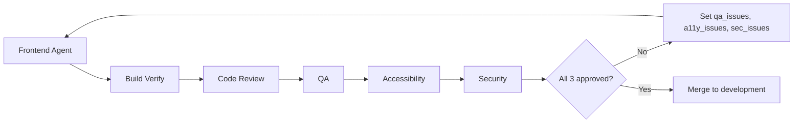

# Add Accessibility Engineering Team and Three-Way Approval Gate

## Current behavior

- **Frontend worker** ([orchestrator.py](software_engineering_team/orchestrator.py)): For each frontend task it runs code review (with retries), then **QA**, then optionally creates fix tasks via Tech Lead, then **merges** regardless of QA/security approval. Security review runs only **once at the end** of the whole job on the full frontend codebase (lines 808–838).
- **FrontendInput** ([frontend_agent/models.py](software_engineering_team/frontend_agent/models.py)) already accepts `qa_issues` and `security_issues` (and `code_review_issues`); the frontend agent uses them when present to fix issues.
- There is **no per-task security review** in the frontend worker and **no merge gate** requiring QA, security, or any third approval.

## Target behavior

1. **After** the frontend developer’s code passes **code review**, run **QA**, **accessibility**, and **security** (all three) on the frontend code for that task.
2. **Accessibility team**: New agent that reviews frontend code for **WCAG 2.2** compliance, keeps a list of accessibility issues (with severity, criterion, description, location, recommendation), and returns an “approved” flag when no blocking issues remain.
3. When any of QA, accessibility, or security **do not** approve: pass their issues back to the frontend agent (`qa_issues`, `accessibility_issues`, `security_issues`) and **re-run** the same task (same branch) in a loop—no merge.
4. **Merge only when** code review is approved **and** QA approved **and** accessibility approved **and** security approved. After fixes, the same flow (QA + accessibility + security) runs again until all three approve.

## Implementation plan

### 1. New Accessibility Agent (mirror QA/Security pattern)

Create a new agent package `software_engineering_team/accessibility_agent/`:

- **models.py**
  - `AccessibilityIssue`: `severity`, `wcag_criterion` (e.g. `"1.1.1"`, `"2.2.1"`), `description`, `location`, `recommendation`.
  - `AccessibilityInput`: `code`, `language`, `task_description`, optional `architecture` (same shape as [QAInput](software_engineering_team/qa_agent/models.py) / [SecurityInput](software_engineering_team/security_agent/models.py)).
  - `AccessibilityOutput`: `issues: List[AccessibilityIssue]`, `approved: bool` (e.g. true when no critical/high severity issues), `summary: str`.
- **prompts.py**
  - Prompt for an expert accessibility engineer: review frontend code (HTML/TS/templates) against **WCAG 2.2** (Perceivable, Operable, Understandable, Robust). Output JSON: list of issues with severity, WCAG criterion ID, description, location, and a concrete **recommendation** for the coding agent. No fixes in the agent—only issue list. Approved when no critical/high issues (or equivalent rule).
- **agent.py**
  - `AccessibilityExpertAgent(llm_client)`, `run(input_data: AccessibilityInput) -> AccessibilityOutput`: build context from code/task/architecture, call LLM with WCAG prompt, parse issues and set `approved` (e.g. no critical/high).
- **init.py**
  - Export `AccessibilityExpertAgent`, `AccessibilityInput`, `AccessibilityOutput`.

### 2. Frontend agent: accept and use `accessibility_issues`

- **[frontend_agent/models.py](software_engineering_team/frontend_agent/models.py)**  
Add field:
  - `accessibility_issues: List[Dict[str, Any]] = Field(default_factory=list, description="Accessibility (WCAG 2.2) issues to fix.")`
- **[frontend_agent/agent.py](software_engineering_team/frontend_agent/agent.py)**  
  - Add `accessibility_issues` to the context passed to the LLM (same pattern as `qa_issues` / `security_issues`): e.g. a section “**Accessibility issues to fix (implement these):**” with severity, criterion, description, location, recommendation.
  - Include `accessibility_issues` in the log line that already mentions `qa_issues` and `security_issues`.
- **[frontend_agent/prompts.py](software_engineering_team/frontend_agent/prompts.py)**  
  - In “Input” and “Your task”, mention `accessibility_issues`; when provided, implement fixes per recommendation (same as for `qa_issues` / `security_issues`).

### 3. Orchestrator: register accessibility and implement three-way gate in frontend worker

- **Agent registration** ([orchestrator.py](software_engineering_team/orchestrator.py) ~lines 48–71)  
  - Import `AccessibilityExpertAgent`, `AccessibilityInput` (and optionally `AccessibilityOutput` if needed).  
  - Add `"accessibility": AccessibilityExpertAgent(llm)` to the agents dict.
- **Frontend worker loop** (same file, ~619–714):  
  - Initialize `a11y_issues = []` alongside `qa_issues` and `sec_issues`.  
  - Pass `accessibility_issues=a11y_issues` into `FrontendInput`.  
  - **After** code review passes (and before merge):
    1. Run **QA** (unchanged).
    2. Run **accessibility**: `code_to_review` → `AccessibilityInput` → `agents["accessibility"].run(...)` → get `AccessibilityOutput`.
    3. Run **security** on the same frontend code (per task): `SecurityInput` with `code=code_to_review`, `language="typescript"` → `agents["security"].run(...)`.
  - **Issue collection and loop**:
    - If **QA** did not approve: set `qa_issues` from `qa_result.bugs_found` (convert to list of dicts with `severity`, `description`, `location`, `recommendation`).
    - If **accessibility** did not approve: set `a11y_issues` from `a11y_result.issues` (same dict shape: `severity`, `wcag_criterion`/`description`, `location`, `recommendation`).
    - If **security** did not approve: set `sec_issues` from `sec_result.vulnerabilities` (already matches existing `security_issues` format).
  - **Merge condition**: Only call `merge_branch` when `qa_result.approved` and `a11y_result.approved` and `sec_result.approved`. Otherwise, do **not** merge; set the issue lists and `continue` the `for iteration_round` loop so the frontend agent runs again with all three issue types.
  - **Fix tasks**: Decide how to treat `evaluate_qa_and_create_fix_tasks`: either (a) keep it only for creating **backend** fix tasks (e.g. when QA finds API contract issues) and still block frontend merge on QA/accessibility/security approval, or (b) stop creating frontend fix tasks from QA and rely entirely on the in-loop `qa_issues` path. Option (b) is simpler and matches “all three must approve before merge”; optional (a) can be left as-is for backend-only fix tasks.
- **End-of-job security**: The existing **post-job** security run on the full frontend codebase (lines 808–838) can remain as a final check; it does not replace the per-task security review in the frontend worker.

### 4. Iteration and caps

- Re-use the existing `MAX_CODE_REVIEW_ITERATIONS` loop for the “code → build → code review → QA → accessibility → security” flow: if any of the three do not approve, pass issues back and `continue` (same branch, same task). Optionally introduce a separate cap (e.g. max 5 “review rounds” after code review passes) to avoid infinite loops; if that cap is hit, treat as failure and do not merge.

### 5. Tech Lead / docs (optional)

- In [tech_lead_agent/prompts.py](software_engineering_team/tech_lead_agent/prompts.py), under “Your team”, add a line that accessibility reviews frontend for WCAG 2.2 after code exists (same as security/QA). No change to task creation—accessibility is invoked by the orchestrator, not as a task type.

## Data flow (high level)

## Files to add

| Path                                                        | Purpose                                                     |
| ----------------------------------------------------------- | ----------------------------------------------------------- |
| `software_engineering_team/accessibility_agent/__init__.py` | Exports                                                     |
| `software_engineering_team/accessibility_agent/models.py`   | AccessibilityIssue, AccessibilityInput, AccessibilityOutput |
| `software_engineering_team/accessibility_agent/prompts.py`  | WCAG 2.2 review prompt                                      |
| `software_engineering_team/accessibility_agent/agent.py`    | AccessibilityExpertAgent                                    |

## Files to modify

| Path                                                                                                         | Changes                                                                                                                                                                                                            |
| ------------------------------------------------------------------------------------------------------------ | ------------------------------------------------------------------------------------------------------------------------------------------------------------------------------------------------------------------ |
| [software_engineering_team/orchestrator.py](software_engineering_team/orchestrator.py)                       | Register accessibility agent; in frontend worker run QA → accessibility → security; convert all three results to issue lists; gate merge on all three approved; pass qa_issues, a11y_issues, sec_issues on re-run. |
| [software_engineering_team/frontend_agent/models.py](software_engineering_team/frontend_agent/models.py)     | Add `accessibility_issues` to `FrontendInput`.                                                                                                                                                                     |
| [software_engineering_team/frontend_agent/agent.py](software_engineering_team/frontend_agent/agent.py)       | Add `accessibility_issues` to context and logging.                                                                                                                                                                 |
| [software_engineering_team/frontend_agent/prompts.py](software_engineering_team/frontend_agent/prompts.py)   | Document and handle `accessibility_issues` in input/task.                                                                                                                                                          |
| [software_engineering_team/tech_lead_agent/prompts.py](software_engineering_team/tech_lead_agent/prompts.py) | (Optional) Mention accessibility team in team list.                                                                                                                                                                |

## Out of scope (for later)

- Backend pipeline: no change (backend does not require accessibility review).
- Automated WCAG tooling (e.g. axe): the plan uses an LLM-based accessibility agent only; tooling can be added later.
- Dummy LLM: add accessibility-agent JSON responses in [shared/llm.py](software_engineering_team/shared/llm.py) for tests if the test harness runs the full frontend worker.

