# Agent Sub-Team Grouping Recommendations

## Current State

The software engineering team has **25+ agents** invoked from [orchestrator.py](software_engineering_team/orchestrator.py). Two sub-teams already exist:

- **planning_team/** – Spec intake, project planning, and domain planning agents (API contract, data architecture, UI/UX, infra, DevOps, QA test strategy, security, observability, performance), plus Tech-Lead-internal planning graph agents (backend/frontend/data/test/performance/docs/quality-gate planning).
- **frontend_team/** – UX Designer, UI Designer, Design System, Frontend Architect, Feature Agent (FrontendExpertAgent), UX Engineer, Performance Engineer, Build/Release; Accessibility lives here but is invoked by the main orchestrator for frontend tasks.

Execution is driven by **task assignee** ([orchestrator.py](software_engineering_team/orchestrator.py) lines 1162–1165): `git_setup`, `devops`, `backend`, `frontend`. QA and Security are not assignees; they are invoked **inside** backend/frontend workflows and in a final full-codebase pass.

---

## Recommended Sub-Team Groupings

Group by **SDLC phase** and **who consumes whose output**, so sub-teams align with handoffs and ownership.

```mermaid
flowchart LR
  subgraph discovery [Discovery]
    SpecIntake
    ProjectPlanning
  end

  subgraph design [Design and planning]
    Architecture
    TechLead
    DomainPlanning[API Contract, Data Arch, UI/UX, etc.]
  end

  subgraph setup [Setup]
    GitSetup
  end

  subgraph implementation [Implementation]
    Backend[Backend worker]
    Frontend[Frontend worker]
  end

  subgraph quality [Quality and review]
    CodeReview
    QA
    Security
    Accessibility
    AcceptanceVerifier
    DbcComments
  end

  subgraph integration [Integration and release]
    IntegrationAgent
    DevOps
    Documentation
  end

  discovery --> design
  design --> setup
  setup --> implementation
  implementation --> quality
  quality --> integration
```

---

### 1. **Discovery / Requirements** (keep in planning_team, treat as "intake" sub-group)

| Agent | Role |
|-------|------|
| Spec Intake | Validates spec, REQ-IDs, glossary, assumptions |
| Project Planning | Features/functionality doc from spec; feeds Tech Lead and Architecture |

**Rationale:** Both run before the Tech Lead / Architecture loop; their outputs are consumed by design. No code execution. Fits as the leading edge of `planning_team`.

---

### 2. **Design and Planning** (current planning_team core)

| Agent / group | Role |
|---------------|------|
| Architecture Expert | System architecture from requirements + features doc; consumed by all downstream agents |
| Tech Lead | Task breakdown, execution order, alignment with architecture; invokes planning graph agents internally |
| Domain planning agents | API Contract, Data Architecture, UI/UX, Frontend Architecture, Infrastructure, DevOps Planning, QA Test Strategy, Security Planning, Observability, Performance Doc |
| Planning consolidation | Master plan, risk register, ship checklist |

**Rationale:** Single "design and planning" phase: everything that produces plans and task assignments and writes to `plan/`. Tech Lead is the bridge from planning to execution (assignees: backend, frontend, devops, git_setup).

---

### 3. **Setup** (standalone or small "platform" sub-team)

| Agent | Role |
|-------|------|
| Git Setup | Backend/frontend repo clones, branches, `development` branch |

**Rationale:** Runs once before backend/frontend workers; no LLM; clear boundary. Could stay at top level or live under a small **platform_team** if you add more setup/infra agents later (e.g. env bootstrap).

---

### 4. **Implementation workers** (already split by stack)

| Sub-team | Agents | Invoked by |
|----------|--------|------------|
| **Backend** | Backend Expert (single agent, but with internal workflow) | Orchestrator backend worker |
| **Frontend** | Frontend team: UX Designer, UI Designer, Design System, Frontend Architect, Feature Agent, UX Engineer, Performance Engineer, Build/Release | Orchestrator frontend worker via FrontendExpertAgent / FrontendOrchestratorAgent |

**Rationale:** Matches execution queues and assignees. Backend and frontend run in parallel; each "worker" is the entry point for its stack. The frontend_team is already a proper sub-team; backend is a single agent with a rich internal workflow (plan → code → build → review loop).

---

### 5. **Quality and review** (cross-cutting "quality gate" sub-team)

| Agent | Role | Used in |
|-------|------|--------|
| Code Review | Spec/standards/acceptance criteria | Backend and frontend per-task workflows |
| QA Expert | Bugs, tests, README | Backend and frontend per-task workflows |
| Cybersecurity Expert | Security review | Backend and frontend per-task; plus full codebase at end |
| Accessibility Expert | WCAG 2.2, frontend | Frontend per-task only |
| Acceptance Verifier | Per-criterion evidence | Backend and frontend (optional) |
| DbC Comments | Pre/postconditions, invariants | Backend and frontend per-task |

**Rationale:** All are **consumers** of implementation output; none own tasks in the execution queue. They are invoked by the backend and frontend workflows (and optionally Tech Lead). Grouping them as a **quality_team** (or **quality_gates**) makes dependencies clear and would allow shared interfaces (e.g. "review this artifact") and consistent configuration (e.g. severity thresholds).

---

### 6. **Integration and release** (post-execution sub-team)

| Agent | Role |
|-------|------|
| Integration Agent | Backend–frontend API contract alignment after workers complete |
| DevOps Expert | CI/CD, containerization; triggered by Tech Lead for backend/frontend repos |
| Documentation Agent | README and project docs; triggered per task and final pass |

**Rationale:** Run after implementation (and quality); they integrate or package the product. Tech Lead triggers DevOps and Documentation; Integration runs once in the orchestrator. A small **integration_team** or **release_team** keeps "ship" concerns in one place.

---

## Suggested Directory / Conceptual Layout

Keep existing folders; add **conceptual** (or optional physical) grouping for clarity:

- **planning_team/** – Already holds Discovery + Design (Spec Intake, Project Planning, Architecture-related planning, domain planning, consolidation). No structural change required; you can document "Discovery" vs "Design" inside the README.
- **frontend_team/** – Unchanged; remains the implementation sub-team for frontend.
- **Backend** – Single agent today; could become **backend_team/** if you add more backend specialists (e.g. API agent, DB agent) later.
- **Quality / quality_gates** – **New optional sub-team**: code_review_agent, qa_agent, security_agent, acceptance_verifier_agent, dbc_comments_agent; **accessibility_agent** can stay under frontend_team but be *documented* as part of the quality-gate set for frontend. This is the only place where a new folder might add value.
- **Integration / release** – **Optional sub-team**: integration_agent, devops_agent, documentation_agent. Alternatively leave them at top level and document the "Integration and release" phase in the README.
- **Setup** – **git_setup_agent** can stay at top level or move under a small **platform_team** if you add more setup agents.

---

## Summary Table (by SDLC phase)

| Phase | Sub-team (recommended) | Agents |
|-------|------------------------|--------|
| Discovery | planning_team (intake) | Spec Intake, Project Planning |
| Design | planning_team | Architecture, Tech Lead, domain planning agents, consolidation |
| Setup | (top-level or platform_team) | Git Setup |
| Implementation | backend (single agent) | Backend Expert |
| Implementation | frontend_team | UX Designer → … → Build/Release, Feature Agent |
| Quality | quality_gates (new optional) | Code Review, QA, Security, Accessibility, Acceptance Verifier, DbC |
| Integration / release | integration_team (optional) | Integration, DevOps, Documentation |

---

## Minimal-Change Recommendation

- **Do not restructure** planning_team or frontend_team; they already match how agents interact and where they sit in the SDLC.
- **Document** the six phases (Discovery → Design → Setup → Implementation → Quality → Integration/release) and which agents belong to each in [software_engineering_team/README.md](software_engineering_team/README.md). Add a "Sub-teams and SDLC" section and, if helpful, a diagram like the one above.
- **Optionally** introduce a **quality_gates** (or quality_team) package that groups Code Review, QA, Security, Acceptance Verifier, DbC (and references Accessibility for frontend). This improves discoverability and makes it easy to add shared interfaces (e.g. a common "review result" contract) later.
- **Optionally** introduce an **integration_team** (or release_team) package for Integration, DevOps, and Documentation if you want a single place for "post-execution" agents.

This keeps the current orchestration and assignee model intact while giving a clear, phase-based grouping for onboarding and future changes.
