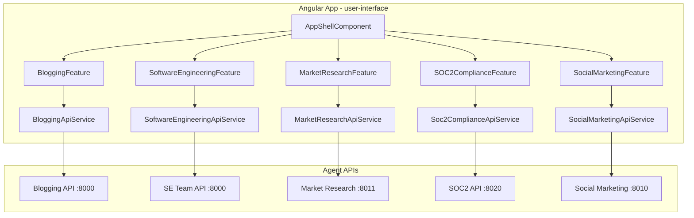

# Angular User Interface for Agents APIs

## Scope: APIs and Endpoints to Cover

The repo exposes **5 agent APIs** on different ports. The UI must call every endpoint below.

| API                           | Base port | Endpoints                                                                                                                                                                                                                                                                                                                         |
| ----------------------------- | --------- | --------------------------------------------------------------------------------------------------------------------------------------------------------------------------------------------------------------------------------------------------------------------------------------------------------------------------------- |
| **Blogging**                  | 8000      | `POST /research-and-review`, `POST /full-pipeline`, `GET /health`                                                                                                                                                                                                                                                                 |
| **Software Engineering Team** | 8000      | `POST /run-team`, `GET /run-team/{job_id}`, `POST /run-team/{job_id}/retry-failed`, `POST /run-team/{job_id}/re-plan-with-clarifications`, `POST /clarification/sessions`, `POST /clarification/sessions/{id}/messages`, `GET /clarification/sessions/{id}`, `GET /execution/tasks`, `GET /execution/stream` (SSE), `GET /health` |
| **Market Research**           | 8011      | `POST /market-research/run`, `GET /health`                                                                                                                                                                                                                                                                                        |
| **SOC2 Compliance**           | 8020      | `POST /soc2-audit/run`, `GET /soc2-audit/status/{job_id}`, `GET /health`                                                                                                                                                                                                                                                          |
| **Social Media Marketing**    | 8010      | `POST /social-marketing/run`, `POST /social-marketing/performance/{job_id}`, `POST /social-marketing/revise/{job_id}`, `GET /social-marketing/status/{job_id}`, `GET /health`                                                                                                                                                     |

Reference: [agents/README.md](agents/README.md) (Quick start ports), [agents/api/main.py](agents/api/main.py), [agents/blogging/api/main.py](agents/blogging/api/main.py), [agents/software_engineering_team/api/main.py](agents/software_engineering_team/api/main.py), [agents/market_research_team/api/main.py](agents/market_research_team/api/main.py), [agents/soc2_compliance_team/api/main.py](agents/soc2_compliance_team/api/main.py), [agents/social_media_marketing_team/api/main.py](agents/social_media_marketing_team/api/main.py).

**Note:** Blogging has two entry points: `agents/api/main.py` (research-and-review only) and `agents/blogging/api/main.py` (research-and-review + full-pipeline). The UI should target the richer blogging API and support both research-and-review and full-pipeline.

---

## 1. Project Setup and Structure

- **Location:** Create `user-interface/` at repository root (or under `agents/` if you prefer; the plan assumes repo root).
- **Scaffold:** Angular CLI (v19+), standalone components, strict TypeScript. Use `ng new user-interface --style=scss --routing --ssr=false` and add Angular Material (`ng add @angular/material`) with a single theme (e.g. indigo-pink or custom).
- **Config:** Environment files for API base URLs per service (e.g. `environment.ts` with `bloggingApiUrl`, `softwareEngineeringApiUrl`, `marketResearchApiUrl`, `soc2ComplianceApiUrl`, `socialMarketingApiUrl`) so each API can point to its port (8000, 8010, 8011, 8020). Use a single “api base” only if you later introduce a BFF that proxies all backends.
- **Structure (align with existing frontend conventions in the codebase):**
  - `src/app/app.config.ts` – `provideHttpClient()`, `provideRouter()`, `provideAnimations()`, Material providers.
  - `src/app/core/` – HTTP interceptors (e.g. error handler, optional auth), API base URL injection.
  - `src/app/features/` or `src/app/pages/` – one feature per API (see below).
  - `src/app/shared/` – shared Material modules, pipes, directives, loading/error UI components.
  - `src/app/models/` – TypeScript interfaces mirroring backend request/response models (e.g. `ResearchAndReviewRequest`, `JobStatusResponse`, `TeamOutput`).

---

## 2. One Component (Feature) per API

Implement **5 feature areas**, each with its own module/route and dedicated components so the UI is “one component per API” and can grow into dashboards and visual feedback.

- **Blogging API feature**
  - **Route:** e.g. `/blogging`.
  - **Components:** e.g. `BloggingDashboardComponent` (container), `ResearchReviewFormComponent` (form for `POST /research-and-review`: brief, title_concept, audience, tone_or_purpose, max_results), `ResearchReviewResultsComponent` (title_choices, outline, compiled_document, notes), `FullPipelineFormComponent` (form for `POST /full-pipeline` with run_gates, max_rewrite_iterations), `FullPipelineResultsComponent` (status, work_dir, title_choices, outline, draft_preview). Call `GET /health` for status indicator.
  - **Service:** `BloggingApiService` – methods for `researchAndReview()`, `fullPipeline()`, `health()`.
- **Software Engineering Team API feature**
  - **Route:** e.g. `/software-engineering`.
  - **Components:** e.g. `RunTeamFormComponent` (repo_path, optional clarification_session_id) → `POST /run-team`; `JobStatusComponent` (poll `GET /run-team/{job_id}`, show progress, task_results, failed_tasks, error); `RetryFailedComponent` (button + `POST /run-team/{job_id}/retry-failed`); `RePlanWithClarificationsComponent` (form + `POST /run-team/{job_id}/re-plan-with-clarifications`). Clarification: `ClarificationSessionsComponent` (create session `POST /clarification/sessions`), `ClarificationChatComponent` (send message `POST /clarification/sessions/{id}/messages`, load session `GET /clarification/sessions/{id}`). Execution: `ExecutionTasksComponent` (dashboard for `GET /execution/tasks`), `ExecutionStreamComponent` (subscribe to `GET /execution/stream` SSE, show live updates). Health: status from `GET /health`.
  - **Service:** `SoftwareEngineeringApiService` – all endpoints above; optionally use `EventSource` or `HttpClient` with `observe: 'events'` for SSE.
- **Market Research API feature**
  - **Route:** e.g. `/market-research`.
  - **Components:** e.g. `MarketResearchFormComponent` (product_concept, target_users, business_goal, topology, transcript_folder_path, transcripts, human_approved, human_feedback) → `POST /market-research/run`; `MarketResearchResultsComponent` (display `TeamOutput`: status, mission_summary, insights, market_signals, recommendation, proposed_research_scripts). Health indicator.
  - **Service:** `MarketResearchApiService` – `run()`, `health()`.
- **SOC2 Compliance API feature**
  - **Route:** e.g. `/soc2-compliance`.
  - **Components:** e.g. `Soc2AuditFormComponent` (repo_path) → `POST /soc2-audit/run`; `Soc2AuditStatusComponent` (poll `GET /soc2-audit/status/{job_id}`: status, current_stage, error, result with findings). Health indicator.
  - **Service:** `Soc2ComplianceApiService` – `runAudit()`, `getStatus(jobId)`, `health()`.
- **Social Media Marketing API feature**
  - **Route:** e.g. `/social-marketing`.
  - **Components:** e.g. `SocialMarketingRunFormComponent` (all `RunMarketingTeamRequest` fields: brand_guidelines_path, brand_objectives_path, llm_model_name, brand_name, target_audience, goals, voice_and_tone, cadence_posts_per_day, duration_days, human_approved_for_testing, human_feedback) → `POST /social-marketing/run`; `SocialMarketingStatusComponent` (poll `GET /social-marketing/status/{job_id}`); `SocialMarketingPerformanceComponent` (form to submit `POST /social-marketing/performance/{job_id}` with observations); `SocialMarketingReviseComponent` (feedback, approved_for_testing → `POST /social-marketing/revise/{job_id}`). Health indicator.
  - **Service:** `SocialMarketingApiService` – `run()`, `getStatus(jobId)`, `ingestPerformance(jobId, observations)`, `revise(jobId, body)`, `health()`.

**Shared:** A shell/layout component (e.g. `AppShellComponent`) with sidebar or tabs linking to each feature route; a small “API status” widget that shows health for each backend (optional but recommended).

---

## 3. Angular Material (Material UI)

- Use **Angular Material** for all UI: forms (MatFormField, MatInput, MatSelect, MatCheckbox, MatSlideToggle), buttons (MatButton), cards (MatCard), progress (MatProgressBar, MatProgressSpinner), tables (MatTable) where needed, snackbars (MatSnackBar) for success/error, expansion (MatExpansionPanel) for long content, tabs (MatTabGroup) inside features if needed, dialogs (MatDialog) for confirmations.
- Ensure **theming** is consistent: one theme (e.g. custom palette or indigo-pink), typography and spacing from Material.
- **Responsive:** Use Material layout (e.g. flex or grid) and breakpoints so forms and dashboards work on small and large screens.

---

## 4. Testing and 80%+ Code Coverage

- **Unit tests:** Every component and service has a `.spec.ts` file. Use `TestBed`, `HttpTestingController` for API services (mock HTTP per endpoint), and component fixtures. Test: form validation, submit calls service with correct payload, success/error paths, loading states.
- **Coverage:** Run `ng test --code-coverage`. Aim for **at least 80%** line/branch coverage for `src/app`; add tests for edge cases (4xx/5xx, empty responses, SSE disconnect) so coverage stays above 80%.
- **Best practices:** Prefer testing public behavior (user actions and resulting service calls / UI updates); mock services where appropriate; use `fakeAsync`/`tick` for timers/polling if needed.

---

## 5. Design and UX Best Practices

- **Visual feedback:** Loading spinners or progress bars during API calls; disable submit buttons while request in flight; clear success/error messages (e.g. MatSnackBar).
- **Dashboards:** Where applicable (e.g. job status, execution tasks, audit status), show key metrics and lists in cards or tables; use chips or badges for status (e.g. running, completed, failed).
- **Forms:** Use reactive forms (ReactiveFormsModule), validators matching backend (required, min/max length, numeric bounds), and clear labels and hints so users know what each API expects.
- **Empty and error states:** Handle “no data” and API errors with inline messages or small empty-state UI; avoid blank screens.

---

## 6. Accessibility (a11y)

- **Semantic HTML and ARIA:** Use correct headings (h1/h2), landmarks, and `attr.aria-`* in templates (e.g. `[attr.aria-label]`, `[attr.aria-live]` for dynamic status). Follow existing frontend agent guidance: [agents/software_engineering_team/frontend_team/feature_agent/prompts.py](agents/software_engineering_team/frontend_team/feature_agent/prompts.py) (ARIA with `attr.` prefix).
- **Keyboard:** All interactive elements focusable and operable via keyboard; no keyboard traps; logical tab order.
- **Focus and screen readers:** Loading and errors announced (e.g. aria-live region); form errors associated with controls (aria-describedby).
- **Material:** Prefer Material components that are accessible by default; add labels and roles where needed (e.g. icon-only buttons get aria-label).
- **Contrast and targets:** Ensure sufficient contrast and touch target size (Material generally complies; verify in theme).

---

## 7. Coding Best Practices

- **Consistency with repo:** Follow the same conventions as the software engineering team’s frontend agent: kebab-case for components/files, `src/app/components/<name>/`, `src/app/services/<name>.service.ts`, standalone components, `environment.apiUrl`-style config. See [agents/software_engineering_team/frontend_team/feature_agent/prompts.py](agents/software_engineering_team/frontend_team/feature_agent/prompts.py).
- **Design by contract / JSDoc:** Document public methods and services (purpose, parameters, errors); keep components focused (SRP).
- **Typing:** Mirror backend request/response with TypeScript interfaces in `src/app/models/` and use them in services and components (no `any` for API payloads).
- **Error handling:** Centralize API errors in an HTTP interceptor where appropriate; show user-friendly messages and optionally log for debugging.
- **State:** Prefer local component state and services for API calls; introduce NgRx or similar only if complexity justifies it.

---

## 8. Documentation (In Depth)

- **README in user-interface:** How to install (Node version, `npm ci`), configure (env or environment.*.ts for API base URLs), run (`ng serve`), build (`ng build`), run tests (`ng test --code-coverage`). List all 5 APIs and their default ports and which env vars override them.
- **Architecture doc:** Short document (e.g. `docs/ARCHITECTURE.md`) describing: app shell, routing, feature structure (one per API), how each feature connects to its backend (service → HTTP → endpoints table), and where shared UI and interceptors live.
- **API mapping doc:** Table or section mapping each UI action to the exact HTTP method and path (e.g. “Submit research form → POST /research-and-review” with request/response types). Reference backend OpenAPI or `main.py` files.
- **Component and service docs:** JSDoc on every public class and method; for each feature, a short comment or README describing the main components and flow (form → submit → results / polling).
- **Accessibility doc:** List a11y choices: ARIA usage, keyboard nav, focus management, testing with axe or Lighthouse (optional but recommended).

---

## 9. High-Level Architecture Diagram

---

## 10. Implementation Order (Suggested)

1. **Scaffold and config** – Create `user-interface/`, Angular + Material, environment files with 5 API base URLs, routing and app shell with links to each feature.
2. **Shared core** – HTTP interceptor (error handling), shared loading/error components, TypeScript models for all request/response types used.
3. **Features one-by-one** – Implement in order: Blogging → Market Research → SOC2 Compliance → Social Marketing → Software Engineering (most endpoints). For each: service with all endpoints, then container + form + results components, then tests to 80%+ for that feature.
4. **Polish** – Global a11y pass, dashboard improvements, API status widget, README and architecture/docs.
5. **Coverage and docs** – Final `ng test --code-coverage` check (≥80%), complete JSDoc and README/ARCHITECTURE/API-mapping/accessibility docs.

---

## 11. Out of Scope / Clarifications

- **Investment team:** No HTTP API was found under `agents/investment_team`; the UI plan does not include it. If an API is added later, a sixth feature can follow the same pattern.
- **Backend “research-and-review” only variant:** The simpler [agents/api/main.py](agents/api/main.py) (research-and-review only) can be used as the blogging base URL if you do not run the full blogging API; the UI still calls the same path `/research-and-review`.
- **CORS:** Backends must allow the Angular dev origin (e.g. `http://localhost:4200`) in CORS; if not, either configure each FastAPI app or add a small dev proxy in `angular.json` / `proxy.conf.json` to forward to the correct ports.

