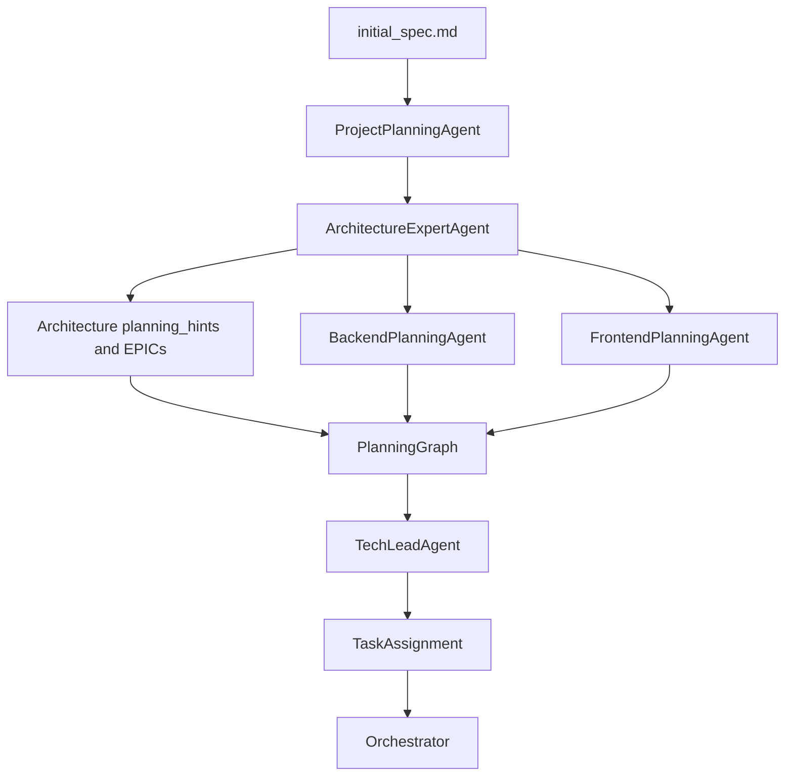

## Goals

- **Richer architecture outputs**: Ensure the `ArchitectureExpertAgent` reliably produces detailed architecture documents, populated components, and valid Mermaid diagrams.
- **Organic co-evolution with planning**: Make architecture planning participate in the same planning ecosystem as backend/frontend/etc., rather than being a one-shot pre-step.
- **Detailed feature-level guidance**: Provide architecture details at a granularity that directly informs PlanningGraph nodes and downstream tasks.

## High-level approach

- **Strengthen the architecture prompt and models** so the LLM is strongly guided to emit the detailed structure you want (including multiple diagrams) and we can detect/repair missing fields.
- **Wire architecture more tightly into the PlanningGraph flow** by making planners explicitly consume architecture slices and, where useful, by exposing architecture-derived nodes/edges.
- **Add a feedback loop** where planning results can drive a refinement pass over architecture for complex specs, keeping architecture and plans in sync.

## Proposed changes

### 1. Make architecture outputs richer and more reliable

- **Tighten JSON contract and fallbacks in `ArchitectureExpertAgent**`
  - In `architecture_agent/agent.py`, harden parsing of `data` from `complete_json`:
    - **Validate required keys** (`overview`, `components`, `architecture_document`, `diagrams`, `decisions`, `summary`) and log when any is missing.
    - If `diagrams` is missing or empty, **synthesize minimal-but-valid default Mermaid diagrams** (e.g., simple `flowchart TD` skeletons) so `DEVELOPMENT_PLAN-architecture.md` always has renderable diagrams.
    - Normalize `components` to ensure each has `name`, `type`, `description` and backfill defaults when the LLM omits them.
  - Ensure that we **don't silently accept empty strings** for `overview`/`architecture_document`; if they're blank, construct a short synthetic overview from requirements so planners and humans have usable content.
- **Adjust `ARCHITECTURE_PROMPT` to emphasize detail and diagrams**
  - In `architecture_agent/prompts.py`, update the instructions to:
    - Emphasize **detailed, implementation-relevant structure** (layers, modules, data flows, cross-cutting concerns) rather than just high-level prose.
    - Ask explicitly for **"at least N" components** and call out backends, frontends, infra, and data stores separately.
    - Strengthen the requirement that **all six required diagram keys** must be present in `diagrams`, and that each must be **valid Mermaid** with a short example pattern given for each.
    - Clarify that Mermaid node IDs must avoid spaces and HTML to reduce broken diagrams.
- **Improve development plan rendering of diagrams**
  - `shared/development_plan_writer.write_architecture_plan` already normalizes and wraps diagrams in Mermaid code fences.
  - Ensure that when we synthesize default diagrams (above), they are simple but semantically meaningful (e.g., client → API → DB) so the plan is still useful even in worst-case LLM outputs.

### 2. Make architecture a first-class participant in the planning layer

- **Expose architecture-derived structure into `PlanningGraph` metadata**
  - In `ArchitectureExpertAgent.run`, derive and attach a lightweight **architecture summary structure** (e.g., list of backend endpoints, main UI surfaces, critical data flows) into `SystemArchitecture` metadata or a new field, such as `architecture.metadata["planning_hints"]`.
  - Example hints:
    - For backend: inferred endpoint groups, service boundaries, DB schemas.
    - For frontend: pages/routes, key components, shared layout/state.
    - For infra: CI/CD, environments, secrets management.
- **Have backend/frontend planners consume architecture slices more explicitly**
  - In `backend_planning_agent/agent.py` and `frontend_planning_agent/agent.py`:
    - Extend context to include **grouped, domain-specific views** of architecture:
      - Backend planner: backend services, APIs, DB entities, queues from `SystemArchitecture.components` and `planning_hints`.
      - Frontend planner: UI components, routes, and their backing APIs.
    - Encourage planners (via prompts, not code-only) to create **PlanningGraph nodes that map back to specific architecture components**, e.g., via `PlanningNode.metadata["component_name"]`.
  - This ensures that PlanningGraph nodes and edges trace back to architectural elements, making architecture feel like a live part of planning rather than a static pre-doc.
- **Add an optional "architecture planning graph" slice**
  - Introduce an internal helper (or a small new planning agent) that can:
    - Read `SystemArchitecture.components` and `diagrams` and emit a **top-level PlanningGraph slice** with EPIC/FEATURE nodes such as "Backend service: Orders" or "Frontend module: Dashboard".
    - Attach these as **parents** for backend/frontend TASK/SUBTASK nodes (via `parent_id`), enriching the hierarchy in `planning_graph.PlanningGraph`.
  - Integrate this slice into `TechLeadAgent._run_planning_pipeline` before domain planners run, so domain planners can attach their tasks under existing architecture EPIC/FEATURE nodes instead of inventing their own hierarchy.

### 3. Let planning and architecture co-evolve for complex specs

- **Add an optional architecture refinement pass after initial planning**
  - In `tech_lead_agent/agent.py`:
    - After `_run_planning_pipeline` builds and validates the `PlanningGraph`, add an optional step for **complex/ambiguous specs**:
      - Summarize the merged `PlanningGraph` (e.g., key domains, hot spots, cross-cutting edges).
      - Feed that plus the original `SystemArchitecture` back into the LLM (either via `ArchitectureExpertAgent` or a smaller refinement prompt) to request **refinements or clarifications** to architecture (e.g., missing components, refactored boundaries, new data flows).
    - When refinements are returned:
      - Update `SystemArchitecture` in memory for downstream agents.
      - Optionally **record an extra ADR** entry capturing the change, so `DEVELOPMENT_PLAN-architecture.md` reflects that the plan evolved based on planning insights.
- **Surface architecture–plan linkage in development artifacts**
  - In `development_plan_writer.write_tech_lead_plan`, augment task rendering to optionally show the linked `component_name` or architecture reference from `PlanningNode.metadata`, e.g., `- **Architecture component:** OrdersService` when present.
  - This makes the Tech Lead plan read like a continuation of the architecture doc instead of a separate artifact.

### 4. Keep execution flow unchanged while enriching context

- **Preserve orchestrator sequencing but pass improved structures**
  - In `orchestrator.run_orchestrator`:
    - Keep the same order: `ProjectPlanningAgent` → `ArchitectureExpertAgent` → `TechLeadAgent`.
    - Ensure the updated, richer `SystemArchitecture` (with `planning_hints` and any refinement data) is passed to `TechLeadInput` and is logged to job state.
  - No changes to backend/frontend execution agents are required; they already receive `architecture` and benefit from any newly enriched fields.
- **Mermaid diagrams as the primary visual artifact**
  - Keep **Mermaid-only** diagrams as the canonical diagram format:
    - Required diagrams stay as-is: client/server, frontend structure, backend structure, backend infra, overall infra, security.
    - For the new co-evolution behavior, consider using additional diagrams (e.g., `data_flow`, `sequence_auth`) as optional keys that planners can reference in their prompts but that still render in `DEVELOPMENT_PLAN-architecture.md` automatically.

## Implementation phasing

- **Phase 1: Reliability & richness of architecture output**
  - Harden `ArchitectureExpertAgent.run` parsing and defaults.
  - Enhance `ARCHITECTURE_PROMPT` to enforce detailed, diagram-rich outputs.
  - Confirm `DEVELOPMENT_PLAN-architecture.md` always contains valid mermaid blocks for all required diagram keys.
- **Phase 2: Deep integration with planning graph**
  - Add `planning_hints`/similar metadata to `SystemArchitecture`.
  - Update backend/frontend (and optionally data/test) planning agents to consume structured architecture slices and tag nodes with architecture component references.
  - Optionally add a small architecture-to-PlanningGraph helper to seed EPIC/FEATURE nodes before domain planners.
- **Phase 3: Architecture–planning co-evolution**
  - Add the optional refinement loop in `TechLeadAgent._run_planning_pipeline` for complex specs.
  - Wire refined architecture (and new ADRs) back into `SystemArchitecture` and `DEVELOPMENT_PLAN-architecture.md` while keeping runtime `TaskAssignment` and orchestrator execution unchanged.

## Simple architecture–planning flow (mermaid)

## Key files to touch

- **Architecture agent & artifacts**
  - `software_engineering_team/architecture_agent/agent.py`
  - `software_engineering_team/architecture_agent/prompts.py`
  - `software_engineering_team/shared/development_plan_writer.py`
- **Planning layer & Tech Lead**
  - `software_engineering_team/planning/planning_graph.py` (for architecture-derived EPIC/FEATURE nodes, if added)
  - `software_engineering_team/tech_lead_agent/agent.py` (planning pipeline refinement and architecture–plan linkage)
  - `software_engineering_team/backend_planning_agent/agent.py`
  - `software_engineering_team/frontend_planning_agent/agent.py`
- **Orchestrator wiring**
  - `software_engineering_team/orchestrator.py` (to pass enriched/refined architecture consistently)

