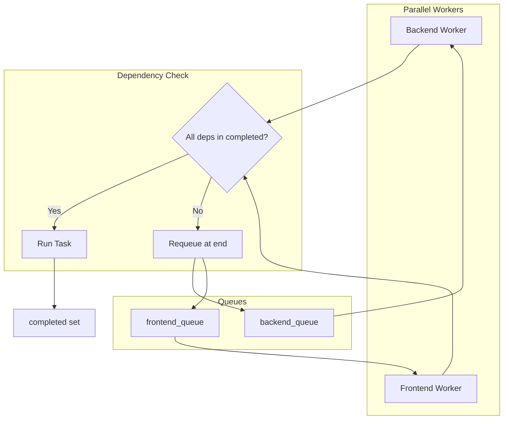

# Backend/Frontend Parallel Planning and Dependency-Aware Scheduling

## Findings

### 1. Backend vs frontend task imbalance

**Likely causes:**

- **Planning granularity bias**: Frontend planning tends to produce one task per component/screen (e.g. `frontend-todo-list`, `frontend-todo-form`, `frontend-app-shell`), while backend planning may produce fewer, coarser tasks (e.g. one "Todo CRUD API" task instead of separate models, endpoints, validation tasks). See [planning_team/planning_graph.py](software_engineering_team/planning_team/planning_graph.py) and [planning_team/backend_planning_agent](software_engineering_team/planning_team/backend_planning_agent/), [planning_team/frontend_planning_agent](software_engineering_team/planning_team/frontend_planning_agent/).
- **TaskGenerator fallback**: When the planning pipeline is skipped (`SW_MINIMAL_PLANNING=1`) or fails, [TaskGeneratorAgent](software_engineering_team/planning_team/task_generator_agent/agent.py) produces tasks in a single LLM call. Prompts emphasize interleaving but do not enforce backend/frontend count balance.
- **Spec bias**: UI-heavy specs naturally yield more frontend tasks; backend work may be under-specified.

### 2. Dependency-blind scheduling (root cause of blocking)

**Current behavior:**

- Workers run in parallel (one backend thread, one frontend thread). Each pops from its queue in order. **No runtime check of `task.dependencies**`.
- [shared/task_parsing.py](software_engineering_team/shared/task_parsing.py) `_interleave_execution_order` **ignores dependencies** and strictly alternates backend/frontend. Example: if the LLM produces `[backend-models, backend-crud-api, frontend-list, frontend-form]` (correct dependency order), interleaving yields `[backend-models, frontend-list, backend-crud-api, frontend-form]` — so `frontend-list` can run before `backend-crud-api` completes.
- [orchestrator.py](software_engineering_team/orchestrator.py) lines 805–806 and 907–909: workers pop from `backend_queue` and `frontend_queue` without checking whether dependencies are satisfied.

**Result:** Frontend tasks that depend on backend APIs may run before those APIs exist, causing failures or placeholder code.

### 3. Integration tasks

**Integration tasks are not planned.** There is no `TaskType.INTEGRATION` and no integration task in `TaskAssignment`.

- **Integration Agent** ([integration_agent/agent.py](software_engineering_team/integration_agent/agent.py)) runs **post-execution** in the orchestrator (lines 1623–1654). It validates backend–frontend API contract alignment after all workers finish. It does not create or execute tasks.
- "Integration" in planning refers to external systems (third-party APIs) or integration tests, not full-stack wiring tasks.

---

## Proposed solution

### A. Runtime dependency enforcement

**Goal:** Ensure no task runs until its dependencies are complete. Neither backend nor frontend should block the other when work is independent.

**Changes in [orchestrator.py](software_engineering_team/orchestrator.py):**

1. Before a worker starts a task, check: `all(dep in completed for dep in (task.dependencies or []))`.
2. If dependencies are not satisfied:
  - Put the task back at the **end** of its queue (or at a position that preserves dependency order).
  - Pop the next task and repeat the check.
3. If no task in the queue is runnable, the worker waits (e.g. short sleep + retry) or yields until dependencies complete.

**Effect:** Backend and frontend continue in parallel when tasks are independent. When a frontend task depends on a backend task, the frontend worker skips it until that backend task is in `completed`, then runs it. No artificial blocking of independent work.

### B. Fix `_interleave_execution_order` to respect dependencies

**Current bug:** [shared/task_parsing.py](software_engineering_team/shared/task_parsing.py) lines 81–90 blindly alternate, violating dependency order.

**Fix:** Interleave only when safe. For each candidate task, ensure all its dependencies appear earlier in the interleaved sequence. Options:

- **Option 1:** Remove interleaving from `parse_assignment_from_data` and use the LLM’s `execution_order` as-is (planning_graph already uses dependency-respecting topological sort with domain balance).
- **Option 2:** Implement dependency-aware interleaving: when choosing the next task, pick one whose dependencies are already in the result; prefer alternating backend/frontend when multiple candidates exist.

Recommend **Option 2** so TaskGenerator output remains interleaved without breaking dependencies.

### C. Planning for parallel independence (API contract–first)

**Goal:** Maximize work that can run in parallel by defining contracts before coding.

1. **API contract planning:** Ensure the API Contract planning agent ([planning_team/api_contract_planning_agent](software_engineering_team/planning_team/api_contract_planning_agent/)) produces an OpenAPI or contract spec **before** coding tasks. Backend implements to the contract; frontend can build against the contract (or mocks) without waiting for backend completion.
2. **Task dependency design:** Update Tech Lead / TaskGenerator prompts to:
  - Prefer `frontend-app-shell` and `backend-data-models` as independent first tasks (no cross-domain dependency).
  - Make `frontend-list` depend on `backend-crud-api` only when it truly needs the live API; otherwise, frontend can use a contract/mock.
  - Explicitly list which tasks have cross-domain dependencies vs which are independent.
3. **Backend task granularity:** Review [BackendPlanningAgent](software_engineering_team/planning_team/backend_planning_agent/) and [TECH_LEAD_PROMPT](software_engineering_team/tech_lead_agent/prompts.py) to encourage finer backend tasks (e.g. models, CRUD, validation as separate tasks) so backend and frontend queues are more balanced.

### D. Integration tasks (optional)

**Current:** Integration is a post-execution validation step, not a planned task.

**If you want integration tasks planned:**

- Add `TaskType.INTEGRATION` and an assignee (e.g. `integration` or reuse `frontend` for wiring tasks).
- Create tasks such as "Wire UserListComponent to GET /api/users" or "Validate API contract for /api/todos" that run after backend and frontend coding tasks.
- The Integration Agent would then either run as a task executor or remain as a final validator. Duplication can be avoided by having planned integration tasks call the same validation logic.

**Recommendation:** Keep the current design (post-execution Integration Agent) unless you need explicit integration tasks in the plan for traceability or retries. The agent already validates the full stack; adding planned integration tasks is optional.

---

## Implementation order

1. **Runtime dependency enforcement** (orchestrator) — prevents tasks from running before dependencies complete.
2. **Dependency-aware interleaving** (task_parsing) — fixes TaskGenerator path so `execution_order` never violates dependencies.
3. **Backend granularity and contract-first prompts** — improves planning balance and parallelizability.
4. **Integration tasks** — only if you decide to plan them explicitly.

---

## Mermaid: dependency-aware execution flow

