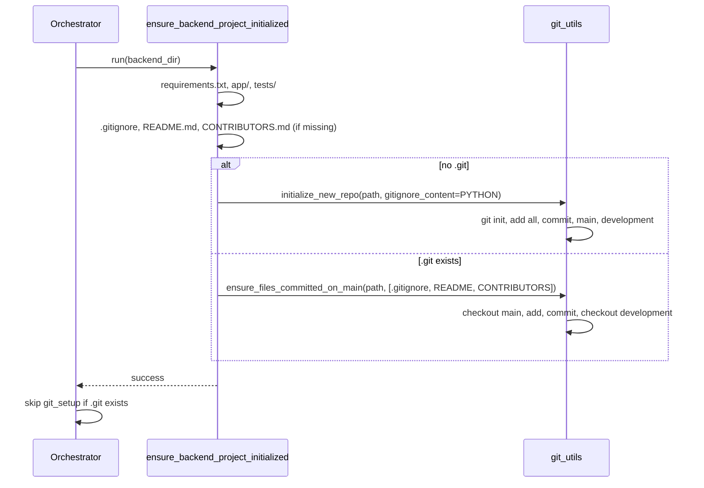

# Backend project setup parity with frontend

## Current state

- **Frontend** (`[shared/command_runner.py](software_engineering_team/shared/command_runner.py)`): `ensure_frontend_project_initialized` creates the directory, runs `npm init -y`, installs deps, writes Angular config and scaffold (including `.nvmrc`). It does not create README/CONTRIBUTORS/.gitignore; that is done by **git_setup** when `.git` is missing.
- **Backend** (`[shared/command_runner.py](software_engineering_team/shared/command_runner.py)`): `ensure_backend_project_initialized` only creates `requirements.txt`, `app/` (with `main.py`), and `tests/`. No README, CONTRIBUTORS, .gitignore, and no `pip install`. Git setup is run only when `(backend_dir / ".git").exists()` is false ([orchestrator](software_engineering_team/orchestrator.py) ~512–517).
- **Git setup** (`[shared/git_utils.py](software_engineering_team/shared/git_utils.py)`): `initialize_new_repo` does `git init`, writes a single `_DEFAULT_GITIGNORE` (Python + Node), blank README.md and CONTRIBUTORS.md, initial commit, renames to `main`, creates and checks out `development`. It always overwrites .gitignore/README/CONTRIBUTORS.

## Goal

- Backend performs its own project setup similar to the frontend: dependency manager (already `requirements.txt`), plus README.md, CONTRIBUTORS.md, and .gitignore with **Python/FastAPI** default patterns.
- Blank README.md and CONTRIBUTORS.md created and **committed on main** if they do not already exist.
- .gitignore added with standard patterns for Python/FastAPI.

## Design

1. **Extend `ensure_backend_project_initialized**` so the backend “owns” repo-level files and, when there is no repo, the initial commit (so setup is self-contained like the frontend).
2. **Python .gitignore**: Define a Python/FastAPI-focused constant (e.g. in `command_runner` or `git_utils`) with patterns such as: `__pycache__/`, `*.py[cod]`, `.venv/`, `venv/`, `.env`, `.env.local`, `dist/`, `build/`, `.pytest_cache/`, `.mypy_cache/`, `.coverage`, `htmlcov/`, IDE/OS cruft (`.idea/`, `.vscode/`, `.DS_Store`). Reuse or trim existing `_DEFAULT_GITIGNORE` from `[git_utils.py](software_engineering_team/shared/git_utils.py)` (lines 147–195) so backend repos get a Python-appropriate default.
3. **README.md and CONTRIBUTORS.md**: Create blank files in `ensure_backend_project_initialized` with `_write_if_missing` so they are never overwritten.
4. **Commit to main**:
  - **No .git**: After writing all project files (including README, CONTRIBUTORS, .gitignore), call git init and initial commit on main, then create/checkout `development`. Use a Python-only .gitignore for this path (either by passing it into `initialize_new_repo` or by writing it before init and making `initialize_new_repo` skip writing .gitignore/README/CONTRIBUTORS when they already exist).  
  - **Existing .git**: If README, CONTRIBUTORS, or .gitignore were just created (or are untracked), ensure they are committed on **main** (e.g. checkout main, add, commit, then checkout development). Add a small helper in `git_utils` for “ensure these files are committed on main” to keep logic in one place.
5. **Dependency install (optional)**: To align with frontend’s `npm install`, add an optional step: run `pip install -r requirements.txt` (or `python -m pip install -r requirements.txt`) after writing `requirements.txt`. Consider doing this inside a venv if we create one (e.g. `.venv`) to avoid polluting the system Python; otherwise document that CI/containers typically run `pip install -r requirements.txt` and keep this step optional or behind a flag so it does not break in constrained environments.

## Implementation outline

### 1. `shared/git_utils.py`

- **Optional .gitignore in `initialize_new_repo**`: Add parameter `gitignore_content: str | None = None`. If provided, write that as `.gitignore`; otherwise use `_DEFAULT_GITIGNORE`. This allows the backend to pass a Python-only .gitignore when it creates the repo.
- **Write-only-if-missing for repo files**: When creating a new repo (inside `initialize_new_repo`), write `.gitignore`, `README.md`, and `CONTRIBUTORS.md` only if each file does not already exist. This lets `ensure_backend_project_initialized` write these files first (with the desired content), then call `initialize_new_repo` for init + add + commit without overwriting.
- **Helper `ensure_files_committed_on_main(repo_path, file_paths: list[str])**`: If the repo has a `main` branch: checkout `main`, `git add` the given paths, commit with a message like “Add README, CONTRIBUTORS, .gitignore” only if there are changes, then checkout `development`. Idempotent and safe when files are already committed.

### 2. `shared/command_runner.py`

- **Python .gitignore constant**: Define `_PYTHON_GITIGNORE` (or similar) with Python/FastAPI patterns (bytecode, venvs, .env, pytest/mypy/coverage, IDE/OS). Can be a subset of or derived from `_DEFAULT_GITIGNORE` without Node-specific lines.
- `**ensure_backend_project_initialized**`:
  - Keep existing logic: create directory, `requirements.txt`, `app/`, `tests/` with `_write_if_missing`.
  - Add: `_write_if_missing(cwd / ".gitignore", _PYTHON_GITIGNORE)`, `_write_if_missing(cwd / "README.md", "")`, `_write_if_missing(cwd / "CONTRIBUTORS.md", "")`.
  - **If no .git**: Call `initialize_new_repo(cwd, gitignore_content=_PYTHON_GITIGNORE)`. Because we now write .gitignore/README/CONTRIBUTORS only if missing in `initialize_new_repo`, the backend’s already-written files will be kept and included in the initial commit.
  - **If .git exists**: Call `ensure_files_committed_on_main(cwd, [".gitignore", "README.md", "CONTRIBUTORS.md"])` so any newly added or previously untracked repo files are committed on main.
  - Optional: run `pip install -r requirements.txt` (or with a venv) after writing `requirements.txt`; document or gate so it does not break in headless/CI environments.

### 3. Orchestrator

- No change required to the “if not .git then git_setup” guard: after `ensure_backend_project_initialized`, the backend dir will already have `.git` when we created it there, so `git_setup` will not run for that path. If for some reason the backend init does not call `initialize_new_repo` (e.g. init is moved or conditional), the existing `git_setup` fallback remains correct.

### 4. Backend prompt (optional)

- In `[backend_agent/prompts.py](software_engineering_team/backend_agent/prompts.py)`, the “PROJECT SCAFFOLDING” section can mention that README.md, CONTRIBUTORS.md, and .gitignore are created by project setup and the agent should extend rather than replace them when appropriate. This is a small documentation alignment.

## Flow summary

## Files to touch

| File                                                                                                       | Changes                                                                                                                                                                                                                              |
| ---------------------------------------------------------------------------------------------------------- | ------------------------------------------------------------------------------------------------------------------------------------------------------------------------------------------------------------------------------------ |
| `[software_engineering_team/shared/git_utils.py](software_engineering_team/shared/git_utils.py)`           | Add `gitignore_content` to `initialize_new_repo`; write .gitignore/README/CONTRIBUTORS only if missing; add `ensure_files_committed_on_main`.                                                                                        |
| `[software_engineering_team/shared/command_runner.py](software_engineering_team/shared/command_runner.py)` | Add `_PYTHON_GITIGNORE`; in `ensure_backend_project_initialized`, write repo files, call `initialize_new_repo` when no .git (with Python gitignore), call `ensure_files_committed_on_main` when .git exists; optional `pip install`. |

## Out of scope

- Java/Spring Boot backend init (e.g. Maven/Gradle and Java .gitignore): the current pipeline uses Python; this plan keeps scope to Python/FastAPI. Java can be added later via a separate init path or a `language` parameter.

