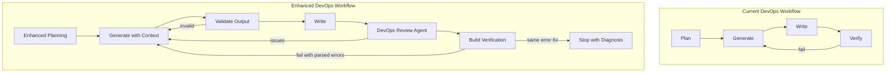

# Beef Up DevOps Agent to Reduce Revisions

## Problem Analysis

The DevOps agent currently lacks the robustness features that make the Backend agent successful. Comparing the two reveals significant gaps:


| Feature                  | Backend Agent                              | DevOps Agent                |
| ------------------------ | ------------------------------------------ | --------------------------- |
| Review sub-agents        | Code Review, QA, Security, DBC Comments    | None                        |
| Structured error parsing | Import, SQL, pytest patterns               | No DevOps-specific patterns |
| File path validation     | Rejects sentence-like names, verb prefixes | None                        |
| Same-error detection     | Breaks loop after 6 identical failures     | None                        |
| Empty output retry       | 4 attempts with explicit rejection         | None                        |
| Planning depth           | Detailed task breakdown                    | Basic 4-field JSON          |


## Recommended Improvements

### 1. Add a DevOps Review Sub-Agent

Create a dedicated review agent for DevOps artifacts that validates:

- **Dockerfile best practices**: Multi-stage builds, non-root users, proper layer caching, minimal base images
- **CI/CD patterns**: Proper job dependencies, caching strategies, secret handling
- **YAML syntax and structure**: Valid workflow syntax, proper indentation
- **IaC conventions**: Resource naming, variable usage, state management

Location: Create `software_engineering_team/devops_review_agent/` with similar structure to `code_review_agent/`.

### 2. Add Structured Error Parsing for DevOps Failures

Extend `shared/error_parsing.py` with new failure classes and parsing logic:

```python
class FailureClass(str, Enum):
    # ... existing ...
    DOCKER_BUILD_ERROR = "docker_build_error"
    DOCKERFILE_SYNTAX = "dockerfile_syntax"
    YAML_PARSE_ERROR = "yaml_parse_error"
    GITHUB_ACTIONS_ERROR = "github_actions_error"
    TERRAFORM_ERROR = "terraform_error"
```

Add playbooks for common DevOps errors:

- `PLAYBOOK_DOCKER_BUILD`: Missing files, invalid base images, failed RUN commands
- `PLAYBOOK_YAML_SYNTAX`: Indentation issues, invalid keys, type mismatches
- `PLAYBOOK_GHA_WORKFLOW`: Invalid action versions, missing permissions, runner issues

### 3. Enhance the DevOps Workflow with Review Gates

Update `devops_agent/agent.py:run_workflow()` to match Backend agent's pattern:

```python
def run_workflow(...):
    # Step 1: Plan (existing)
    # Step 2: Generate (existing)
    # Step 3: Write (existing)
    # NEW Step 4: Pre-verification validation
    #   - Validate YAML syntax before docker build
    #   - Check Dockerfile for obvious issues
    # Step 5: Verify with structured error parsing
    # Step 6: DevOps review sub-agent
    # Step 7: Fix loop with same-error detection
```

### 4. Add Same-Error Detection

Port the Backend agent's loop-breaker logic to DevOps:

```python
# From backend_agent/agent.py lines 716-734
build_error_sig = _build_error_signature(build_errors)
if build_error_sig == last_build_error_sig:
    consecutive_same_build_failures += 1
if consecutive_same_build_failures >= MAX_SAME_BUILD_FAILURES:
    break  # Avoid infinite loop
```

### 5. Add Output Validation

Create validation for DevOps outputs similar to `_validate_file_paths()`:

- Validate Dockerfile has required instructions (FROM, CMD/ENTRYPOINT)
- Validate YAML is syntactically correct before writing
- Validate CI workflow has required top-level keys (name, on, jobs)
- Reject empty or stub outputs

### 6. Enhanced Planning Sub-Agent (Optional but Recommended)

Create a more robust planning phase that:

1. **Analyzes the existing codebase** to understand what needs containerization
2. **Identifies dependencies** (requirements.txt, package.json) to inform Dockerfile
3. **Checks existing CI/CD** to avoid conflicts
4. **Produces a detailed task breakdown** rather than a 4-field summary

This could use the existing `planning_team/devops_planning_agent/` or create a new inline planner similar to Backend's `_plan_task()` but with more depth.

## Implementation Priority

1. **High Impact, Lower Effort**: Add same-error detection and output validation (prevents infinite loops)
2. **High Impact, Medium Effort**: Add structured error parsing for DevOps (better feedback to LLM)
3. **High Impact, Higher Effort**: Add DevOps Review sub-agent (catches issues before verification)
4. **Medium Impact**: Enhance planning sub-agent (reduces first-pass errors)

## Key Files to Modify

- `[software_engineering_team/devops_agent/agent.py](software_engineering_team/devops_agent/agent.py)` - Add validation, review gates, same-error detection
- `[software_engineering_team/shared/error_parsing.py](software_engineering_team/shared/error_parsing.py)` - Add Docker/YAML/GHA failure patterns
- Create `software_engineering_team/devops_review_agent/` - New review sub-agent

## Architecture




