# Plan: Brand-Aligned Blogging Agent Team

## Current state vs spec

**Existing blogging stack** ([blogging/README.md](blogging/README.md)):

- **Research** → web + arXiv, `compiled_document`, `references` (no `allowed_claims.json`).
- **Review** → title choices + outline (no formal content brief, audience model, or angle strategy).
- **Draft** → draft from research + outline + style guide (markdown; no claim tagging).
- **Copy Editor** → feedback items only (no PASS/FAIL, no `compliance_report.json`, no veto).
- **Publication** → submit/approve/reject, platform formats (no `publishing_pack.json` schema).

**Pipeline** ([blogging/agent_implementations/blog_writing_process.py](blogging/agent_implementations/blog_writing_process.py)): linear Research → Review → Draft ↔ Copy Editor loop (fixed iterations). No artifact persistence, no gates, no validators.

**Style guide**: Single markdown file ([blogging/docs/brandon_kindred_brand_and_writing_style_guide.md](blogging/docs/brandon_kindred_brand_and_writing_style_guide.md)); spec requires structured `brand_spec.yaml` with banned phrases, formatting rules, definition of done, etc.

---

## Architecture (target)

```mermaid
flowchart LR
  subgraph inputs [Inputs]
    Brief[Industry/Brief]
    Brand[brand_spec.yaml]
  end

  subgraph orchestration [Orchestration]
    ED[Editorial Director]
  end

  subgraph planning [Planning]
    AA[Audience Analyst]
    TAS[Angle Strategist]
  end

  subgraph research [Research]
    RL[Research Librarian]
    SME[SME Optional]
  end

  subgraph content [Content]
    CA[Content Architect]
    DW[Draft Writer]
    DE[Developmental Editor]
    LE[Line Editor]
  end

  subgraph gates [Gates]
    Validators[Deterministic Validators]
    FC[Fact-Checker Risk]
    BSE[Brand Style Enforcer]
  end

  subgraph output [Output]
    Final[final.md]
    Pack[publishing_pack.json]
  end

  Brief --> ED
  Brand --> ED
  ED --> AA
  ED --> TAS
  AA --> RL
  TAS --> RL
  RL --> CA
  CA --> DW
  DW --> DE
  DE --> LE
  LE --> Validators
  Validators --> FC
  FC --> BSE
  BSE -->|PASS| Final
  BSE -->|FAIL| DW
  Final --> Pack
```

**Hard gates (publish-ready only when all PASS)**:

- Deterministic validators → `validator_report.json` (status PASS/FAIL).
- Fact-Checker / Risk → claims and risk PASS.
- Brand and Style Enforcer → `compliance_report.json` (status PASS/FAIL); veto on FAIL.

**Closed-loop rewrite**: On any FAIL, route `compliance_report.json` (and validator details) back to Draft Writer or Line Editor; re-run validators and compliance until PASS or max iterations (e.g. 3–5); then escalate to human or output best draft + reports.

---

## Implementation plan

### 1. Artifact layer and run directory

- **Add a run-scoped artifact directory** (e.g. `blogging/agent_implementations/run_dir/` or caller-provided `work_dir`). Every run writes all outputs as named files so the pipeline is auditable and repeatable.
- **Standard artifact names** (as per spec): `brand_spec.yaml`, `content_brief.md`, `research_packet.md`, `allowed_claims.json`, `outline.md`, `draft_v1.md`, `draft_v2.md`, `final.md`, `compliance_report.json`, `validator_report.json`, `publishing_pack.json`.
- **Helper**: e.g. `blogging/shared/artifacts.py` with `write_artifact(work_dir, name, content)` and `read_artifact(work_dir, name)` (and optional path return for downstream agents). Reuse the same pattern as [software_engineering_team/planning_team/api_contract_planning_agent/agent.py](software_engineering_team/planning_team/api_contract_planning_agent/agent.py) `_write_artifact`.
- **Pipeline entrypoint**: Accept `work_dir` (and optional `brand_spec_path`). Ensure each agent reads/writes from `work_dir` where applicable.

**Files to add/change**:

- New: `blogging/shared/artifacts.py` (and `blogging/shared/__init__.py`).
- Update: `blog_writing_process.py` (or new `blog_writing_process_v2.py`) to take `work_dir`, persist after each stage (e.g. `research_packet.md`, `outline.md`, `draft_v1.md`, …).

---

### 2. Brand Spec (single source of truth)

- **Introduce `brand_spec.yaml**` as the canonical brand and style source. Minimum fields (per spec): `brand` (name, audience, purpose), `voice` (tone, style_notes, banned_phrases, banned_patterns), `readability` (target_grade_level, max_grade_level), `formatting` (require_sections, min/max paragraph sentences, prefer_short_paragraphs, disallow_em_dash, avoid_excessive_bullets), `content_rules` (claims_policy, safety disclaimers), `examples` (on_brand, off_brand), `definition_of_done`.
- **Create an initial `brand_spec.yaml**` derived from [blogging/docs/brandon_kindred_brand_and_writing_style_guide.md](blogging/docs/brandon_kindred_brand_and_writing_style_guide.md): extract banned phrases (e.g. “corporate buzzword soup”, “crushing it”), paragraph rules (e.g. 2–4 sentences), no em dash, reading level 8, etc. Keep the markdown as optional supplementary reading; agents and validators load only the YAML.
- **Loader**: Add `blogging/shared/brand_spec.py` (or under `blogging/`) to load and validate `brand_spec.yaml` (Pydantic model or dataclass) and expose it to validators, compliance agent, and draft/copy-editor agents.
- **Draft and Copy Editor agents**: When a brand spec path (or `work_dir` with `brand_spec.yaml`) is provided, load YAML and inject structured rules (and optionally the full YAML or a summary) into prompts; keep fallback to existing style guide path for backward compatibility during migration.

**Files to add/change**:

- New: `blogging/brand_spec.yaml` (or `blogging/docs/brand_spec.yaml`), `blogging/shared/brand_spec.py` (loader + schema).
- Update: `blog_draft_agent`, `blog_copy_editor_agent` to accept `brand_spec_path` or `brand_spec` dict and use it when present.

---

### 3. Deterministic validators (mandatory)

- **New module**: `blogging/validators/` (or `blogging/blog_validators/`) producing a single `validator_report.json` from inputs: `final.md` (or latest draft), `brand_spec.yaml`, and (when required) `allowed_claims.json`.
- **Checks to implement**:
  1. **Banned phrases**: Exact and case-insensitive match against `brand_spec.voice.banned_phrases`.
  2. **Banned patterns**: e.g. em dash scan, excessive exclamation (regex or simple heuristics from `banned_patterns`).
  3. **Paragraph sentence count**: Per-paragraph sentence count within `[min_paragraph_sentences, max_paragraph_sentences]` from brand spec.
  4. **Reading level**: Flesch-Kincaid grade level (use existing library e.g. `textstat`) vs `target_grade_level` / `max_grade_level`.
  5. **Required sections**: If `formatting.require_sections` is true, check presence of required headings (configurable list in spec or default from definition_of_done).
  6. **Claims policy**: If `content_rules.claims_policy.require_allowed_claims` is true, fail if draft contains factual claims not tagged with `[CLAIM:<id>]` or references unknown claim IDs (see allowed claims below).
- **Output schema**: `validator_report.json` with `status` (PASS/FAIL) and `checks` array of `{ name, status, details }`. One failing check sets overall status to FAIL.

**Files to add**:

- New: `blogging/validators/__init__.py`, `blogging/validators/runner.py` (orchestrates all checks), `blogging/validators/checks.py` (per-check logic), `blogging/validators/models.py` (report schema). Optional: `blogging/validators/reading_level.py` (Flesch-Kincaid wrapper).

---

### 4. Allowed claims policy (Research Librarian + Draft Writer)

- **Research Librarian output**: Extend or wrap the current Research agent so that in addition to `research_packet.md` (e.g. current `compiled_document`), it produces `**allowed_claims.json**`: list of claims with `id`, `text`, `citations`, `risk_level`. Research agent should explicitly extract “evidence-backed factual claims” from sources and list them; optionally flag risky/weak statements.
- **Schema**: Match spec example: `{ "topic": "...", "claims": [ { "id": "123", "text": "...", "citations": ["..."], "risk_level": "low" } ] }`.
- **Draft Writer**: Instruct (via prompt and optional few-shot) to use **only** claims from `allowed_claims.json` and tag them in the draft as `[CLAIM:123]`. No new factual claims allowed; opinions or general advice need not be tagged.
- **Validator**: Claims check: (1) any sentence that looks like a factual claim (heuristic: numbers, “studies show”, “X%”, etc.) must have a `[CLAIM:id]` tag; (2) every `[CLAIM:id]` must exist in `allowed_claims.json`. Simplest reliable approach is requiring tags for all factual claims and strict ID matching.

**Files to add/change**:

- New: `blogging/blog_research_agent/allowed_claims.py` (schema + extraction prompt/step in research flow) or extend [blogging/blog_research_agent/agent.py](blogging/blog_research_agent/agent.py) to output `allowed_claims` and persist as `allowed_claims.json` in `work_dir`.
- Update: [blogging/blog_draft_agent/prompts.py](blogging/blog_draft_agent/prompts.py) and agent to accept `allowed_claims.json` path/content and enforce tagging; [blogging/blog_draft_agent/models.py](blogging/blog_draft_agent/models.py) add optional `allowed_claims_path` or `allowed_claims` to `DraftInput`.
- Update: Validator claims check to read `allowed_claims.json` and scan draft for tags and untagged factual-looking statements.

---

### 5. Brand and Style Enforcer (compliance agent with veto)

- **New agent**: `blogging/blog_compliance_agent/` (or `blog_style_enforcer_agent/`). **Inputs**: `brand_spec.yaml`, draft candidate (e.g. `final.md`), `validator_report.json`. **Output**: `compliance_report.json` with:
  - `status`: PASS | FAIL
  - `violations`: list of `{ rule_id, description, evidence_quotes, location_hint }`
  - `required_fixes`: ordered list of patch instructions
  - `notes`: optional
- **Behavior**: Load brand spec and draft; run LLM (or rule-based) to detect violations of voice, formatting, definition_of_done, etc. Produce machine-actionable report. If `status == FAIL`, the orchestrator **blocks publication** and enters the rewrite loop.
- **Veto rule**: Pipeline treats FAIL as “not publish-ready”; only when status is PASS do we consider the post ready and write `publishing_pack.json` / mark publish-ready.

**Files to add**:

- New: `blogging/blog_compliance_agent/__init__.py`, `agent.py`, `models.py` (ComplianceReport schema), `prompts.py`. Persist output to `work_dir/compliance_report.json`.

---

### 6. Fact-Checker and Risk Officer

- **New agent**: `blogging/blog_fact_check_agent/` (or combined with compliance). **Inputs**: draft, `allowed_claims.json`, `brand_spec.yaml` (safety.require_disclaimer_for). **Output**: extend `compliance_report.json` or separate `risk_report` section: claims verified, legal/medical/financial/security flags, disclaimers required. Status PASS/FAIL for “claims policy” and “risk policy”.
- **Integration**: Either (a) same report file as compliance (e.g. `compliance_report.json` has `claims_status`, `risk_status`, `required_disclaimers`) or (b) separate report that the orchestrator also gates on. Spec says “Risk and fact-check returns PASS for claims policy” as a gate.

**Files to add**:

- New: `blogging/blog_fact_check_agent/` (or a submodule under `blog_compliance_agent`) with agent, models, prompts. Orchestrator runs it after validators and before or in parallel with style compliance; both must PASS.

---

### 7. Closed-loop rewrite cycle

- **Orchestrator logic** (in `blog_writing_process` or new Editorial Director script):
  - After producing a draft candidate (e.g. `final.md`), run validators → `validator_report.json`; run Fact-Checker → risk/claims status; run Brand/Style Enforcer → `compliance_report.json`.
  - If any of these is FAIL: pass `compliance_report.json` (and validator failure details) to the **Draft Writer** or **Line Editor** with instructions to apply `required_fixes` exactly and not introduce new factual claims. Re-run validators and compliance. Repeat until PASS or **max iterations** (e.g. 3–5).
  - **Escalation**: If max iterations reached, output best draft plus all failure reports and set status to `NEEDS_HUMAN_REVIEW`.
- **Line Editor**: Spec calls out a separate “Line Editor” that tightens prose and applies brand constraints to produce `final.md`. Currently the Copy Editor only gives feedback. Options: (a) add a dedicated Line Editor agent that takes draft + compliance/validator feedback and outputs revised `final.md`; or (b) use the existing Draft revision path with Copy Editor feedback replaced or augmented by `required_fixes` from compliance. Prefer (b) for minimal new agents first, then add a dedicated Line Editor if needed.
- **Status codes**: Use `PASS`, `FAIL`, `NEEDS_HUMAN_REVIEW` in reports and orchestrator.

**Files to change**:

- [blogging/agent_implementations/blog_writing_process.py](blogging/agent_implementations/blog_writing_process.py) or new `blogging/agent_implementations/blog_writing_process_v2.py`: add artifact work_dir, run validators + compliance + fact-check after draft, loop on FAIL with max iterations, then optional SEO/packaging step.

---

### 8. Content brief and optional new agents (phased)

- **Content brief**: The spec has the Editorial Director produce `content_brief.md` (including audience model and angle selection). Today, the “brief” is a short string. Add a structured **content brief** artifact: e.g. sections for audience model, angle selection (3–5 angles, primary thesis, counterargument), and any other planning output. This can be produced by:
  - **Option A**: A single “Editorial Director” agent that takes industry/brief + brand spec and outputs `content_brief.md` (and optionally drives the rest of the pipeline).
  - **Option B**: Extend the Review agent to output a fuller `content_brief.md` (audience + angles + outline) and persist it; then keep a thin orchestrator that sequences stages.
- **Audience and Industry Analyst**: Could be a dedicated agent that writes the “Audience model” section of `content_brief.md` (pain points, incentives, vocabulary, taboos, objections). Same for **Trend and Angle Strategist** (3–5 angles, primary thesis, counterargument). Implement as separate small agents or as one “Planning” agent that fills the brief.
- **Content Architect**: Spec says “Outline Engineer” that builds `outline.md` from brief + research and maps sections to goals. Current Review agent already produces an outline; rename or split so that “Content Architect” is responsible for `outline.md` from `content_brief.md` + `research_packet.md`.
- **Developmental Editor**: Spec: “Fixes structure, flow, logic, pacing” → `draft_v2.md`. **Line Editor**: “Tightens prose, enforces style” → `final.md`. Today: Draft → Copy Editor feedback → Draft revises (no separate developmental vs line). Phased approach: (1) Keep current Draft + Copy Editor loop but add compliance/validator gates and required_fixes-driven revisions. (2) Optionally add a Developmental Editor step (Draft → Developmental → draft_v2) and a Line Editor step (draft_v2 → Line → final) for clearer separation.

**Recommendation**: Implement **Phase 1** (artifacts, brand_spec, validators, allowed_claims, compliance agent, fact-check agent, rewrite loop) without adding all new agents. Add **Phase 2** (Editorial Director, Audience Analyst, Angle Strategist, Content Architect, Developmental + Line Editor, SEO/Packaging, Repurposing) as separate tasks so the pipeline first becomes “gate-based” and “auditable,” then “richer” in planning and editing stages.

---

### 9. SEO and publishing pack

- `**publishing_pack.json**`: Add schema and producer (optional agent or final step): title options, meta description, header polish, internal link suggestions, snippet copy. Publication agent already produces platform-specific markdown (Medium, dev.to, Substack); extend it to also write `publishing_pack.json` (or a dedicated SEO/Packaging step) with this structure so the spec’s “publish-ready” output includes `final.md` + `publishing_pack.json`.

**Files to change**:

- [blogging/blog_publication_agent/models.py](blogging/blog_publication_agent/models.py): add `PublishingPack` model (title_options, meta_description, etc.). [blogging/blog_publication_agent/agent.py](blogging/blog_publication_agent/agent.py): after approval, generate and persist `publishing_pack.json` in the post folder or work_dir.

---

### 10. API and backward compatibility

- **API**: Existing [blogging/api/main.py](blogging/api/main.py) exposes `POST /research-and-review`. Add optional `work_dir` (or run_id) so that when provided, artifacts are written there and the full pipeline (including validators and compliance) can be invoked. New endpoint e.g. `POST /full-pipeline` (or extend request body with `run_artifact_dir` and `run_full_gates`) to run research → review → draft → validators → compliance → rewrite loop → publishing pack.
- **Backward compatibility**: When `work_dir` is not set, keep current behavior: in-memory only, no validators/compliance gates, same response shapes. This allows existing callers to remain unchanged until they opt in to the new flow.

---

## Definition of done (per spec)

A blog post is **publish-ready** when:

- `validator_report.json.status == PASS`
- `compliance_report.json.status == PASS`
- Claims policy passes (fact-check / allowed_claims)
- Risk policy passes
- Outputs stored as `final.md` and `publishing_pack.json`

---

## Suggested implementation order (detailed todos in frontmatter)

Execute the frontmatter `todos` in this order for a runnable pipeline at each step:

1. **Artifact layer** – `shared-dir` → `artifacts-module` → `artifact-constants` → `pipeline-work-dir` → `pipeline-persist-research` → `pipeline-persist-outline` → `pipeline-persist-drafts`.
2. **Brand spec** – `brand-spec-schema` → `brand-spec-loader` → `brand-spec-yaml` → `draft-agent-brand-spec` → `copy-editor-brand-spec`.
3. **Validators (no claims yet)** – `validators-module` → `validator-banned-phrases` → `validator-banned-patterns` → `validator-paragraph-length` → `validator-reading-level` → `validator-required-sections` → `validators-runner`. Add `tests-validators` when runner is done.
4. **Allowed claims** – `allowed-claims-schema` → `research-output-claims` → `research-persist-claims` → `draft-input-claims` → `draft-prompts-claims` → `validator-claims-check`.
5. **Compliance agent** – `compliance-agent-module` → `compliance-models` → `compliance-agent-run` → `compliance-veto` → `tests-compliance`.
6. **Fact-Checker** – `fact-check-agent-module` → `fact-check-models` → `fact-check-agent-run`.
7. **Closed-loop** – `orchestrator-gates` → `orchestrator-rewrite-loop` → `orchestrator-escalation` → `orchestrator-status-codes`.
8. **Publishing pack** – `publishing-pack-schema` → `publishing-pack-generate`.
9. **API and docs** – `api-work-dir` → `api-full-pipeline` → `backward-compat` → `readme-artifacts` → `tests-pipeline`.
10. **Phase 2 (optional)** – `phase2-editorial-director` through `phase2-repurposing` in any order that respects dependencies (e.g. content_brief before Content Architect).

This order keeps the pipeline runnable at each step and delivers “hard gates + closed loop” before expanding the number of agents.