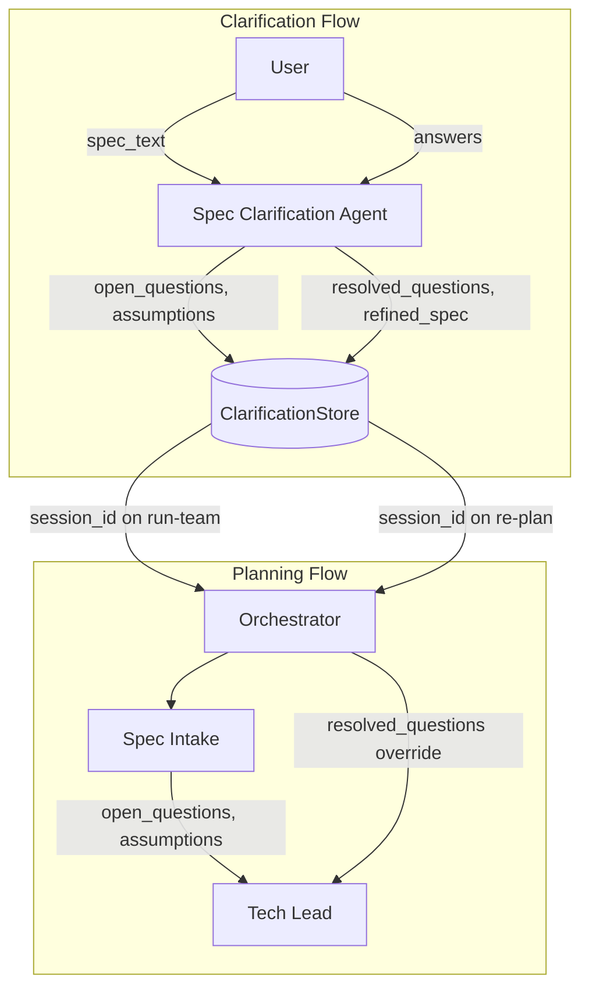

# Clarification Agent with Planning Integration

## Current State

- **Clarification API** (`[software_engineering_team/api/main.py](software_engineering_team/api/main.py)` lines 254-298): Rule-based `ClarificationStore` with keyword heuristics; no LLM, no link to jobs or planning.
- **Spec Intake** (`[planning_team/spec_intake_agent/agent.py](software_engineering_team/planning_team/spec_intake_agent/agent.py)`): Produces `open_questions` and `assumptions` via LLM.
- **Tech Lead** (`[tech_lead_agent/models.py](software_engineering_team/tech_lead_agent/models.py)`): Receives `open_questions` and `assumptions`, resolves them with best-practice defaults; no support for user-provided answers.
- **Orchestrator** (`[orchestrator.py](software_engineering_team/orchestrator.py)`): Single-threaded flow; spec from `initial_spec.md`, no mechanism to inject clarification data mid-run.

## Architecture




## Implementation Plan

### 1. Spec Clarification Agent (LLM-based)

**New module:** `software_engineering_team/planning_team/spec_clarification_agent/`

- **Input:** `spec_content`, `prior_turns` (chat history), `open_questions`, `assumptions`
- **Output:** `assistant_message`, `open_questions` (updated), `assumptions` (updated), `resolved_questions` (accumulated), `confidence_score`, `done_clarifying`
- **Behavior:** Uses LLM to pick the next question from `open_questions`, or to interpret the user's answer and update state. When the user answers, append to `resolved_questions` and remove that question from `open_questions`. Stop when confidence is high or no questions remain.

**Bootstrap:** On session create, run Spec Intake to get initial `open_questions` and `assumptions`, or have the clarification agent analyze the spec itself. Reusing Spec Intake keeps alignment with the planning pipeline.

### 2. ClarificationStore Enhancements

**File:** `[shared/clarification_store.py](software_engineering_team/shared/clarification_store.py)`

- Add `resolved_questions: List[Dict]` to `ClarificationSession` (each entry: `{question, answer, category}`).
- Add optional `job_id: Optional[str]` to link a session to a job.
- Replace rule-based `_extract_open_questions` / `_extract_assumptions` with a call to Spec Intake (or the new clarification agent) when creating a session.
- On `add_user_message`: call the Spec Clarification Agent to process the answer and produce the next question or completion.

### 3. Tech Lead: User-Resolved Questions

**File:** `[tech_lead_agent/models.py](software_engineering_team/tech_lead_agent/models.py)`

- Add to `TechLeadInput`:
  ```python
  resolved_questions: Optional[List[Dict[str, str]]] = Field(
      None,
      description="User-provided answers from clarification chat; when set, use these instead of resolving with defaults",
  )
  ```

**File:** `[tech_lead_agent/prompts.py](software_engineering_team/tech_lead_agent/prompts.py)` and agent logic

- When `resolved_questions` is provided, inject them into the prompt as pre-resolved and skip asking the model to resolve those questions.

### 4. API: Link Clarification to Run

**File:** `[api/main.py](software_engineering_team/api/main.py)`

**POST /run-team** – extend request body:

```python
class RunTeamRequest(BaseModel):
    repo_path: str = Field(...)
    clarification_session_id: Optional[str] = Field(None, description="Use refined_spec and resolved_questions from this session")
```

- When `clarification_session_id` is set: load session, use `refined_spec` (or `spec_text` + clarification summary) as `spec_content`, and pass `resolved_questions` into the orchestrator.

**New endpoint: POST /run-team/{job_id}/re-plan-with-clarifications**

- Body: `{ "clarification_session_id": str }`
- Behavior: Load session; use `refined_spec` and `resolved_questions`; call `run_orchestrator` with overrides. Only re-runs the planning phase (spec intake through conformance); does not re-run execution. Requires a planning-only code path.

### 5. Orchestrator Changes

**File:** `[orchestrator.py](software_engineering_team/orchestrator.py)`

- Extend `run_orchestrator(job_id, repo_path, ...)` with optional kwargs:
  - `spec_content_override: Optional[str] = None`
  - `resolved_questions_override: Optional[List[Dict]] = None`
- When `spec_content_override` is set: use it instead of `load_spec_from_repo(path)`.
- When `resolved_questions_override` is set: after Spec Intake, merge user resolutions into the flow. Pass `resolved_questions` to Tech Lead; Tech Lead uses them instead of resolving `open_questions` with defaults.

### 6. "Inform Planning Agents" During Run

**Option A (simpler):** No mid-run injection. Clarification only affects:

- New runs (via `clarification_session_id` on POST /run-team)
- Completed runs (via POST /run-team/{job_id}/re-plan-with-clarifications)

**Option B (advanced):** Add a shared store (e.g. `clarification_updates[job_id]`) that the orchestrator checks before each Tech Lead call. When the user sends a clarification message, the API writes to this store. The orchestrator merges new `resolved_questions` into the Tech Lead input. This requires orchestration checkpoints and is more invasive.

**Recommendation:** Start with Option A. Add Option B only if you need live updates during a run.

### 7. Planning-Only Re-run

The orchestrator today is one end-to-end function. To support "re-plan only":

- **Option 1:** Add a `planning_only: bool = False` parameter. When true, run spec intake through conformance, then stop before execution.
- **Option 2:** Extract a `run_planning_phase(job_id, repo_path, ...)` function and call it from both `run_orchestrator` and the re-plan endpoint.

## Key Files


| File                                      | Changes                                                                |
| ----------------------------------------- | ---------------------------------------------------------------------- |
| `planning_team/spec_clarification_agent/` | New agent (prompts, models, agent.py)                                  |
| `shared/clarification_store.py`           | LLM integration, resolved_questions, Spec Intake bootstrap             |
| `api/main.py`                             | RunTeamRequest.session_id, re-plan endpoint                            |
| `orchestrator.py`                         | spec_content_override, resolved_questions_override, planning-only path |
| `tech_lead_agent/models.py`               | resolved_questions field                                               |
| `tech_lead_agent/agent.py`                | Use resolved_questions when provided                                   |


## Data Flow Summary

1. **Create session:** POST /clarification/sessions with spec_text → run Spec Intake → store open_questions, assumptions → return first question.
2. **Chat:** POST /clarification/sessions/{id}/messages with user answer → Spec Clarification Agent processes answer → update resolved_questions, open_questions → return next question or done.
3. **Start run with clarifications:** POST /run-team with repo_path + clarification_session_id → use refined_spec and resolved_questions.
4. **Re-plan after run:** POST /run-team/{job_id}/re-plan-with-clarifications with session_id → re-run planning phase with refined_spec and resolved_questions.

