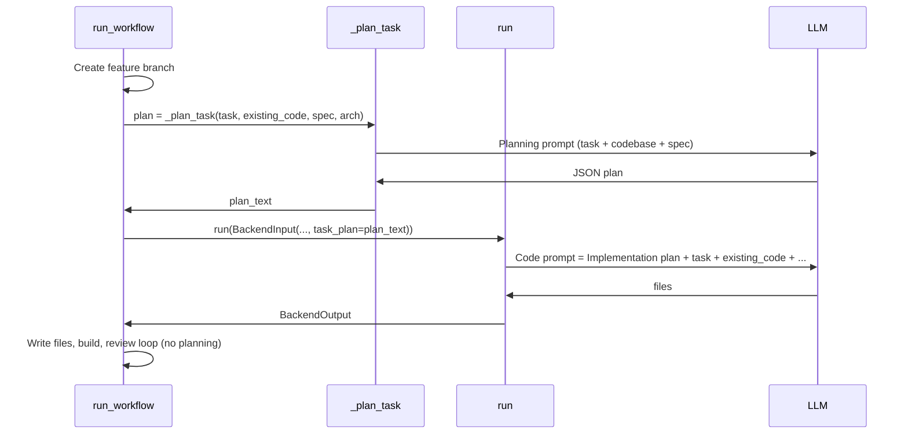

# Per-task planning for backend and frontend coding agents

## Current behavior

- **Backend** (`[software_engineering_team/backend_agent/agent.py](software_engineering_team/backend_agent/agent.py)`): `run_workflow()` creates a feature branch, then immediately calls `self.run(BackendInput(...))` with task, requirements, spec, architecture, and existing code. No planning step; the model goes straight to generating files.
- **Frontend** (`[software_engineering_team/frontend_team/feature_agent/agent.py](software_engineering_team/frontend_team/feature_agent/agent.py)`): Same pattern—branch, then `self.run(FrontendInput(...))` in a loop with no prior planning.
- **Existing “planning”** in the repo is project-level: Tech Lead uses `BackendPlanningAgent` / `FrontendPlanningAgent` in `[planning_team](software_engineering_team/planning_team/)` to produce a **PlanningGraph** (task IDs and dependencies), not per-task implementation plans (what to change, algorithms, tests).

So the gap is **per-task implementation planning** before writing code.

## Goal

When each coding agent receives a task, before the first code generation it should:

1. **Review the codebase** (existing code is already read and passed as context; planning will use it explicitly).
2. **Produce a plan** covering:
  - **Feature intent** – what the feature is meant to achieve from the task details.
  - **What needs to change** – files/modules to add or modify.
  - **Algorithms / data structures** – choices for efficiency and correctness.
  - **Tests needed** – what to add or update to verify behavior.
3. **Use that plan to perform the implementation**: the coding agent must treat the plan as the authoritative guide. Code generation is not optional interpretation—the agent implements the task **according to** the plan: the files and modules produced must realize the plan’s “what needs to change”, the algorithms/data structures chosen in the plan must be used, and the tests written must cover “tests needed” from the plan.

Planning should run only for **initial** code generation, not in the review/fix loop (when QA, security, or code review issues are already present).

## Design options

| Approach                    | Description                                                                                                                                                                                                                   | Pros                                                                                | Cons                                                         |
| --------------------------- | ----------------------------------------------------------------------------------------------------------------------------------------------------------------------------------------------------------------------------- | ----------------------------------------------------------------------------------- | ------------------------------------------------------------ |
| **A. In-agent (two-phase)** | Add a planning step inside `BackendExpertAgent` and `FrontendExpertAgent`: one LLM call for the plan, then pass the plan into the existing `run()` and prompt.                                                                | No new agents; minimal wiring; plan always in context for code gen.                 | Two LLM calls per task; prompt surface grows.                |
| **B. Planning subagent**    | New agent(s), e.g. `BackendTaskPlanningAgent` and `FrontendTaskPlanningAgent` (or one shared `TaskPlanningAgent` with domain). Workflow calls the subagent first, then passes the plan into `BackendInput` / `FrontendInput`. | Clear separation; reusable; easy to persist plans to `plan/` and test in isolation. | More modules; orchestrator/workflow must wire and pass plan. |

Recommendation: **Option A (in-agent)** for fewer moving parts and a single place to maintain behavior. Option B is a good follow-up if you want to persist plans to `plan/` or reuse planning elsewhere.

## Plan structure

Introduce a small, structured plan so it can be passed into the code prompt and optionally persisted:

- **feature_intent** (str): What the feature is meant to achieve.
- **what_changes** (str or list): Files/modules to add or modify; high-level change list.
- **algorithms_data_structures** (str): Key algorithmic or data-structure choices for efficiency/correctness.
- **tests_needed** (str): What unit/integration tests to add or update.

Serialize to a short markdown or bullet block for injection into the code-generation prompt (e.g. a “**Implementation plan**” section).

### Using the plan to drive implementation

The plan must **drive** implementation, not sit alongside it. Concretely:

- **Code-generation prompt**: When `task_plan` is present, the prompt must state clearly that the model must **implement the task according to the Implementation plan**: the “files” (and “code”) output must realize the plan’s *what_changes* (files/modules to add or modify), use the *algorithms_data_structures* choices described in the plan, and include the *tests_needed* (unit/integration tests) from the plan. The plan is the primary specification for what to build; the task description and requirements provide context but the plan refines them into a concrete implementation checklist.
- **Placement**: The Implementation plan block should appear near the top of the code-generation context (after any problem-solving header) so the model sees it before the rest of the task and existing code.
- **Wording**: Use explicit instructions such as “Implement the task strictly according to the Implementation plan below. Your output must realize every item under ‘What changes’ and ‘Tests needed’, and use the algorithms/data structures described. Do not deviate from the plan unless the task description explicitly contradicts it.”

This ensures the coding agents actually use the plan to perform the implementation for the provided task.

## Implementation outline

### 1. Shared plan model and prompts (optional but useful)

- **Location**: e.g. `software_engineering_team/shared/task_plan.py` (or in each agent’s `models.py`).
- **Model**: Pydantic or dataclass with the four fields above; add a `to_markdown()` (or `to_context_string()`) for the code prompt.
- **Planning prompt**: Add a prompt (backend- and frontend-specific or parameterized by domain) that:
  - Takes: task description, requirements, existing code (truncated), spec snippet, architecture.
  - Asks for: feature intent, what to change, algorithms/data structures, tests needed.
  - Requests JSON output with those four keys for reliable parsing.

### 2. Backend agent

- **Models** (`[backend_agent/models.py](software_engineering_team/backend_agent/models.py)`): Add optional `task_plan: Optional[str] = None` to `BackendInput` (plan text to inject into the code prompt).
- **Agent** (`[backend_agent/agent.py](software_engineering_team/backend_agent/agent.py)`):
  - In `run_workflow()`, **before** the clarification loop and first `self.run()`: if there are no `qa_issues` / `security_issues` / `code_review_issues`, call a new internal method (e.g. `_plan_task()`) that:
    - Builds context from task, existing code (from repo), spec, architecture.
    - Calls the LLM with the planning prompt; parses JSON into the plan model; serializes to string.
  - Pass the resulting plan into the first `BackendInput(..., task_plan=plan_text)`.
  - In the review loop, when calling `_regenerate_with_issues()`, do **not** pass a plan (or pass `None`); planning is only for initial generation.
- **Prompts** (`[backend_agent/prompts.py](software_engineering_team/backend_agent/prompts.py)`): Add `BACKEND_PLANNING_PROMPT`. In the main code-generation prompt, add a clear rule: when “Implementation plan” is present, the model **must implement the task according to that plan**—output must realize the plan’s what_changes and tests_needed and use the stated algorithms/data structures; the plan is the authoritative guide for what to build.

In `run()`: when `input_data.task_plan` is present, prepend the Implementation plan near the top of the context (after any problem-solving header) with explicit wording that implementation must follow the plan (e.g. “Implement the task strictly according to the Implementation plan below. Your files output must realize every item under ‘What changes’ and ‘Tests needed’.”).

### 3. Frontend agent

- **Models** (`[frontend_team/feature_agent/models.py](software_engineering_team/frontend_team/feature_agent/models.py)`): Add optional `task_plan: Optional[str] = None` to `FrontendInput`.
- **Agent** (`[frontend_team/feature_agent/agent.py](software_engineering_team/frontend_team/feature_agent/agent.py)`):
  - In `run_workflow()`, **before** the first `self.run(FrontendInput(...))` in the loop (and only when there are no issues to fix), call a planning step (e.g. `_plan_task()`) with task, existing code, spec, architecture, and optionally API/backend context; get back plan text.
  - Pass `task_plan=plan_text` into the first `FrontendInput(...)`.
  - Do not re-plan in subsequent loop iterations when fixing QA/a11y/security/code review issues.
- **Prompts** (`[frontend_team/feature_agent/prompts.py](software_engineering_team/frontend_team/feature_agent/prompts.py)`): Add `FRONTEND_PLANNING_PROMPT`. In the main code-generation prompt, add a rule: when “Implementation plan” is present, the model **must implement the task according to that plan**—files/components must realize the plan’s what_changes and tests_needed; the plan is the authoritative guide.

In `run()`: when `input_data.task_plan` is set, prepend the Implementation plan near the top of the context with explicit instructions that implementation must follow the plan (realize what_changes and tests_needed; do not deviate unless the task contradicts the plan).

### 4. Frontend orchestrator

- `[frontend_team/orchestrator.py](software_engineering_team/frontend_team/orchestrator.py)` calls `self.feature_agent.run(FrontendInput(...))` in the implementation loop. For consistency:
  - Either run the same planning step once at the start of the implementation phase and pass `task_plan` into the first `FrontendInput`, or
  - Rely on the feature agent’s own planning when the orchestrator is not used (direct `FrontendExpertAgent.run_workflow()`). If both paths should plan, add a small shared helper (e.g. “produce task plan for frontend”) and call it from both the feature agent and the orchestrator so behavior and prompts stay aligned.

### 5. Optional: persist plans

- In `run_workflow()` (backend and frontend), after producing the plan, if a `plan/` directory exists (e.g. `repo_path.parent / "plan"` or `repo_path / "plan"` as in the README), write the plan to e.g. `plan/backend_task_<task_id>.md` or `plan/frontend_task_<task_id>.md` for traceability and debugging.

### 6. Clarification and edge cases

- **Clarification**: If the agent returns `needs_clarification` in the **planning** step, you can either (a) treat it like today and let the Tech Lead refine the task, then re-run planning, or (b) skip plan and pass no plan into the first code gen. Prefer (a) so the plan reflects the refined task.
- **Empty/repo-setup tasks**: For tasks that are mostly “setup repo / add .gitignore”, planning may be minimal; the planning prompt should allow short plans and still output valid JSON.
- **Token budget**: Planning uses existing_code (already truncated in workflows). Keep planning output short (e.g. a few hundred words) so the combined plan + code prompt stays within limits.

## Flow summary (in-agent option)

The code prompt includes the Implementation plan plus explicit instructions that the model must **implement the task according to the plan** (realize what_changes and tests_needed); the plan drives what gets built.

## Files to touch (in-agent approach)

- `[software_engineering_team/backend_agent/agent.py](software_engineering_team/backend_agent/agent.py)`: Add `_plan_task()`, call it before first `run()`, pass plan into `BackendInput`; in `run()`, inject `task_plan` into context.
- `[software_engineering_team/backend_agent/models.py](software_engineering_team/backend_agent/models.py)`: Add `task_plan: Optional[str]` to `BackendInput`; optionally add a small `TaskPlan` model for parsing.
- `[software_engineering_team/backend_agent/prompts.py](software_engineering_team/backend_agent/prompts.py)`: Add `BACKEND_PLANNING_PROMPT`; mention in main prompt that “Implementation plan” must be followed when present.
- `[software_engineering_team/frontend_team/feature_agent/agent.py](software_engineering_team/frontend_team/feature_agent/agent.py)`: Same: `_plan_task()`, pass plan into first `FrontendInput`, inject plan in `run()`.
- `[software_engineering_team/frontend_team/feature_agent/models.py](software_engineering_team/frontend_team/feature_agent/models.py)`: Add `task_plan: Optional[str]` to `FrontendInput`.
- `[software_engineering_team/frontend_team/feature_agent/prompts.py](software_engineering_team/frontend_team/feature_agent/prompts.py)`: Add `FRONTEND_PLANNING_PROMPT`; document “Implementation plan” in code prompt.
- Optionally `[software_engineering_team/frontend_team/orchestrator.py](software_engineering_team/frontend_team/orchestrator.py)`: Run planning once before the implementation loop and pass `task_plan` into the first `FrontendInput` so behavior matches when using the orchestrator.

If you later switch to a **subagent** (Option B), the same plan structure and prompt content can live in a new `TaskPlanningAgent` (or backend/frontend-specific planners); the only change is that `run_workflow()` would call that agent instead of `_plan_task()` and pass its output into `BackendInput` / `FrontendInput` as today.