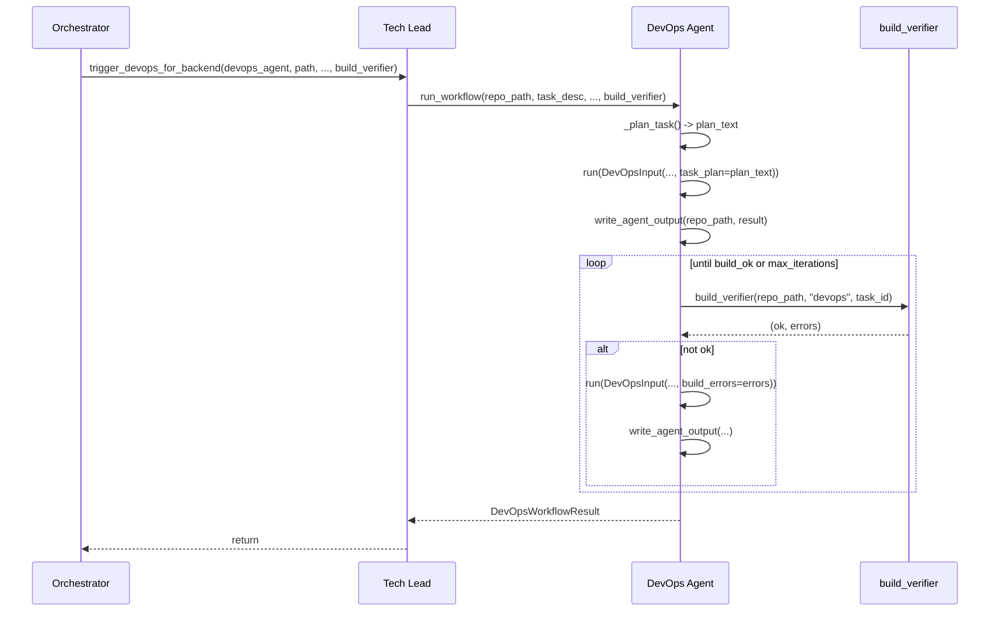

# DevOps Agent: Planning and Testing (align with Backend/Frontend)

## Current state

- **DevOps agent** ([software_engineering_team/devops_agent/agent.py](software_engineering_team/devops_agent/agent.py)): single `run(DevOpsInput) -> DevOpsOutput` with no planning step and no verification loop.
- **Invocation**: (1) After backend/frontend complete, Tech Lead calls `trigger_devops_for_backend` / `trigger_devops_for_frontend` (one shot per repo). (2) Retry path runs devops tasks in prefix phase with a single `run()` and `write_agent_output(path, result, subdir="devops")`.
- **Backend/Frontend**: Both use `_plan_task()` (producing a [TaskPlan](software_engineering_team/shared/task_plan.py)-style plan), persist the plan under `plan/`, pass `task_plan` into the main `run()`, then in a workflow they run `build_verifier()` and iterate with QA/code-review when verification fails.

## Goal

- **Planning**: DevOps produces an implementation plan before generating config (what to add: Dockerfile steps, CI steps, validation).
- **Testing**: DevOps output is verified (e.g. YAML validity, `docker build`) with a fix loop when verification fails, analogous to backend/frontend build_verifier + review loop.

## Design choices

- **Reuse TaskPlan**: Use the existing [TaskPlan](software_engineering_team/shared/task_plan.py) for DevOps planning (feature_intent, what_changes, algorithms_data_structures, tests_needed). For DevOps, “tests_needed” can mean “how to validate (e.g. docker build, CI run)”. No new model required.
- **Workflow shape**: Add a lightweight **DevOps workflow** (no feature branch): plan → generate → write → verify → on failure re-generate with errors and retry (e.g. up to 3–5 iterations). This mirrors the backend/frontend “verify then fix” loop without git branching.
- **Verifier**: Extend [orchestrator.py](software_engineering_team/orchestrator.py) `_run_build_verification` with `agent_type == "devops"`: (1) Validate `.github/workflows/*.yml` and any pipeline YAML with a YAML parse (e.g. `yaml.safe_load`). (2) If a Dockerfile exists in the repo, run `docker build` in that directory (with a short timeout). Return `(False, error_message)` on first failure so the agent can fix.

## Implementation plan

### 1. DevOps planning step

- **File**: [software_engineering_team/devops_agent/agent.py](software_engineering_team/devops_agent/agent.py)
  - Add `_plan_task(self, *, task_description, requirements, architecture, existing_pipeline, target_repo=None) -> str` that:
    - Builds context from task_description, requirements, architecture, existing_pipeline, target_repo.
    - Uses a new **DEVOPS_PLANNING_PROMPT** (in [devops_agent/prompts.py](software_engineering_team/devops_agent/prompts.py)) asking for the same JSON shape as TaskPlan (feature_intent, what_changes, algorithms_data_structures, tests_needed), with “tests_needed” interpreted as “how to validate (docker build, CI, lint)”.
    - Calls `self.llm.complete_json(...)`, parses with `TaskPlan.from_llm_json(data)`, returns `plan.to_markdown()` (or empty string on failure).
- **File**: [software_engineering_team/devops_agent/prompts.py](software_engineering_team/devops_agent/prompts.py)
  - Add `DEVOPS_PLANNING_PROMPT`: same output keys as TaskPlan; instruct the model that “what_changes” lists artifacts (e.g. Dockerfile, .github/workflows/ci.yml), “tests_needed” describes validation (docker build, run tests in CI, YAML lint).

### 2. Pass plan into run()

- **File**: [software_engineering_team/devops_agent/models.py](software_engineering_team/devops_agent/models.py)
  - Add optional `task_plan: Optional[str] = None` to `DevOpsInput`.
- **File**: [software_engineering_team/devops_agent/agent.py](software_engineering_team/devops_agent/agent.py)
  - In `run()`, if `input_data.task_plan` is set, append it to the prompt (e.g. “**Implementation plan:** …”) so the model implements according to the plan, matching backend/frontend behavior.

### 3. DevOps build verifier

- **File**: [software_engineering_team/orchestrator.py](software_engineering_team/orchestrator.py)
  - In `_run_build_verification(repo_path, agent_type, task_id)` add branch for `agent_type == "devops"`:
    - Collect YAML files: `.github/workflows/*.yml` and any top-level `*.yml`/`*.yaml` (e.g. docker-compose). For each, run `yaml.safe_load(content)` (or read file and parse); on parse error return `(False, "YAML parse error: ...")`.
    - If `Dockerfile` exists in repo_path, run `docker build -t devops-verify .` (or a neutral tag) from repo_path with a timeout (e.g. 120s); on non-zero exit return `(False, stderr)`.
  - Use existing patterns (e.g. [shared/command_runner](software_engineering_team/shared/command_runner.py) if present) for running docker; otherwise subprocess with timeout.
- **Dependency**: Ensure PyYAML is available (often already present); add to requirements if missing.

### 4. DevOps workflow (plan → generate → write → verify → fix loop)

- **File**: [software_engineering_team/devops_agent/agent.py](software_engineering_team/devops_agent/agent.py)
  - Add `run_workflow(self, *, repo_path, task_description, requirements, architecture, existing_pipeline, target_repo, tech_stack, build_verifier, max_iterations=5) -> DevOpsWorkflowResult`.
  - Steps:
    1. **Plan**: Call `_plan_task(...)`; optionally persist plan to `repo_path/plan/devops_task_<id>.md` (or work path’s plan dir) for traceability.
    2. **Generate**: Call `self.run(DevOpsInput(..., task_plan=plan_text))`.
    3. **Write**: Call `write_agent_output(repo_path, result, subdir="")` (existing [repo_writer](software_engineering_team/shared/repo_writer.py) already handles DevOpsOutput).
    4. **Verify**: `build_ok, build_errors = build_verifier(repo_path, "devops", task_id)`. Use a synthetic task_id e.g. `devops-backend` or `devops-frontend` when called from Tech Lead.
    5. **Loop**: If not build_ok and iterations left, call `self.run(DevOpsInput(..., task_plan=plan_text, build_errors=build_errors))` (add optional `build_errors` to DevOpsInput for fix context), then write and verify again; else exit.
  - **File**: [software_engineering_team/devops_agent/models.py](software_engineering_team/devops_agent/models.py)
    - Add `build_errors: Optional[str] = None` to `DevOpsInput` for the fix pass.
    - Add `DevOpsWorkflowResult(success: bool, failure_reason: Optional[str], iterations: int)` for workflow return.
  - In `run()`, when `build_errors` is present, append “**Build/validation errors to fix:** …” to the prompt so the model can correct the config.

### 5. Tech Lead: use workflow and pass build_verifier

- **File**: [software_engineering_team/tech_lead_agent/agent.py](software_engineering_team/tech_lead_agent/agent.py)
  - In `trigger_devops_for_backend` and `trigger_devops_for_frontend`: instead of calling `devops_agent.run(DevOpsInput(...))` then `write_agent_output`, call `devops_agent.run_workflow(...)` with:
    - `repo_path`, `task_description`, `requirements`, `architecture`, `existing_pipeline`, `tech_stack`, `target_repo` (as now).
    - `build_verifier` = orchestrator’s `_run_build_verification` (passed from orchestrator into Tech Lead, or Tech Lead receives a callable from the orchestrator when it invokes trigger_devops_*). So the orchestrator must pass `build_verifier` into the Tech Lead when calling these methods (or Tech Lead gets it from a shared helper). Prefer passing `build_verifier` from orchestrator into `trigger_devops_for_backend`/`trigger_devops_for_frontend` so the same `_run_build_verification` is used.
  - Orchestrator already has `_run_build_verification`; when it calls `tech_lead.trigger_devops_for_backend(devops_agent, backend_dir, ...)`, add an optional `build_verifier` argument and pass `_run_build_verification`. Tech Lead then calls `devops_agent.run_workflow(..., build_verifier=build_verifier)`.

### 6. Orchestrator: pass build_verifier to Tech Lead devops triggers

- **File**: [software_engineering_team/orchestrator.py](software_engineering_team/orchestrator.py)
  - Where `tech_lead.trigger_devops_for_backend(...)` and `trigger_devops_for_frontend(...)` are called (main run and retry), add argument `build_verifier=_run_build_verification`.
  - Tech Lead signature: `trigger_devops_for_backend(..., build_verifier=None)`. If `build_verifier` is None, keep current one-shot behavior (run only, no verify loop) for backward compatibility; if provided, use `run_workflow`.

### 7. Retry path: run DevOps workflow for devops tasks

- **File**: [software_engineering_team/orchestrator.py](software_engineering_team/orchestrator.py)
  - In the retry prefix phase where devops tasks are executed (around 1466–1484), instead of a single `agents["devops"].run(DevOpsInput(...))` and `write_agent_output(path, result, subdir="devops")`, call `devops_agent.run_workflow(...)` with:
    - `repo_path=path` (or the appropriate subdir; today retry writes to `subdir="devops"` so path may be work path — confirm whether verification should run from work path or from backend/frontend repo; for retry, devops tasks are on work path, so use path and have the devops verifier run in that path).
    - `task_description=task.description`, `requirements=_task_requirements(task)`, `architecture=architecture`, `existing_pipeline=...`, `target_repo` inferred from task or left None, `tech_stack=...`, `build_verifier=_run_build_verification`.
  - Persist output with the same write semantics as today (subdir="devops" if that’s the convention for retry). The workflow’s write step can use subdir when writing so the verifier runs against the path that contains the written files (e.g. `repo_path` = work path, write to `repo_path/devops` or repo_path root; then verifier runs in `repo_path` or `repo_path/devops` depending on where Dockerfile ends up). Simplest: write to repo_path (or repo_path/devops) and run verifier on that same path.

### 8. Optional: persist DevOps plan in Tech Lead trigger

- When calling `run_workflow` from Tech Lead, the workflow can persist the plan to `repo_path/plan/devops_backend.md` or `repo_path/plan/devops_frontend.md` for consistency with backend/frontend task plans.

## Files to touch (summary)

| Area      | File                                                                           | Changes                                                                                                                                                                       |
| --------- | ------------------------------------------------------------------------------ | ----------------------------------------------------------------------------------------------------------------------------------------------------------------------------- |
| Planning  | [devops_agent/prompts.py](software_engineering_team/devops_agent/prompts.py)   | Add `DEVOPS_PLANNING_PROMPT` (TaskPlan JSON shape).                                                                                                                           |
| Planning  | [devops_agent/agent.py](software_engineering_team/devops_agent/agent.py)       | Add `_plan_task`, use `TaskPlan`; add `run_workflow`; in `run()` accept and use `task_plan` and `build_errors`.                                                               |
| Models    | [devops_agent/models.py](software_engineering_team/devops_agent/models.py)     | Add `task_plan`, `build_errors` to `DevOpsInput`; add `DevOpsWorkflowResult`.                                                                                                 |
| Verifier  | [orchestrator.py](software_engineering_team/orchestrator.py)                   | Add `agent_type == "devops"` in `_run_build_verification` (YAML parse + docker build); pass `build_verifier` into Tech Lead devops triggers; retry path calls `run_workflow`. |
| Tech Lead | [tech_lead_agent/agent.py](software_engineering_team/tech_lead_agent/agent.py) | `trigger_devops_for_backend` / `trigger_devops_for_frontend` accept optional `build_verifier` and call `devops_agent.run_workflow` when provided.                             |
| Deps      | [requirements.txt](software_engineering_team/requirements.txt) or project root | Ensure `pyyaml` (or `PyYAML`) if not already present.                                                                                                                         |

## Flow after changes

## Testing

- Unit test: `_plan_task` returns non-empty markdown when LLM returns valid TaskPlan JSON.
- Unit test: `run()` with `task_plan` and/or `build_errors` includes those in the prompt (or assert behavior via mock).
- Integration/verifier test: `_run_build_verification(repo_path, "devops", "test")` with a repo containing invalid YAML returns (False, ...); with valid YAML and a valid Dockerfile returns (True, "") (or skip docker if not available).
- Optional: end-to-end test that Tech Lead trigger runs workflow and that a failing verifier causes a retry (mock build_verifier to fail once then pass).

