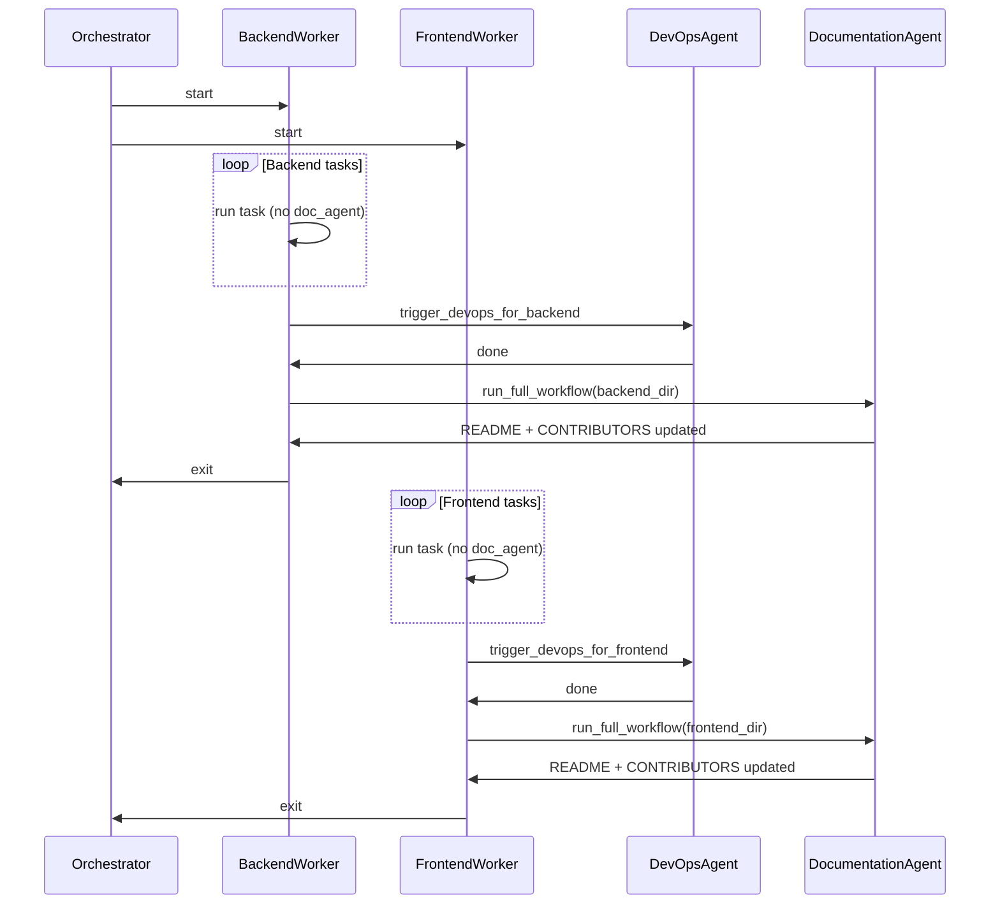

# Defer documentation updates until all tasks and DevOps are done

## Current behavior

- **Per-task documentation:** After each backend task, the backend workflow calls `tech_lead.trigger_documentation_update(doc_agent=...)` ([backend_agent/agent.py](software_engineering_team/backend_agent/agent.py) ~691–706). After each frontend task, the orchestrator calls `_run_tech_lead_review(..., doc_agent=agents.get("documentation"))`, which triggers the same ([orchestrator.py](software_engineering_team/orchestrator.py) ~469–474, 717–722).
- **Final pass:** A “Final documentation pass” in the orchestrator (~831–565) runs only when a repo’s README is missing or empty; it does not update existing README/CONTRIBUTORS after all work is done.

So the documentation agent runs after every task and does not reliably update README/CONTRIBUTORS once per repo at the end.

## Desired behavior

- Do **not** run the documentation agent after each task.
- For each repo (backend, frontend): run the documentation agent **once**, only after:
  1. All coding tasks for that repo are complete (queue empty), and
  2. The devops agent has finished for that repo.
- That single run updates **README.md** and **CONTRIBUTORS.md** in that repo’s folder (e.g. `work_path/backend`, `work_path/frontend`).

## Implementation

### 1. Stop per-task documentation triggers

- **Backend:** In [orchestrator.py](software_engineering_team/orchestrator.py), pass `doc_agent=None` into `agents["backend"].run_workflow(...)` (main run ~537 and retry ~983) so the backend workflow no longer calls `trigger_documentation_update` after each task.
- **Frontend:** In [orchestrator.py](software_engineering_team/orchestrator.py), pass `doc_agent=None` into `_run_tech_lead_review(...)` for the frontend (e.g. ~469–474 and ~717–722) so the Tech Lead no longer triggers the documentation agent after each frontend task.

No change to [backend_agent/agent.py](software_engineering_team/backend_agent/agent.py) or [tech_lead_agent/agent.py](software_engineering_team/tech_lead_agent/agent.py) is required; they already support `doc_agent=None` (backend only calls when `doc_agent is not None`; Tech Lead only runs when `if doc_agent`).

### 2. Run documentation once per repo after DevOps

Each worker already runs DevOps for its repo when its task queue is empty:

- **Backend worker** ([orchestrator.py](software_engineering_team/orchestrator.py) ~416–423): after the `while True` loop, it calls `tech_lead.trigger_devops_for_backend(...)` for `backend_dir`.
- **Frontend worker** (~471–478): after the loop, it calls `tech_lead.trigger_devops_for_frontend(...)` for `frontend_dir`.

Add a single documentation run **immediately after** each worker’s DevOps call, for that repo only:

- **In `_backend_worker`:** After `trigger_devops_for_backend(...)`, if `backend_dir.is_dir()` and `(backend_dir / ".git").exists()` and the documentation agent is available, call `doc_agent.run_full_workflow(repo_path=backend_dir, task_id="docs-backend-final", task_summary="Update README and CONTRIBUTORS after all backend tasks and DevOps.", agent_type="backend", spec_content=..., architecture=..., codebase_content=...)`. Build `codebase_content` with `_truncate_for_context(_read_repo_code(backend_dir), MAX_EXISTING_CODE_CHARS)` (same pattern as elsewhere). Wrap in try/except and log warnings so failures are non-blocking.
- **In `_frontend_worker`:** After `trigger_devops_for_frontend(...)`, same pattern for `frontend_dir`: `run_full_workflow(repo_path=frontend_dir, task_id="docs-frontend-final", ...)`, with codebase from `_read_repo_code(frontend_dir, [".ts", ".tsx", ".html", ".scss"])` truncated. Non-blocking.

This ensures documentation runs only when “all tasks for this repo are done” and “DevOps for this repo has run.”

### 3. Final documentation pass (orchestrator)

Replace or narrow the existing “Final documentation pass” block (~831–565):

- **Option A (recommended):** Remove it. Documentation is now guaranteed to run once per repo at the end of each worker (after DevOps). No need for a second pass.
- **Option B:** Keep a minimal fallback: only if a repo’s README is still missing or empty after the worker’s doc run (e.g. doc run failed), run the documentation agent once for that repo. This adds complexity; Option A is simpler and matches the requested behavior.

Recommendation: **Option A** — remove the existing “Final documentation pass” block so the only documentation runs are the new end-of-worker runs.

### 4. Retry path (`run_failed_tasks`)

In [orchestrator.py](software_engineering_team/orchestrator.py), `run_failed_tasks` already passes `doc_agent=agents.get("documentation")` to the backend workflow (~~983). Change that to `doc_agent=None` for consistency. After the retry loop it runs DevOps for both repos (~~687–698) but does not run the documentation agent. Add the same “after DevOps, run documentation once per repo” logic: after the existing DevOps block, for each of `backend_dir` and `frontend_dir` that is a git repo, call `doc_agent.run_full_workflow(...)` with the same pattern (task_id e.g. `docs-backend-retry` / `docs-frontend-retry`), non-blocking. That way retries also get a single doc update per repo after DevOps.

## Summary of file changes

| File                                                         | Change                                                                                                                                                                                                                                                                                                                                                                                                                                                                                                                                           |
| ------------------------------------------------------------ | ------------------------------------------------------------------------------------------------------------------------------------------------------------------------------------------------------------------------------------------------------------------------------------------------------------------------------------------------------------------------------------------------------------------------------------------------------------------------------------------------------------------------------------------------ |
| [orchestrator.py](software_engineering_team/orchestrator.py) | Pass `doc_agent=None` to backend `run_workflow` and to `_run_tech_lead_review` for frontend. In `_backend_worker`, after `trigger_devops_for_backend`, call `doc_agent.run_full_workflow` for `backend_dir`. In `_frontend_worker`, after `trigger_devops_for_frontend`, call `doc_agent.run_full_workflow` for `frontend_dir`. Remove the “Final documentation pass” block (or replace with optional fallback). In `run_failed_tasks`, pass `doc_agent=None` to backend workflow and add one documentation run per repo after the DevOps block. |

No changes to [documentation_agent/agent.py](software_engineering_team/documentation_agent/agent.py), [tech_lead_agent/agent.py](software_engineering_team/tech_lead_agent/agent.py), or [backend_agent/agent.py](software_engineering_team/backend_agent/agent.py) are required beyond the orchestrator’s call-site changes above.

## Flow (after change)

