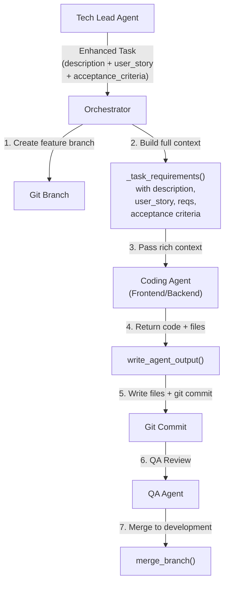

# Enhanced Task Generation and Code-Writing Pipeline

## Analysis Summary

### Problem 1: Shallow Task Descriptions from Tech Lead

The Tech Lead prompt (`[tech_lead_agent/prompts.py](software_engineering_team/tech_lead_agent/prompts.py)`) already requests 4-8 sentence descriptions, but two issues prevent rich descriptions from reaching coding agents:

- **The `DummyLLMClient**` (`[shared/llm.py](software_engineering_team/shared/llm.py)` lines 117-137) hardcodes short 1-sentence descriptions for all tasks. Example from the dummy response:
  ```
  "description": "Create the Angular application shell with routing configuration, main layout component, and navigation structure."
  ```
  This needs to be 4-8 sentences as the prompt requests.
- `**user_story` exists in the `Task` model but is never propagated to coding agents.** The `FrontendInput` and `BackendInput` models have no `user_story` field. The orchestrator's `_task_requirements()` helper only concatenates `task.requirements` + `task.acceptance_criteria` -- it omits `task.description` and `task.user_story`.

### Problem 2: Agents Not Writing, Committing, or Merging Code

The orchestrator pipeline (feature branch -> write -> commit -> QA -> merge) is architecturally sound in `[orchestrator.py](software_engineering_team/orchestrator.py)`, but several bugs prevent it from working:

**Bug A: DummyLLMClient returns identical output for all tasks of the same type.** Every frontend task returns the same `app.component.ts` with identical content. Every backend task returns the same `main.py`. After the first task writes and commits, subsequent tasks of the same type write identical files, causing `git status --porcelain` to return empty and `write_files_and_commit` to report "No changes to commit (files unchanged)".

**Bug B: `task_completed` variable not initialized in the devops handler.** In the orchestrator devops block (~line 195), `task_completed` is referenced at the end (`if task_completed:`) but is only assigned inside a conditional `if merge_ok:` branch. Unlike the backend/frontend handlers which initialize `task_completed = False` at the top, the devops handler will raise a `NameError` if the merge fails.

**Bug C: Backend tasks silently fail / get blocked.** The terminal log shows `backend-data-models` has NO log entries at all (no feature branch creation, no agent run), yet `backend-crud-api` reports it as a missing dependency. This cascading failure blocks all backend tasks, which in turn blocks frontend tasks that depend on backend endpoints.

**Bug D: Coding agents receive insufficient context.** The `_task_requirements()` helper only passes `task.requirements` + `task.acceptance_criteria` to agents. The much richer `task.description` and `task.user_story` are lost.

---

## Implementation Plan

### Part 1: Enhance Tech Lead Task Descriptions + Add User Story

**1a. Add `user_story` to coding agent input models**

- `[frontend_agent/models.py](software_engineering_team/frontend_agent/models.py)`: Add `user_story: str = ""` to `FrontendInput`
- `[backend_agent/models.py](software_engineering_team/backend_agent/models.py)`: Add `user_story: str = ""` to `BackendInput`

**1b. Update orchestrator to pass full task context to agents**

In `[orchestrator.py](software_engineering_team/orchestrator.py)`, update `_task_requirements()` to also include `task.description` and `task.user_story`:

```python
def _task_requirements(task) -> str:
    parts = []
    if task.description:
        parts.append(f"Task Description:\n{task.description}")
    if task.user_story:
        parts.append(f"User Story: {task.user_story}")
    if task.requirements:
        parts.append(f"Technical Requirements:\n{task.requirements}")
    if getattr(task, "acceptance_criteria", None):
        parts.append("Acceptance criteria: " + "; ".join(task.acceptance_criteria))
    return "\n\n".join(parts) if parts else task.description
```

Also update the backend and frontend handler blocks to pass `user_story=current_task.user_story` when constructing `BackendInput` / `FrontendInput`.

**1c. Update agent prompts to use user_story**

In `[frontend_agent/agent.py](software_engineering_team/frontend_agent/agent.py)` and `[backend_agent/agent.py](software_engineering_team/backend_agent/agent.py)`, include `user_story` in the context_parts sent to the LLM so agents understand the usage intent.

**1d. Enhance DummyLLMClient Tech Lead task descriptions**

In `[shared/llm.py](software_engineering_team/shared/llm.py)`, update the hardcoded task definitions (lines 117-137) to include rich, multi-sentence descriptions and proper `user_story` fields following the format the prompt requests.

### Part 2: Fix Code Writing/Committing/Merging Pipeline

**2a. Make DummyLLMClient return task-specific responses**

The core issue is that `DummyLLMClient.complete_json()` returns identical code output regardless of which task is being executed. Fix by extracting the task description from the prompt and generating distinct file names/content per task. For example, use the task description to derive unique filenames and placeholder content, so each task produces different files.

**2b. Fix `task_completed` scoping bug in devops handler**

In `[orchestrator.py](software_engineering_team/orchestrator.py)`, initialize `task_completed = False` at the top of the devops block (matching the pattern used in backend/frontend handlers).

**2c. Add error logging for silent failures**

The `except Exception` block in the orchestrator loop only calls `logger.exception()`. Add explicit status tracking so blocked-task warnings include context about WHY the dependency task failed.

### Part 3: Enhance Tech Lead Prompt for Richer Descriptions

The current `TECH_LEAD_PROMPT` already requests detailed descriptions. Strengthen it further by:

- Adding a concrete example of a `user_story` in the output format section (line 93 of `[tech_lead_agent/prompts.py](software_engineering_team/tech_lead_agent/prompts.py)`)
- Emphasizing that `description` must include: file/module names to create, data flow, API contracts to consume/produce, UI states, and error handling expectations
- Adding the `user_story` field to the `TECH_LEAD_REFINE_TASK_PROMPT` and `TECH_LEAD_REVIEW_PROGRESS_PROMPT` so dynamically created tasks also have user stories




