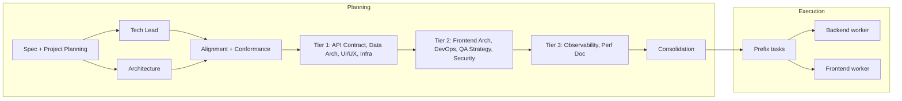

# Faster Software Engineering Team Delivery (Without Sacrificing Quality)

## Current bottlenecks (from codebase)

- **Planning:** ~12 domain planning agents run strictly sequentially after Architecture/Tech Lead alignment ([orchestrator.py](software_engineering_team/orchestrator.py) ~1058–1182). Each only needs `arch_overview`/`spec_content`/`plan_dir` or a prior agent’s output.
- **LLM concurrency:** Single global semaphore caps concurrent Ollama calls at **2** ([shared/llm.py](software_engineering_team/shared/llm.py) ~567–585). Backend and frontend workers already run in parallel, so they contend for this limit.
- **Execution:** Backend and frontend queues are already parallelized; within each domain, tasks run one-by-one by design (shared repos/branches).
- **Quality:** Per-task workflows already exit early when all gates pass ([backend_agent/agent.py](software_engineering_team/backend_agent/agent.py) ~1214–1220). Frontend has a lightweight path that skips design for fix/resolve-style tasks ([frontend_team/orchestrator.py](software_engineering_team/frontend_team/orchestrator.py) ~117–118, 212–221).

---

## 1. Parallelize domain planning agents (high impact)

**Idea:** Run planning agents in dependency tiers so independent agents run in parallel instead of one after another.

**Dependencies (from [orchestrator.py](software_engineering_team/orchestrator.py) 1058–1182):**

- **Tier 1** (inputs: `spec_content`, `arch_overview`, `plan_dir`, plus features/requirements where used): `api_contract`, `data_architecture`, `ui_ux`, `infrastructure` → no cross-deps; can run in parallel.
- **Tier 2:** `frontend_architecture` (needs `ui_ux_doc`), `devops_planning` (needs `infra_doc`), `qa_test_strategy`, `security_planning` (needs `data_lifecycle` from data_architecture). After Tier 1 completes, run these in parallel (e.g. frontend_arch + devops + qa_test_strategy + security_planning in a thread pool).
- **Tier 3:** `observability` (needs `infra_doc`, `devops_doc`), `performance_doc`. Run after Tier 2, optionally in parallel with each other.
- **Then:** `run_planning_consolidation` and write Tech Lead plan (unchanged).

**Implementation:** In `orchestrator.py`, replace the sequential `if agents.get("api_contract"): ... if agents.get("data_architecture"): ...` block with a small dependency graph: Tier 1 → `concurrent.futures.ThreadPoolExecutor` (or similar) with 4 workers, collect outputs into `infra_doc`, `data_lifecycle`, `ui_ux_doc`; Tier 2 same pattern; Tier 3 then consolidation. Preserve existing `try/except` and `logger.debug("... skipped: %s", e)` so a single agent failure does not break the rest. Keep writing artifacts to `plan_dir` from the same threads (or serialize writes if needed to avoid races).

**Quality:** No change to artifacts or decisions; only execution order and concurrency. Same inputs and outputs per agent.

---

## 2. Increase LLM concurrency (medium impact)

**Idea:** Default `SW_LLM_MAX_CONCURRENCY` is 2 ([shared/llm.py](software_engineering_team/shared/llm.py)). With backend and frontend workers running in parallel, and (after change 1) multiple planning agents in parallel, raising the limit allows more concurrent LLM calls and better CPU/GPU utilization.

**Implementation:**

- In [shared/llm.py](software_engineering_team/shared/llm.py), keep reading from `ENV_LLM_MAX_CONCURRENCY` but change the default from `2` to `4` (or document that users can set 4–6 for faster runs when the Ollama/server can handle it).
- In [README.md](software_engineering_team/README.md), document that increasing `SW_LLM_MAX_CONCURRENCY` (e.g. to 4–6) can reduce wall-clock time when running with parallel planning and backend+frontend workers.

**Quality:** No change to prompts or logic; only more concurrent requests. Users with limited GPU/memory can keep the limit at 2.

---

## 3. Optional “minimal planning” or skip-list (medium impact, configurable)

**Idea:** For smaller or time-sensitive runs, allow skipping some domain planning agents so planning finishes sooner while still keeping Architecture, Tech Lead, alignment, and conformance.

**Implementation:**

- Add an optional parameter (e.g. `skip_planning_agents: list[str]` or env `SW_SKIP_PLANNING_AGENTS=observability,performance_doc`) and, in the planning block (or in the new tiered execution), skip any agent whose key is in that set.
- Alternatively, a single flag like `minimal_planning: bool` that skips all of: API Contract, Data Arch, UI/UX, Infra, Frontend Arch, DevOps Planning, QA Test Strategy, Security Planning, Observability, Performance doc—so only spec → project planning → Tech Lead ↔ Architecture (alignment + conformance) → consolidation (with whatever consolidation can do without those artifacts) → execution. Use only when the user explicitly opts in.

**Quality:** Clearly documented as a fast path; full planning remains the default. Useful for experiments or when artifacts from skipped agents are not required.

---

## 4. Make iteration caps configurable (low–medium impact)

**Idea:** Current caps are hardcoded (e.g. backend `MAX_REVIEW_ITERATIONS = 40`, orchestrator `MAX_REVIEW_ITERATIONS = 20`, `MAX_ALIGNMENT_ITERATIONS = 6`, `MAX_CONFORMANCE_RETRIES = 4`). Making them configurable (env or API option) lets users trade off speed vs. strictness without code changes.

**Implementation:**

- In [orchestrator.py](software_engineering_team/orchestrator.py): read `MAX_ALIGNMENT_ITERATIONS` / `MAX_CONFORMANCE_RETRIES` from env (e.g. `SW_MAX_ALIGNMENT_ITERATIONS`, `SW_MAX_CONFORMANCE_RETRIES`) with current values as defaults.
- In [backend_agent/agent.py](software_engineering_team/backend_agent/agent.py) and [frontend_team/orchestrator.py](software_engineering_team/frontend_team/orchestrator.py): same for `MAX_REVIEW_ITERATIONS`, `MAX_CLARIFICATION_REFINEMENTS`, `MAX_SAME_BUILD_FAILURES` (backend/frontend).
- Document in README. Defaults remain as today so behavior is unchanged unless the user overrides.

**Quality:** Preserves current defaults; power users can lower caps for faster (and potentially less refined) runs.

---

## 5. Cache coding standards and static context per run (low impact)

**Idea:** Coding standards and other static prompt fragments are likely loaded or concatenated repeatedly per task. Caching them once per run reduces redundant I/O and string work.

**Implementation:**

- In [shared/coding_standards.py](software_engineering_team/shared/coding_standards.py) (or at first use in orchestrator/backend/frontend), add a module-level or run-scoped cache for the resolved standards text and pass that into agents instead of re-reading/re-resolving every time.
- If any agent currently reads from disk on every invocation, switch to a single load at the start of the run (or when the agent is first constructed) and reuse.

**Quality:** Same content; only fewer redundant loads.

---

## 6. Expand lightweight frontend path (low impact)

**Idea:** Frontend already skips the design phase for “lightweight” tasks ([frontend_team/orchestrator.py](software_engineering_team/frontend_team/orchestrator.py) `_is_lightweight_task`: short description with keywords like fix, resolve, update, patch). Slightly expanding this (e.g. more keywords or a higher `LIGHTWEIGHT_MAX_DESC_LEN`) can skip design for more implementation-only tasks without materially affecting quality.

**Implementation:**

- Consider adding keywords (e.g. "refactor", "adjust", "tweak") or increasing `LIGHTWEIGHT_MAX_DESC_LEN` (e.g. from 300 to 400) after validating on a few sample specs that no full-feature tasks are misclassified. Optionally make these configurable via env or task metadata.

**Quality:** Limit expansion to clearly implementation-only/fix-style tasks; keep full design for net-new features.

---

## 7. Smarter context truncation (optional, higher risk)

**Idea:** Limits like `MAX_EXISTING_CODE_CHARS = 40000` and `MAX_API_SPEC_CHARS = 20000` keep context manageable. A “smarter” truncation could prefer files relevant to the current task (e.g. by route/component name) so the model sees the most relevant code within the same cap. This can improve both speed (smaller prompts) and relevance (fewer irrelevant lines).

**Implementation:** More involved: would require task-aware file selection (e.g. from task description or acceptance criteria) and then truncation within that subset. Consider as a follow-up; document as an option rather than a first-step change.

**Quality:** Can improve relevance; must validate that critical files are never dropped.

---

## 8. Multiple backend or frontend tasks in parallel (advanced, high complexity)

**Idea:** Today, backend runs one task at a time and frontend runs one task at a time (with backend and frontend concurrent). Running multiple backend (or frontend) tasks in parallel would require either separate working directories (e.g. clone per task) or strict branch/lock discipline and merge order. This could significantly reduce wall time when there are many independent tasks.

**Implementation:** Would require cloning `work_path/backend` (and optionally `work_path/frontend`) per parallel worker, or implementing a queue with branch-per-task and serialized merges. High implementation and maintenance cost; only worth it if profiling shows task execution dominates total time after planning is parallelized.

**Quality:** Same workflows per task; coordination and merge order must preserve correctness.

---

## Suggested order of work

1. **Parallelize domain planning (section 1)** – largest win for planning-heavy runs.
2. **Increase default LLM concurrency and document it (section 2)** – quick, low-risk.
3. **Configurable iteration caps (section 4)** – enables tuning without code changes.
4. **Optional minimal planning or skip-list (section 3)** – for users who want a fast path.
5. **Cache coding standards (section 5)** and **expand lightweight frontend (section 6)** – small, safe improvements.
6. Consider **smarter truncation (7)** and **parallel tasks per domain (8)** only if profiling shows they are necessary.

---

## Flow after changes (conceptual)

Tier 1/2/3 run with internal parallelism (thread pool); execution remains as today with backend and frontend in parallel.
