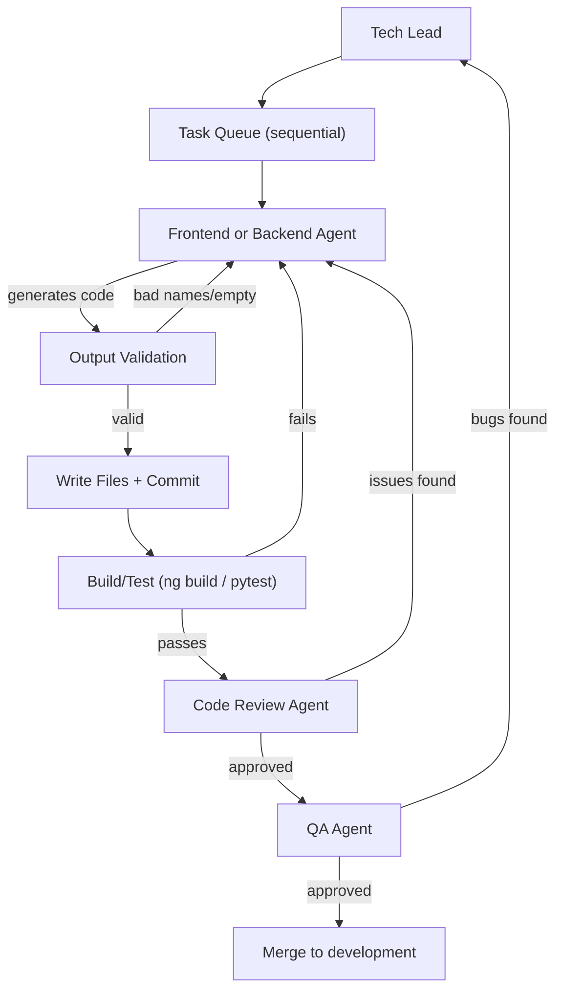

# Fix Agent Code Quality and Add Code Review

## Problem Summary

1. **Frontend agent generates nonsensical component names** -- it uses the (truncated) task description as the component/directory name (e.g., `create-the-angular-application-shell-tha`). It also doesn't actually run the Angular app to verify output.
2. **Backend agent is not producing code** -- same JSON-only architecture with no validation that code was actually generated or that it runs.
3. **No code review step** -- QA agent catches bugs but doesn't review code against the spec or coding standards.
4. **No sequential enforcement** -- while the orchestrator already processes one task at a time, there's no explicit guarantee that frontend and backend won't conflict on the same repo.

## Root Cause Analysis

Both coding agents (`[frontend_agent/agent.py](software_engineering_team/frontend_agent/agent.py)`, `[backend_agent/agent.py](software_engineering_team/backend_agent/agent.py)`) share the same fundamental flaw:

- They call `self.llm.complete_json(prompt)` and trust whatever JSON the LLM returns
- The LLM decides filenames, component names, and directory structure with zero validation
- `[shared/repo_writer.py](software_engineering_team/shared/repo_writer.py)` blindly writes whatever `files` dict the agent returns
- Neither agent can execute commands (`ng build`, `ng serve`, `python -m pytest`, etc.)
- Neither agent sees the **project spec** -- they only see the task description and requirements

The terminal output confirms this: the LLM turned the task description "Create the Angular application shell tha..." into the component name `create-the-angular-application-shell-tha`.

---

## Changes

### 1. Enhance Frontend Agent Prompt and Input (frontend_agent/)

**Files:** `[frontend_agent/prompts.py](software_engineering_team/frontend_agent/prompts.py)`, `[frontend_agent/models.py](software_engineering_team/frontend_agent/models.py)`, `[frontend_agent/agent.py](software_engineering_team/frontend_agent/agent.py)`

- Add `spec_content: str` field to `FrontendInput` so the agent sees the full project spec
- Rewrite `FRONTEND_PROMPT` to explicitly:
  - Require proper Angular naming conventions (kebab-case, concise names like `task-list`, `app-shell`, NOT task descriptions)
  - Require file paths that match Angular project structure (`src/app/components/`, `src/app/services/`, etc.)
  - Instruct the agent to decompose broad tasks: if a task covers multiple components/pages, set `needs_clarification=true` and request the tech lead break it down
  - Include a section for "task too broad" detection with examples
- Add output validation in `agent.py`:
  - Reject filenames longer than 50 chars or containing full sentences
  - Validate file paths follow Angular conventions
  - Ensure non-empty `files` dict

### 2. Enhance Backend Agent Prompt and Input (backend_agent/)

**Files:** `[backend_agent/prompts.py](software_engineering_team/backend_agent/prompts.py)`, `[backend_agent/models.py](software_engineering_team/backend_agent/models.py)`, `[backend_agent/agent.py](software_engineering_team/backend_agent/agent.py)`

- Add `spec_content: str` field to `BackendInput`
- Rewrite `BACKEND_PROMPT` to:
  - Require proper Python/FastAPI project structure (`app/`, `app/routers/`, `app/models/`, `app/services/`, etc.)
  - Require complete, runnable files -- not snippets
  - Require `files` dict to always be populated (not just a single `code` string)
  - Include examples of expected output structure
- Add output validation in `agent.py`:
  - Ensure `files` dict is non-empty
  - Validate file paths are reasonable
  - Log warnings if only `code` is returned without `files`

### 3. Create Code Review Agent (code_review_agent/)

**New files:**

- `code_review_agent/__init__.py`
- `code_review_agent/agent.py`
- `code_review_agent/models.py`
- `code_review_agent/prompts.py`

**Models (`models.py`):**

- `CodeReviewInput`: `code` (the diff/files on the branch), `spec_content`, `task_description`, `task_requirements`, `acceptance_criteria`, `architecture`, `existing_codebase`
- `CodeReviewOutput`: `approved` (bool), `issues` (list of `CodeReviewIssue`), `summary`, `suggested_fixes`
- `CodeReviewIssue`: `severity` (critical/major/minor/nit), `category` (naming/structure/logic/spec-compliance/standards), `file_path`, `description`, `suggestion`

**Prompt (`prompts.py`):**

- Reviews code against: spec compliance, acceptance criteria, coding standards, Angular/Python conventions, file structure, naming conventions
- Explicitly checks for: component names derived from task descriptions, missing files, code that doesn't integrate with the existing project

**Agent (`agent.py`):**

- Takes the branch diff + spec + task details
- Returns approval or list of issues
- `approved = True` only when no critical/major issues

### 4. Add Command Execution Capability (shared/command_runner.py)

**New file:** `[shared/command_runner.py](software_engineering_team/shared/command_runner.py)`

A utility that coding agents (via the orchestrator) can use to:

- Run `ng build` / `ng serve --port XXXX` for frontend verification
- Run `python -m pytest` / `uvicorn app.main:app` for backend verification
- Capture stdout/stderr and return success/failure
- Kill long-running processes (dev servers) after verification

### 5. Update Orchestrator Flow (orchestrator.py)

**File:** `[orchestrator.py](software_engineering_team/orchestrator.py)`

Changes to the frontend task block (lines ~387-468):

```
1. Create feature branch
2. Frontend agent generates code
3. Validate output (reject bad filenames)
4. Write files and commit
5. Run `ng build` -- if it fails, send errors back to frontend agent for a fix iteration
6. Code Review agent reviews the branch
7. If code review approves: merge to development, delete branch
8. If code review rejects: send issues back to frontend agent, iterate (max 3 rounds)
9. Run `ng serve` briefly to confirm app loads (optional smoke test)
```

Same pattern for backend task block (lines ~308-385):

```
1. Create feature branch
2. Backend agent generates code
3. Validate output
4. Write files and commit
5. Run `python -m pytest` -- if fails, send errors back
6. Code Review agent reviews
7. Approve -> merge, or reject -> iterate
```

Pass `spec_content` to both coding agents in their input models.

Add explicit sequential lock logging: before each coding task, log that the agent is acquiring the "coding slot" and that other agents must wait.

### 6. Update repo_writer.py for Frontend Path Validation

**File:** `[shared/repo_writer.py](software_engineering_team/shared/repo_writer.py)`

- Add a `_validate_frontend_paths()` function that:
  - Rejects paths with segments > 40 characters
  - Ensures paths follow `src/app/...` structure for Angular
  - Sanitizes component names (strip to meaningful kebab-case)
- Add a `_validate_backend_paths()` function similarly

### 7. Enforce Sequential Coding in Orchestrator

The orchestrator already processes tasks sequentially from the queue. To make this explicit and robust:

- Add a comment/log at the top of the task loop: "Only one coding agent active at a time"
- Ensure the task queue groups frontend and backend tasks but doesn't interleave them unexpectedly (this is already the case since it's a FIFO queue)
- No changes needed for locking since Python runs the orchestrator in a single thread

---

## Architecture After Changes




