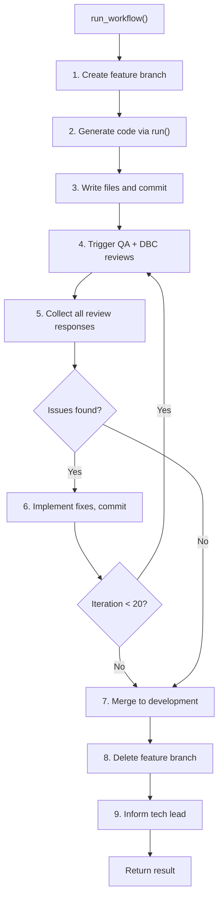

# Fix Backend Agent Workflow

## Issues Identified

### Issue 1: Backend agent is a stateless code generator, not a workflow agent

The `BackendExpertAgent.run()` in `[backend_agent/agent.py](software_engineering_team/backend_agent/agent.py)` is a thin LLM wrapper. It constructs a prompt, calls `self.llm.complete_json()`, parses the response, and returns `BackendOutput`. It does NOT create branches, write files, commit, trigger reviews, or merge. All workflow orchestration is embedded in the orchestrator's monolithic 150-line backend block (lines 552-701 of `[orchestrator.py](software_engineering_team/orchestrator.py)`).

### Issue 2: QA feedback never returns to the backend agent for the current task

After QA review (orchestrator lines 645-659), the tech lead creates **new separate tasks** that get added to the execution queue. The backend agent never receives QA feedback for its current task on its current branch. The desired QA-fix-re-review cycle is broken.

### Issue 3: Shared iteration counter conflates three different retry purposes

The single `for clarification_round in range(MAX_CLARIFICATION_REFINEMENTS + 1)` loop (line 566) is shared between:

- Clarification refinements (Phase 1)
- Build failure retries (Phase 2)
- Code review fix retries (Phase 3)

Using rounds on one purpose starves the others.

### Issue 4: QA and DBC run only once -- no feedback loop

Phase 4 (QA) and Phase 5 (DBC) execute after the code-review loop exits. If QA or DBC find issues, they are never fed back to the backend agent for the same task on the same branch.

### Issue 5: No workflow-level logging from the backend agent

All workflow logging (branch creation, writing files, build verification, code review, QA, merge) comes from the orchestrator. The backend agent itself only logs "received task" and "done". There is no progress tracking internal to the agent.

### Issue 6: No explicit "inform tech lead" or "merge and cleanup" capability

The orchestrator handles merging (line 670), branch deletion (line 672), and tech lead notification (line 693). The backend agent has no knowledge of or control over these steps.

---

## Proposed Solution

### High-level approach

Add a new `run_workflow()` method to `BackendExpertAgent` that encapsulates the full 9-step autonomous lifecycle. The existing `run()` method stays as-is (it's useful as the pure code-generation step). The orchestrator's backend block shrinks to a thin delegation call.




---

### File changes

#### 1. `backend_agent/agent.py` -- Add `run_workflow()` method

Add a new method `run_workflow()` that accepts additional dependencies:

- `repo_path: Path` -- the repository path
- `task: Task` -- the full task object from the tech lead
- `spec_content: str` -- for context
- `architecture: SystemArchitecture` -- for context
- `qa_agent: QAExpertAgent` -- to trigger QA review
- `dbc_agent: DbcCommentsAgent` -- to trigger DBC review
- `code_review_agent: CodeReviewAgent` -- to trigger code review
- `tech_lead: TechLeadAgent` -- to notify on completion
- `build_verifier: Callable` -- for build verification

The workflow inside `run_workflow()`:

```python
def run_workflow(self, ...) -> BackendWorkflowResult:
    MAX_REVIEW_ITERATIONS = 20

    # Step 1: Create feature branch
    logger.info("[%s] Step 1: Creating feature branch", task_id)
    ok, branch_name = create_feature_branch(repo_path, DEVELOPMENT_BRANCH, task_id)

    # Step 2: Generate initial code (calls self.run())
    logger.info("[%s] Step 2: Generating backend code", task_id)
    result = self.run(BackendInput(...))

    # Step 3: Write and commit
    logger.info("[%s] Step 3: Writing files and committing", task_id)
    write_agent_output(repo_path, result, subdir="backend")

    # Steps 4-6: Review feedback loop (max 20 iterations)
    for iteration in range(MAX_REVIEW_ITERATIONS):
        logger.info("[%s] Review iteration %d/%d", task_id, iteration+1, MAX_REVIEW_ITERATIONS)

        # Step 4: Trigger QA + DBC
        all_issues = []
        qa_result = qa_agent.run(...)
        dbc_result = dbc_agent.run(...)
        # Collect issues from both

        # Step 5: Check for issues
        if not all_issues:
            logger.info("[%s] No issues found, proceeding to merge", task_id)
            break

        # Step 6: Fix issues and commit
        result = self.run(BackendInput(..., qa_issues=..., code_review_issues=...))
        write_agent_output(repo_path, result, subdir="backend")

    # Step 7: Merge
    merge_branch(repo_path, branch_name, DEVELOPMENT_BRANCH)

    # Step 8: Delete branch
    delete_branch(repo_path, branch_name)

    # Step 9: Notify tech lead
    tech_lead.review_progress(...)
```

#### 2. `backend_agent/models.py` -- Add `BackendWorkflowResult` model

Add a new Pydantic model to capture the full workflow result:

```python
class BackendWorkflowResult(BaseModel):
    task_id: str
    success: bool
    branch_name: str = ""
    iterations_used: int = 0
    final_files: Dict[str, str] = Field(default_factory=dict)
    review_history: List[Dict[str, Any]] = Field(default_factory=list)
    summary: str = ""
    failure_reason: str = ""
```

#### 3. `orchestrator.py` -- Simplify the backend block (lines 552-701)

Replace the entire 150-line backend section with a thin delegation:

```python
elif task.assignee == "backend":
    logger.info("[%s] >>> Backend agent workflow starting", task_id)
    workflow_result = agents["backend"].run_workflow(
        repo_path=path,
        task=current_task,
        spec_content=spec_content,
        architecture=architecture,
        qa_agent=agents["qa"],
        dbc_agent=agents["dbc_comments"],
        code_review_agent=agents["code_review"],
        tech_lead=tech_lead,
        build_verifier=_run_build_verification,
    )
    if workflow_result.success:
        task_completed = True
        completed_code_task_ids.append(task_id)
    else:
        failure_reason = workflow_result.failure_reason
    logger.info("[%s] <<< Backend agent workflow complete", task_id)
```

#### 4. `shared/logging_config.py` -- Ensure backend workflow logging is captured

The existing logger name `"backend_agent.agent"` already covers the module. No changes needed here, but the new `run_workflow()` method should use structured log messages with consistent prefixes like `[task_id] Step N:` for monitorability.

---

### Detailed review loop design

The review loop (steps 4-6) should work as follows:

1. **Run build verification first** -- if syntax/tests fail, feed errors back as code review issues and re-generate (no need to involve QA/DBC for build failures)
2. **Run code review** -- if rejected, feed issues back and re-generate
3. **Once code review passes, run QA + DBC in sequence** -- collect all issues
4. **If QA or DBC report issues, feed them back and re-generate**
5. **On the next iteration, re-run all reviews from build verification onwards**
6. **Exit loop when no issues remain or 20 iterations exhausted**

This separates build/code-review fixes (which are cheap/fast) from QA/DBC feedback (which is the outer loop the user requested).

### Progress logging strategy

Every step logs with a consistent format:

```
[task_id] WORKFLOW Step N/9: <description> (iteration M/20)
[task_id] WORKFLOW   QA: found K issues (C critical, H high, M medium)
[task_id] WORKFLOW   DBC: N comments added, M updated
[task_id] WORKFLOW   Build: PASS/FAIL
[task_id] WORKFLOW   Code review: APPROVED/REJECTED (K issues)
[task_id] WORKFLOW COMPLETE: merged to development in M iterations
```

