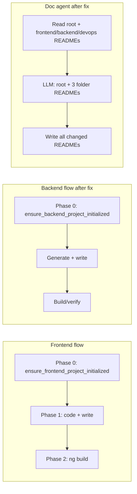

# Plan: Frontend, Documentation, and Backend Agent Fixes

## 1. Frontend agent failures (why feature branches did not merge)

### 1.1 Node.js version environment error (primary cause)

**What the logs show:** Build verification fails with:
`Node.js version v18.17.1 detected. The Angular CLI requires a minimum Node.js version of v20.19 or v22.12.`

This error is sent back to the frontend agent as a "code" issue ([orchestrator.py](software_engineering_team/orchestrator.py) lines 697–700). The agent cannot fix a system Node version; it produces the same code, "No changes to commit," and after 10 rounds the task fails with "Frontend agent produced no output."

**Required changes:**

- **Detect environment vs code build failures** in the orchestrator (or in [shared/command_runner.py](software_engineering_team/shared/command_runner.py) `run_ng_build` result). Classify stderr: if it contains "Node.js version" / "requires a minimum Node" / "update your Node", treat it as an **environment** failure.
- **Fail fast for environment failures:** Do not feed environment failures into the code-review loop. Either:
  - Skip build verification when the environment is unsupported and log a clear warning, or
  - Mark the task as failed immediately with a reason like "Unsupported environment: Node.js vX.Y; Angular CLI requires v20.19+ or v22.12+. Update Node or run in a supported environment."
- **Optional (recommended):** Document or support running frontend build in a controlled environment (e.g. nvm, Docker, or CI with a fixed Node version) so verification runs in a supported Node version.

### 1.2 FileNotFoundError in `_read_repo_code` (frontend-app-shell crash)

**What the logs show:** `FileNotFoundError: [Errno 2] No such file or directory: '.../todo-app/.git/objects/2d'` in `_read_repo_code` at `repo_path.rglob("*")` ([orchestrator.py](software_engineering_team/orchestrator.py) line 104). `rglob("*")` traverses the whole tree including `.git`. Missing or corrupt `.git/objects` entries cause `scandir` to raise.

**Required changes:**

- **Exclude `.git` from repo code scan:** In [orchestrator.py](software_engineering_team/orchestrator.py) `_read_repo_code`, do not iterate under `.git`. For example: iterate with `rglob("*")` but skip any path that is inside `repo_path / ".git"`, or use a walk that explicitly excludes `.git`.
- **Same exclusion in backend agent:** [backend_agent/agent.py](software_engineering_team/backend_agent/agent.py) has its own `_read_repo_code` (lines 100–119) with `repo_path.rglob("*")`. Apply the same `.git` exclusion there so backend workflow and any other callers do not hit the same error.

---

## 2. Documentation agent: README creation and per-folder READMEs

### 2.1 Current behavior

- The documentation agent only reads/writes **root** [README.md](software_engineering_team/documentation_agent/agent.py) and CONTRIBUTORS.md (see [documentation_agent/agent.py](software_engineering_team/documentation_agent/agent.py) lines 301–302, 331–334).
- It has no concept of `frontend/README.md`, `backend/README.md`, or `devops/README.md`.
- If the LLM returns `readme_changed=False` or empty `readme_content`, the root README is not written. CONTRIBUTORS is written when the LLM sets `contributors_changed=True` and provides content, which explains "only managed to create a contributors.md file."

### 2.2 Required behavior

- **Root README.md:** High-level overview of the repo: what the project is, main components, and where to find things (frontend, backend, devops, docs).
- **frontend/README.md, backend/README.md, devops/README.md:** Each must describe for that folder: requirements for **building**, **deploying**, **running**, and **interacting** with the code in that project.

### 2.3 Implementation outline

- **Models:** Extend [documentation_agent/models.py](software_engineering_team/documentation_agent/models.py): add fields for root README plus optional content for `frontend/README.md`, `backend/README.md`, `devops/README.md`. Output model should indicate which of these changed (e.g. `readme_root_changed`, `readme_frontend_changed`, etc.) and carry the corresponding content.
- **Prompts:** In [documentation_agent/prompts.py](software_engineering_team/documentation_agent/prompts.py):
  - Update or add a prompt so the LLM returns **one root README** (overview, where to find things) and **three folder READMEs** (each with build, deploy, run, interact for that folder). Specify JSON keys for root and for `frontend_readme`, `backend_readme`, `devops_readme`.
  - Keep CONTRIBUTORS prompt as-is unless you want to refine it.
- **Agent logic:** In [documentation_agent/agent.py](software_engineering_team/documentation_agent/agent.py):
  - In `run_full_workflow`, read existing content for `README.md`, `frontend/README.md`, `backend/README.md`, `devops/README.md` (and CONTRIBUTORS.md).
  - Pass these into `run()` (extend `DocumentationInput` with existing content for each README path).
  - In `run()`, call the LLM with the multi-README prompt; parse root + three folder READMEs; set changed flags per file.
  - When writing: if root README content is non-empty and (root didn’t exist or root changed), write `README.md`. For each of frontend/backend/devops, if that folder exists in the repo and the LLM returned content for it, write `frontend/README.md`, `backend/README.md`, `devops/README.md` as appropriate.
  - **Force root README when missing:** If root `README.md` does not exist and the LLM returns any root content (or a minimal stub), always write it (override `readme_changed` if needed) so the repo always has at least a root README after the first doc run.

---

## 3. Backend agent: project initialization and build-config updates

### 3.1 Why the backend isn’t “initialized”

- The orchestrator has an explicit **Phase 0** for frontend: [ensure_frontend_project_initialized](software_engineering_team/shared/command_runner.py) ([orchestrator.py](software_engineering_team/orchestrator.py) lines 626–639). There is **no equivalent** for backend: no `ensure_backend_project_initialized` and no call before backend tasks.
- Backend tasks assume a structure (e.g. `app/main.py`, `requirements.txt`, `app/config.py`) already exists. The backend agent prompt ([backend_agent/prompts.py](software_engineering_team/backend_agent/prompts.py)) requires "Root files: requirements.txt, README.md" and an `app/` layout, but the agent only emits files for the **current task**. The first task may add e.g. `app/routers/foo.py` without ever creating `app/main.py`, `requirements.txt`, or a runnable app.

### 3.2 Required changes

**A. Backend project initialization (mirror frontend pattern)**

- **Add `ensure_backend_project_initialized(backend_dir)**` in [shared/command_runner.py](software_engineering_team/shared/command_runner.py):
  - If `backend_dir` does not exist or does not look like a Python project (e.g. no `requirements.txt` and no `app/main.py`), create a minimal FastAPI skeleton:
    - `backend/requirements.txt` (e.g. fastapi, uvicorn, minimal versions),
    - `backend/app/__init__.py`, `backend/app/main.py` (minimal FastAPI app),
    - Optionally `backend/app/config.py`, `backend/tests/` with a trivial test, so pytest and imports work.
  - If `requirements.txt` and `app/main.py` (or equivalent) already exist, no-op.
- **Call it from the orchestrator** before running the first backend task (or before each backend task, if idempotent): e.g. when `task.assignee == "backend"`, ensure `path / "backend"` is initialized the same way frontend ensures `path / "frontend"` is initialized. This guarantees a buildable backend before any backend agent write.

**B. Backend agent: update build config when build is impacted**

- **Prompts:** In [backend_agent/prompts.py](software_engineering_team/backend_agent/prompts.py), add explicit rules: when the agent adds or removes dependencies (imports from PyPI), it **must** update `requirements.txt` (and if present, `pyproject.toml` or other build files). When it adds new modules or entry points, it **must** update `app/main.py` (or the main app) so the new routers/services are registered and the app remains runnable.
- **Validation / guidance:** Optionally, after writing backend output, the orchestrator or a shared helper could check that `requirements.txt` exists under `backend/` and that `app/main.py` exists and includes the new modules; if the agent’s "files" dict didn’t update them, either reject the write with a message or add a follow-up step that asks the agent to fix build/config. Prefer making the prompt strict so the agent always updates build config and main app when impacting the build.

---

## Summary of files to touch

| Area                  | Files                                                                                                                                                                                                                                                                        |
| --------------------- | ---------------------------------------------------------------------------------------------------------------------------------------------------------------------------------------------------------------------------------------------------------------------------- |
| Frontend env + .git   | [orchestrator.py](software_engineering_team/orchestrator.py), [shared/command_runner.py](software_engineering_team/shared/command_runner.py)                                                                                                                                 |
| Repo scan .git        | [orchestrator.py](software_engineering_team/orchestrator.py), [backend_agent/agent.py](software_engineering_team/backend_agent/agent.py)                                                                                                                                     |
| Doc agent READMEs     | [documentation_agent/agent.py](software_engineering_team/documentation_agent/agent.py), [documentation_agent/models.py](software_engineering_team/documentation_agent/models.py), [documentation_agent/prompts.py](software_engineering_team/documentation_agent/prompts.py) |
| Backend init + config | [shared/command_runner.py](software_engineering_team/shared/command_runner.py), [orchestrator.py](software_engineering_team/orchestrator.py), [backend_agent/prompts.py](software_engineering_team/backend_agent/prompts.py)                                                 |

---

## Optional diagram (flow)

No code changes are made in this step; the plan is for review and subsequent implementation.