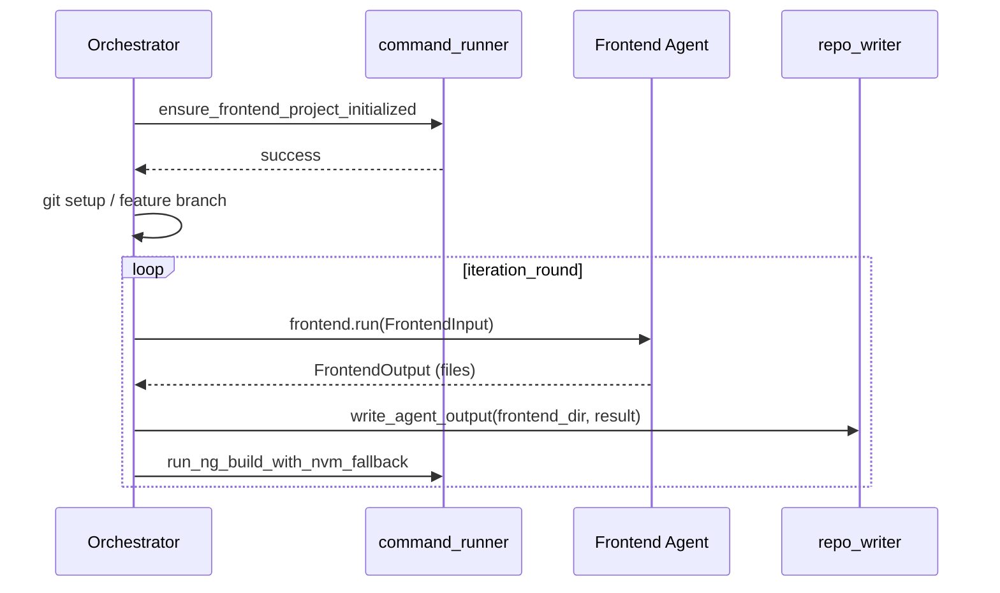

# Frontend: Always install dependencies before making code changes

## Current flow

Dependencies are only installed when:

- The project is first created (inside `ensure_frontend_project_initialized`, which runs `npm install` only when `package.json` did not exist), or
- Right before `ng build` if `node_modules` is missing (recent change in `run_ng_build_with_nvm_fallback`).

So the agent can run and write files before any `npm install` has happened in an already-initialized project.

## Goal

Run `npm install` **once per frontend task**, **before** the first agent run and any `write_agent_output`, so the frontend coding agent always works with dependencies installed.

## Implementation

### 1. Add `ensure_frontend_dependencies_installed` in command_runner

**File:** [software_engineering_team/shared/command_runner.py](software_engineering_team/shared/command_runner.py)

- Add a new function (e.g. after `run_ng_build_with_nvm_fallback` or near other frontend helpers):
**Signature:** `ensure_frontend_dependencies_installed(project_path: str | Path) -> CommandResult`
- Behavior:
  - Resolve `project_path` and check for `package.json`. If it does not exist, return success (no-op) or a clear result so the orchestrator can skip or fail as desired; recommend treating missing `package.json` as "not a frontend project" and returning success so callers do not block.
  - If NVM is available: run `npm install` in the project directory using `run_command_with_nvm` with `ANGULAR_NODE_VERSION` and a suitable timeout (e.g. `BUILD_TIMEOUT`).
  - If NVM is not available: run `npm install` via `run_command` (same as in `ensure_frontend_project_initialized` when not using NVM).
  - Return the `CommandResult` of `npm install`.
- Reuse the same NVM-vs-no-NVM pattern and timeouts already used in `ensure_frontend_project_initialized` and `run_ng_build_with_nvm_fallback` so behavior is consistent.

### 2. Call it from the orchestrator before the agent runs

**File:** [software_engineering_team/orchestrator.py](software_engineering_team/orchestrator.py)

- In `_frontend_worker()`, after:
  - `ensure_frontend_project_initialized(frontend_dir)` has succeeded, and
  - Git setup and `create_feature_branch` have succeeded,
- and **before** the `for iteration_round in range(MAX_CODE_REVIEW_ITERATIONS):` loop:
  - Call `ensure_frontend_dependencies_installed(frontend_dir)`.
  - If the result is not success: set `failed[task_id]` to an appropriate message (e.g. "Frontend dependency install failed: ..."), then `continue` to the next task (same pattern as init/git/branch failures).

No change to the frontend agent itself (prompts or agent code); the agent does not run shell commands. Only the orchestrator and command_runner are updated.

### 3. Optional: keep or remove pre-build npm install

The existing logic in `run_ng_build_with_nvm_fallback` that runs `npm install` when `node_modules` is missing can remain as a safety net (e.g. if something deletes `node_modules` between the pre-task install and the build). No need to remove it unless you want to avoid redundant installs; leaving it keeps builds robust.

## Summary

| Location                                                                | Change                                                                                                                             |
| ----------------------------------------------------------------------- | ---------------------------------------------------------------------------------------------------------------------------------- |
| [command_runner.py](software_engineering_team/shared/command_runner.py) | Add `ensure_frontend_dependencies_installed(project_path)` that runs `npm install` with NVM when available.                        |
| [orchestrator.py](software_engineering_team/orchestrator.py)            | After init and git/branch, call `ensure_frontend_dependencies_installed(frontend_dir)`; on failure, mark task failed and continue. |

Result: every frontend task installs dependencies once before any code is generated or written.

---

## Implementation tasks (execute in order)

When executed in full, these tasks implement the plan.

1. **Add `ensure_frontend_dependencies_installed` in command_runner**
  In [software_engineering_team/shared/command_runner.py](software_engineering_team/shared/command_runner.py), add a new function `ensure_frontend_dependencies_installed(project_path: str | Path) -> CommandResult`. Resolve `project_path` with `Path(project_path).resolve()`. If `(cwd / "package.json").exists()` is false, return `CommandResult(success=True, ...)` (no-op so orchestrator does not block when there is no frontend project). Add a short docstring stating that the function runs `npm install` so dependencies are installed before the frontend agent runs.
2. **Implement NVM and fallback for npm install**
  Inside `ensure_frontend_dependencies_installed`: If `_get_nvm_script_prefix()` is not None, call `run_command_with_nvm(["npm", "install"], cwd=cwd, node_version=ANGULAR_NODE_VERSION, timeout=BUILD_TIMEOUT)` and return its result. Otherwise call `run_command(["npm", "install"], cwd=cwd, timeout=BUILD_TIMEOUT)` and return its result. Use the same `cwd` variable (resolved path) for both.
3. **Call from orchestrator before agent loop**
  In [software_engineering_team/orchestrator.py](software_engineering_team/orchestrator.py), inside `_frontend_worker()`, after the successful `create_feature_branch` block and before the line `for iteration_round in range(MAX_CODE_REVIEW_ITERATIONS):`, add an import for `ensure_frontend_dependencies_installed` from `shared.command_runner`, then call `install_result = ensure_frontend_dependencies_installed(frontend_dir)`.
4. **Handle install failure in orchestrator**
  Immediately after the call in task 3, add: `if not install_result.success:` then with `state_lock`: set `failed[task_id] = "Frontend dependency install failed: " + (install_result.error_summary or install_result.stderr or "unknown")`, then `continue`. Use the same `state_lock` and `failed` pattern as for `ensure_frontend_project_initialized` and git/branch failures. (If `CommandResult` has no `error_summary`, use `result.stderr or result.stdout or "unknown"`.)
5. **Verify and optionally test**
  Confirm that no edits were made to the frontend agent module or prompts. Optionally run the software_engineering_team test suite or a manual run that triggers a frontend task to ensure the new step runs and does not break the pipeline.

