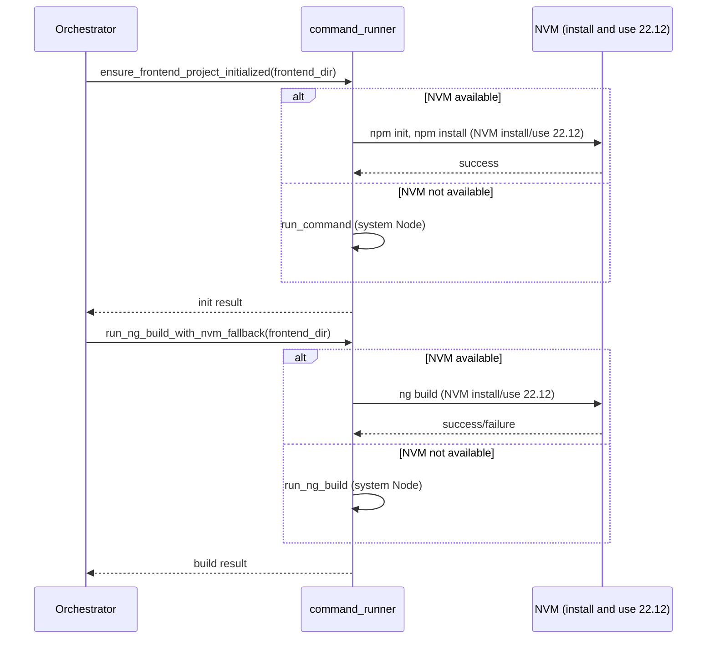

# Frontend NVM Node version fix

## Problem

- Angular CLI requires **Node.js v20.19+ or v22.12+**.
- System (or default NVM) has **v20.10.0**.
- Current logic in [software_engineering_team/shared/command_runner.py](software_engineering_team/shared/command_runner.py): run `ng build` with system Node; if it fails with an "environment" (Node version) error, **retry** with `run_command_with_nvm(..., node_version="20")`.
- **Why it still fails**: `nvm use 20` uses whatever Node 20.x is **already installed** (e.g. 20.10.0). The code does `nvm install 20 --no-progress` which can leave an existing 20.10 in place. So the NVM retry still runs under 20.10 and Angular still rejects it.

## Approach

1. **Use Node.js 22.12 for Angular CLI**
  The frontend coding agent needs **Node.js 22.12** so Angular CLI works. Define `ANGULAR_NODE_VERSION = "22.12"` and use it everywhere frontend runs under NVM. NVM will **install** 22.12 if not present (`nvm install 22.12`) and **use** it (`nvm use 22.12`) for every frontend command.
2. **Run frontend commands with NVM first when available**
  When NVM is available, run all frontend commands (ng build, npm init, npm install) with NVM and 22.12 **every time**—no system Node. This ensures the agent always runs in an environment where Angular CLI is supported. Fall back to system Node only when NVM is not found.
3. **Use NVM for frontend project initialization**
  In `ensure_frontend_project_initialized`, run `npm init` and `npm install` with NVM and 22.12 when NVM is available, so the project is created with the correct Node from the start.
4. **Optional: ng serve smoke test**
  If `run_ng_serve_smoke_test` is ever used for frontend, run it with NVM + 22.12 for consistency (currently it is not called from the orchestrator).

## Tasks

1. **Add Angular Node constant** — In `command_runner.py`, add `ANGULAR_NODE_VERSION = "22.12"` and use it at all frontend NVM call sites. NVM will install and use 22.12 so Angular CLI works.
2. **Prefer NVM for ng build** — In `run_ng_build_with_nvm_fallback`, when NVM is available run `run_command_with_nvm(..., node_version=ANGULAR_NODE_VERSION)` first (NVM installs 22.12 if needed); only call `run_ng_build` (system Node) when NVM is not found.
3. **NVM for frontend init** — In `ensure_frontend_project_initialized`, when NVM is available run `npm init -y` and both `npm install` via `run_command_with_nvm(..., node_version=ANGULAR_NODE_VERSION)` so init uses Node 22.12; when NVM is not available keep current `run_command` behavior.
4. **Optional: ng serve with NVM** — In `run_ng_serve_smoke_test`, run `ng serve` with NVM + `ANGULAR_NODE_VERSION` when NVM is available so future use is consistent.

## Key file changes

### 1. [software_engineering_team/shared/command_runner.py](software_engineering_team/shared/command_runner.py)

- **Constant**: Add `ANGULAR_NODE_VERSION = "22.12"` (required by Angular CLI). All frontend NVM usage will install and use this version.
- `**run_ng_build_with_nvm_fallback**`  
  - If `_get_nvm_script_prefix()` is not None: call `run_command_with_nvm(..., node_version=ANGULAR_NODE_VERSION)` **first**. NVM will run `nvm install 22.12` (if needed) and `nvm use 22.12` before `ng build`, so the frontend agent always has the Node version Angular CLI needs.  
  - Else: run `run_ng_build(project_path)` as today.
- `**run_command_with_nvm**`  
  - Keep existing behavior (it already runs `nvm install {node_version}` then `nvm use {node_version}`). All frontend call sites must pass `ANGULAR_NODE_VERSION` ("22.12") so NVM installs and uses that version.
- `**ensure_frontend_project_initialized**`  
  - When NVM is available: run `npm init -y` and both `npm install` commands via `run_command_with_nvm(..., node_version=ANGULAR_NODE_VERSION)` so the project is created with Node 22.12.  
  - When NVM is not available: keep current `run_command` behavior.
- `**run_ng_serve_smoke_test**` (optional)  
  - Run `ng serve` under NVM with `ANGULAR_NODE_VERSION` when NVM is available so any future use is consistent.

### 2. [software_engineering_team/orchestrator.py](software_engineering_team/orchestrator.py)

- No logic change required. It already calls `run_ng_build_with_nvm_fallback` and `ensure_frontend_project_initialized`. The improved behavior is entirely in `command_runner`.
- Optional: the failure message at line 719 already says “Node v20.19+ or v22.12+”; it can stay as-is.

### 3. Frontend agent

- [software_engineering_team/frontend_agent/agent.py](software_engineering_team/frontend_agent/agent.py) does not run shell commands; it only returns file contents. No code changes needed there. “Full access to use NVM” is implemented by the **orchestrator** and **command_runner**: when NVM is available they use NVM to **install** and **use** Node 22.12 for every frontend command (npm init, npm install, ng build), so the frontend coding agent always runs in an environment where Angular CLI works.

## Flow after change

## Summary

| What                                   | Change                                                                |
| -------------------------------------- | --------------------------------------------------------------------- |
| Node version used with NVM             | **22.12** (required by Angular CLI); NVM installs and uses it         |
| When we use NVM for ng build           | **First** when NVM is available; NVM installs 22.12 if needed         |
| Frontend init (npm init / npm install) | Run with NVM + 22.12 when NVM is available                            |
| Frontend agent code                    | No change (orchestrator/command_runner use NVM to provide Node 22.12) |

This removes the version conflict: when NVM is available, the frontend pipeline uses NVM to install and use Node 22.12 for every frontend command, so the frontend coding agent always runs in an environment where Angular CLI works.