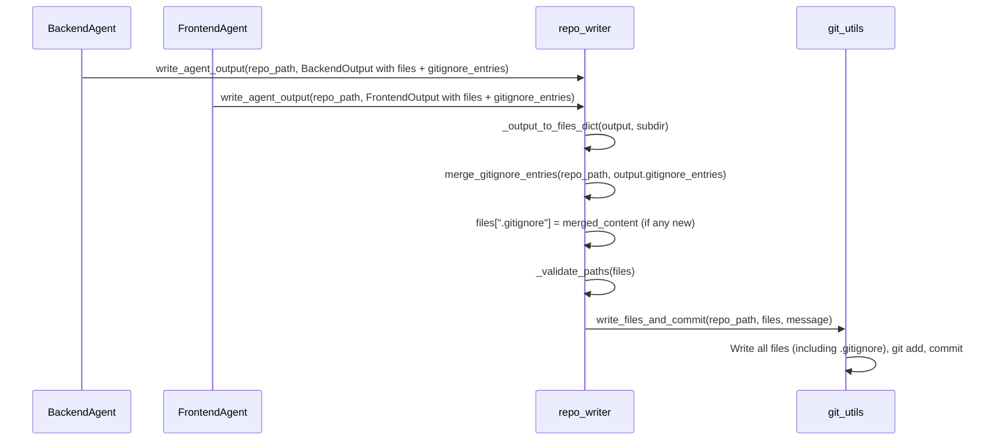

# Gitignore handling for backend and frontend coding agents

## Context

- **Write path**: Backend and frontend outputs are written via [shared/repo_writer.py](software_engineering_team/shared/repo_writer.py) `write_agent_output(repo_path, result, subdir="backend"|"frontend")`. Files are written relative to **repo root** (e.g. `backend/app/main.py`, `frontend/src/...`). The repo root is always `repo_path`; there is no .gitignore handling today.
- **Output models**: [backend_agent/models.py](software_engineering_team/backend_agent/models.py) `BackendOutput` and [frontend_agent/models.py](software_engineering_team/frontend_agent/models.py) `FrontendOutput` define `files`, `suggested_commit_message`, etc. Parsing happens in each agent’s `run()` from LLM JSON.
- **User goal**: When the *target* repo (the one the agents are coding in) has no or incomplete .gitignore, the backend and frontend agents should add patterns so that build/install artifacts (cache, node_modules, dependencies, configs with secrets, etc.) are ignored. If .gitignore is missing, either agent should be able to create it.

## Design decisions

1. **Single repo-root .gitignore**
  Use one `.gitignore` at repo root. Both agents contribute patterns to it. This matches the usual monorepo layout (`backend/`, `frontend/` under one repo).
2. **Merge, don’t overwrite**
  Agents output a **list of patterns** (`gitignore_entries`). The writer **merges** these into the existing `.gitignore` (if present), deduplicates, and writes back. Existing content and comments are preserved.
3. **Optional field**
  `gitignore_entries` is optional. If the agent omits it or leaves it empty, behavior is unchanged (no .gitignore update).

## Implementation plan

### 1. Shared: merge .gitignore in repo writer

**File:** [software_engineering_team/shared/repo_writer.py](software_engineering_team/shared/repo_writer.py)

- Add a helper `merge_gitignore_entries(repo_path: Path, new_entries: List[str]) -> str`:
  - Read `repo_path / ".gitignore"` if it exists, else treat as empty.
  - Normalize and collect existing non-empty, non-comment lines into a set for dedup.
  - Append each `new_entries` item (stripped, non-empty) that is not already present.
  - Return the full file content (existing lines + optionally a short comment + new lines). Preserve existing content and order; only append new patterns.
- In `write_agent_output`:
  - After building `files` from the agent output (via `_output_to_files_dict` or the dict branch), check for `gitignore_entries` on the output (e.g. `getattr(output, "gitignore_entries", None)` or dict `output.get("gitignore_entries")`).
  - If present and non-empty, call `merge_gitignore_entries(Path(repo_path).resolve(), list(gitignore_entries))`, then set `files[".gitignore"] = merged_content` (path relative to repo root, no `subdir` prefix).
- Ensure path validation allows `.gitignore` (single segment, no slashes); current rules in `_validate_paths` should already allow it.

No change to [shared/git_utils.py](software_engineering_team/shared/git_utils.py); `write_files_and_commit` already writes any `files_dict` including `.gitignore`.

### 2. Backend: model and parsing

**File:** [software_engineering_team/backend_agent/models.py](software_engineering_team/backend_agent/models.py)

- Add to `BackendOutput`:
  - `gitignore_entries: List[str] = Field(default_factory=list, description="Patterns to add to repo .gitignore (e.g. __pycache__/, .env)")`

**File:** [software_engineering_team/backend_agent/agent.py](software_engineering_team/backend_agent/agent.py)

- In `run()`, when building `BackendOutput` from `data`: add `gitignore_entries=data.get("gitignore_entries") or []` (ensure list, strip strings if desired).

### 3. Frontend: model and parsing

**File:** [software_engineering_team/frontend_agent/models.py](software_engineering_team/frontend_agent/models.py)

- Add to `FrontendOutput`:
  - `gitignore_entries: List[str] = Field(default_factory=list, description="Patterns to add to repo .gitignore (e.g. node_modules/, dist/)")`

**File:** [software_engineering_team/frontend_agent/agent.py](software_engineering_team/frontend_agent/agent.py)

- In `run()`, when building `FrontendOutput`: add `gitignore_entries=data.get("gitignore_entries") or []`.

### 4. Backend prompt: when and what to output

**File:** [software_engineering_team/backend_agent/prompts.py](software_engineering_team/backend_agent/prompts.py)

- In the "Output format" section, add:
  - `"gitignore_entries": list of strings (optional). Patterns for the repo root .gitignore so build/install artifacts and secrets are not committed. Include when you add or touch backend code.`
- Add a short **rule** (e.g. under project structure or output):
  - When you add backend code, include `gitignore_entries` with patterns for: Python bytecode/cache (`__pycache__/`, `*.py[cod]`, `*.pyo`), virtualenvs (`.venv/`, `venv/`, `env/`), env files (`.env`, `.env.local`, `.env.*.local`), build/cache dirs (`*.egg-info/`, `dist/`, `build/`, `.pytest_cache/`, `.mypy_cache/`, `.coverage`, `htmlcov/`). For Java: `target/`, `*.class`, `.gradle/`, `build/`. If the repo has no .gitignore, include a full set of these patterns so one can be created.

### 5. Frontend prompt: when and what to output

**File:** [software_engineering_team/frontend_agent/prompts.py](software_engineering_team/frontend_agent/prompts.py)

- In the "Output format" section, add:
  - `"gitignore_entries": list of strings (optional). Patterns for the repo root .gitignore so build/install artifacts and secrets are not committed. Include when you add or touch frontend code.`
- Add a short **rule**:
  - When you add frontend code, include `gitignore_entries` with patterns for: `node_modules/`, `dist/`, `.angular/`, `.env`, `.env.local`, `*.log`, `npm-debug.log*`, `.idea/`, `.vscode/` (if desired). If the repo has no .gitignore, include a full set of these patterns so one can be created.

### 6. Dict output branch in repo_writer

- In `write_agent_output`, the branch that handles `isinstance(output, dict)` should also support `output.get("gitignore_entries")` and pass those into the same merge logic so any caller that passes a dict with `gitignore_entries` gets consistent behavior.

### 7. Edge cases and validation

- **Path validation**: Confirm `.gitignore` is not rejected (e.g. segment length, sentence-like name). If needed, allow `.gitignore` explicitly in `_validate_paths` (e.g. in `_ALLOWED_DIRS` or a separate check for the literal `.gitignore`).
- **Empty merge**: If after merge the file would be unchanged, you can skip adding `.gitignore` to the files dict to avoid no-op commits; alternatively always add and let git report "no changes". Prefer skipping to keep commit history clean.
- **Order**: Merge helper should append new patterns after existing content; optional section comment (e.g. `# Build/install artifacts`) before the new entries improves readability.

## Flow summary

## Files to touch (summary)

| Area     | File                        | Change                                                                                                                                               |
| -------- | --------------------------- | ---------------------------------------------------------------------------------------------------------------------------------------------------- |
| Shared   | `shared/repo_writer.py`     | Add `merge_gitignore_entries`; in `write_agent_output` merge and set `files[".gitignore"]` when output has `gitignore_entries`; support dict output. |
| Backend  | `backend_agent/models.py`   | Add `gitignore_entries` to `BackendOutput`.                                                                                                          |
| Backend  | `backend_agent/agent.py`    | Parse `data.get("gitignore_entries")` into `BackendOutput`.                                                                                          |
| Backend  | `backend_agent/prompts.py`  | Document and require optional `gitignore_entries`; list backend patterns.                                                                            |
| Frontend | `frontend_agent/models.py`  | Add `gitignore_entries` to `FrontendOutput`.                                                                                                         |
| Frontend | `frontend_agent/agent.py`   | Parse `data.get("gitignore_entries")` into `FrontendOutput`.                                                                                         |
| Frontend | `frontend_agent/prompts.py` | Document and require optional `gitignore_entries`; list frontend patterns.                                                                           |

No orchestrator changes: backend and frontend already call `write_agent_output`; the new behavior is inside that function and the agents’ outputs.