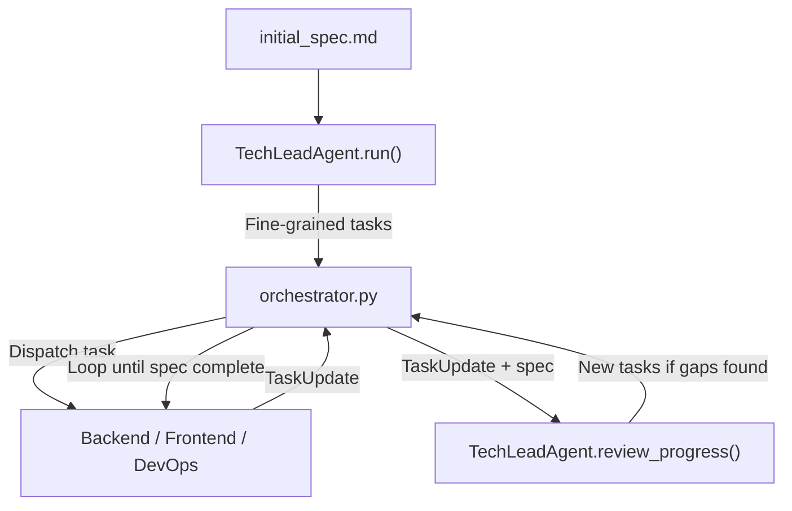

# Improve Tech Lead Agent Task Planning and Review Loop

## Problem

The tech lead agent produces tasks that are too high-level and poorly defined. It has no feedback loop after agents complete work -- it cannot review what was built against the spec and create follow-up tasks to close gaps.

## Changes Overview

Five files need modification, one new model is added:




---

## 1. Update Task schema in shared models

**File:** [shared/models.py](software_engineering_team/shared/models.py)

- Rename `label` to `name` (descriptive title, required string with default `""`)
- Add `user_story: str = ""` field to `Task`
- Keep `description` (will now be in-depth, outcomes-based via prompt changes)
- Keep `requirements`, `acceptance_criteria`, etc. as-is

Add a new `TaskUpdate` model:

```python
class TaskUpdate(BaseModel):
    """Completion report from a specialist agent after finishing a task."""
    task_id: str
    agent_type: str  # "backend", "frontend", "devops"
    status: str  # "completed", "failed", "partial"
    summary: str = ""  # agent's summary of what was done
    files_changed: List[str] = Field(default_factory=list)
    needs_followup: bool = False
```

---

## 2. Rewrite tech lead prompts for thorough decomposition

**File:** [tech_lead_agent/prompts.py](software_engineering_team/tech_lead_agent/prompts.py)

### Update `TECH_LEAD_PROMPT`:

- **Task schema**: Change the output format to require `name` (descriptive title), `description` (in-depth, outcomes-based referencing specific spec sections), `user_story` (as a user, I want... so that...), and `acceptance_criteria` (list of 3-7 testable criteria).
- **Decomposition examples**: Add explicit examples showing bad vs good granularity. E.g.:
  - BAD: "Implement Angular frontend" (one task)
  - GOOD: "Create Angular app shell with routing" -> "Create landing page component" -> "Create login page component" -> "Connect landing page to backend API" -> "Add form validation to login" (5 tasks)
- **Spec review protocol**: Instruct the tech lead to enumerate every section/feature/requirement from the spec before generating tasks, then cross-reference to ensure full coverage.
- **Description depth**: Each task description must reference the specific spec section it implements, describe expected inputs/outputs, and state what "done" looks like.

### Add new `TECH_LEAD_REVIEW_PROGRESS_PROMPT`:

New prompt for the progress review method. It receives:

- The original spec
- The task update (what was just completed)
- List of all completed tasks and remaining tasks
- Summary of the current codebase state

It must:

- Evaluate whether the completed work satisfies the original task's acceptance criteria
- Review the spec for any requirements not yet covered by remaining tasks
- Output new tasks (same enriched schema) to fill gaps, or an empty list if on track

---

## 3. Update tech lead agent with new parsing and review method

**File:** [tech_lead_agent/agent.py](software_engineering_team/tech_lead_agent/agent.py)

### Update `_parse_assignment_from_data`:

- Parse `name` (fall back to `label` for backward compat), `user_story`, and enriched `description` from LLM output.

### Add `review_progress()` method:

```python
def review_progress(
    self,
    task_update: "TaskUpdate",
    spec_content: str,
    architecture,
    completed_tasks: List[Task],
    remaining_tasks: List[Task],
    codebase_summary: str,
) -> List[Task]:
    """
    Review completed work against spec. Return new tasks to fill gaps.
    Called by orchestrator after each specialist agent completes a task.
    """
```

This method:

1. Builds context from the task update, spec, completed/remaining tasks, and codebase state
2. Calls the LLM with `TECH_LEAD_REVIEW_PROGRESS_PROMPT`
3. Parses any new tasks from the response (same enriched schema)
4. Returns them for the orchestrator to enqueue

---

## 4. Update tech lead models

**File:** [tech_lead_agent/models.py](software_engineering_team/tech_lead_agent/models.py)

- Update `TechLeadInput` to optionally accept `existing_tasks: Optional[List[Task]]` (already exists) for the review flow
- No other changes needed here since `TechLeadOutput` uses `TaskAssignment` which references `Task`

---

## 5. Wire up the feedback loop in the orchestrator

**File:** [orchestrator.py](software_engineering_team/orchestrator.py)

After each specialist agent completes a task (backend, frontend, devops), before moving to the next task:

1. Construct a `TaskUpdate` from the agent's output (summary, files from `result.files`/`result.artifacts`, status)
2. Call `tech_lead.review_progress(task_update, spec_content, architecture, completed_tasks_list, remaining_tasks_list, codebase_summary)`
3. If new tasks are returned, add them to `all_tasks` and insert into `execution_queue`
4. Log the review outcome

This replaces the current pattern where the tech lead only creates fix tasks from QA feedback. The review is broader -- it checks spec compliance holistically, not just QA bugs.

**Important**: Keep the existing QA flow (`evaluate_qa_and_create_fix_tasks`) as a complementary check. The new `review_progress` runs *in addition to* the QA feedback loop.

---

## 6. Update task validation

**File:** [shared/task_validation.py](software_engineering_team/shared/task_validation.py)

- Add validation for `name` field (must be non-empty for coding tasks)
- Add validation for `user_story` field (must be non-empty for backend/frontend tasks)
- Increase `MIN_ACCEPTANCE_CRITERIA_COUNT` from 1 to 3 for coding tasks
- Increase `MIN_DESCRIPTION_LENGTH` from 20 to 50 chars

