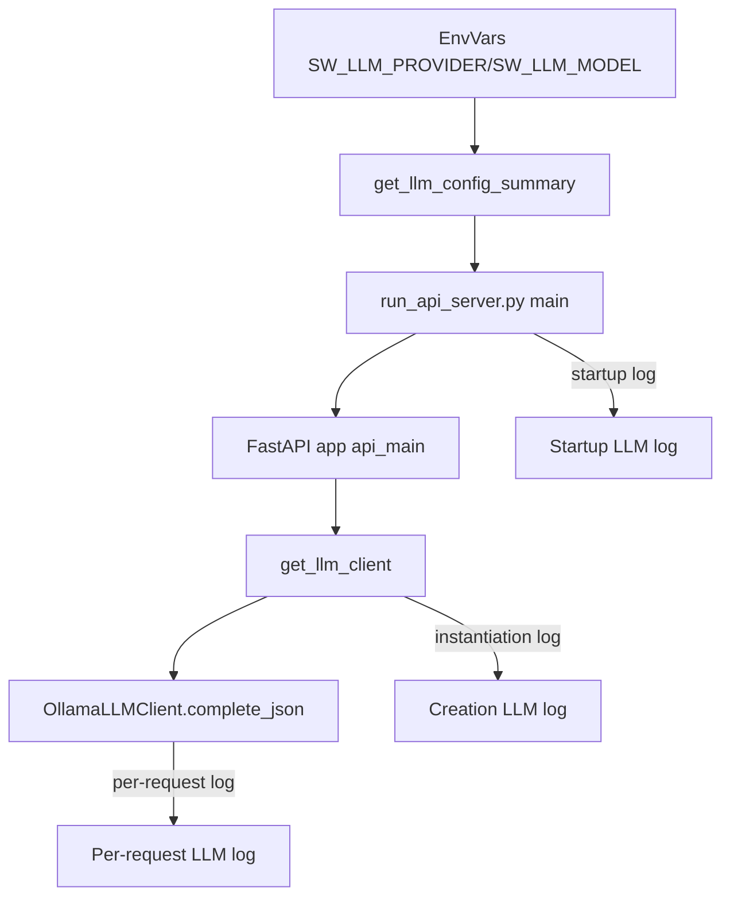

### Goals

- **Startup logging**: When the software engineering team API server starts, emit a prominent log line that clearly states which LLM provider and model are active.
- **Per-request logging**: Each time the LLM client is used to make a completion call, emit a similarly prominent log line with the current model (and provider) so it stands out in application logs.
- **Reuse existing configuration**: Use the existing env-based configuration in `shared/llm.py` so the logging always reflects the real runtime model.

### Key Locations

- **Server entrypoint**: `[software_engineering_team/agent_implementations/run_api_server.py](software_engineering_team/agent_implementations/run_api_server.py)` – runs `uvicorn.run("api.main:app", ...)` in the `__main__` block.
- **FastAPI app**: `[software_engineering_team/api/main.py](software_engineering_team/api/main.py)` – defines the `FastAPI` app and request handlers.
- **LLM factory & config**: `[software_engineering_team/shared/llm.py](software_engineering_team/shared/llm.py)` – contains env var names, `get_llm_client()`, and `OllamaLLMClient`.
- **LLM orchestration entry**: `[software_engineering_team/orchestrator.py](software_engineering_team/orchestrator.py)` – calls `get_llm_client()` and wires the client into agents.

### Implementation Plan

- **1. Centralize model/provider introspection**
  - In `shared/llm.py`, add a small helper function (e.g., `get_llm_config_summary()`) that reads the effective provider and model using the existing env vars (`SW_LLM_PROVIDER`, `SW_LLM_MODEL`) and defaults.
  - Return a short string like `"provider=ollama, model=qwen2.5-coder"` that can be reused by logging sites.
- **2. Add startup logging for the LLM configuration**
  - In `run_api_server.py` (or alternatively in an `on_event("startup")` handler in `api/main.py`), import the helper from `shared/llm.py`.
  - Before calling `uvicorn.run(...)` (or inside the FastAPI startup hook), log a single prominent line at `INFO` level using the existing logging setup, along the lines of:
    - `"*** ACTIVE LLM MODEL *** provider=..., model=..."`.
  - Optionally surround it with simple repeated characters (e.g., a line of `*` above and below) to further increase visibility while keeping it to a few lines.
- **3. Log the model on each LLM completion call**
  - In `OllamaLLMClient` in `shared/llm.py`, locate the method that actually performs the completion call (e.g., `complete_json`).
  - At the top of this method, add a log line with the same strong prefix, including at least the model name and possibly the provider or base URL, such as:
    - `"*** ACTIVE LLM MODEL (REQUEST) *** model=..., base_url=..."`.
  - Ensure this logging fires for every LLM request made by agents that use `self.llm.complete_json(...)`.
- **4. Log when the LLM client is instantiated (optional but helpful)**
  - In `get_llm_client()` in `shared/llm.py`, after determining provider/model and constructing the client, add a one-time log line using the same prefix, indicating which client type was created and which model it uses.
  - This provides additional confirmation in logs around orchestrator startup.
- **5. Keep output readable and consistent**
  - Use a consistent prefix string (`"*** ACTIVE LLM MODEL ***"` and `"*** ACTIVE LLM MODEL (REQUEST) ***"`) so they are easy to grep for.
  - Avoid including huge payloads or prompts in this log; stick to configuration details (provider, model, maybe base URL) to keep logs concise.
- **6. Verify behavior**
  - Run the API server via `run_api_server.py` and confirm that:
    - On startup, the banner-style model line appears once, showing the correct provider/model based on env vars.
    - When issuing a request that triggers the orchestrator (e.g., `POST /run-team`), per-request LLM calls emit the request-level model log line each time `complete_json` is invoked.
  - Adjust wording or surrounding characters if the log does not stand out enough in the existing log volume.

