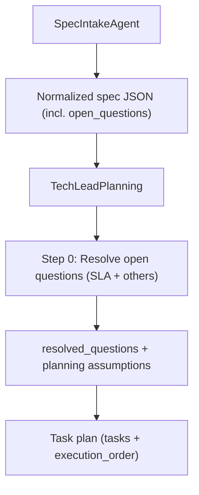

## Open Question & SLA Defaulting in Planning Agents

### 1. Current behavior and target scope

- **Current flow**:
  - Spec intake (`spec_intake_agent`) reads the raw spec and outputs a normalized JSON spec that includes an `open_questions` list and `assumptions` but does not resolve those questions.
  - Spec chunks are analyzed by `spec_chunk_analyzer` and/or `TECH_LEAD_ANALYZE_SPEC_PROMPT`, which extract requirements but do not systematically address open questions.
  - The Tech Lead prompt (`TECH_LEAD_PROMPT`) can short-circuit planning by returning `spec_clarification_needed=true` when the spec is ambiguous, instead of planning with informed assumptions.
  - The Task Generator agent (`TaskGeneratorAgent`) reuses `TECH_LEAD_PROMPT` and thus inherits its behavior.
- **Scope for change (per your choices)**:
  - Apply the new behavior to **core planning** only: spec intake → spec analysis/merge → Tech Lead / Task Generator plan generation (not to all specialized planners yet).
  - Let the system **choose appropriate enterprise references per context** (cloud providers, SaaS/devtools, ITSM patterns, etc.).
  - When defaulting SLAs, prefer **cost-sensitive best practices** over ultra-premium/high-cost defaults.

### 2. High-level design: Open-question resolution layer

- **Goal**: Before or as part of task planning, automatically convert open questions into:
  - A **concrete decision** (chosen default), informed by real-world enterprise patterns.
  - A short **justification** describing trade-offs and why this option is preferred.
  - A set of **implementation tasks** that make the decision real (code, infra, monitoring, docs).
- **Where this lives**:
  - Keep `spec_intake_agent` as the source of `open_questions` and `assumptions`.
  - Add an explicit **"Resolve Open Questions" step inside `TECH_LEAD_PROMPT**`, so that:
    - The Tech Lead consumes `open_questions` (and any prior `assumptions`).
    - It classifies each question, selects enterprise-informed defaults, records the decision, and emits tasks.
  - Ensure the **Task Generator** path (fallback planning) also routes through this same logic via its use of `TECH_LEAD_PROMPT`.
- **Data contract extension (conceptual)**:
  - Extend the Tech Lead / Task Generator JSON shape with an optional field (backward compatible):
    - `"resolved_questions"`: list of objects, each like:
      - `"question"`: original open question text
      - `"category"`: e.g. `"sla-availability"`, `"sla-latency"`, `"sla-rto-rpo"`, `"security"`, `"ux"`, `"data-governance"`
      - `"decision"`: the concrete assumption/default the team is adopting
      - `"justification"`: 2–4 sentences referencing enterprise-style examples and trade-offs
      - `"linked_task_ids"`: list of task IDs created to implement or validate this decision
  - Existing consumers can ignore `resolved_questions` if they do not need it; tasks still carry the behavioral impact.

### 3. SLA best-practice catalog (cost-sensitive defaults)

- **Design a small internal catalog** of SLA defaults that the Tech Lead can reference in its reasoning:
  - Availability / uptime:
    - Internal line-of-business or backoffice tools → default around **99.5%–99.8%** (single-region HA, managed DB with multi-AZ, health checks) to avoid overpaying for extreme redundancy.
    - External customer-facing core flows (auth, payments, main app) → default around **99.9%** with clear error budgets; multi-AZ and robust auto-recovery, but **not** multi-region active-active by default.
  - Latency / performance:
    - User-facing UI interactions → aim for **p95 page load or primary action under ~500ms** on modern connections; background or reporting flows can tolerate higher.
    - Public APIs → default **p95 < 500–800ms**, with explicit timeouts and backpressure; internal batch/analytics APIs may be higher.
  - RTO/RPO and data durability:
    - General transactional apps → **RPO ≤ 15 min**, **RTO ≤ 1–2 hours**, implemented with periodic automated backups, point-in-time restore, and infra-as-code to re-provision.
    - For clearly critical financial or compliance systems, the Tech Lead should bump targets up one tier while calling out cost impact.
  - Incident response / support SLAs:
    - Detection and alerting: on-call alert for severity-1 issues within **5 minutes**, acknowledgment within **15 minutes**, mitigation within **2–4 hours**.
    - Support response (if the spec hints at a support team): first response within **1 business day** for normal tickets, faster for critical ones.
- **Enterprise anchoring guidance (in prompts, not code)**:
  - Instruct the Tech Lead that when resolving SLA questions, it should:
    - Use **cloud provider and devtools patterns** (e.g. typical AWS/Azure/GCP managed service SLAs, Datadog/PagerDuty-style incident practices) as mental models.
    - Favor **managed services and simpler topologies** as defaults unless the spec explicitly demands extreme HA or low latency (cost-sensitive bias).
    - Explicitly mention trade-offs (cost, complexity, vendor lock-in) in the `justification` field.

### 4. Prompt changes: Tech Lead open-question resolution

- **Augment `TECH_LEAD_PROMPT**` in `software_engineering_team/tech_lead_agent/prompts.py` with a new section before STEP 1:
  - Add **"STEP 0 – Resolve Open Questions with Best-Practice Defaults"** that says, in summary:
    - Take `open_questions` from the spec context.
    - For **each question**:
      - Classify it (SLA-related vs. other).
      - If it is **SLA-related**, choose a best-practice default using the SLA catalog and enterprise patterns, with a **cost-sensitive bias**.
      - If it is **non-SLA**, make a reasonable assumption informed by similar patterns in enterprise tools and services (e.g. typical auth flows, logging strategies, role models).
      - Only refrain from making an assumption (and set `spec_clarification_needed=true`) if:
        - The spec is fundamentally contradictory, or
        - The choice would materially affect compliance, legal, or safety in ways that cannot be responsibly assumed.
    - For each decision, create at least one task that **implements or validates** the decision:
      - E.g. define SLOs and alerts, configure monitoring dashboards, document SLAs and escalation runbooks, add validation tests.
    - Populate `resolved_questions` with the classification, decision, justification, and the IDs of created tasks.
  - Tighten the `SPEC CLARIFICATION` section to emphasize:
    - Prefer **planning with explicit, well-justified assumptions** derived from best practices over blocking for clarification when possible.
    - When `spec_clarification_needed=true` is returned, still include any assumptions that could partially unblock work (e.g. monitoring setup or baseline metrics collection) and tasks that are safe to proceed with.
- **Ensure Task Generator reuses this logic**:
  - `TaskGeneratorAgent` already prefixes its context with `TECH_LEAD_PROMPT` (`base_prompt = TECH_LEAD_PROMPT + ...`). Once `TECH_LEAD_PROMPT` is updated, fallback planning inherits the new behavior automatically.

### 5. Using plan patterns and enterprise examples

- **Extend plan-pattern hints** in `plan_patterns.py` (conceptually) to cover SLAs and observability:
  - Add a short **"SLA & Observability" pattern**:
    - Define SLOs (availability, latency) for key APIs or flows.
    - Implement metrics, traces, and logs aligned with those SLOs.
    - Configure alerts with sane thresholds and escalation policies.
    - Document runbooks for incident response and on-call.
  - Reference these in `TECH_LEAD_PROMPT` so the Tech Lead can map SLA-related open questions into a **repeatable pattern of tasks**, instead of inventing structures from scratch.
- **Enterprise example guidance**:
  - In the prompt text, instruct the Tech Lead to briefly note which style of enterprise pattern it is mirroring when justifying decisions (e.g. “similar to common managed DB HA setups on major clouds” or “mirrors typical on-call SLAs for SaaS incident response”), without naming specific vendors if not present in the spec.

### 6. Output and downstream usage

- **Tasks**:
  - For every resolved question (especially SLA ones), ensure there are concrete tasks such as:
    - "Define and document SLAs and SLOs for [service/feature] including availability, latency, and error budgets."
    - "Implement metrics and alerts to enforce [chosen SLA] using existing observability stack."
    - "Update runbooks and README to include SLA details and incident response procedures."
  - These tasks should follow the existing **task schema** (title, description, user_story, requirements, acceptance_criteria, dependencies, type, assignee).
- **Resolved question metadata**:
  - `resolved_questions` allows downstream orchestration or reporting to:
    - Show which assumptions were made.
    - Point stakeholders to the specific tasks that embody those assumptions.
    - Potentially drive a later “stakeholder review” step that confirms or adjusts these defaults.

### 7. Implementation considerations (at code level)

- **Wiring `open_questions` into the Tech Lead context**:
  - Ensure the pipeline that constructs the Tech Lead input includes `open_questions` from the Spec Intake JSON (and any subsequent merged spec structures) into the prompt context.
  - Represent them clearly in the Tech Lead input (e.g. a markdown list section in the prompt) so the model can iterate over them.
- **Schema tolerance**:
  - Verify/adjust task parsing and validation (`shared.task_parsing`, `shared.task_validation`) so that:
    - New top-level fields like `resolved_questions` are tolerated.
    - The requirement that “every acceptance criterion from the spec appears in `requirement_task_mapping`” still holds, but **resolved questions** don’t break parsing.
- **Testing strategy**:
  - Add tests that feed:
    - Specs with SLA-shaped open questions (availability, latency, RTO/RPO).
    - Specs with non-SLA open questions (UX, security, data retention).
  - Validate that the Tech Lead:
    - Produces `resolved_questions` with non-empty `decision` and `justification`.
    - Emits at least one meaningful task per resolved question.
    - Only falls back to `spec_clarification_needed=true` for truly non-assumable cases.

### 8. Conceptual flow diagram

