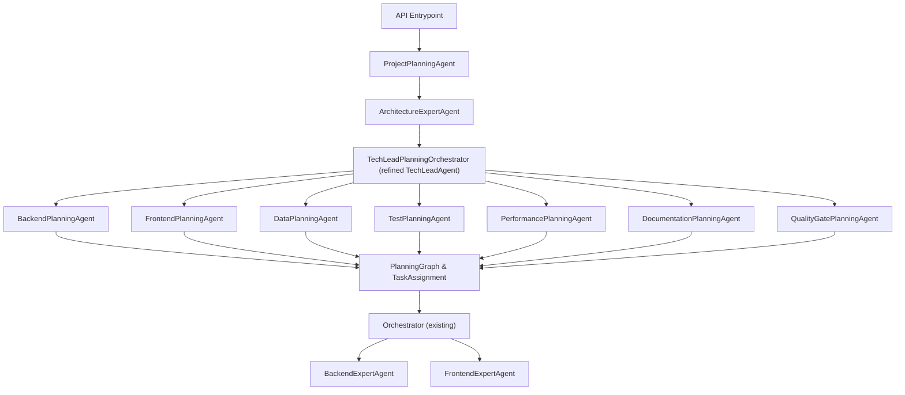

## Objectives and Constraints

- **Primary outcome**: Optimize for **fast delivery of features** while still producing **clean, performant, well-documented code**.
- **Scope**: Focus on the **Planning layer only**. Execution/review agents stay as-is, but we may refine **interfaces and artifacts** that planning produces for them.
- **Key improvements**:
  - Deeper, more structured planning (hierarchical, domain-specific).
  - Clearer contracts between planning outputs and execution/review inputs.
  - Minimal disruption to existing `Task` and `TaskAssignment` models used by execution agents.

## High-Level Architecture

We introduce a **multi-stage, multi-agent planning pipeline** on top of the current `ArchitectureExpertAgent` and `TechLeadAgent`:

- **ProjectPlanningAgent**: New high-level planner that frames the engagement as milestones and epics before architecture.
- **TechLeadPlanningOrchestrator**: A refactored/extended Tech Lead that coordinates several **domain-specific planning agents**.
- **Domain planners**: Dedicated planning agents (backend, frontend, data, tests, performance, docs, quality gates) that produce fine-grained plans.
- **PlanningGraph**: Internal planning structure (task graph, phases, dependencies) that is then compiled down to the existing flat `TaskAssignment` for compatibility with execution agents.

## Changes to Existing Agents

### 1. `ArchitectureExpertAgent` (keep, but enrich outputs)

**File**: `[software_engineering_team/architecture_agent/agent.py](software_engineering_team/architecture_agent/agent.py)`

- **Today**: Produces a high-level `SystemArchitecture` plus a markdown plan.
- **Upgrade**:
  - Add more **structured fields** to `SystemArchitecture` (or a nested planning-specific DTO) that downstream planners can consume, such as:
    - `components` with explicit `owner` (`backend`, `frontend`, `data`, `devops`).
    - `api_contracts` (endpoints, payloads, performance expectations).
    - `data_flows` (sources, sinks, batch vs streaming).
    - `non_functional_requirements` (latency budgets, availability, security, compliance).
  - Keep the human-readable `DEVELOPMENT_PLAN-architecture.md` artifact.
  - Ensure outputs remain backwards compatible for existing execution agents, while adding new optional fields for planners.

### 2. `TechLeadAgent` → "TechLeadPlanningOrchestrator"

**File**: `[software_engineering_team/tech_lead_agent/agent.py](software_engineering_team/tech_lead_agent/agent.py)`

- **Today**:
  - Performs one-shot task decomposition into a flat `TaskAssignment`.
  - Provides progress review and limited dynamic task creation.
- **Upgrade**:
  - Conceptually reposition as a **planning orchestrator** that:
    - Coordinates new domain-specific planners.
    - Maintains a **PlanningGraph** (see below).
    - Ultimately compiles a validated `TaskAssignment` (so execution remains unchanged).
  - Internally, split responsibilities into:
    - `project_overview_planning` (consumes `ProjectPlanningAgent` output).
    - `domain_planning_orchestration` (invokes each domain planner with the relevant slice of requirements and architecture).
    - `plan_integration` (merges domain plans into a single graph with dependencies between domains).
    - `task_assignment_compiler` (turns the graph into the current `TaskAssignment` with `tasks` and `execution_order`).
  - Keep existing public interface (`run`, `review_progress`, `refine_task`) but implement them in terms of the new planning pipeline.

### 3. `Orchestrator`

**File**: `[software_engineering_team/orchestrator.py](software_engineering_team/orchestrator.py)`

- **Today**: Calls `ArchitectureExpertAgent` then `TechLeadAgent.run` directly.
- **Upgrade (planning-only interface changes)**:
  - Insert **ProjectPlanningAgent** call before architecture, passing its results into architecture.
  - Treat `TechLeadAgent` as the **TechLeadPlanningOrchestrator** but keep signature for compatibility:
    - `tech_lead.run(requirements, architecture, spec_content, existing_codebase, project_overview)`.
  - No changes needed to how backend/frontend execution agents consume `TaskAssignment`.

## New Core Planning Data Structure: `PlanningGraph`

**File**: new module `[software_engineering_team/planning/planning_graph.py](software_engineering_team/planning/planning_graph.py)`

- **Purpose**: Internal, richer representation of the plan used only in the planning layer.
- **Key concepts**:
  - `PlanningNode`:
    - `id` (string, unique).
    - `domain` (backend, frontend, data, qa, docs, perf, devops).
    - `kind` (EPIC, FEATURE, TASK, SUBTASK).
    - `summary`, `details` (NL descriptions).
    - `inputs` / `outputs` (e.g., APIs, files, DB tables).
    - `acceptance_criteria` (mirrors/extends existing `Task.acceptance_criteria`).
  - `PlanningEdge`:
    - `from_id`, `to_id`.
    - `type` (BLOCKS, RELATES_TO, VERIFIES, DOCUMENTS, LOADS_FROM, EXPOSES_API).
  - `PlanningGraph`:
    - `nodes: Dict[str, PlanningNode]`.
    - `edges: List[PlanningEdge]`.
    - `phases: List[Phase]` (e.g., Architecture, Scaffolding, Core Features, Hardening).
- **Compiler**:
  - Utility that maps `PlanningGraph` → `TaskAssignment` by:
    - Collapsing EPIC/FEATURE nodes into tags/metadata.
    - Emitting **implementation-ready `Task`s** for TASK/SUBTASK nodes only.
    - Generating a topologically sorted `execution_order` based on `BLOCKS` edges and domain balancing similar to current interleaving.
  - This lets us get very fine-grained domain planning **without** changing how execution agents are invoked.

## New / Updated Planning Agents

### 1. `ProjectPlanningAgent` (new)

**File**: `[software_engineering_team/project_planning_agent/agent.py](software_engineering_team/project_planning_agent/agent.py)`

- **Role**: Turn raw spec + context into a **project overview**: goals, constraints, milestones, and epics optimized for fast delivery.
- **Inputs**:
  - Parsed requirements (`ProductRequirements` from `spec_parser`).
  - Spec content (`initial_spec.md`).
  - Repo state summary (existing codebase scan from shared utilities).
- **Outputs**:
  - `ProjectOverview` model, e.g.:
    - `primary_goal`, `secondary_goals`.
    - `milestones` (each with description, target order, rough scope).
    - `risk_items` (top N risks with mitigation notes).
    - `delivery_strategy` (e.g., backend-first, vertical slices, etc.).
  - Markdown artifact: `DEVELOPMENT_PLAN-project_overview.md`.
- **How it helps**:
  - Provides a **fast-delivery-oriented framing** (e.g., prioritize a minimal viable walking skeleton) that all other planners can align with.

### 2. `BackendPlanningAgent` (new)

**File**: `[software_engineering_team/backend_planning_agent/agent.py](software_engineering_team/backend_planning_agent/agent.py)`

- **Role**: Convert backend-related slices of the architecture + requirements into **backend-specific PlanningGraph nodes and edges**.
- **Inputs**:
  - `ProjectOverview`.
  - `SystemArchitecture` (filtered to backend components and APIs).
  - Backend-relevant requirements and user stories.
- **Outputs**:
  - A partial `PlanningGraph` with:
    - Backend EPICs and FEATURES (e.g., "User Accounts Service").
    - TASK/SUBTASK nodes (e.g., "Implement /api/users POST", "Add pydantic models", "Write unit tests for service layer").
    - Dependencies between endpoints, data models, and integration points.
- **Handoff to execution**:
  - The compiler will generate backend `Task`s with concise, implementation-ready descriptions and **clear acceptance criteria** for use by `BackendExpertAgent`.

### 3. `FrontendPlanningAgent` (new)

**File**: `[software_engineering_team/frontend_planning_agent/agent.py](software_engineering_team/frontend_planning_agent/agent.py)`

- **Role**: Create a UI/UX-focused plan aligned with the backend and accessibility requirements.
- **Inputs**:
  - `ProjectOverview`.
  - `SystemArchitecture` UI components and API contracts.
  - Frontend-related requirements (UX, theming, accessibility hints).
- **Outputs**:
  - UI epics (e.g., "Dashboard", "Settings").
  - TASK/SUBTASK nodes for pages, components, routing, state management, and integration calls.
  - Accessibility-focused tasks (e.g., keyboard navigation, ARIA roles, color contrast) attached as subtasks to relevant features.
- **Handoff**:
  - Tasks feed into `TaskAssignment` as FRONTEND `Task`s that execution agents use as today but with **better structure and a11y-focused acceptance criteria**.

### 4. `DataPlanningAgent` (new, optional per project)

**File**: `[software_engineering_team/data_planning_agent/agent.py](software_engineering_team/data_planning_agent/agent.py)`

- **Role**: Plan schemas, migrations, and data flows when requirements involve significant data modeling or analytics.
- **Inputs**:
  - `ProjectOverview`.
  - `SystemArchitecture.data_flows` and database-related components.
- **Outputs**:
  - Data model EPICs (e.g. "User Profile Schema", "Audit Logging").
  - TASKS for migrations, indexing strategies, data retention, and privacy constraints.
  - Edges linking data tasks to backend/frontend tasks that consume the data.

### 5. `TestPlanningAgent` (new)

**File**: `[software_engineering_team/test_planning_agent/agent.py](software_engineering_team/test_planning_agent/agent.py)`

- **Role**: Produce a **test strategy** and test-related tasks ahead of implementation.
- **Inputs**:
  - `ProjectOverview`.
  - Requirements with acceptance criteria.
  - Architecture and early backend/frontend plans.
- **Outputs**:
  - Mapping from high-level acceptance criteria to specific test types (unit, integration, E2E).
  - TASK/SUBTASK nodes like "Add pytest suite for service X", "Add Playwright test for flow Y".
  - Edges: `VERIFIES` relationships from test tasks to feature tasks.
- **Benefits**:
  - Ensures execution agents always implement tests alongside features, not as an afterthought.

### 6. `PerformancePlanningAgent` (new)

**File**: `[software_engineering_team/performance_planning_agent/agent.py](software_engineering_team/performance_planning_agent/agent.py)`

- **Role**: Plan for performance and scalability early, which is especially important given your emphasis on clean, performant code.
- **Inputs**:
  - Non-functional requirements from `SystemArchitecture`.
  - Expected load patterns from spec.
- **Outputs**:
  - Performance budgets (latency, throughput) attached to relevant nodes.
  - Tasks for instrumenting metrics, adding caching, load testing scenarios.

### 7. `DocumentationPlanningAgent` (new)

**File**: `[software_engineering_team/documentation_planning_agent/agent.py](software_engineering_team/documentation_planning_agent/agent.py)`

- **Role**: Plan documentation artifacts that execution and the existing `DocumentationAgent` will later generate.
- **Inputs**:
  - `ProjectOverview` milestones and epics.
  - Architecture overview.
- **Outputs**:
  - Doc EPICs (Developer Guide, API Reference, Architecture Decision Records, User Guide).
  - TASK/SUBTASK nodes like "Add ADR for auth strategy", "Update README with setup instructions", "Document /api/orders endpoints".
  - Edges `DOCUMENTS` linking doc tasks to code feature nodes.

### 8. `QualityGatePlanningAgent` (new)

**File**: `[software_engineering_team/quality_gate_planning_agent/agent.py](software_engineering_team/quality_gate_planning_agent/agent.py)`

- **Role**: Remain within the planning layer but **shape how review agents are used** without changing their internal logic.
- **Inputs**:
  - `ProjectOverview` (delivery speed vs quality tradeoffs).
  - Domain plans and `PlanningGraph` state.
- **Outputs**:
  - Per-task or per-phase **quality gate configuration**, such as:
    - Which reviews are required (code review, QA, security, accessibility, DBC).
    - When to run them (per commit, per feature, per milestone).
    - Exit criteria per gate (e.g., "no critical security issues", "all high-severity QA issues resolved").
  - Stored as metadata in the `PlanningGraph` (node/phase annotations) and compiled into comments/rationales in `Task` descriptions for execution agents.

## Collaboration & Data Flow in Planning Layer

1. **Spec Parsing** (existing)
  - `spec_parser` produces `ProductRequirements` and parsed acceptance criteria.
2. **Project Overview** (new)
  - Orchestrator calls `ProjectPlanningAgent`.
  - Produces `ProjectOverview` and `DEVELOPMENT_PLAN-project_overview.md`.
3. **Architecture Design** (existing, enriched)
  - `ArchitectureExpertAgent` consumes `ProductRequirements` + `ProjectOverview`.
  - Emits enriched `SystemArchitecture` and `DEVELOPMENT_PLAN-architecture.md`.
4. **Domain Planning Orchestration** (refined Tech Lead)
  - `TechLeadPlanningOrchestrator` initializes an empty `PlanningGraph` and then:
    - Invokes `BackendPlanningAgent`, `FrontendPlanningAgent`, `DataPlanningAgent` etc., each returning partial graphs.
    - Invokes `TestPlanningAgent`, `PerformancePlanningAgent`, `DocumentationPlanningAgent`, `QualityGatePlanningAgent` to augment the graph.
    - Merges all partial graphs and resolves cross-domain dependencies.
5. **Plan Validation & Refinement**
  - Replace the current flat validation with validation on `PlanningGraph`:
    - Detect cycles, missing dependencies, orphan test/docs/perf tasks.
    - Ensure coverage: every high-level requirement maps to one or more feature tasks, and every feature has at least one verification (test) and documentation node.
  - Expose a summarized validation report in `DEVELOPMENT_PLAN-tech_lead.md`.
6. **Compilation to `TaskAssignment**`
  - Use the compiler to:
    - Generate backend/frontend/devops tasks with rich descriptions and acceptance criteria.
    - Compute an execution order that:
      - Respects `BLOCKS` edges.
      - Prioritizes **vertical slices** to deliver value quickly (aligned with `ProjectOverview.delivery_strategy`).
      - Organizes tasks into small, execution-friendly chunks for the expert coders.
  - Emit the existing `TaskAssignment` structure plus a new, optional `planning_metadata` field for debugging/tracing.

## Impact on Execution and Review (Planning-Scope Only)

- **Execution agents** (`BackendExpertAgent`, `FrontendExpertAgent`, `DevOpsExpertAgent`, etc.) continue to:
  - Receive `Task`s and `TaskAssignment.execution_order` as before.
  - Benefit from **better task descriptions, more precise acceptance criteria, and explicit quality gates** without code changes.
- **Review agents** (QA, security, accessibility, code review, DBC, acceptance verifier) remain unchanged but:
  - Will see better-structured context in tasks and development plans.
  - Can be guided by quality gate annotations embedded in task descriptions.

## Implementation Strategy (High Level)

1. **Introduce core planning abstractions**
  - Add `planning_graph` module and models.
  - Implement a first-pass compiler from graph to `TaskAssignment` and unit tests to lock in behavior.
2. **Add `ProjectPlanningAgent` and minimal domain planners**
  - Implement `ProjectPlanningAgent` and simple `BackendPlanningAgent` / `FrontendPlanningAgent` that generate a basic `PlanningGraph` from requirements and architecture.
  - Wire them into the orchestrator and `TechLeadAgent`.
3. **Refine Tech Lead into orchestrator of planners**
  - Gradually move current monolithic task generation into planner orchestration plus compiler.
  - Maintain compatibility for `run` and `review_progress`.
4. **Add specialized planners for tests, docs, performance, data, and quality gates**
  - Introduce each planner as an incremental extension that enriches the `PlanningGraph` and improves task quality without affecting execution logic.
5. **Enhance validation and development plan artifacts**
  - Upgrade validation to operate on `PlanningGraph` and surface reports in `DEVELOPMENT_PLAN-tech_lead.md`.
  - Ensure each new planner logs its rationale and key decisions for transparency.
6. **Tighten feedback loop (future work, beyond this iteration)**
  - Once planning is stable, extend `review_progress` to update `PlanningGraph` based on execution and review feedback, then recompile updated `TaskAssignment` (optional future step, outside current scope).

