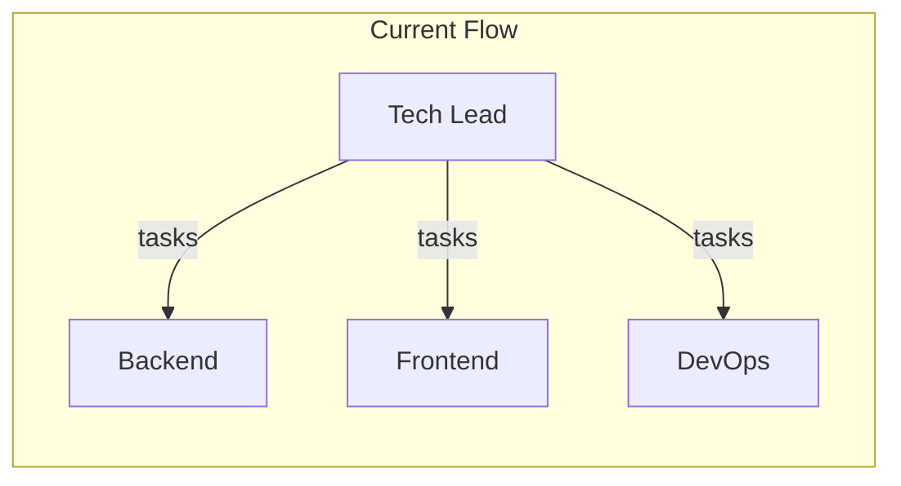

# Software Engineering Agent Effectiveness Analysis

## Executive Summary

The software engineering team agents suffer from structural gaps across three areas: task generation quality, spec coverage, and the absence of any clarification/feedback loop. Key root causes include: no validation of task quality, specialists never receiving existing code context, zero mechanism for agents to request clarification, and silent failure handling.

---

## 1. Why Agents Don't Generate Meaningful, Well-Defined Tasks

### Tech Lead Agent Issues

**No output validation or quality checks** ([tech_lead_agent/agent.py](software_engineering_team/tech_lead_agent/agent.py))

- The Tech Lead blindly accepts whatever the LLM returns. Tasks with empty `description`, `requirements`, or `acceptance_criteria` are still created.
- `Task.requirements` and `Task.acceptance_criteria` default to empty:
  ```python
  requirements=t.get("requirements", ""),
  acceptance_criteria=acc,  # can be []
  ```
- No retry if the LLM returns too few tasks or vague descriptions.

**Context truncation limits task specificity**

- Spec is truncated to 6000 chars: `spec_content[:6000]` ([tech_lead_agent/agent.py](software_engineering_team/tech_lead_agent/agent.py) line 50)
- Architecture document truncated to 2000 chars (line 64)
- Large or detailed specs/architectures lose critical details needed for precise task breakdown.

**Prompt guidance vs. enforcement**

- The prompt instructs "15–30+ FINE-GRAINED tasks" and "DESCRIPTIVE task IDs" but there is no code-level enforcement.
- No minimum requirements for `description` length, `acceptance_criteria` count, or presence of `requirements`.

### Specialist Agent Issues

**Specialists never receive existing code context** ([orchestrator.py](software_engineering_team/orchestrator.py) lines 204–252)

- `BackendInput` and `FrontendInput` support `existing_code`, `api_spec`, and `api_endpoints`, but the orchestrator never passes them:
  ```python
  result = agents["backend"].run(BackendInput(
      task_description=task.description,
      requirements=_task_requirements(task),
      architecture=architecture,
      language="python",
      qa_issues=qa_issues,
      security_issues=sec_issues,
      # existing_code=???  NOT PASSED
      # api_spec=???       NOT PASSED
  ))
  ```
- Each task runs as if the repo is empty. Backend/frontend agents cannot extend or integrate with prior work.
- Frontend never receives backend API contract (`api_endpoints`), so it cannot reliably integrate.

**Vague task descriptions propagate**

- `_task_requirements()` ([orchestrator.py](software_engineering_team/orchestrator.py) lines 69–74) concatenates `task.requirements` and `task.acceptance_criteria`. If both are empty or thin, specialists get minimal context.
- Specialist prompts don't instruct agents to detect ambiguity or request more detail.

### LLM Configuration

- Orchestrator uses `DummyLLMClient()` by default ([orchestrator.py](software_engineering_team/orchestrator.py) line 111) — `# TODO: configurable`
- In production, this may still be the dummy client, producing canned placeholder outputs.

---

## 2. Why Agents Don't Generate All Required Tasks for the Spec

### Spec-to-Task Traceability Gaps

**No mapping from spec to tasks**

- Tech Lead prompt says "Map EVERY requirement, feature, and acceptance criterion from the spec to one or more tasks" but there is no structured output or validation for this.
- No field like `spec_coverage` or `requirement_task_mapping` to verify coverage.

**Spec parsing quality** ([spec_parser.py](software_engineering_team/spec_parser.py))

- Heuristic fallback produces `acceptance_criteria=[]` (line 79), so ProductRequirements can lack structured acceptance criteria.
- Tech Lead receives weak input when LLM parsing fails.

**No post-generation verification**

- No check that `ProductRequirements.acceptance_criteria` are covered by task `acceptance_criteria`.
- No check that `execution_order` includes all tasks or that dependencies are valid.

### Execution Gaps

**Silent skipping of dependent tasks** ([orchestrator.py](software_engineering_team/orchestrator.py) lines 169–171)

```python
if any(dep not in completed for dep in task.dependencies):
    continue  # Silent skip—no retry, no logging of blocked tasks
```

- Tasks with unsatisfied dependencies are skipped without retry or escalation.
- No way to unblock or reschedule.

**Tasks marked complete regardless of outcome** ([orchestrator.py](software_engineering_team/orchestrator.py) lines 233–234, 269–270)

- `completed.add(task_id)` happens even when:
  - `write_agent_output` fails
  - Merge fails (branch is abandoned but task is still "completed")
- Downstream tasks may run with incomplete or missing artifacts.

**Weak enforcement of task count**

- Prompt says "fewer than 15 tasks... you have not been thorough enough" but there is no validation or retry when the LLM returns fewer tasks.

---

## 3. Why Agents Don't Flag Poorly Defined Tasks or Request Clarification

### No Clarification Mechanism Exists

Grep for clarification-related terms returns no matches. There is no designed path for specialists to ask for more information.

### Specialist Output Schema is Implementation-Only

- Backend, Frontend, DevOps: output is always `{code, files, summary, ...}` — no alternative response type.
- Prompts never mention detecting ambiguity or requesting clarification.
- No `needs_clarification`, `blocked`, or `clarification_requests` in any output model.

### One-Way Communication




- Tech Lead produces tasks; specialists execute. No feedback to Tech Lead.
- Even if a specialist could "flag" something, there is no handler to route that back to the Tech Lead or pause execution.

### Tech Lead Can't Flag Unclear Specs Either

- Tech Lead prompt assumes the spec is usable. There is no option to return "spec is incomplete or ambiguous" instead of tasks.
- Tech Lead always returns `TaskAssignment`; no `SpecClarificationRequest` or similar type.

---

## Root Cause Summary


| Issue                | Root Cause                                                                       |
| -------------------- | -------------------------------------------------------------------------------- |
| Vague tasks          | No validation of Tech Lead output; empty/minimal fields accepted                 |
| Incomplete task list | No spec-to-task traceability or coverage checks                                  |
| Spec truncation      | Hard limits (6000/2000 chars) drop important details                             |
| Code doesn't work    | Specialists lack `existing_code` and API contracts; run in isolation             |
| No clarification     | No schema or flow for specialists to request more info                           |
| Silent failures      | Tasks skipped when deps fail; tasks marked complete despite write/merge failures |
| Dummy LLM in prod    | Orchestrator hardcoded to DummyLLMClient                                         |


---

## Recommended Improvements (High Level)

1. **Task quality**: Add validation (min description length, non-empty acceptance criteria, dependency validation) and retry when Tech Lead output is insufficient.
2. **Spec coverage**: Add structured spec-to-task mapping and coverage checks; avoid truncation or use chunking for large specs.
3. **Context for specialists**: Pass `existing_code` and API contracts to backend/frontend on each task.
4. **Clarification flow**: Introduce `needs_clarification` / `clarification_requests` in specialist outputs; add orchestrator logic to route back to Tech Lead and pause/resume.
5. **Tech Lead spec handling**: Allow Tech Lead to return "spec unclear" with a list of questions before generating tasks.
6. **Execution robustness**: Improve dependency handling (retry, escalation), and only mark tasks complete when writes and merges succeed.
7. **Configuration**: Make LLM client configurable so production uses a real model.

