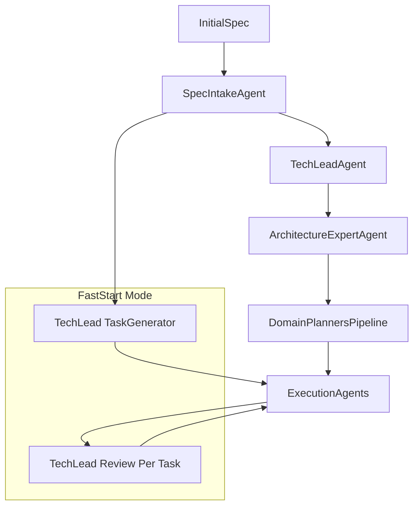

## Speed Up Software Engineering Planning

### High-level approach

- **Scope**: Implement recommendations 1–8 inside the existing planning pipeline for the software engineering team (Tech Lead + planning_team + orchestrator), without changing external APIs to other teams.
- **Strategy**: Start with low-risk configuration and prompt changes (caps, flags, templates), then add structural improvements (parallelism, caches, domain boundaries) guarded behind feature flags/env vars.
- **Safety**: Keep a "current behavior" mode via env/config toggles so you can A/B test the new, faster planning mode against existing behavior.

---

### 1. Short, structured spec input

- **Goal**: Ensure specs are concise and structured before entering heavy planning, reducing chunking and analysis cost.
- **Key files**:
  - `[software_engineering_team/orchestrator.py](software_engineering_team/orchestrator.py)` – spec loading and initial orchestrator control.
  - `[software_engineering_team/planning_team/spec_intake_agent/agent.py](software_engineering_team/planning_team/spec_intake_agent/agent.py)` and its prompts/models.
  - `[software_engineering_team/planning_team/spec_intake_agent/models.py](software_engineering_team/planning_team/spec_intake_agent/models.py)` – `ProductRequirements`/REQ schema.
- **Planned changes**:
  - Introduce a **structured spec template** (sections: Goal, Context, Requirements with REQ-IDs, Constraints, Non-goals, Open questions) and bake it into the `SpecIntakeAgent` prompt so it normalizes arbitrary specs into this compact schema.
  - Add a **pre-normalization step** in `run_orchestrator` that always runs `SpecIntakeAgent` (or a light-weight mode of it) and passes downstream agents only the normalized `ProductRequirements` and a short derived summary, not raw free-form spec text.
  - Add an optional env flag (e.g., `SW_ENFORCE_STRUCTURED_SPEC`) to fail fast or strongly warn when the incoming spec is too long or significantly deviates from the expected template.

---

### 2. Reduce depth / number of planning passes

- **Goal**: Cap and short-circuit loops and multi-step planning when early outputs are already good enough.
- **Key files**:
  - `[software_engineering_team/orchestrator.py](software_engineering_team/orchestrator.py)` – alignment and conformance loops.
  - `[software_engineering_team/planning_team/planning_review.py](software_engineering_team/planning_team/planning_review.py)` – `check_tasks_architecture_alignment`, `check_spec_conformance`.
  - `[software_engineering_team/tech_lead_agent/agent.py](software_engineering_team/tech_lead_agent/agent.py)` – `_run_planning_pipeline`, TaskGenerator fallback, retries.
- **Planned changes**:
  - Introduce **configurable, lower default caps** for `MAX_ALIGNMENT_ITERATIONS` and `MAX_CONFORMANCE_RETRIES`, and add **early-exit heuristics** (e.g., if misalignment count < threshold and no high-severity issues, skip remaining iterations).
  - In `TechLeadAgent.run`, introduce a **confidence/coverage check** (e.g., minimum number of coding tasks, coverage of all REQ-IDs) and, when satisfied, avoid re-running the planning pipeline or TaskGenerator on the same inputs.
  - Add a **“minimal planning mode”** that, when enabled, uses a single TaskGenerator pass for many projects and only escalates to the full multi-planner pipeline when spec size/complexity or risk flags exceed thresholds.

---

### 3. Use templates and plan patterns

- **Goal**: Make planners fill in templates instead of re-inventing structure, reducing tokens and variance.
- **Key files**:
  - `[software_engineering_team/tech_lead_agent/prompts.py](software_engineering_team/tech_lead_agent/prompts.py)` – Tech Lead prompts.
  - Domain planner prompts, for example:
    - `[software_engineering_team/planning_team/backend_planning_agent/prompts.py](software_engineering_team/planning_team/backend_planning_agent/prompts.py)`
    - `[software_engineering_team/planning_team/frontend_planning_agent/prompts.py](software_engineering_team/planning_team/frontend_planning_agent/prompts.py)`
    - `[software_engineering_team/planning_team/devops_planning_agent/prompts.py](software_engineering_team/planning_team/devops_planning_agent/prompts.py)`
  - `[software_engineering_team/planning_team/planning_graph.py](software_engineering_team/planning_team/planning_graph.py)` – `PlanningGraph` structure.
- **Planned changes**:
  - Define a small **library of reusable plan patterns** (e.g., “CRUD API + SPA”, “background worker + queue”, “feature-flagged rollout”, “standard CI/CD + observability”) documented and encoded as structured examples in the prompts.
  - Update Tech Lead and domain planner prompts to **explicitly emit plans in a fixed, compact schema** (e.g., constrained node types and sections) that match `PlanningGraph`, avoiding long prose.
  - Optionally implement **pattern selection hints** based on spec tags/domain (e.g., web app vs batch job) and make planners “select and adapt” a pattern rather than generate from scratch.

---

### 4. Tighten context sizing for planning agents

- **Goal**: Systematically reduce the amount of text sent to planning agents while retaining essential information.
- **Key files**:
  - `[software_engineering_team/shared/context_sizing.py](software_engineering_team/shared/context_sizing.py)` – `compute_spec_chunk_chars`, `compute_task_generator_*`, `compute_existing_code_chars`, etc.
  - `[software_engineering_team/planning_team/spec_chunk_analyzer/agent.py](software_engineering_team/planning_team/spec_chunk_analyzer/agent.py)` and `[software_engineering_team/planning_team/spec_analysis_merger/agent.py](software_engineering_team/planning_team/spec_analysis_merger/agent.py)`.
  - `[software_engineering_team/tech_lead_agent/agent.py](software_engineering_team/tech_lead_agent/agent.py)` – construction of `TaskGeneratorAgent` inputs.
- **Planned changes**:
  - Review and **lower context caps** for spec chunks, spec analysis, and codebase summaries; favor shorter, more focused slices.
  - Ensure that spec analysis and merger prompts operate primarily on **normalized spec fields and summaries**, not full-spec text; trim or omit secondary sections when constructing prompt inputs.
  - For TaskGenerator, restrict inputs to **concise summaries** (project overview, condensed spec analysis, architecture highlights) instead of raw, large artifacts, and make the prompt itself expect these shorter inputs.

---

### 5. Parallelize spec/risk analysis and per-area subplans

- **Goal**: Exploit independence between analyses and domain planners to reduce wall-clock time.
- **Key files**:
  - `[software_engineering_team/tech_lead_agent/agent.py](software_engineering_team/tech_lead_agent/agent.py)` – `_analyze_codebase`, `_analyze_spec_chunked`, `_run_planning_pipeline`.
  - `[software_engineering_team/orchestrator.py](software_engineering_team/orchestrator.py)` – existing thread-pool orchestration for Tier 1/2/3 planning.
  - Domain planner agents in `[software_engineering_team/planning_team/](software_engineering_team/planning_team/)` (backend, frontend, test, performance, documentation, etc.).
- **Planned changes**:
  - Refactor `_analyze_spec_chunked` to **run `SpecChunkAnalyzer` calls in parallel** (e.g., `ThreadPoolExecutor`), bounded by a small max worker count for safety.
  - Where dependencies allow, **overlap spec analysis with early codebase analysis**, so Tech Lead’s overall pre-planning passes run concurrently instead of strictly serially.
  - Confirm domain planners depend only on shared artifacts (normalized spec, merged spec analysis, architecture), and then **invoke domain planners in parallel batches** (similar to existing Tier 1/2/3 patterns) from `_run_planning_pipeline`.

---

### 6. Narrow planner responsibilities (right granularity)

- **Goal**: Make each planner responsible for a clear subset of tasks to avoid overlap and redundant planning work.
- **Key files**:
  - `[software_engineering_team/tech_lead_agent/agent.py](software_engineering_team/tech_lead_agent/agent.py)` – `_run_planning_pipeline` wiring.
  - Domain planner models/agents in `[software_engineering_team/planning_team/*_planning_agent/](software_engineering_team/planning_team/)`.
  - `[software_engineering_team/planning_team/planning_graph.py](software_engineering_team/planning_team/planning_graph.py)` and any validation helpers.
- **Planned changes**:
  - Clarify a **domain ownership matrix** (e.g., backend planner: APIs/services/data persistence; frontend planner: UI/UX + client state; devops planner: CI/CD, infra; test planner: QA tasks only) and encode this in both prompts and model schemas.
  - Update planner prompts and their output schemas so that each planner **only emits nodes in its allowed domains**, with explicit guidance not to plan for areas owned by other planners.
  - Strengthen `PlanningGraph` validation to **reject or flag nodes created by the wrong planner**, making overlaps visible and preventing duplicated planning work.

---

### 7. Cache and reuse plans

- **Goal**: Avoid re-running expensive planning steps when spec and architecture have not changed.
- **Key files**:
  - `[software_engineering_team/orchestrator.py](software_engineering_team/orchestrator.py)` – writing/reading `plan/*.md`, `_all_tasks`, `_spec_content`, `_architecture_overview`.
  - `[software_engineering_team/shared/job_store.py](software_engineering_team/shared/job_store.py)` – persisted job data.
  - `[software_engineering_team/tech_lead_agent/agent.py](software_engineering_team/tech_lead_agent/agent.py)` – main planning entry point.
- **Planned changes**:
  - Introduce a **planning cache key** (e.g., hash of normalized spec + architecture + project overview) and store Tech Lead outputs (spec analysis, TaskAssignment) and key domain planner artifacts using this key.
  - Extend `job_store` (or a new persistence helper) to **save and load planning artifacts** across runs; before invoking planners, check for a valid cache entry and reuse when present.
  - Allow this behavior to be toggled with an env flag (e.g., `SW_ENABLE_PLANNING_CACHE`) and log clearly when cached vs fresh planning results are used.

---

### 8. Shorter, iterative cycles vs heavy upfront planning

- **Goal**: Do just enough up-front planning to start execution, and rely more on per-task reviews for refinement.
- **Key files**:
  - `[software_engineering_team/orchestrator.py](software_engineering_team/orchestrator.py)` – planning loops, `SW_MINIMAL_PLANNING`, `SW_SKIP_PLANNING_AGENTS`, `_run_tech_lead_review`.
  - `[software_engineering_team/tech_lead_agent/agent.py](software_engineering_team/tech_lead_agent/agent.py)` – TaskGenerator vs full pipeline.
  - `[software_engineering_team/tech_lead_agent/review_prompts.py](software_engineering_team/tech_lead_agent/review_prompts.py)` – progress review prompts.
- **Planned changes**:
  - Define a **"fast-start" planning mode** that: (a) runs Spec Intake + a single-pass Tech Lead TaskGenerator + a lean ArchitectureExpert pass, (b) skips Tier 1–3 domain planners and most alignment/conformance iterations, and (c) moves quickly into execution.
  - Slightly **enrich `TechLeadAgent.review_progress` prompts** to better support course-correcting tasks and adding missing REQ coverage during execution, compensating for lighter up-front planning.
  - Wire fast-start mode into `run_orchestrator` via env flags or parameters, and ensure that all additional deep-planning loops are conditioned on being in "full" mode.

---

### Architecture view (current vs optimized planning)

This diagram illustrates keeping the full pipeline available while enabling a shorter fast-start path that leans on per-task reviews.