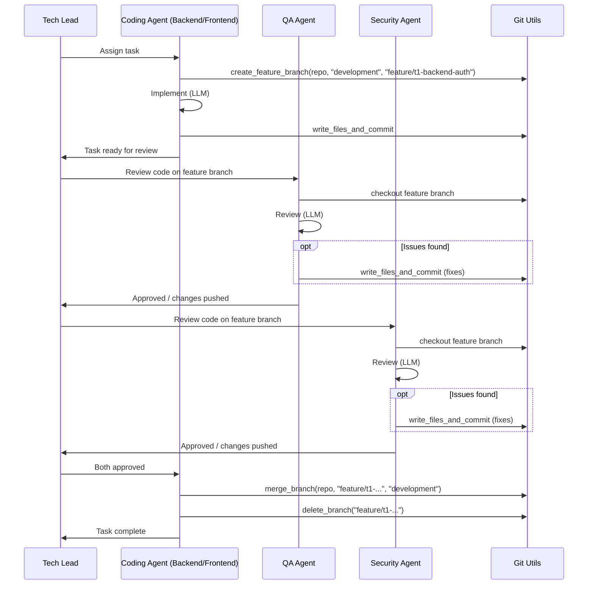

# Tech Lead Orchestration with Feature Branches

## Current State vs. Target State

```mermaid
flowchart TB
    subgraph current [Current Flow]
        A1[API: validate spec] --> A2[Architecture agent]
        A2 --> A3[Tech Lead: assign tasks]
        A3 --> A4[Linear execution: DevOps, Backend, Frontend, Security, QA]
        A4 --> A5[Return response]
    end

    subgraph target [Target Flow]
        B1[API: validate repo, create job] --> B2[Tech Lead: entry point]
        B2 --> B3[Tech Lead: dev branch, read spec, plan, cache tasks]
        B3 --> B4[Tech Lead: request architecture from Architect when needed]
        B4 --> B5[For each task: assign to agent]
        B5 --> B6[Agent: create feature branch, implement, push]
        B6 --> B7{Type?}
        B7 -->|Coding| B8[Ready for review]
        B7 -->|DevOps| B9[Task complete]
        B8 --> B10[QA + Security: review on branch, push fixes]
        B10 --> B11[Both approve?]
        B11 -->|Yes| B12[Agent: merge to dev, delete branch]
        B11 -->|No| B10
        B12 --> B5
        B9 --> B5
    end
```

## Architecture

### 1. Async API

- **POST /run-team** `{ "repo_path": "..." }` → validates repo, creates job, spawns background Tech Lead, returns `{ "job_id": "uuid", "status": "running" }`
- **GET /run-team/{job_id}** → returns `{ "status", "progress", "current_task", "task_results", "error" }`
- Job store: file-based in `.agent_cache/jobs/{job_id}.json` for persistence

### 2. Tech Lead as Orchestrator

Tech Lead becomes the only agent invoked by the API. It:

1. Receives `repo_path` (no pre-parsed spec)
2. Runs `ensure_development_branch(repo_path)` via [shared/git_utils.py](software_engineering_team/shared/git_utils.py)
3. Reads `initial_spec.md` from repo
4. When architecture is needed: calls Architecture agent, gets design
5. Generates task plan (small tasks), saves to task cache
6. Distributes tasks to agents in dependency order
7. Tracks completion and drives the workflow

### 3. Task Cache

New module `shared/task_cache.py` (pattern from [blog_research_agent/agent_cache.py](blogging/blog_research_agent/agent_cache.py)):

- Store: `{ job_id: { tasks: [...], execution_order: [...], status: {...} } }`
- Path: `.agent_cache/jobs/{job_id}.json` or `{repo_path}/.agent_cache/{job_id}.json`
- Tasks include: id, type, assignee, description, status, feature_branch_name, dependencies

### 4. Git Operations

Extend [shared/git_utils.py](software_engineering_team/shared/git_utils.py):

| Function                                                 | Purpose                                   |
| -------------------------------------------------------- | ----------------------------------------- |
| `create_feature_branch(repo_path, base, name)`           | `git checkout -b feature/name` from base  |
| `checkout_branch(repo_path, branch)`                     | `git checkout branch`                     |
| `write_files_and_commit(repo_path, files_dict, message)` | Write files, `git add`, `git commit`      |
| `merge_branch(repo_path, source, target)`                | `git checkout target`, `git merge source` |
| `delete_branch(repo_path, branch)`                       | `git branch -d branch`                    |

### 5. Repository Writer

New module `shared/repo_writer.py`:

- `write_agent_output(repo_path, output, subdir)` – takes BackendOutput/FrontendOutput/DevOpsOutput (code, files dict), writes to repo, commits with `suggested_commit_message`
- Uses git_utils for commit/push

### 6. Per-Task Execution Flow

### 7. DevOps and Non-Coding Tasks

- **DevOps**: Creates feature branch, writes pipeline/IaC/Docker files, commits. No QA/Security review. Merges to development when done.
- **Architecture**: Invoked by Tech Lead when needed; returns design used for subsequent tasks.

### 8. Approval Protocol

- QA and Security return `{ approved: bool, changes_pushed: bool, summary }`
- If `changes_pushed`, the branch has new commits; no re-review for now (or optional: re-run QA/Security after their fixes)
- Coding agent merges only when both QA and Security have `approved: true`

---

## Implementation Plan

### Phase 1: Infrastructure

1. **shared/git_utils.py** – Add `create_feature_branch`, `checkout_branch`, `write_files_and_commit`, `merge_branch`, `delete_branch`
2. **shared/repo_writer.py** – New module to write agent outputs to repo and commit
3. **shared/task_cache.py** – New module for job/task state (file-based, keyed by job_id)
4. **shared/job_store.py** – Job status (pending, running, completed, failed) for async API

### Phase 2: Async API

1. **api/main.py** – Refactor:
  - POST /run-team: validate repo, create job_id, spawn `asyncio.create_task(run_tech_lead_orchestrator(job_id, repo_path))`, return `{ job_id, status }`
  - GET /run-team/{job_id}: read job store, return status and progress
  - Remove pre-loading of spec; Tech Lead handles it

### Phase 3: Tech Lead Orchestrator

1. **New `orchestrator.py**` (or tech_lead_agent/orchestrator.py):
  - `run_orchestrator(job_id, repo_path)` – main loop
  - Ensure dev branch, read spec, parse to requirements
  - Call Architecture agent when needed (e.g. first run or when plan says so)
  - Tech Lead generates plan, saves to task cache
  - For each task in order:
    - Resolve dependencies (wait for dependent tasks if needed)
    - Assign to agent
    - If coding (backend/frontend): feature branch → implement → write → "ready for review" → QA + Security → merge when approved
    - If devops: feature branch → implement → write → merge (no review)
    - If security/qa (standalone task): run as today
  - Update job status when done
2. **tech_lead_agent** – Add method or delegate to orchestrator for "run full pipeline" vs. "plan only"

### Phase 4: Agent Integration with Repo

1. **Backend/Frontend/DevOps agents** – Integrate with repo_writer:
  - Agent produces code/files (unchanged)
  - Orchestrator calls `write_agent_output(repo_path, output, task)` to write and commit on feature branch
2. **QA/Security agents** – Add "push fixes" path:
  - When `fixed_code` differs from input, write to repo and commit (on feature branch)
  - Return `approved: true` when no issues, or `approved: true, changes_pushed: true` when they pushed fixes

### Phase 5: Models and Prompts

1. **Task model** – Add `feature_branch_name`, `status` (pending, in_progress, ready_for_review, approved, merged, failed)
2. **QA/Security output** – Add `approved: bool`, `changes_pushed: bool`
3. **Tech Lead prompt** – Update so Tech Lead knows to request architecture when needed and to drive the feature-branch workflow

---

## Key Files to Create/Modify

| File                                                                                                                                               | Action                                       |
| -------------------------------------------------------------------------------------------------------------------------------------------------- | -------------------------------------------- |
| [shared/git_utils.py](software_engineering_team/shared/git_utils.py)                                                                               | Add branch/create/merge/delete, write+commit |
| [shared/repo_writer.py](software_engineering_team/shared/repo_writer.py)                                                                           | New                                          |
| [shared/task_cache.py](software_engineering_team/shared/task_cache.py)                                                                             | New                                          |
| [shared/job_store.py](software_engineering_team/shared/job_store.py)                                                                               | New                                          |
| [api/main.py](software_engineering_team/api/main.py)                                                                                               | Refactor to async, job-based                 |
| [orchestrator.py](software_engineering_team/orchestrator.py) or tech_lead_agent/                                                                   | New orchestration loop                       |
| [qa_agent/models.py](software_engineering_team/qa_agent/models.py), [security_agent/models.py](software_engineering_team/security_agent/models.py) | Add approved, changes_pushed                 |

---

## Open Design Choices

1. **Feature branch naming**: `feature/{task_id}-{slug}` e.g. `feature/t3-backend-auth`
2. **Re-review after QA/Security push**: Option A) merge after first approvals; Option B) re-run QA/Security after their fixes. Recommendation: A for simplicity; B if stricter.
3. **Concurrent tasks**: Backend and Frontend can run in parallel if no dependencies. Orchestrator can spawn parallel tasks when possible.

