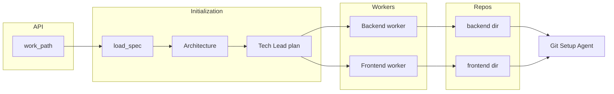

# Work folder, Git Setup Agent, repo-scoped docs/QA/security, and parallel execution

## Current state

- **API** (`[software_engineering_team/api/main.py](software_engineering_team/api/main.py)`): Accepts `repo_path`; `[validate_repo_path](software_engineering_team/spec_parser.py)` requires path to be a **git repo** and to contain `initial_spec.md`.
- **Orchestrator** (`[software_engineering_team/orchestrator.py](software_engineering_team/orchestrator.py)`): Single `path` (monorepo); `ensure_development_branch(path)` at start; backend uses `path/backend`, frontend uses `path/frontend`; one task at a time globally; doc/QA/security all use the same `path`.
- **Tech Lead** (`[software_lead_agent/prompts.py](software_engineering_team/tech_lead_agent/prompts.py)`): Prompts say "only ONE coding agent works at a time" and interleave backend/frontend in `execution_order`.
- **Documentation** (`[software_engineering_team/documentation_agent/agent.py](software_engineering_team/documentation_agent/agent.py)`): `run_full_workflow(repo_path)` expects a monorepo with `backend/`, `frontend/`, `devops/` and writes root + subdir READMEs and CONTRIBUTORS.
- **Backend/Frontend init** (`[software_engineering_team/shared/command_runner.py](software_engineering_team/shared/command_runner.py)`): `ensure_backend_project_initialized(backend_dir)` and `ensure_frontend_project_initialized(frontend_dir)` create the directory and scaffold if missing.

## Target model

- **Work path**: API accepts a **folder path** where work is saved. Path must exist, be a directory, and contain `initial_spec.md`. It does **not** need to be a git repository.
- **Two git repos**: `work_path/backend` and `work_path/frontend` are each initialized as their **own** git repo by a new Git Setup Agent. DevOps continues to write to `work_path/devops` (no separate git repo unless you add it later).
- **Parallel execution**: Backend and frontend tasks run **simultaneously**, with at most **one** backend task and **one** frontend task at a time (two concurrent “streams,” each single-threaded).

---

## 1. API: accept work folder (no git required)

- **Spec / validation**
  - In `[spec_parser.py](software_engineering_team/spec_parser.py)`: Add `validate_work_path(work_path)` that checks path exists, is a directory, and has `initial_spec.md`. Do **not** require `.git`.
  - Keep `load_spec_from_repo` (or rename to `load_spec_from_path`) to read `initial_spec.md` from that path; it already only reads a file.
- **API**
  - In `[api/main.py](software_engineering_team/api/main.py)`: Use `validate_work_path` instead of `validate_repo_path`. Request body can stay `repo_path` for backward compatibility or be renamed to `work_path`; description should state that the path is a **folder** and does not need to be a git repository.

---

## 2. New Git Setup Agent

- **Role**: Takes a path and turns it into a new git repo with standard layout and first commit.
- **Location**: New module, e.g. `software_engineering_team/git_setup_agent/` with `agent.py`, `models.py` (optional; input can be a single path).
- **Behavior** (no LLM required; deterministic steps):
  1. `git init` at the given path.
  2. Add `.gitignore` at root (e.g. Python + Node + IDE entries; can be a constant string in code or a small template).
  3. Add empty `README.md` and `CONTRIBUTORS.md` at root.
  4. Create initial commit (e.g. message: "Initial commit").
  5. Rename default branch from `master` to `main` (e.g. `git branch -m master main` if exists).
  6. Create branch `development` and switch to it.
- **Interface**: e.g. `run(path: str | Path) -> GitSetupResult(success: bool, message: str)`. Idempotency: if path is already a git repo, either no-op or ensure `development` exists and checkout (reuse logic similar to `[shared/git_utils.py](software_engineering_team/shared/git_utils.py)` `ensure_development_branch`).
- **Reuse**: Use `[shared/git_utils.py](software_engineering_team/shared/git_utils.py)` `_run_git` (or equivalent) for all git commands; add a small helper like `initialize_new_repo(path)` if useful.

---

## 3. Backend and frontend: call Git Setup Agent

- **When**: Before the **first** backend task runs, ensure `work_path/backend` exists (via existing `ensure_backend_project_initialized`), then if `work_path/backend` is **not** a git repo, call the Git Setup Agent for `work_path/backend`. Same for frontend: before the first frontend task, ensure `work_path/frontend` exists, then run Git Setup Agent on `work_path/frontend` if it has no `.git`.
- **Where**:
  - **Orchestrator**: When handling the first backend task, after `ensure_backend_project_initialized(backend_dir)`, call `git_setup_agent.run(backend_dir)` (or equivalent); similarly for the first frontend task with `frontend_dir`. Track “already initialized” per dir (e.g. by presence of `.git`) to avoid re-running.
  - **Backend agent** (`[backend_agent/agent.py](software_engineering_team/backend_agent/agent.py)`): Receives `repo_path` from orchestrator; orchestrator will pass `work_path/backend` once that dir is git-initialized. No change needed inside backend agent except that `repo_path` will now point to the backend repo only.
  - **Frontend**: Orchestrator passes `work_path/frontend` as the repo path for frontend tasks (and uses it for branches, merge, etc.).
- **Remove** the current global `ensure_development_branch(path)` at orchestrator start (path is no longer a single repo). Instead, development branch is ensured per repo when that repo is first used (after Git Setup Agent runs).

---

## 4. Documentation agent: update README/CONTRIBUTORS in the right repo

- **Rule**: When a **backend** task completes, Tech Lead triggers the Documentation Agent for the **backend repo** (`work_path/backend`). When a **frontend** task completes, trigger for the **frontend repo** (`work_path/frontend`). Same for task summary and codebase context: use the repo that was worked on.
- **Orchestrator**:
  - When calling `_run_tech_lead_review(..., doc_agent=...)` after a backend task, pass `repo_path=backend_dir` (and codebase for backend repo). After a frontend task, pass `repo_path=frontend_dir` (and codebase for frontend repo).
- **Tech Lead** (`[tech_lead_agent/agent.py](software_engineering_team/tech_lead_agent/agent.py)`): `trigger_documentation_update` already receives `repo_path` from the caller; no signature change needed. Caller (orchestrator or backend workflow) must pass the **appropriate** repo path (backend_dir or frontend_dir).
- **Backend workflow** (`[backend_agent/agent.py](software_engineering_team/backend_agent/agent.py)`): It already calls `tech_lead.trigger_documentation_update(..., repo_path=repo_path)`. Once orchestrator passes `repo_path=backend_dir` into `run_workflow`, this will automatically target the backend repo.
- **Documentation agent** (`[documentation_agent/agent.py](software_engineering_team/documentation_agent/agent.py)`): `run_full_workflow` currently assumes a monorepo (root + `frontend/`, `backend/`, `devops/`). When `repo_path` is the backend or frontend repo root, there are no such subdirs. So when invoking for “backend repo” or “frontend repo,” pass `has_frontend_folder=False`, `has_backend_folder=False`, `has_devops_folder=False` (or true only for the repo being updated) and only write root `README.md` and `CONTRIBUTORS.md`. The existing logic that writes only when the corresponding `has_*_folder` is true and content changed will work; ensure the caller sets these flags from the **single-repo** context (e.g. backend repo → only root README + CONTRIBUTORS).

---

## 5. QA agent: review the correct repo

- **Rule**: When QA is triggered by the **backend** (in backend workflow), QA should review the backend repo; when triggered by the **frontend** (in orchestrator), QA should review the frontend repo.
- **Current behavior**: Backend workflow already runs QA with code from its `repo_path` (which will be `backend_dir`). Orchestrator runs QA for frontend with `_read_repo_code(path, [".ts", ...])` (monorepo).
- **Change**: In the orchestrator, for the **frontend** task branch, pass code from the **frontend repo** only: e.g. `_read_repo_code(frontend_dir, [".ts", ".tsx", ".html", ".scss"])` when building QA input. No change to QA agent model (it still receives `code` + task); the caller supplies the correct code from the repo that was worked on. Similarly, ensure backend workflow keeps using its own `repo_path` for reading code for QA (already the case).

---

## 6–8. Tech Lead: parallel backend/frontend, one task per agent at a time

- **Requirements**: Distribute backend and frontend tasks **simultaneously** (parallel). Send **at most one** task at a time to the frontend agent and **at most one** to the backend agent.
- **Execution model**:
  - Keep initial phase sequential: e.g. load spec, architecture, Tech Lead plan, and run **devops** and **git_setup** tasks (if any) in order on the **work path** (devops writes to `work_path/devops`; git_setup can be deprecated or repurposed since we now have a Git Setup Agent per backend/frontend dir).
  - Split the execution queue into **backend** and **frontend** task lists (and optionally a “prefix” list for devops/git_setup). Then run **two concurrent streams**: one thread (or async task) consumes the backend list one task at a time; another consumes the frontend list one task at a time. So at any moment at most one backend and one frontend task are running.
- **Implementation**:
  - In `[orchestrator.py](software_engineering_team/orchestrator.py)`: After building `assignment.execution_order` and `all_tasks`, partition by `task.assignee` into `backend_queue`, `frontend_queue`, and a `prefix_queue` (devops, git_setup). Run prefix_queue sequentially. Then start two workers (e.g. `threading.Thread` or `concurrent.futures`) that each process their queue one-by-one. Each worker, when it starts a task: ensures the repo exists and is git-initialized (Git Setup Agent if needed), creates feature branch on **that** repo (backend_dir or frontend_dir), runs the agent, merges, runs QA and doc for **that** repo, updates shared state (completed, failed, and any new fix tasks) under a lock. Fix tasks added by Tech Lead/QA should be pushed to the correct queue (backend fix → backend_queue, frontend fix → frontend_queue).
  - **Tech Lead prompts** (`[tech_lead_agent/prompts.py](software_engineering_team/tech_lead_agent/prompts.py)`): Update wording from “only ONE coding agent works at a time” and “interleave in execution_order” to: backend and frontend can run **in parallel**; execution_order should still list all tasks in a sensible dependency order, but the orchestrator will split by assignee and run backend and frontend streams concurrently, each processing one task at a time. So the Tech Lead can still output an interleaved execution_order for dependencies; the orchestrator will use it to build backend_queue and frontend_queue (e.g. by filtering by assignee while preserving relative order per assignee).

---

## 9. Security agent: review the correct repo

- **Rule**: When security runs in response to backend work, review the **backend repo**; when in response to frontend work, review the **frontend repo**.
- **Current behavior**: Security runs once at the end (`[orchestrator.py](software_engineering_team/orchestrator.py)`) when Tech Lead decides “90%+ of spec covered,” with `_read_repo_code(path)` and language `"python"`.
- **Change**: Run security **twice** when the condition is met (or run once per repo when that repo’s stream reaches a similar threshold): once for the **backend repo** with `_read_repo_code(backend_dir)` and language `"python"`, and once for the **frontend repo** with `_read_repo_code(frontend_dir)` and language `"typescript"`. Pass the appropriate repo path and language into `SecurityInput`. If you need to avoid duplicate “full codebase” reviews, you can gate each run on “this repo has completed tasks” (e.g. at least one completed backend task for backend security run, and at least one completed frontend task for frontend security run).

---

## Data flow summary

- **Job store**: Continue to store the work path (e.g. as `repo_path` or `work_path`) so retries and status still have a single root path; backend and frontend paths are derived as `{work_path}/backend` and `{work_path}/frontend`.

---

## File-level checklist

| Area              | Files to touch                                                                                                                                                                                                                                                                |
| ----------------- | ----------------------------------------------------------------------------------------------------------------------------------------------------------------------------------------------------------------------------------------------------------------------------- |
| API / validation  | `[api/main.py](software_engineering_team/api/main.py)`, `[spec_parser.py](software_engineering_team/spec_parser.py)`                                                                                                                                                          |
| Git Setup Agent   | New `git_setup_agent/` (e.g. `agent.py`, optional `models.py`); possibly `[shared/git_utils.py](software_engineering_team/shared/git_utils.py)` for helpers                                                                                                                   |
| Orchestrator      | `[orchestrator.py](software_engineering_team/orchestrator.py)`: work path vs backend/frontend paths, Git Setup calls, parallel backend/frontend workers, per-repo QA/doc/security, remove global `ensure_development_branch(path)`                                            |
| Tech Lead         | `[tech_lead_agent/prompts.py](software_engineering_team/tech_lead_agent/prompts.py)`: parallel execution wording; `[tech_lead_agent/agent.py](software_engineering_team/tech_lead_agent/agent.py)` only if signature of `trigger_documentation_update` or review flow changes |
| Documentation     | `[documentation_agent/agent.py](software_engineering_team/documentation_agent/agent.py)`: ensure single-repo mode (root README + CONTRIBUTORS only) when `repo_path` is backend or frontend root; callers set `has_*_folder` accordingly                                      |
| Backend agent     | `[backend_agent/agent.py](software_engineering_team/backend_agent/agent.py)`: ensure doc trigger uses `repo_path` (orchestrator will pass backend_dir)                                                                                                                        |
| Retry / job store | `[orchestrator.py](software_engineering_team/orchestrator.py)` `run_failed_tasks`: derive backend_dir and frontend_dir from stored work path; run Git Setup if needed and route tasks to the correct repo/worker                                                              |

---

## Risks and notes

- **DevOps**: Still writes to `work_path/devops`. No git repo there unless you add a separate requirement later. If devops needs a repo, the same Git Setup Agent can be run on `work_path/devops`.
- **git_setup task**: Tech Lead currently emits a `git_setup` task. You can either keep it as a no-op (orchestrator “completes” it immediately) or remove it from the prompt and rely entirely on the Git Setup Agent when backend/frontend dirs are first used.
- **Concurrency**: Use a lock when updating `completed`, `failed`, `all_tasks`, and when appending fix tasks to backend_queue/frontend_queue so both workers stay consistent.
- **Tests**: Update API tests that expect `repo_path` to be a git repo; add tests for Git Setup Agent and for parallel execution (e.g. two tasks completing in different order).

