# Architecture

This document describes the architecture of the Software Engineering Team — a multi-agent system that takes a product specification and produces a fully implemented, tested, and documented codebase. The diagrams below cover system entry points, the end-to-end pipeline, every agent and its role, execution mechanics, and sub-team orchestration.

## Table of Contents

- [1. System Context and Entry Points](#1-system-context-and-entry-points)
  - [Temporal (durable execution)](#temporal-durable-execution)
- [2. End-to-End Pipeline](#2-end-to-end-pipeline)
- [3. Agent Registry and Roles](#3-agent-registry-and-roles)
- [4. Task Execution Model](#4-task-execution-model)
- [5. Backend Worker Workflow](#5-backend-worker-workflow)
- [5b. Backend-Code-V2 Team Workflow](#5b-backend-code-v2-team-workflow)
- [5c. Frontend-Code-V2 Team Workflow](#5c-frontend-code-v2-team-workflow)
- [6. Frontend Worker Workflow](#6-frontend-worker-workflow)
- [7. Frontend Team Full Pipeline](#7-frontend-team-full-pipeline)
- [8. DevOps Team Pipeline](#8-devops-team-pipeline)
- [9. Planning Loop](#9-planning-loop)
- [10. Plan Folder and Artifacts](#10-plan-folder-and-artifacts)
- [11. Repo Layout](#11-repo-layout)

---

## 1. System Context and Entry Points

Users invoke the system through either a FastAPI HTTP API or a CLI script. When Temporal is not configured, the API starts `run_orchestrator` in a background thread; when `TEMPORAL_ADDRESS` is set, it starts a Temporal workflow that runs the same logic via activities. The orchestrator reads `initial_spec.md` from the provided work path and writes planning artifacts to `plan/`, backend code to `backend/`, and frontend code to `frontend/`.

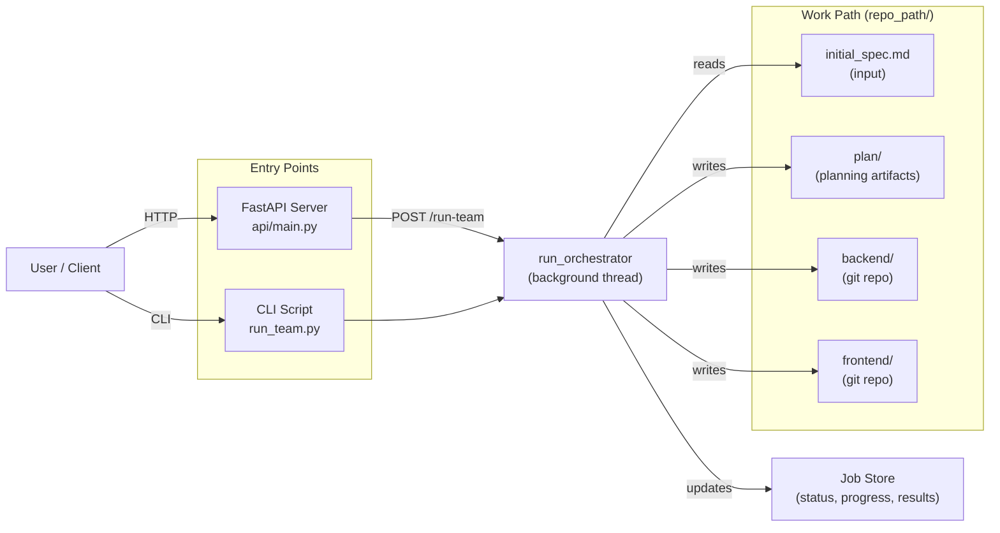

The API also exposes `GET /run-team/{job_id}` for polling job status, `POST /run-team/{job_id}/retry-failed` for retrying failed tasks, and clarification endpoints for interactive spec refinement.

### Temporal (durable execution)

When `TEMPORAL_ADDRESS` is set (e.g. in Docker), the SE team uses **Temporal** instead of background threads:

- **Workflows**: `RunTeamWorkflow`, `RetryFailedWorkflow`, `StandaloneJobWorkflow` (for frontend-code-v2, backend-code-v2, planning-v2, product-analysis).
- **Activities**: Each workflow runs activities that call the same logic as the former thread targets (`run_orchestrator`, `run_failed_tasks`, and the standalone runners). Activities update the **job store** so the API and UI continue to poll status from the store.
- **Worker**: A Temporal worker runs in-process (started from the unified API lifespan or when the SE API runs standalone), using task queue `software-engineering` (override with `TEMPORAL_TASK_QUEUE`).
- **Resilience**: Progress is durable in Temporal; after a server restart, the worker reconnects and in-progress workflows continue. **Resume** is allowed for `failed` jobs as well as `pending`, `running`, and `agent_crash`, so jobs marked failed (e.g. by the stale-heartbeat monitor) can be resumed via `POST /run-team/{job_id}/resume`.
- **Env**: `TEMPORAL_ADDRESS` (required for Temporal), optional `TEMPORAL_NAMESPACE` (default `default`), `TEMPORAL_TASK_QUEUE` (default `software-engineering`). When `TEMPORAL_ADDRESS` is unset, the API falls back to thread-based execution for local development.

---

## 2. End-to-End Pipeline

A single run goes through four major phases: Discovery, Design, Execution, and Integration. The orchestrator (`orchestrator.py`) drives this pipeline sequentially. Planning is handled by **planning_v2_team** (6-phase workflow); its output is adapted by **planning_v2_adapter** for Tech Lead and Architecture Expert.

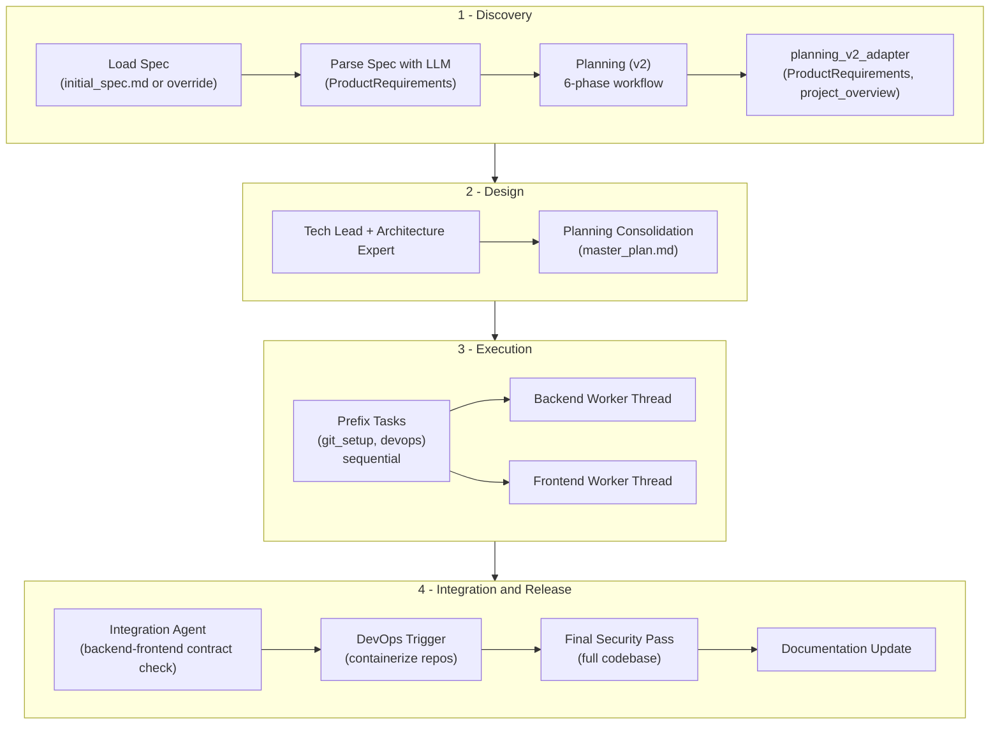

Each phase produces artifacts that feed the next. Planning artifacts are written to `plan/`. Backend and frontend workers operate on separate git repositories under the work path.

---

## 3. Agent Registry and Roles

The orchestrator instantiates agents via `_get_agents()`. The main pipeline uses **planning_v2_team** (PlanningV2TeamLead) for discovery/planning, with **planning_v2_adapter** mapping its result to ProductRequirements and project_overview for Tech Lead and Architecture. Legacy planning_team agents (Spec Intake, Project Planning, domain planning) are not in the main flow; clarification sessions still use Spec Intake.

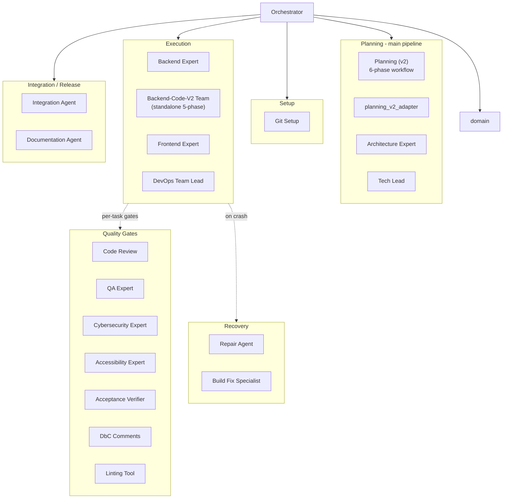

Quality gate agents (code review, QA, security, accessibility, acceptance verifier, DbC, linting) are not task assignees — they are invoked inside backend and frontend workflows for every task. The repair agent and build fix specialist handle agent crashes and persistent build failures respectively.

---

## 4. Task Execution Model

After planning, the Tech Lead produces a `TaskAssignment` with an ordered list of tasks. The orchestrator partitions tasks by assignee into three queues, then runs them in the sequence shown below. Tasks with dependency edges (`blocks`/`blocked_by`) are scheduled so blocked tasks wait until their prerequisites complete.

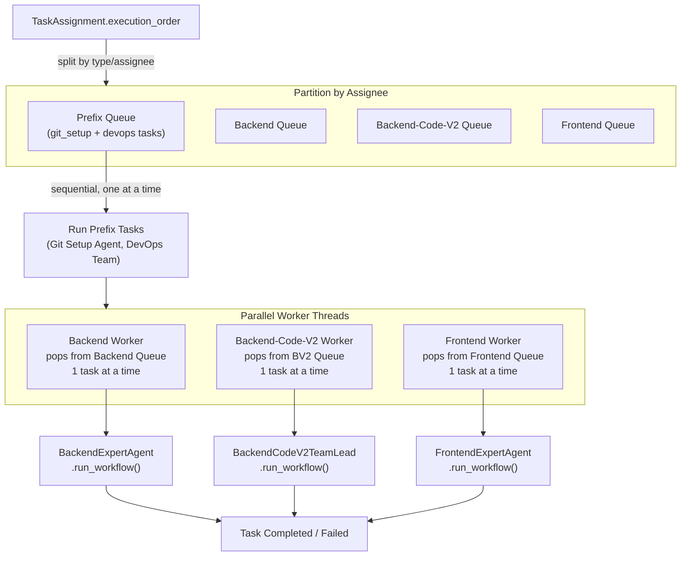

Backend and frontend workers run as concurrent threads (`threading.Thread`). Each worker processes one task at a time from its queue. On task failure, the orchestrator may attempt repair (agent crash) or contract repair (incomplete task metadata) before re-queuing.

---

## 5. Backend Worker Workflow

Each backend task follows this pipeline inside `BackendExpertAgent.run_workflow`. The orchestrator creates a feature branch, runs the workflow, and merges to `development` on success.

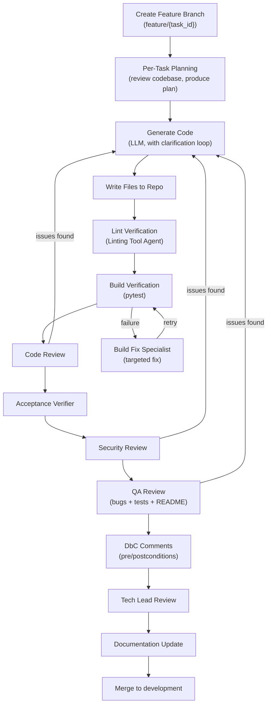

On agent crash, the Repair Agent analyzes the traceback and applies fixes. If the task contract is incomplete (missing required fields like goal, scope, constraints), the orchestrator invokes contract repair via the planning agents and `tech_lead.refine_task`, then re-queues the task.

---

## 5b. Backend-Code-V2 Team Workflow

The **backend-code-v2** agent team is a standalone, experimental backend development team that operates independently from `BackendExpertAgent`. It uses a **three-layer architecture**: a Backend Tech Lead Agent runs Setup then delegates to a Backend Development Agent, which runs the 5-phase cycle and consults **tool agents in every phase**. No code from `backend_agent/` is imported or reused.

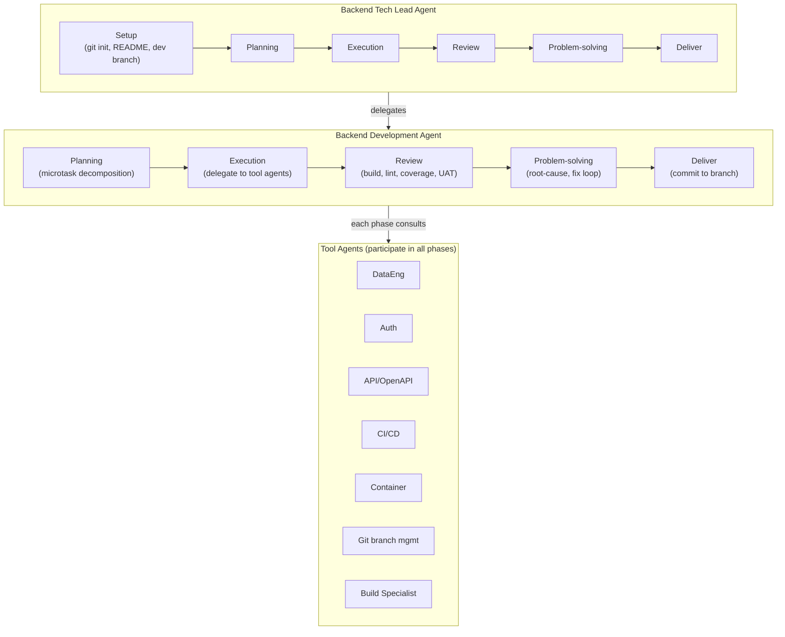

- **Layer 1 — Backend Tech Lead Agent**: Runs the **Setup** phase (git init if needed, README with project title, rename master→main, create `development` branch), then delegates the 5-phase development cycle to the Backend Development Agent.
- **Layer 2 — Backend Development Agent**: Owns Planning (microtask decomposition, language detection), Execution (tool agents + LLM fallback), Review (build, lint, QA, security, code review), Problem-solving (fix loop), and Deliver (feature branch, commit, merge to `development`). The review/fix loop runs up to 5 iterations.
- **Layer 3 — Tool agents**: Data Engineering, API/OpenAPI, Auth, CI/CD, Containerization, **Git branch management**, and **Build Specialist** agents each implement `plan()`, `execute()`, `review()`, `problem_solve()`, and `deliver()`, so they participate in every phase. The **Git branch management** agent creates a feature branch off `development` at the start of Execution, commits changes after each iteration ("commit along the way"), and in Deliver merges the feature branch back into `development`. The **Build Specialist** (stub) is intended to assist when the project doesn't build; it can be wired to the existing build verifier or a dedicated build-fix flow.

The team supports both Python and Java (auto-detected). Quality gate agents (QA, Security, Code Review) are passed in by the main orchestrator and invoked during Review.

**API endpoints:**
- `POST /backend-code-v2/run` — Submit a task and repo path; starts Setup then the 5-phase workflow in a background thread.
- `GET /backend-code-v2/status/{job_id}` — Returns current phase (including `setup`), completed phases, progress percentage, and microtask status.

---

## 5c. Frontend-Code-V2 Team Workflow

The **frontend-code-v2** agent team is a standalone, experimental frontend development team that does **not** import or reuse any code from `frontend_team/` or `feature_agent/`. It mirrors the backend-code-v2 **three-layer architecture**: a Frontend Tech Lead Agent runs Setup then delegates to a Frontend Development Agent, which runs the 5-phase cycle and consults **tool agents in every phase**.

- **Layer 1 — Frontend Tech Lead Agent**: Runs **Setup** (git init if needed, README, development branch), then delegates the 5-phase cycle to the Frontend Development Agent.
- **Layer 2 — Frontend Development Agent**: Planning (microtask decomposition; stack inferred as Angular/React/TypeScript/JavaScript), Execution (tool agents + LLM fallback), Review (build, lint, QA, security, code review), Problem-solving (fix loop), Deliver (feature branch, commit, merge to `development`). Review/fix loop runs up to 5 iterations.
- **Layer 3 — Tool agents**: State Management, Auth, API/OpenAPI, CI/CD, Containerization, Documentation, Testing/QA, Security, **Git branch management**, UI Design, Branding/Theme, UX/Usability, Accessibility, **Build Specialist**, Linter. Each participates in plan, execute, review, problem_solve, and deliver. Git branch management creates a feature branch off `development`, commits along the way, and merges in Deliver.

**API endpoints:**
- `POST /frontend-code-v2/run` — Submit a task and repo path; starts Setup then the 6-phase workflow (setup + 5-phase cycle) in a background thread.
- `GET /frontend-code-v2/status/{job_id}` — Returns current phase (including `setup`), completed phases, progress percentage, and microtask status.

The Software Engineering UI dashboard includes a **Frontend Developer (v2)** tab with a run form and job-status panel; the main orchestrator supports assignee **frontend-code-v2** (task_parsing and a dedicated frontend_code_v2_queue + worker).

---

## 6. Frontend Worker Workflow

The frontend per-task workflow is structurally similar to backend, with the addition of an accessibility gate and `ng build` for build verification.

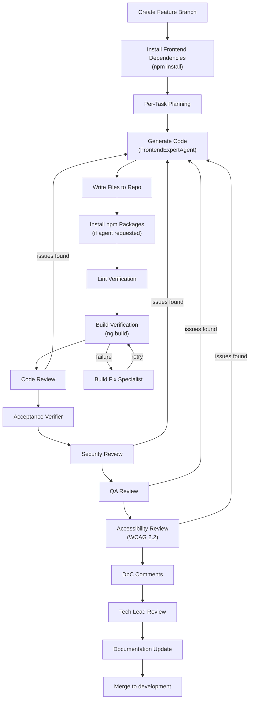

The same crash recovery (Repair Agent) and contract repair mechanisms apply as in the backend workflow.

---

## 7. Frontend Team Full Pipeline

The `FrontendOrchestratorAgent` provides an extended pipeline that wraps `FrontendExpertAgent` with a full design phase. This pipeline runs UX, UI, and design system agents before implementation. The main orchestrator currently uses `FrontendExpertAgent` directly; this diagram documents the alternative full-team pipeline available via `FrontendOrchestratorAgent`.

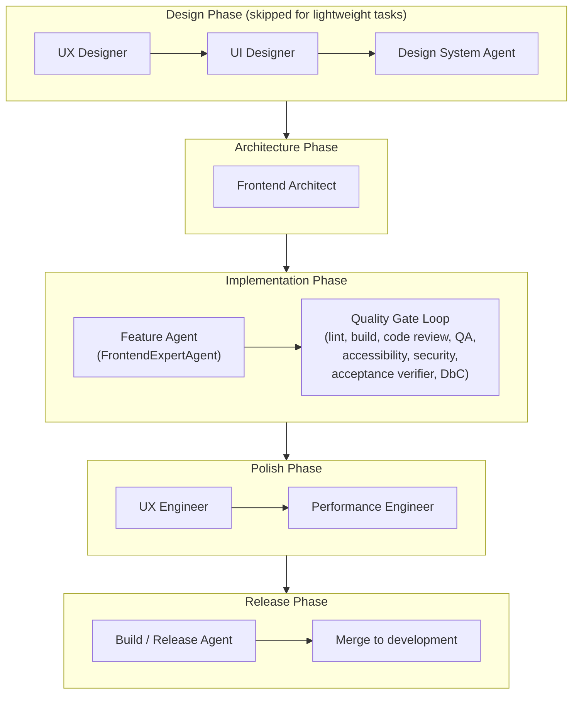

The design phase produces UX wireframes, UI specifications, and design system tokens that feed into the Frontend Architect's component structure, which in turn enriches the implementation context for the Feature Agent. Lightweight tasks (fixes, patches, small updates) skip the design phase entirely.

---

## 8. DevOps Team Pipeline

The `DevOpsTeamLeadAgent` orchestrates a contract-first, multi-agent DevOps pipeline with hard gates. It replaces the legacy monolithic `devops_agent/` with role-separated agents and independent review gates.

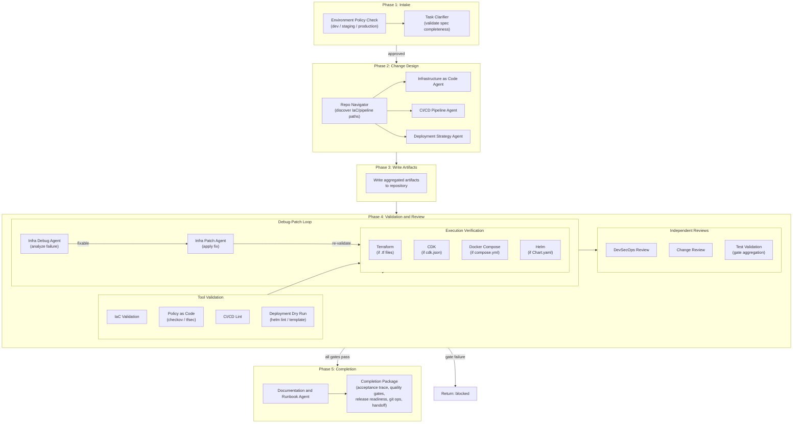

Hard gates that must pass: `iac_validate`, `iac_validate_fmt`, `policy_checks`, `pipeline_lint`, `pipeline_gate_check`, `deployment_dry_run`, `security_review`, `change_review`. The environment policy matrix enforces stricter requirements for production (approval required, rollback test required, high policy strictness) versus dev (auto-deploy allowed, no approval, low strictness).

---

## 9. Planning Loop

The Tech Lead and Architecture Expert run after **Planning (v2)** and **planning_v2_adapter** produce ProductRequirements and project_overview. An optional planning cache short-circuits when the spec, architecture, and project overview are unchanged from a previous run.

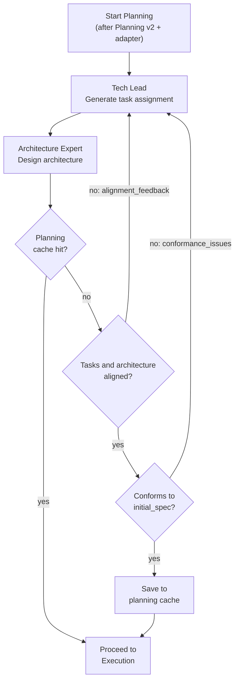

The alignment inner loop runs up to `SW_MAX_ALIGNMENT_ITERATIONS` (default 20) and the conformance outer loop runs up to `SW_MAX_CONFORMANCE_RETRIES` (default 20). Early exit thresholds allow proceeding when only minor non-critical issues remain. During alignment re-runs, both the Tech Lead and Architecture Expert are re-invoked with the feedback from the previous iteration.

---

## 10. Plan Folder and Artifacts

Planning (v2) writes to `planning_v2/` under the repo path. The rest of planning outputs are written to `plan/` at the work path root.

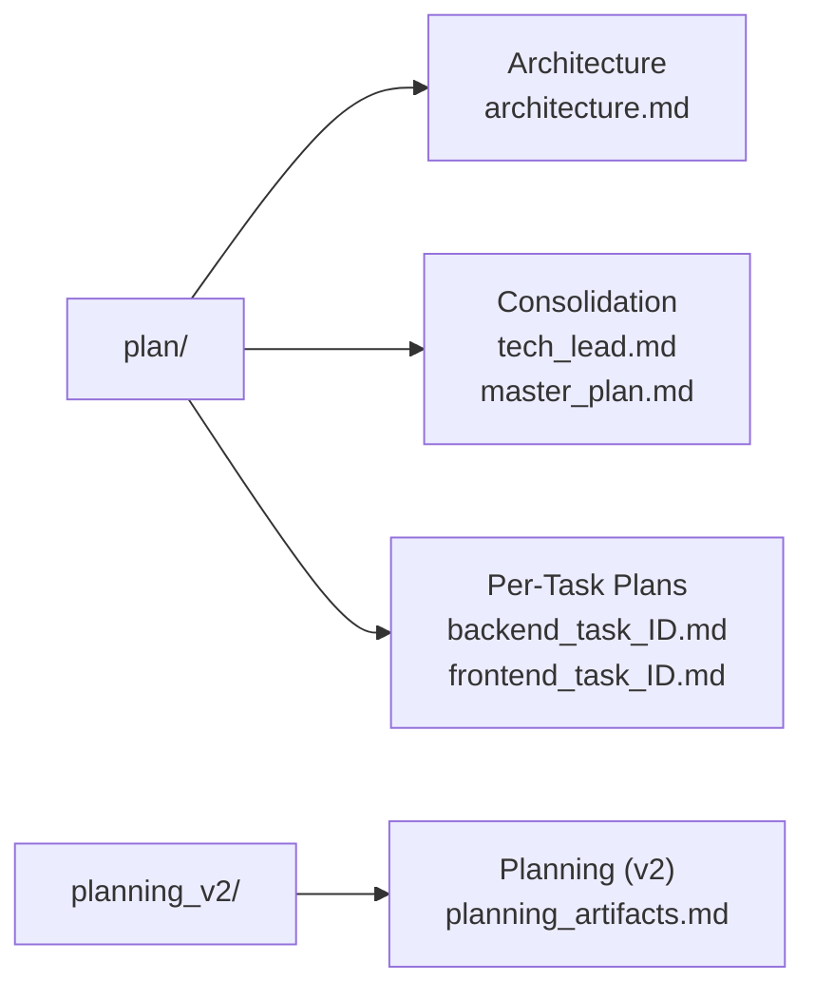

The `master_plan.md` consolidation includes a risk register and ship checklist.

---

## 11. Repo Layout

The repository contains two independent agent systems. The software engineering team is the primary system documented above; a separate blogging agent system exists under `agents/blogging/`.

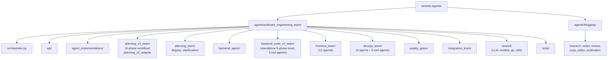

Each agent directory follows a consistent structure: `agent.py` (core logic), `models.py` (Pydantic input/output contracts), and `prompts.py` (LLM prompt templates). Shared utilities (LLM client, git operations, repo I/O, logging) live in `shared/`.
