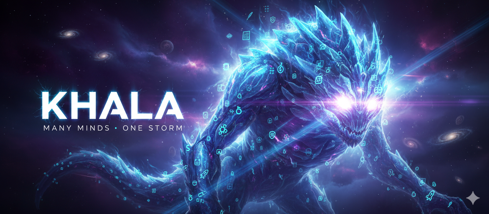
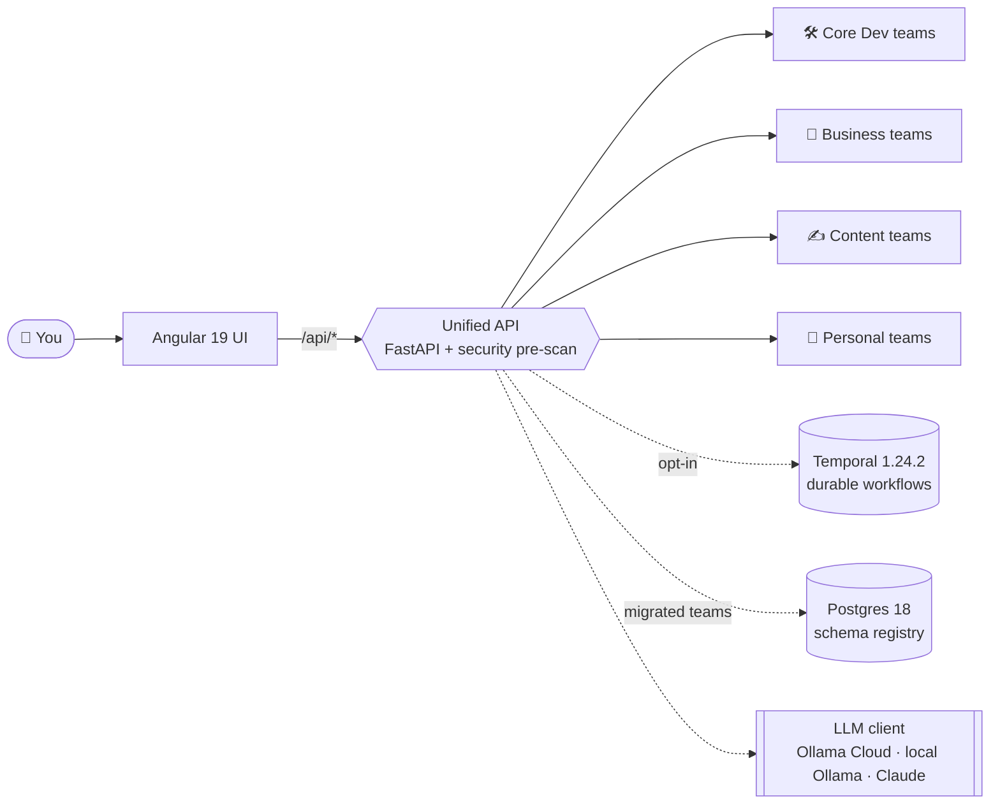

<p align="center">
  
</p>

<h1 align="center">Khala</h1>

<p align="center">
  <em>Many teams. One mind. One objective. Yours.</em><br/>
  <sub>A personal project for building agentic AI teams that actually work together — and, eventually, build themselves</sub>
</p>

<p align="center">
  <strong>🌐 <a href="https://deepthought42.github.io/Khala-Agentic-AI-Teams/">Live site</a></strong> · <strong>📖 You're reading the README</strong>
</p>

<p align="center">
  
  
  
  
  
  
  
</p>

---

## You don't need a team. You need a Khala.

**You don't *point* Khala at a problem. You work with it.**

Under the hood, Khala is a FastAPI gateway that mounts role-separated specialist teams under `/api/<team>` — each one a team-lead agent coordinating specialists over Pydantic contracts. But the point isn't the wiring. The point is that every team plugs into the same shared mind, so you can bring them in on whatever you're working on:

- **Work with Khala to turn a spec into shipped code** → the Software Engineering team runs Discovery → Design → Execution → Integration alongside you: planning, code + tests + docs in parallel backend/frontend queues, merging to a `development` branch when the quality gates pass.
- **Work with it on a market** → Market Research pairs with you on user discovery and concept viability; Planning V3 turns the conversation into a PRD the dev teams can run with.
- **Work with it on a launch** → Blogging (research → planning → draft → copy-edit → gates) writes with you; Social Marketing builds per-platform campaigns with you; the Sales team runs B2B prospecting, qualification, and close with you.
- **Work with it on compliance** → SOC2 Compliance drives the audit workflow; Accessibility Audit reports WCAG 2.2 / Section 508 findings for web and mobile.
- **Work with it on a portfolio** → the Investment team pairs a Financial Advisor (IPS, proposals, memos) with a Strategy Lab (ideation, backtests) behind one API prefix.
- **Work with it on an ambiguous problem** → **Deepthought** recursively spawns the specialist sub-agents it needs to decompose and answer the question with you.

The teams share infrastructure — the gateway with its optional security pre-scan, a shared Postgres schema registry for migrated teams, a shared artifact cache, and a pluggable LLM client (Ollama Cloud, local Ollama, or Claude). Set `TEMPORAL_ADDRESS` and the teams that export Temporal workflows switch from in-process threads to durable executions that survive restarts; teams without workflows keep using threads.

**And Khala is built to grow its own roster.** The real project here isn't the current 20 teams — it's the system that *makes* agentic teams and lets them operate as one mind. Describe a new team in plain English to the **Agentic Team Provisioning** team and it will design the roster and the process with you (and hand off to Agent Provisioning for the sandbox), or register one yourself in [`backend/unified_api/config.py`](backend/unified_api/config.py). Every lesson learned building the current teams feeds back into how the next ones get built.

> **Many teams. One mind. One objective. Yours.**

### What Khala actually is

A personal project to figure out how to build agentic AI teams that actually work together. The honest arc: a vibe-coded experiment turning into a real engineered system, and from there into the thing I'm really after — **an agentic AI that can look at a problem, decide what kind of team would solve it, spin up ephemeral specialist agents to do the work, learn from what landed and what didn't, and keep the agents that earn their keep.** The 20 teams here today are the substrate for that learning, not the destination. Follow along.

<p align="center">
  <a href="https://deepthought42.github.io/Khala-Agentic-AI-Teams/">🌐 Live site</a> ·
  <a href="#quickstart">🚀 Quickstart</a> ·
  <a href="ARCHITECTURE.md">📐 Architecture</a> ·
  <a href="#meet-the-current-roster">👥 Meet the roster</a> ·
  <a href="#add-your-own-team">🧬 Add your own team</a>
</p>

<sub>*(Named after the Protoss unifying religion from StarCraft — a psionic link joining many minds into one.)*</sub>

---

## Why Khala?

- **🌩️ One gateway, one mind** — every team mounts under `/api/<team-slug>` behind a single FastAPI server (with an optional security pre-scan, `SECURITY_GATEWAY_ENABLED`, on by default), so the whole roster is addressable — and collaborates — as one.
- **⚡ Opt-in durability** — set `TEMPORAL_ADDRESS` and teams that ship Temporal workflows switch from in-process threads to durable executions that survive server restarts (Temporal 1.24.2). Other teams keep running as background threads.
- **🧠 Bring your own LLM** — unified client for Ollama Cloud, local Ollama, or Claude via `LLM_PROVIDER` / `LLM_BASE_URL` / `LLM_MODEL`. A few teams expose per-role overrides (e.g. `ARCHITECT_MODEL_SPECIALIST`, `BLOG_PLANNING_MODEL`).
- **🏗️ Real engineering inside the SE team** — 4-phase pipeline (Discovery → Design → Execution → Integration), parallel backend/frontend worker queues, a planning cache that short-circuits re-plans when spec/architecture/overview are unchanged, per-task quality gates (lint, build, code review, acceptance verifier, security, QA, DbC, tech-lead review — plus an accessibility gate on frontend tasks), and a Repair Agent for crash recovery.
- **📊 Observability built in** — every FastAPI service in the Docker stack is auto-instrumented by `prometheus-fastapi-instrumentator`; Prometheus + a provisioned Grafana dashboard ship in `docker-compose.yml`.
- **🧬 Built to grow its own roster** — new teams aren't a plugin afterthought; they're the product. Design one by conversation with Agentic Team Provisioning, or register it yourself in `TEAM_CONFIGS` and it mounts at `/api/<slug>` on restart.
- **🚀 One command to launch the stack** — `docker compose up --build` brings up Postgres, Temporal, every team microservice, the Unified API proxy, the Angular UI, Prometheus, and Grafana. (Healthchecks and first-run image builds mean it's minutes, not seconds.)

---

> [!WARNING]
> **Khala is experimental.** The agents in this project are active research, not a production-ready product. Outputs can be incomplete, inconsistent, or just plain wrong; APIs change without notice; a team that shipped a feature yesterday may hit a wall today. Run it in isolated environments, keep humans in the loop for anything that matters, and treat every generated artifact (code, audits, trades, compliance reports) as a draft that needs review before you rely on it. If you're looking for a hardened platform with SLAs, this isn't it — yet. If you're looking to build, tinker, and help push the frontier of multi-agent systems, welcome aboard.

---

## Meet the current roster

Today Khala ships with 20 specialist teams behind one gateway, grouped loosely for navigation into Core Dev, Business, Content, and Personal. This is the **current** roster, not the ceiling — Khala is a system for *making* agentic teams, and the list grows (and prunes itself) as we learn what's useful. The authoritative source is always [`backend/unified_api/config.py`](backend/unified_api/config.py).

### 🛠️ Core Dev — build, plan, and evolve software

| Team | Route | What it does |
|---|---|---|
| **Software Engineering** | `/api/software-engineering` | Full dev-team simulation: architecture, planning, coding, review, release |
| **Planning V3** | `/api/planning-v3` | Client-facing discovery and PRDs; hands off to dev/UX |
| **Coding Team** | `/api/coding-team` | SE sub-team: tech lead + stack specialists with a task graph |
| **AI Systems** | `/api/ai-systems` | Spec-driven factory that builds new AI agent systems |
| **Agent Provisioning** | `/api/agent-provisioning` | Stands up agent environments (databases, git, docker) |
| **Agentic Team Provisioning** | `/api/agentic-team-provisioning` | Designs new teams and their processes by conversation |
| **User Agent Founder** | `/api/user-agent-founder` | Autonomous "founder" agent that drives the SE team |
| **Deepthought** | `/api/deepthought` | Recursive self-organizing agent that spawns its own sub-agents |

### 💼 Business — the grown-up functions

| Team | Route | What it does |
|---|---|---|
| **Market Research** | `/api/market-research` | User discovery and product-concept viability research |
| **SOC2 Compliance** | `/api/soc2-compliance` | SOC2 audit and certification workflow |
| **Investment** | `/api/investment` | Financial advisor (IPS, proposals) + Strategy Lab (ideation, backtests) |
| **AI Sales Team** | `/api/sales` | Full B2B sales pod: prospect → qualify → nurture → close |
| **Startup Advisor** | `/api/startup-advisor` | Persistent conversational advisor with probing dialogue |

### ✍️ Content — ideas into words into reach

| Team | Route | What it does |
|---|---|---|
| **Blogging** | `/api/blogging` | Research → planning → draft → copy-edit → publish |
| **Social Marketing** | `/api/social-marketing` | Cross-platform campaigns with per-platform specialists |
| **Branding** | `/api/branding` | Brand strategy, moodboards, and design/writing standards |

### 🧘 Personal — life, optimized

| Team | Route | What it does |
|---|---|---|
| **Personal Assistant** | `/api/personal-assistant` | Email, calendar, tasks, deals, reservations |
| **Accessibility Audit** | `/api/accessibility-audit` | WCAG 2.2 and Section 508 auditing for web and mobile |
| **Nutrition & Meal Planning** | `/api/nutrition-meal-planning` | Personalized meal plans that learn from your feedback |
| **Road Trip Planning** | `/api/road-trip-planning` | Profiling, route optimization, activity recommendations, logistics |

> …and more on the way. Run `GET /teams` on a live instance for the authoritative roster.

---

## Quickstart

### 🚢 The Docker way (recommended — full stack)

```bash
cp docker/.env.example docker/.env   # set OLLAMA_API_KEY (Ollama Cloud is the default LLM)
./docker/ensure-network.sh           # one-time: create the external network
docker compose -f docker/docker-compose.yml --env-file docker/.env up --build
```

This brings up Postgres 18, Temporal + Temporal UI, a per-team microservice for every enabled team (ports 8090–8110), the Unified API proxy, the Angular UI, and Prometheus + Grafana. First-run image builds and healthchecks take a few minutes; subsequent starts are much faster.

Then open:
- 🖥️ **UI:** http://localhost:4201
- 🔌 **Unified API + docs:** http://localhost:8888/docs
- ⏱️ **Temporal UI:** http://localhost:8080
- 📈 **Prometheus:** http://localhost:9090
- 📊 **Grafana:** http://localhost:3000 (default `admin` / `admin`)

Full details — ports, volumes, observability, Podman notes — in [`docker/README.md`](docker/README.md).

### 🧑‍💻 The local way (hack on the code)

Local dev runs the Unified API as a single FastAPI process that mounts every enabled team's router in-process (no per-team containers). Teams that need Postgres (blogging, branding, startup_advisor, user_agent_founder, agentic_team_provisioning, nutrition, team_assistant, unified_api credentials) require a running Postgres — start one from `docker/docker-compose.yml` and export the `POSTGRES_*` env vars from [`CLAUDE.md`](CLAUDE.md) before launching.

```bash
# 1) Backend (terminal 1)
cd backend
make install            # venv + deps
python run_unified_api.py
# → http://localhost:8080/docs

# 2) Frontend (terminal 2)
cd user-interface
nvm use                 # Node 22
npm ci
npm start
# → http://localhost:4200
```

Handy Makefile targets: `make lint`, `make lint-fix`, `make test`, `make run`, `make deploy`.

---

## Architecture at a glance



**Runtime modes.**
- *Local dev* (`python run_unified_api.py` or `make run`): a single FastAPI process mounts every enabled team's router under `/api/<slug>`; teams execute as Python threads.
- *Docker*: each team runs as its own microservice (ports 8090–8110) and the `khala` container on port 8888 acts as a reverse proxy, forwarding `/api/<slug>` to the matching `*_SERVICE_URL`. Prometheus scrapes every service's `/metrics` endpoint.
- *Temporal mode*: when `TEMPORAL_ADDRESS` is set, teams that export `WORKFLOWS`/`ACTIVITIES` register workers on the shared task queue and run durable workflows instead of threads.

The full system — SDLC phases, task graphs, planning loop, quality gates, the DevOps pipeline — is documented with Mermaid diagrams in [`ARCHITECTURE.md`](ARCHITECTURE.md).

---

## Add your own team

Growing the collective is a first-class feature, not an afterthought — it's the system's actual job. You have two ways to add a new team:

1. **Design it conversationally with Agentic Team Provisioning.** Describe the roster you want in plain English; it drafts the agents, roles, and process, validates staffing, and (optionally) bridges to Agent Provisioning to stand up the environment. See [`backend/agents/agentic_team_provisioning/`](backend/agents/agentic_team_provisioning/).
2. **Write it yourself.** Follow the agent structure in [`AGENT_ANATOMY.md`](backend/agents/agent_provisioning_team/AGENT_ANATOMY.md) (I/O, tools, memory, prompts, guardrails, sub-agents), register the team in [`backend/unified_api/config.py`](backend/unified_api/config.py) (`TEAM_CONFIGS`), and it mounts at `/api/<your-slug>` on next restart.

---

## Deep dives

<details>
<summary><strong>Per-team READMEs (click to expand)</strong></summary>

### Core Dev
- [`backend/agents/software_engineering_team/`](backend/agents/software_engineering_team/README.md) — the flagship SE pipeline (planning, coding, review, release)
- [`backend/agents/planning_v3_team/`](backend/agents/planning_v3_team/README.md)
- [`backend/agents/coding_team/`](backend/agents/coding_team/README.md)
- [`backend/agents/ai_systems_team/`](backend/agents/ai_systems_team/README.md)
- [`backend/agents/agent_provisioning_team/`](backend/agents/agent_provisioning_team/README.md)
- [`backend/agents/agentic_team_provisioning/`](backend/agents/agentic_team_provisioning/)
- [`backend/agents/user_agent_founder/`](backend/agents/user_agent_founder/README.md)
- [`backend/agents/deepthought/`](backend/agents/deepthought/README.md)

### Business
- [`backend/agents/market_research_team/`](backend/agents/market_research_team/README.md)
- [`backend/agents/soc2_compliance_team/`](backend/agents/soc2_compliance_team/README.md)
- [`backend/agents/investment_team/`](backend/agents/investment_team/README.md) — Advisor/IPS + Strategy Lab
- [`backend/agents/sales_team/`](backend/agents/sales_team/README.md)
- [`backend/agents/startup_advisor/`](backend/agents/startup_advisor/README.md)

### Content
- [`backend/agents/blogging/`](backend/agents/blogging/README.md)
- [`backend/agents/social_media_marketing_team/`](backend/agents/social_media_marketing_team/README.md)
- [`backend/agents/branding_team/`](backend/agents/branding_team/README.md)

### Personal
- [`backend/agents/personal_assistant_team/`](backend/agents/personal_assistant_team/README.md)
- [`backend/agents/accessibility_audit_team/`](backend/agents/accessibility_audit_team/README.md)
- [`backend/agents/nutrition_meal_planning_team/`](backend/agents/nutrition_meal_planning_team/README.md)
- [`backend/agents/road_trip_planning_team/`](backend/agents/road_trip_planning_team/README.md)

### Platform
- [`backend/agents/`](backend/agents/README.md) — backend agent monorepo overview
- [`backend/unified_api/`](backend/unified_api/README.md) — mounts, `TeamConfig`, logical sub-teams

</details>

---

## Developer guide

| Env var | Purpose |
|---|---|
| `LLM_PROVIDER` / `LLM_BASE_URL` / `LLM_MODEL` | Pick and configure the LLM backend |
| `OLLAMA_API_KEY` | Required for Ollama Cloud |
| `TEMPORAL_ADDRESS` / `TEMPORAL_NAMESPACE` / `TEMPORAL_TASK_QUEUE` | Enable durable workflows when set |
| `POSTGRES_HOST` / `POSTGRES_PORT` / `POSTGRES_USER` / `POSTGRES_PASSWORD` / `POSTGRES_DB` | Required for migrated teams (blogging, branding, startup_advisor, nutrition, agentic_team_provisioning, team_assistant, user_agent_founder, unified_api credentials) |
| `SECURITY_GATEWAY_ENABLED` | Toggle the request-scanning gateway (default: `true`) |
| `AGENT_CACHE` | Shared cache root; each team namespaces under `{team_name}/` |

More reference:

- 📐 [**`ARCHITECTURE.md`**](ARCHITECTURE.md) — 26KB deep-dive with Mermaid diagrams (SDLC phases, task graphs, worker pipelines, DevOps gates)
- 🤝 [**`CONTRIBUTORS.md`**](CONTRIBUTORS.md) — setup, branch conventions, code standards, testing, PR process
- 🤖 [**`CLAUDE.md`**](CLAUDE.md) — guidance for Claude Code / Cursor when working in this repo
- 📝 [**`CHANGELOG.md`**](CHANGELOG.md) — what shipped recently
- 🧬 [**`AGENT_ANATOMY.md`**](backend/agents/agent_provisioning_team/AGENT_ANATOMY.md) — the standard structure for a Khala-native agent

---

## License

See [`LICENSE`](LICENSE).

<p align="center">
  <sub>Built by humans and their Khala.  ·  Many teams. One mind. One objective. Yours.</sub>
</p>
