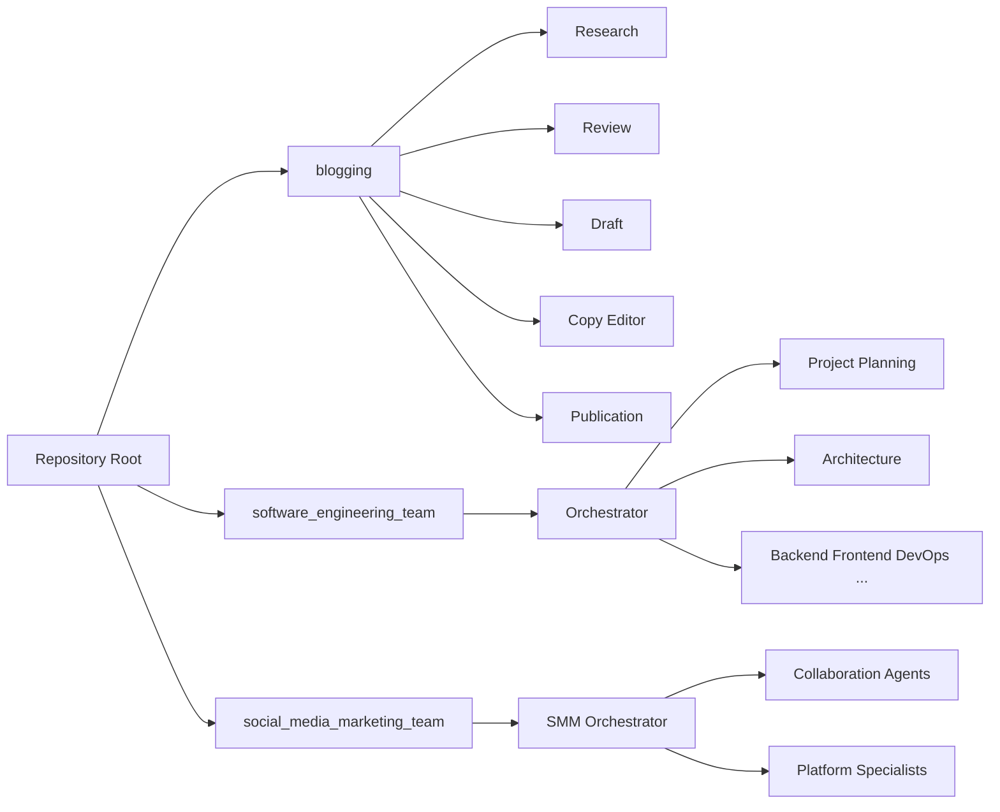

# Strands Agents

This repository provides **multiple Strands-style agent systems** in a monorepo:

- **Blogging** – Research, review, draft, copy-edit, and publication agents for content creation (web + arXiv research, title/outline generation, draft with style guide, copy-editor loop, platform-specific output for Medium/dev.to/Substack).
- **Software engineering team** – Full dev team simulation from spec: architecture, Tech Lead, backend/frontend workers, DevOps, security, QA, code review, accessibility, and more. Reads `initial_spec.md` from a git repo and produces working code.
- **Social media marketing team** – Campaign planning with collaboration agents, human approval gate, and platform specialists (LinkedIn, Facebook, Instagram, X). Produces execution-ready content plans.
- **SOC2 compliance team** – Multi-agent SOC2 audit for a code repository: Security, Availability, Processing Integrity, Confidentiality, and Privacy TSC agents review the repo and produce a compliance report or a next-steps-for-certification document.

## Project structure

```
strands-agents/
├── api/                    # Blog research-and-review HTTP API (port 8000)
├── blogging/               # Blogging agent suite (research, review, draft, copy-edit, publication)
├── software_engineering_team/   # Full software dev team simulation
├── social_media_marketing_team/ # Campaign planning with platform specialists
├── soc2_compliance_team/        # SOC2 compliance audit and certification team
└── requirements.txt        # Shared dependencies
```

| Directory | Description |
|-----------|-------------|
| [blogging/](blogging/README.md) | Research, review, draft, copy-editor, and publication agents. Full pipeline from brief to platform-ready posts. |
| [software_engineering_team/](software_engineering_team/README.md) | Multi-agent dev team: architecture, Tech Lead, backend/frontend, DevOps, security, QA, code review, accessibility, documentation. |
| [social_media_marketing_team/](social_media_marketing_team/README.md) | Cross-platform campaign planning with human approval, collaboration agents, and LinkedIn/Facebook/Instagram/X specialists. |
| [soc2_compliance_team/](soc2_compliance_team/README.md) | SOC2 compliance audit: Security, Availability, Processing Integrity, Confidentiality, Privacy TSC agents; produces compliance report or next-steps document. |



## Quick start

### Dependencies

Install shared dependencies from the repo root:

```bash
pip install -r requirements.txt
```

The `blogging/` and `software_engineering_team/` directories have their own `requirements.txt` for team-specific runs. See each team's README for details.

### How to run each team

| Team | Directory | Command | Port |
|------|------------|---------|------|
| **Blog research & review API** | `blogging/` | `cd blogging && python agent_implementations/run_api_server.py` | 8000 |
| **Blog API (from root)** | repo root | `PYTHONPATH=blogging uvicorn api.main:app --reload --host 0.0.0.0 --port 8000` | 8000 |
| **Software engineering team** | `software_engineering_team/` | See [software_engineering_team/README.md](software_engineering_team/README.md) for CLI and API | 8000 |
| **Social media marketing** | package | `uvicorn social_media_marketing_team.api.main:app --host 0.0.0.0 --port 8010` | 8010 |
| **SOC2 compliance audit** | package | `uvicorn soc2_compliance_team.api.main:app --host 0.0.0.0 --port 8020` | 8020 |

**Environment variables:**

- **Blogging (research):** Set `TAVILY_API_KEY` for web search (or adapt the web search tool to your preferred API).
- **Software engineering:** See `SW_LLM_*` variables in [software_engineering_team/README.md](software_engineering_team/README.md).

## Blog research & review API

The blog API exposes the **research + review** pipeline only (title choices, outline, compiled document). The full blogging pipeline (draft, copy-editor, publication) is in [blogging/README.md](blogging/README.md).

**Start the server** (from `blogging/` directory):

```bash
cd blogging
pip install -r requirements.txt
python agent_implementations/run_api_server.py
# or: uvicorn api.main:app --reload --host 0.0.0.0 --port 8000
```

**POST `/research-and-review`** – Run research and review agents.

Request body:

```json
{
  "brief": "LLM observability best practices for large enterprises",
  "title_concept": "Why CTOs need it",
  "audience": {
    "skill_level": "expert",
    "profession": "CTO",
    "hobbies": ["AI", "DevOps"]
  },
  "tone_or_purpose": "technical deep-dive",
  "max_results": 20
}
```

`audience` can be an object (skill_level, profession, hobbies, other) or a free-text string. `title_concept` and `audience` are optional.

Response: `title_choices`, `outline`, `compiled_document`, `notes`.

**GET `/health`** – Health check.

Interactive docs: http://localhost:8000/docs

## Blogging agents

The blogging suite includes Research, Review, Draft, Copy Editor, and Publication agents. For full agent descriptions, project layout, and pipeline (research → review → draft → copy-editor loop → publication), see [blogging/README.md](blogging/README.md).

- `social_media_marketing_team/` – Multi-agent social marketing workflow with platform specialists (LinkedIn, Facebook, Instagram, X), proposal collaboration with orchestrator consensus, human approval gate, and 14-day cadence planning defaults.
- `market_research_team/` – Multi-agent market research and business concept viability workflow with transcript-folder ingestion, UX + psychology synthesis, experiment scripts, and human approval gates.

## License

This repository is provided as an example implementation for building Strands-style research agents.