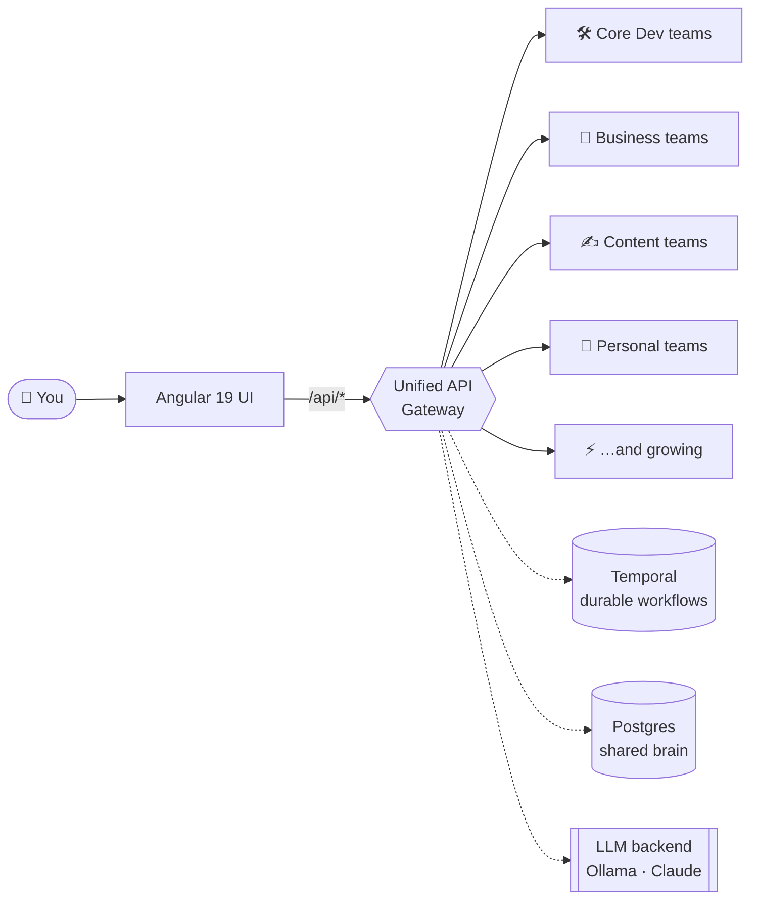

<p align="center">
  
</p>

<h1 align="center">Khala</h1>

<p align="center">
  <em>Many minds. One objective… yours.</em><br/>
  <sub>A growing collective of specialist AI agent teams. One gateway. Your mission.</sub>
</p>

<p align="center">
  
  
  
  
  
  
  
</p>

---

## You don't need a team. You need a Khala.

Khala is a living collective of specialist AI agents that works like the best company you've ever seen — except it boots in sixty seconds, never sits in meetings, and never leaves Slack unread.

Point it at a spec and a full software engineering org spins up to design, code, review, secure, and ship the feature end-to-end. Point it at a market and researchers interview users, surface demand, and hand a PRD to the planners. Point it at a launch and blog writers draft, copy-editors polish, and social specialists fan the campaign across every platform. Sales agents prospect, qualify, and close. Compliance agents drag you toward SOC2. Accessibility agents catch every WCAG 2.2 violation before your users do. Financial agents write your IPS and backtest your strategy. A recursive meta-agent called **Deepthought** spawns its own sub-agents when the problem doesn't fit anywhere else.

They share a psionic link — durable Temporal workflows, a Postgres memory, a pluggable LLM brain — so context doesn't evaporate between steps and crashes don't cost you work. They run in parallel. They hand artifacts to each other. They don't sleep.

And the roster keeps growing. The team you need next is probably already being written — or you can **provision your own** by describing it in plain English to the Agentic Team Provisioning team. Agents all the way down.

> **Many minds. One objective. Yours.**

<sub>*(Named after the Protoss unifying religion from StarCraft — a psionic link joining many minds into one.)*</sub>

---

## Why Khala?

- **🌩️ One gateway, a whole roster** — every agent mounts under `/api/*`. One auth. One UI. One deploy. New teams join every release.
- **⚡ Durable by default** — set `TEMPORAL_ADDRESS` and your workflows laugh at restarts, crashes, and redeploys.
- **🧠 Bring your own brain** — Ollama Cloud, local Ollama, or Claude. Swap per-agent via env vars.
- **🏗️ Real engineering, not demos** — 4-phase SDLC, parallel worker queues, planning cache, crash recovery, 8+ quality gates. This isn't a toy.
- **🧬 Built to expand** — add a new team in one PR. Agentic Team Provisioning can even design the roster for you.
- **🚀 Ship in 60 seconds** — `docker compose up` and the whole stack (Postgres, Temporal, Ollama, API, UI) is live.

---

> [!WARNING]
> **Khala is experimental.** The agents in this project are active research, not a production-ready product. Outputs can be incomplete, inconsistent, or just plain wrong; APIs change without notice; a team that shipped a feature yesterday may hit a wall today. Run it in isolated environments, keep humans in the loop for anything that matters, and treat every generated artifact (code, audits, trades, compliance reports) as a draft that needs review before you rely on it. If you're looking for a hardened platform with SLAs, this isn't it — yet. If you're looking to build, tinker, and help push the frontier of multi-agent systems, welcome aboard.

---

## Meet the current roster

Khala groups its teams into four *cells* — failure-isolated neighborhoods that share infrastructure and deploy together. This list grows every release; the authoritative source is always [`backend/unified_api/config.py`](backend/unified_api/config.py).

### 🛠️ Core Dev — build, plan, and evolve software

| Team | Route | What it does |
|---|---|---|
| **Software Engineering** | `/api/software-engineering` | Full dev-team simulation: architecture, planning, coding, review, release |
| **Planning V3** | `/api/planning-v3` | Client-facing discovery and PRDs; hands off to dev/UX |
| **Coding Team** | `/api/coding-team` | SE sub-team: tech lead + stack specialists with a task graph |
| **AI Systems** | `/api/ai-systems` | Spec-driven factory that builds new AI agent systems |
| **Agent Provisioning** | `/api/agent-provisioning` | Stands up agent environments (databases, git, docker) |
| **Agentic Team Provisioning** | `/api/agentic-team-provisioning` | Designs new teams and their processes by conversation |
| **User Agent Founder** | `/api/user-agent-founder` | Autonomous "founder" agent that drives the SE team |
| **Deepthought** | `/api/deepthought` | Recursive self-organizing agent that spawns its own sub-agents |

### 💼 Business — the grown-up functions

| Team | Route | What it does |
|---|---|---|
| **Market Research** | `/api/market-research` | User discovery and product-concept viability research |
| **SOC2 Compliance** | `/api/soc2-compliance` | SOC2 audit and certification workflow |
| **Investment** | `/api/investment` | Financial advisor (IPS, proposals) + Strategy Lab (ideation, backtests) |
| **AI Sales Team** | `/api/sales` | Full B2B sales pod: prospect → qualify → nurture → close |
| **Startup Advisor** | `/api/startup-advisor` | Persistent conversational advisor with probing dialogue |

### ✍️ Content — ideas into words into reach

| Team | Route | What it does |
|---|---|---|
| **Blogging** | `/api/blogging` | Research → planning → draft → copy-edit → publish |
| **Social Marketing** | `/api/social-marketing` | Cross-platform campaigns with per-platform specialists |
| **Branding** | `/api/branding` | Brand strategy, moodboards, and design/writing standards |

### 🧘 Personal — life, optimized

| Team | Route | What it does |
|---|---|---|
| **Personal Assistant** | `/api/personal-assistant` | Email, calendar, tasks, deals, reservations |
| **Accessibility Audit** | `/api/accessibility-audit` | WCAG 2.2 and Section 508 auditing for web and mobile |
| **Nutrition & Meal Planning** | `/api/nutrition-meal-planning` | Personalized meal plans that learn from your feedback |
| **Road Trip Planning** | `/api/road-trip-planning` | Profiling, route optimization, activity recommendations, logistics |

> …and more on the way. Run `GET /api/teams` on a live instance for the authoritative roster.

---

## Ship in 60 seconds

### 🚢 The Docker way (recommended — entire stack live)

```bash
cp docker/.env.example docker/.env   # then set OLLAMA_API_KEY (or your LLM provider)
docker compose -f docker/docker-compose.yml --env-file docker/.env up --build
```

Then open:
- 🖥️ **UI:** http://localhost:4201
- 🔌 **Unified API + docs:** http://localhost:8888/docs
- ⏱️ **Temporal UI:** http://localhost:8080

Full details in [`docker/README.md`](docker/README.md).

### 🧑‍💻 The local way (hack on the code)

```bash
# 1) Backend (terminal 1)
cd backend
make install            # venv + deps
python run_unified_api.py
# → http://localhost:8080/docs

# 2) Frontend (terminal 2)
cd user-interface
nvm use                 # Node 22
npm ci
npm start
# → http://localhost:4200
```

Handy Makefile targets: `make lint`, `make lint-fix`, `make test`, `make run`, `make deploy`.

---

## Architecture at a glance



The full system — 4-phase SDLC, task graphs, parallel worker queues, planning cache, quality gates, DevOps pipeline — is documented with Mermaid diagrams in [`ARCHITECTURE.md`](ARCHITECTURE.md).

---

## Add your own team

Khala is built to grow. You have two ways to add a new team:

1. **Talk to the Agentic Team Provisioning team.** Describe the roster you want in plain English; it validates the design and (optionally) bridges to Agent Provisioning to stand up the environment. See [`backend/agents/agentic_team_provisioning/`](backend/agents/agentic_team_provisioning/).
2. **Write it yourself.** Follow the agent structure in [`AGENT_ANATOMY.md`](backend/agents/agent_provisioning_team/AGENT_ANATOMY.md) (I/O, tools, memory, prompts, guardrails, sub-agents), register the team in [`backend/unified_api/config.py`](backend/unified_api/config.py) (`TEAM_CONFIGS`), and it mounts at `/api/<your-slug>` on next restart.

---

## Deep dives

<details>
<summary><strong>Per-team READMEs (click to expand)</strong></summary>

### Core Dev
- [`backend/agents/software_engineering_team/`](backend/agents/software_engineering_team/README.md) — the flagship SE pipeline (planning, coding, review, release)
- [`backend/agents/planning_v3_team/`](backend/agents/planning_v3_team/README.md)
- [`backend/agents/coding_team/`](backend/agents/coding_team/README.md)
- [`backend/agents/ai_systems_team/`](backend/agents/ai_systems_team/README.md)
- [`backend/agents/agent_provisioning_team/`](backend/agents/agent_provisioning_team/README.md)
- [`backend/agents/agentic_team_provisioning/`](backend/agents/agentic_team_provisioning/)
- [`backend/agents/user_agent_founder/`](backend/agents/user_agent_founder/README.md)
- [`backend/agents/deepthought/`](backend/agents/deepthought/README.md)

### Business
- [`backend/agents/market_research_team/`](backend/agents/market_research_team/README.md)
- [`backend/agents/soc2_compliance_team/`](backend/agents/soc2_compliance_team/README.md)
- [`backend/agents/investment_team/`](backend/agents/investment_team/README.md) — Advisor/IPS + Strategy Lab
- [`backend/agents/sales_team/`](backend/agents/sales_team/README.md)
- [`backend/agents/startup_advisor/`](backend/agents/startup_advisor/README.md)

### Content
- [`backend/agents/blogging/`](backend/agents/blogging/README.md)
- [`backend/agents/social_media_marketing_team/`](backend/agents/social_media_marketing_team/README.md)
- [`backend/agents/branding_team/`](backend/agents/branding_team/README.md)

### Personal
- [`backend/agents/personal_assistant_team/`](backend/agents/personal_assistant_team/README.md)
- [`backend/agents/accessibility_audit_team/`](backend/agents/accessibility_audit_team/README.md)
- [`backend/agents/nutrition_meal_planning_team/`](backend/agents/nutrition_meal_planning_team/README.md)
- [`backend/agents/road_trip_planning_team/`](backend/agents/road_trip_planning_team/README.md)

### Platform
- [`backend/agents/`](backend/agents/README.md) — backend agent monorepo overview
- [`backend/unified_api/`](backend/unified_api/README.md) — mounts, `TeamConfig`, logical sub-teams

</details>

---

## Developer guide

| Env var | Purpose |
|---|---|
| `LLM_PROVIDER` / `LLM_BASE_URL` / `LLM_MODEL` | Pick and configure the LLM backend |
| `OLLAMA_API_KEY` | Required for Ollama Cloud |
| `TEMPORAL_ADDRESS` / `TEMPORAL_NAMESPACE` / `TEMPORAL_TASK_QUEUE` | Enable durable workflows when set |
| `POSTGRES_HOST` / `POSTGRES_PORT` / `POSTGRES_USER` / `POSTGRES_PASSWORD` / `POSTGRES_DB` | Required for migrated teams (blogging, branding, startup_advisor, nutrition, agentic_team_provisioning, team_assistant, user_agent_founder, unified_api credentials) |
| `SECURITY_GATEWAY_ENABLED` | Toggle the request-scanning gateway (default: `true`) |
| `AGENT_CACHE` | Shared cache root; each team namespaces under `{team_name}/` |

More reference:

- 📐 [**`ARCHITECTURE.md`**](ARCHITECTURE.md) — 26KB deep-dive with Mermaid diagrams (SDLC phases, task graphs, worker pipelines, DevOps gates)
- 🤝 [**`CONTRIBUTORS.md`**](CONTRIBUTORS.md) — setup, branch conventions, code standards, testing, PR process
- 🤖 [**`CLAUDE.md`**](CLAUDE.md) — guidance for Claude Code / Cursor when working in this repo
- 📝 [**`CHANGELOG.md`**](CHANGELOG.md) — what shipped recently
- 🧬 [**`AGENT_ANATOMY.md`**](backend/agents/agent_provisioning_team/AGENT_ANATOMY.md) — the standard structure for a Khala-native agent

---

## License

See [`LICENSE`](LICENSE).

<p align="center">
  <sub>Built by humans and their Khala.  ·  Many minds. One objective. Yours.</sub>
</p>
