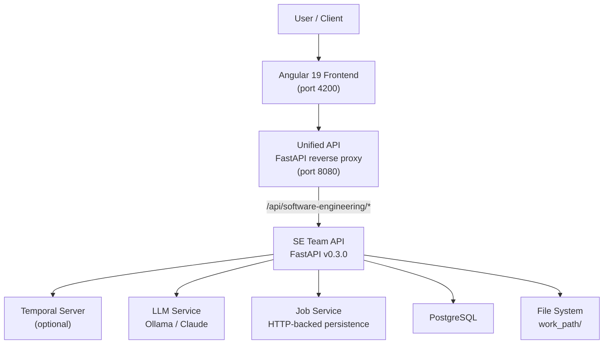
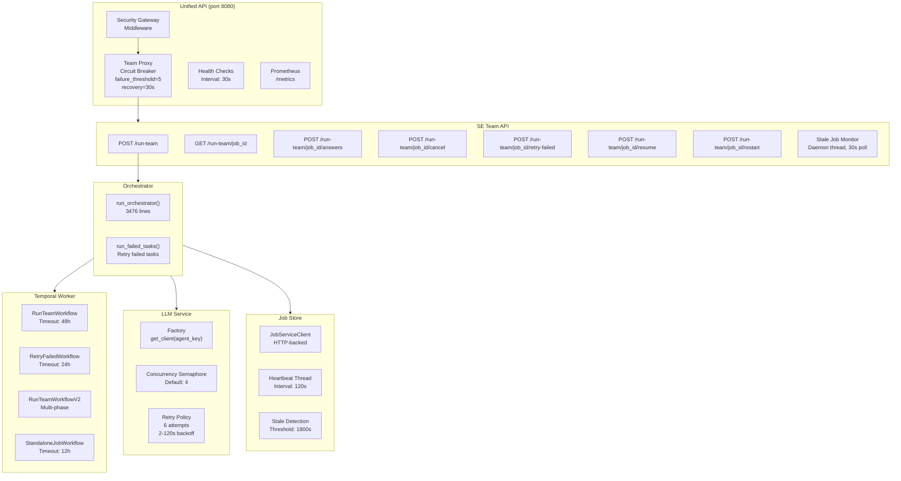
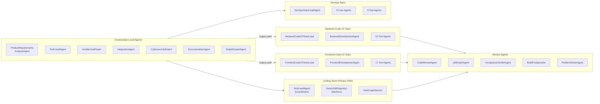
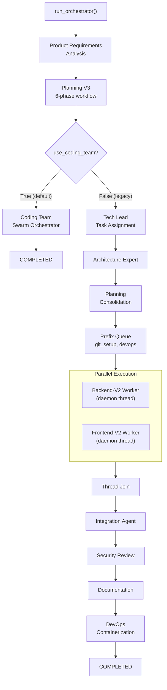

# Software Engineering Team — Architecture Overview

## 1. System Context

The Software Engineering Team is one of 20 agent teams in the Khala platform. It receives project specifications from users, orchestrates multi-phase software development, and produces production-ready code repositories.

## 2. Container Diagram

## 3. Agent Inventory

### Backend-Code-V2 Tool Agents (10)

| # | Agent | Responsibility |
|---|-------|---------------|
| 1 | DataEngineering | Database models, schemas, migrations, ORM |
| 2 | API/OpenAPI | REST endpoints, OpenAPI specs |
| 3 | Auth | Authentication, JWT/OAuth, authorization |
| 4 | CI/CD | Pipeline config (GitHub Actions, etc.) |
| 5 | Containerization | Dockerfile, docker-compose |
| 6 | Git | Branch creation, commits, merges |
| 7 | Build Specialist | Build scripts, dependency management |
| 8 | Testing/QA | Unit tests, integration tests |
| 9 | Security | Security scanning, vulnerability checks |
| 10 | Documentation | Docstrings, README, API docs |

### Frontend-Code-V2 Tool Agents (17)

| # | Agent | Responsibility |
|---|-------|---------------|
| 1 | StateManagement | Redux/Vuex/Context setup |
| 2 | API/OpenAPI | API client generation |
| 3 | Auth | Authentication UI/integration |
| 4 | Architecture | Frontend architecture patterns |
| 5 | UIDesign | UI component design |
| 6 | BrandingTheme | Theming and branding |
| 7 | UXUsability | UX review and improvements |
| 8 | Accessibility | WCAG 2.2 compliance |
| 9 | Testing/QA | Unit, E2E, component tests |
| 10 | Security | Frontend security review |
| 11 | Performance | Performance optimization |
| 12 | Linter | ESLint/Prettier enforcement |
| 13 | Build Specialist | Build/webpack fixes |
| 14 | CI/CD | Frontend-specific CI/CD |
| 15 | Containerization | Frontend containerization |
| 16 | Git | Branch operations |
| 17 | Documentation | Component docs, Storybook |

### DevOps Team Agents (18)

**9 Core Agents:** TaskClarifier, InfrastructureAsCode, CICDPipeline, DeploymentStrategy, DevSecOpsReview, ChangeReview, TestValidation, DocumentationRunbook, InfraDebug, InfraPatch

**9 Tool Agents:** IaCValidation, PolicyAsCode, CICDLint, DeploymentDryRun, RepoNavigator, Terraform, CDK, DockerCompose, Helm

## 4. Technology Stack

| Layer | Technology |
|-------|-----------|
| Language | Python 3.10+, TypeScript (Angular 19) |
| API Framework | FastAPI, Pydantic v2 |
| Workflow Engine | Temporal Python SDK (optional) |
| HTTP Client | httpx |
| Database | PostgreSQL (opt-in via `POSTGRES_HOST`) |
| LLM Provider | Ollama (qwen3.5:397b-cloud default), Claude |
| Observability | OpenTelemetry, Prometheus |
| Frontend | Angular 19, Angular Material, Vitest |
| Container | Docker, docker-compose |

## 5. Two Execution Paths

The orchestrator supports two execution paths. The **Coding Team** path is the current default (`use_coding_team = True`).

