# Software Engineering Team — Flow Charts

## 1. Main Orchestrator Pipeline

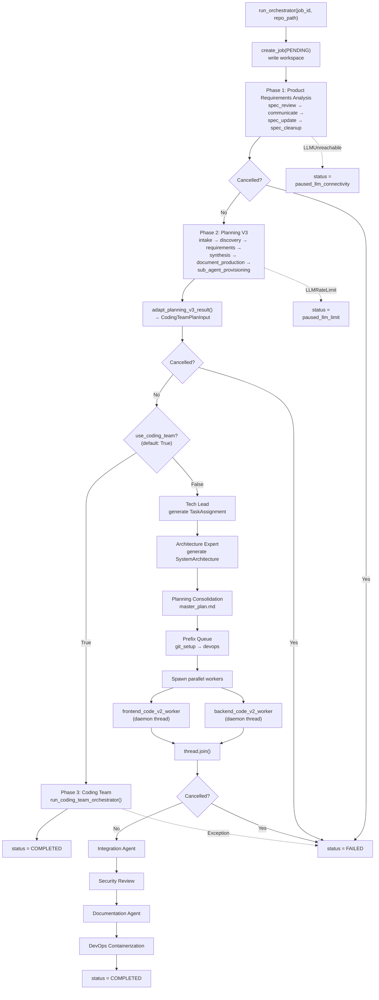

## 2. Coding Team Swarm Loop

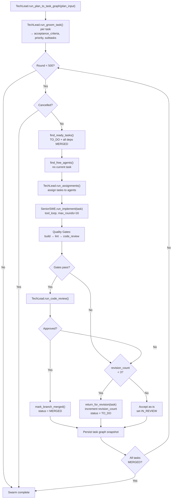

## 3. Backend/Frontend V2 Lifecycle

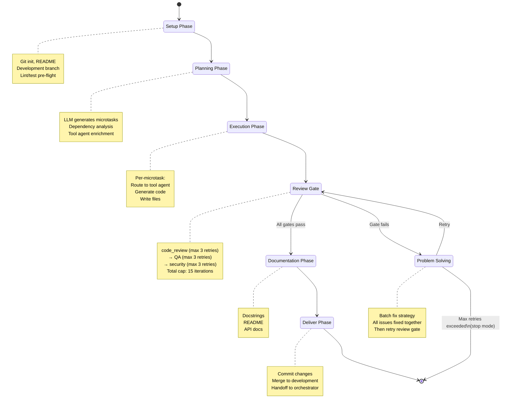

### Microtask Status Transitions

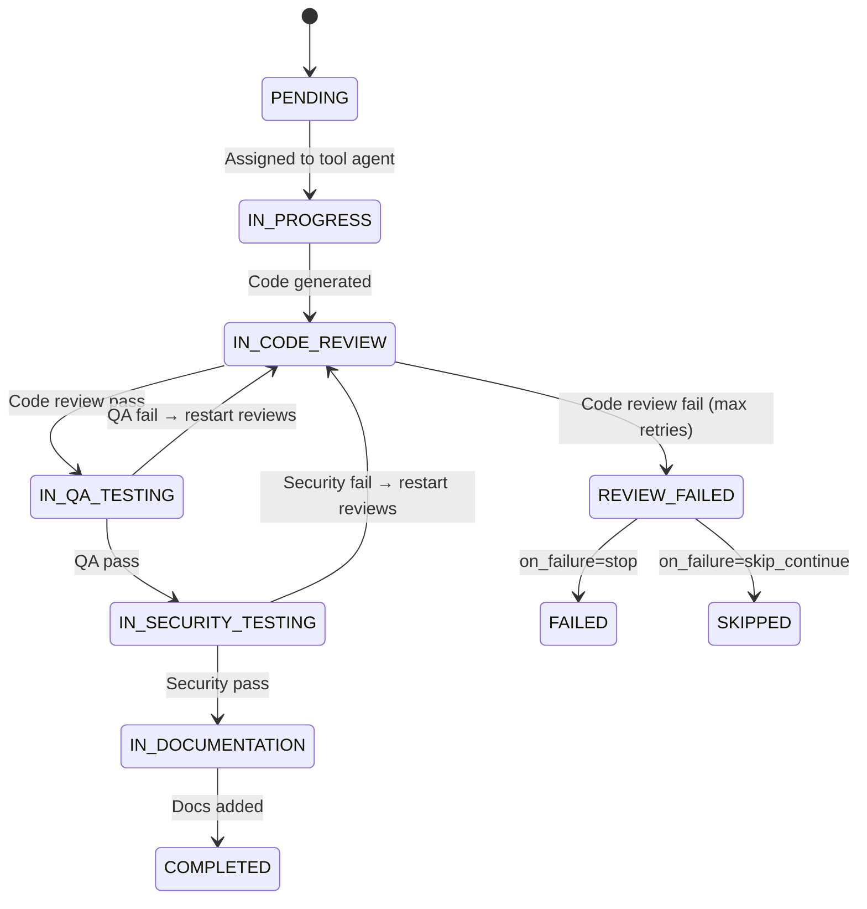

## 4. Microtask Review Gate Pipeline

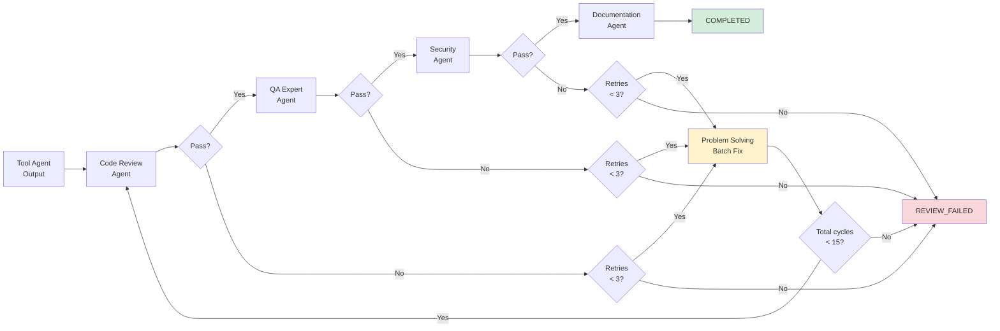

## 5. DevOps 5-Phase Pipeline

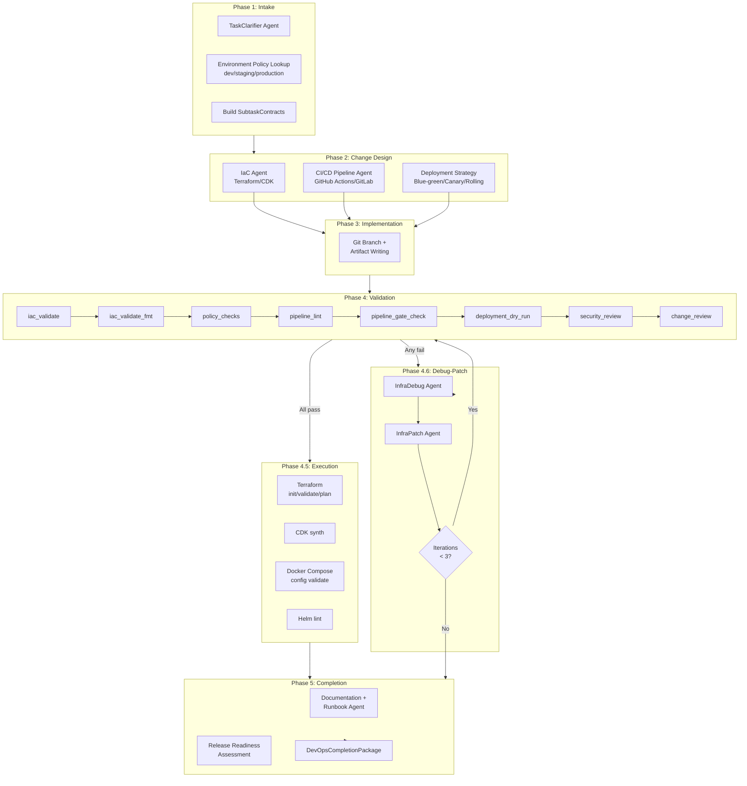

### DevOps Environment Decision

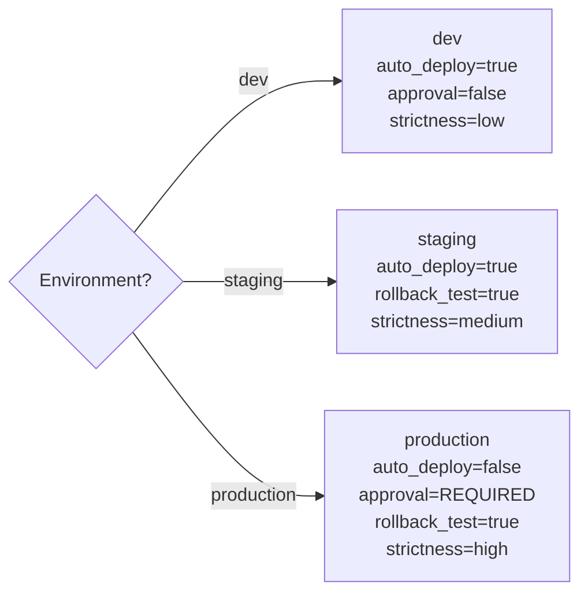

## 6. Planning V3 Workflow

```mermaid
flowchart TD
    START["Planning V3 run_workflow()"]

    INTAKE["INTAKE (5%)\nParse client_name, brief, spec\n→ initial ClientContext"]

    DISC["DISCOVERY (15%)\nLLM extracts:\nproblem_summary\nopportunity_statement\ntarget_users\nsuccess_criteria"]

    REQ["REQUIREMENTS (25%)\nGenerate OpenQuestions:\nRPO/RTO options\nDeployment options\nCompliance notes"]

    SYN["SYNTHESIS (35%)\nMerge market research\nevidence if available"]

    DOCPROD["DOCUMENT PRODUCTION (45%)\nWrite client_context.md\nWrite initial_spec.md"]

    PRA_OPT{"use_product\n_analysis?"}
    PRA_RUN["Run PRA Agent\nvalidate + refine spec"]

    PV2_OPT{"use_planning\n_v2?"}
    PV2_RUN["Run Planning V2\nlegacy 6-phase planning"]

    ARCH_OPT{"run_architecture\n_fn?"}
    ARCH_RUN["Architecture Expert\ngenerate architecture_overview"]

    HANDOFF["Build HandoffPackage\nclient_context + validated_spec +\nPRD + architecture + artifacts"]

    SUB["SUB_AGENT PROVISIONING (90%)"]
    GAP{"capability_gap\nprovided?"}
    BUILD["Write sub_agent_spec.md\nAI Systems build"]

    DONE["COMPLETE (100%)\nReturn HandoffPackage"]

    START --> INTAKE --> DISC --> REQ --> SYN --> DOCPROD

    DOCPROD --> PRA_OPT
    PRA_OPT -->|Yes| PRA_RUN --> PV2_OPT
    PRA_OPT -->|No| PV2_OPT

    PV2_OPT -->|Yes| PV2_RUN --> ARCH_OPT
    PV2_OPT -->|No| ARCH_OPT

    ARCH_OPT -->|Yes| ARCH_RUN --> HANDOFF
    ARCH_OPT -->|No| HANDOFF

    HANDOFF --> SUB --> GAP
    GAP -->|Yes| BUILD --> DONE
    GAP -->|No| DONE
```

## 7. Threading Model — Legacy Path

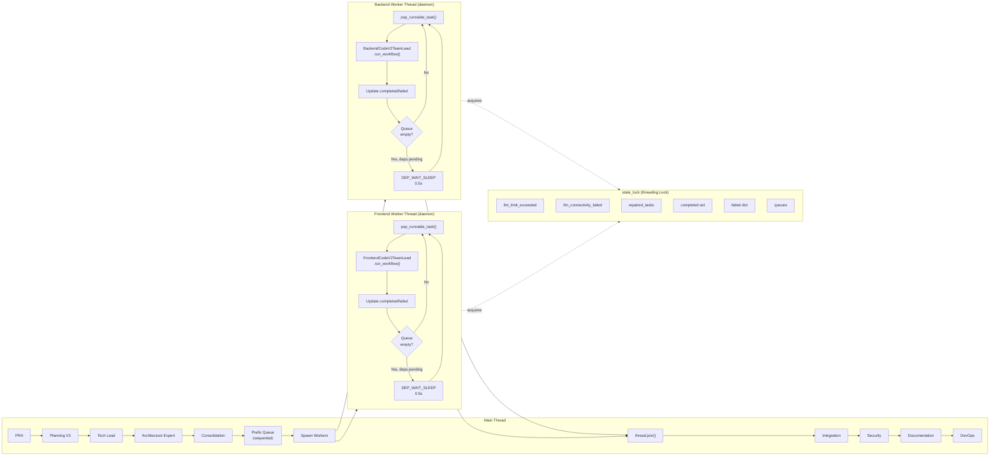

## 8. Build Fix Loop

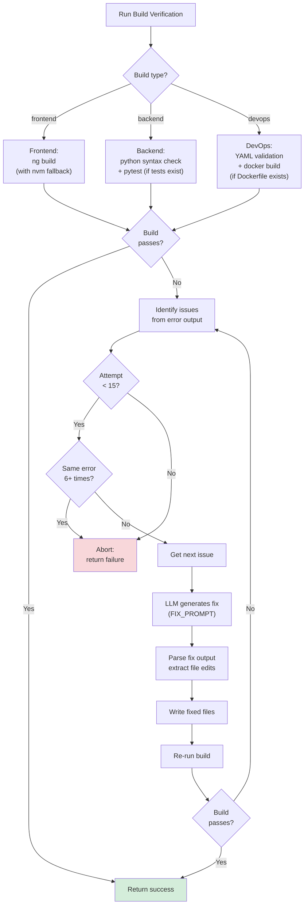

## 9. Planning V3 → Coding Team Data Flow

End-to-end data transformation from planning to execution.

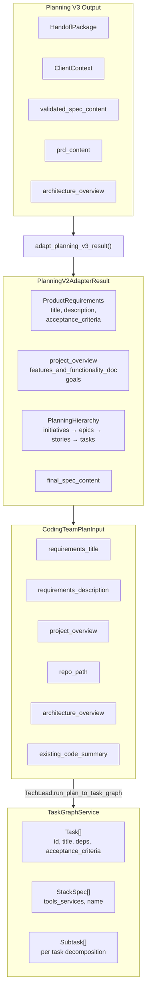
