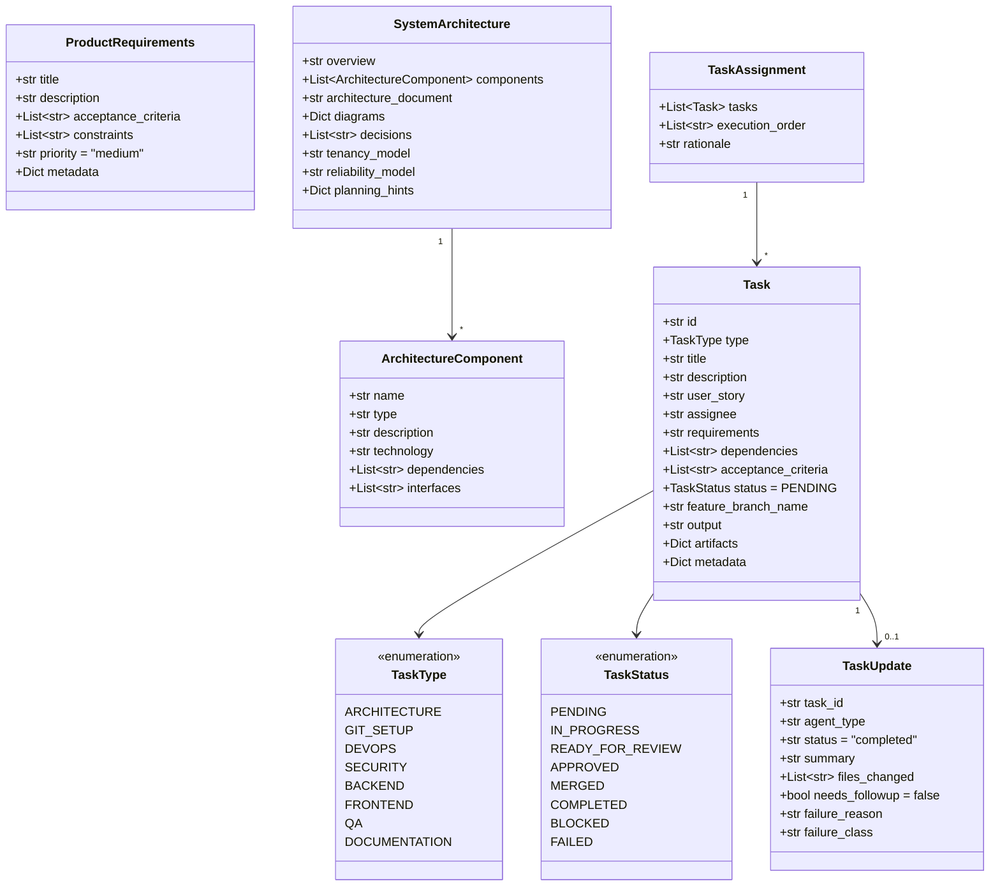
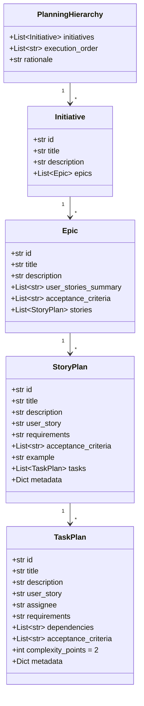
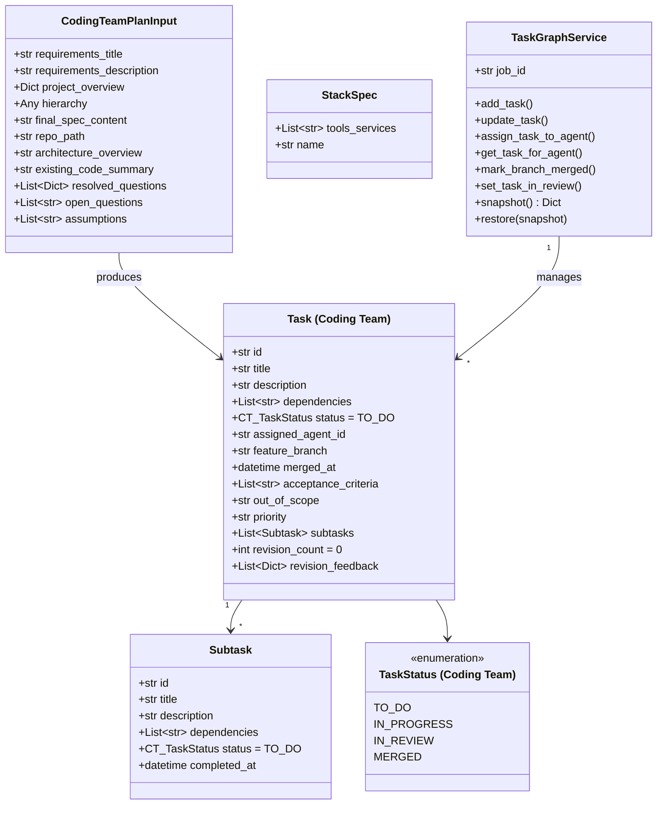
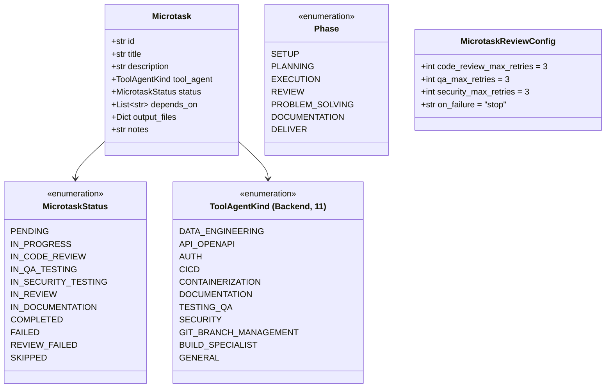
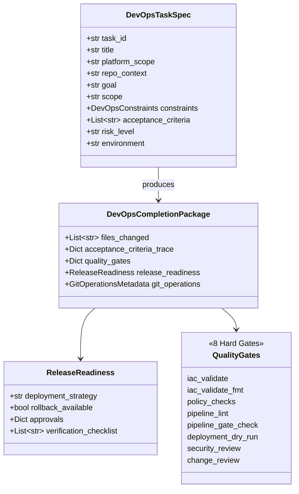
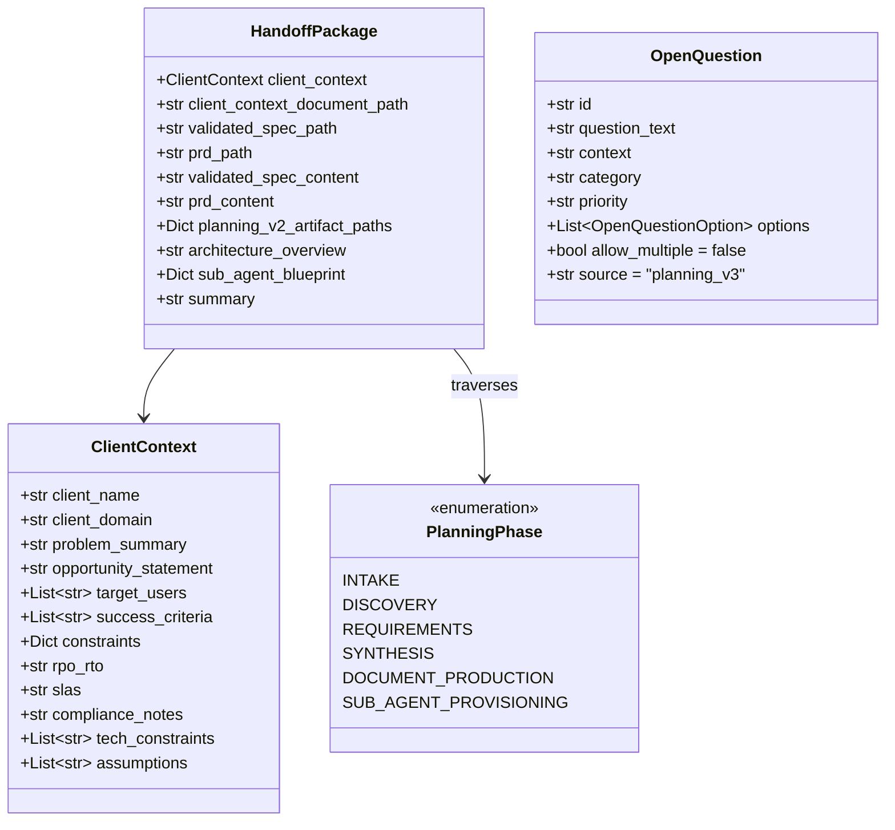
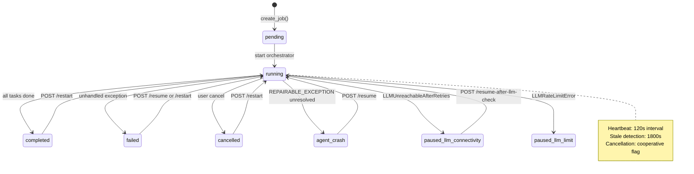
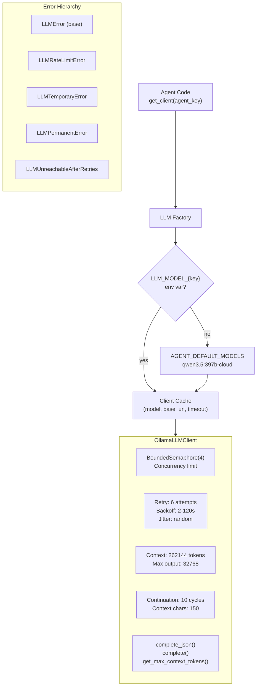
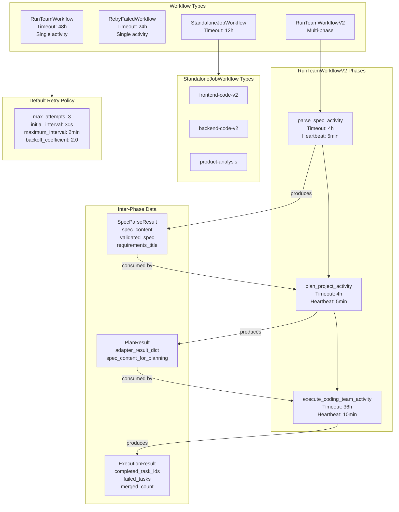

# Software Engineering Team — System Design

## 1. Core Data Model

## 2. Planning Hierarchy Model

## 3. Coding Team Data Model

## 4. Microtask Model (Backend/Frontend V2)

## 5. DevOps Data Model

### Environment Policies

| Environment | auto_deploy | approval | rollback_test | policy_strictness |
|------------|-------------|----------|---------------|-------------------|
| dev | true | false | false | low |
| staging | true | false | true | medium |
| production | false | **true** | true | **high** |

## 6. Planning V3 Data Model

## 7. Job Lifecycle State Machine

## 8. Job Data Structure

| Field | Type | Purpose |
|-------|------|---------|
| `repo_path` | str | Workspace directory |
| `progress` | int (0-100) | Overall completion percentage |
| `current_task` | str | Active task description |
| `status_text` | str | Human-readable status |
| `task_results` | List[Dict] | Completed task summaries |
| `execution_order` | List[str] | Task ID ordering |
| `error` | str | Error message if failed |
| `architecture_overview` | str | Architecture Expert output |
| `requirements_title` | str | Project title from PRA |
| `pending_questions` | List[Dict] | Structured clarification questions |
| `waiting_for_answers` | bool | Blocks orchestrator when true |
| `submitted_answers` | List[Dict] | User responses |
| `cancel_requested` | bool | Cooperative cancellation flag |
| `events` | List[Dict] | Orchestration event log |
| `task_states` | Dict[str, Dict] | Per-task status, assignee, errors |
| `team_progress` | Dict[str, Dict] | Per-team phase, progress, microtask info |
| `failed_tasks` | List[Dict] | Failed task IDs with reasons |
| `_all_tasks` | Dict[str, Dict] | Serialized Task objects (for retry) |
| `_spec_content` | str | Original spec (for retry) |
| `_architecture_overview` | str | Architecture (for retry) |

## 9. LLM Service Architecture

## 10. Temporal Workflow Architecture

## 11. API Design

### SE Team API Endpoints

| Method | Path | Request | Response | Purpose |
|--------|------|---------|----------|---------|
| POST | `/run-team` | `RunTeamRequest(repo_path)` | `RunTeamResponse(job_id, status)` | Start new job |
| POST | `/run-team/upload` | Multipart (project_name + spec_file) | `RunTeamResponse` | Upload spec and start |
| GET | `/run-team/jobs` | - | `RunningJobsResponse` | List active jobs |
| GET | `/run-team/{job_id}` | - | `JobStatusResponse` (30+ fields) | Poll job status |
| POST | `/run-team/{job_id}/cancel` | - | `CancelJobResponse` | Cancel running job |
| DELETE | `/run-team/{job_id}` | - | `DeleteJobResponse` | Delete job record |
| POST | `/run-team/{job_id}/resume` | - | `RunTeamResponse` | Resume paused/failed job |
| POST | `/run-team/{job_id}/restart` | - | `RunTeamResponse` | Restart from scratch |
| POST | `/run-team/{job_id}/retry-failed` | - | `RetryResponse` | Re-run failed tasks only |
| POST | `/run-team/{job_id}/resume-after-llm-check` | - | `RetryResponse` | Resume after LLM outage |
| POST | `/run-team/{job_id}/answers` | `SubmitAnswersRequest` | `JobStatusResponse` | Answer clarification questions |

### Planning V3 API Endpoints

| Method | Path | Request | Response | Purpose |
|--------|------|---------|----------|---------|
| POST | `/run` | `PlanningV3RunRequest` | `PlanningV3RunResponse` | Start planning |
| GET | `/status/{job_id}` | - | `PlanningV3StatusResponse` | Poll status |
| GET | `/result/{job_id}` | - | `PlanningV3ResultResponse` | Get handoff package |
| GET | `/jobs` | - | Job list | List active jobs |
| POST | `/{job_id}/answers` | Answers | `PlanningV3StatusResponse` | Submit answers |

### Coding Team API Endpoints

| Method | Path | Request | Response | Purpose |
|--------|------|---------|----------|---------|
| POST | `/run` | `RunRequest(repo_path, plan_input)` | `RunResponse(job_id)` | Start coding |
| GET | `/status/{job_id}` | - | `StatusResponse` | Poll status with task graph |
| GET | `/jobs` | - | Job list | List active jobs |

### Key Response Models

**JobStatusResponse** includes: job_id, status, repo_path, requirements_title, architecture_overview, current_task, status_text, task_results[], task_ids[], progress (0-100), error, failed_tasks[], phase, task_states{}, team_progress{}, pending_questions[], waiting_for_answers, planning_subprocess, planning_completed_phases[], analysis_subprocess, analysis_completed_phases[], planning_hierarchy.

**TeamProgressEntry** includes: current_phase, progress (0-100), current_task_id, current_microtask, current_microtask_phase, phase_detail, current_microtask_index, microtasks_completed, microtasks_total.

**PendingQuestion** includes: id, question_text, context, recommendation, options[QuestionOption], required, allow_multiple, source. Default options: Yes / No / Not sure.
