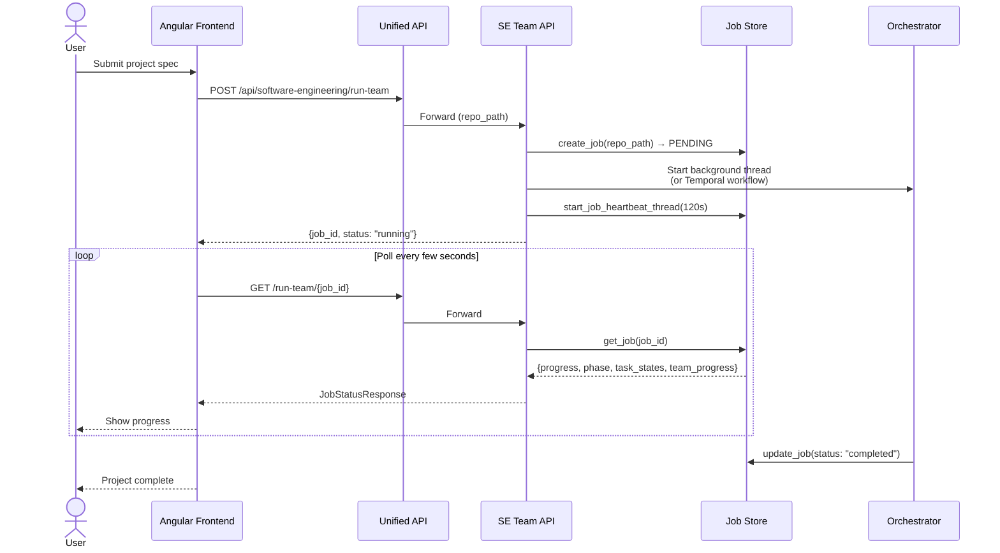
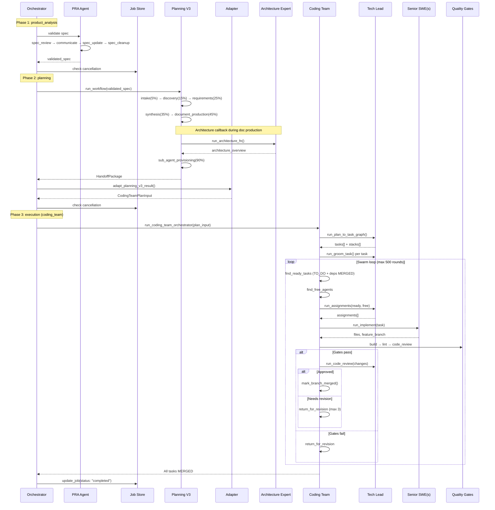
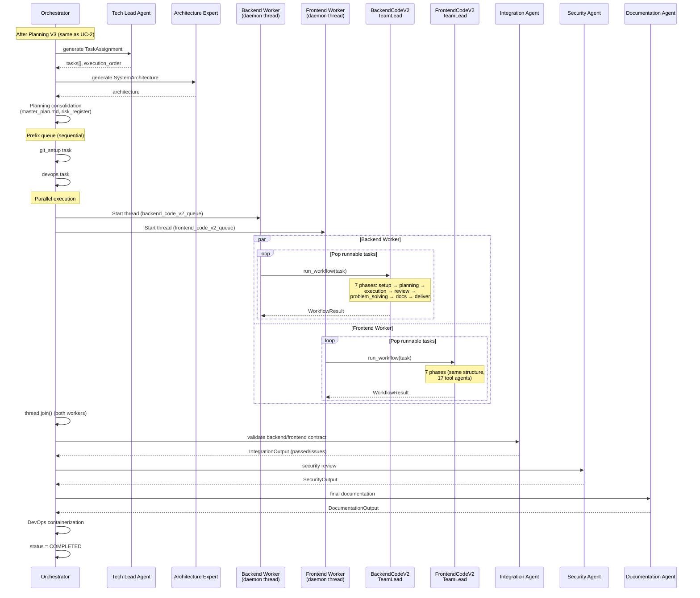
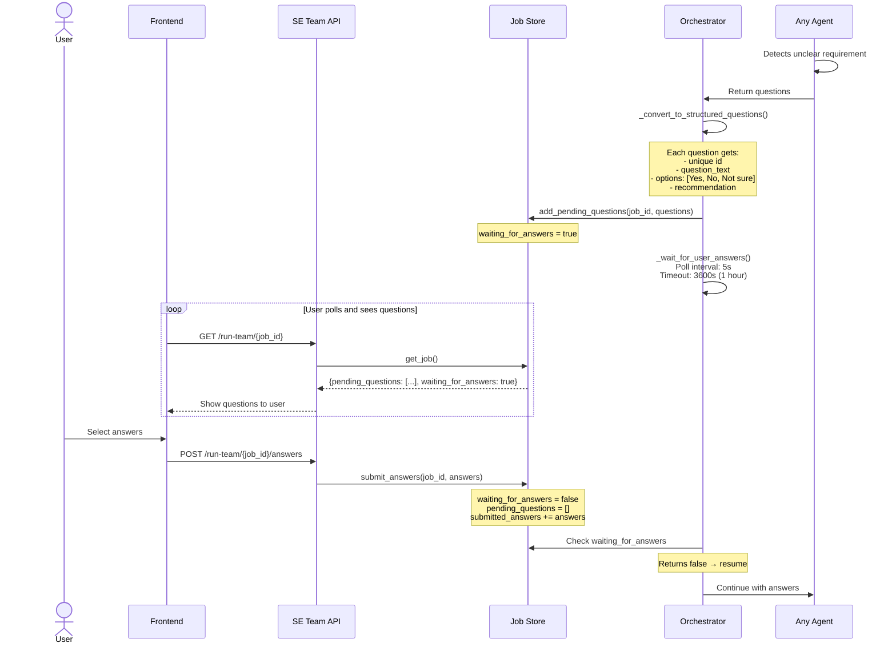
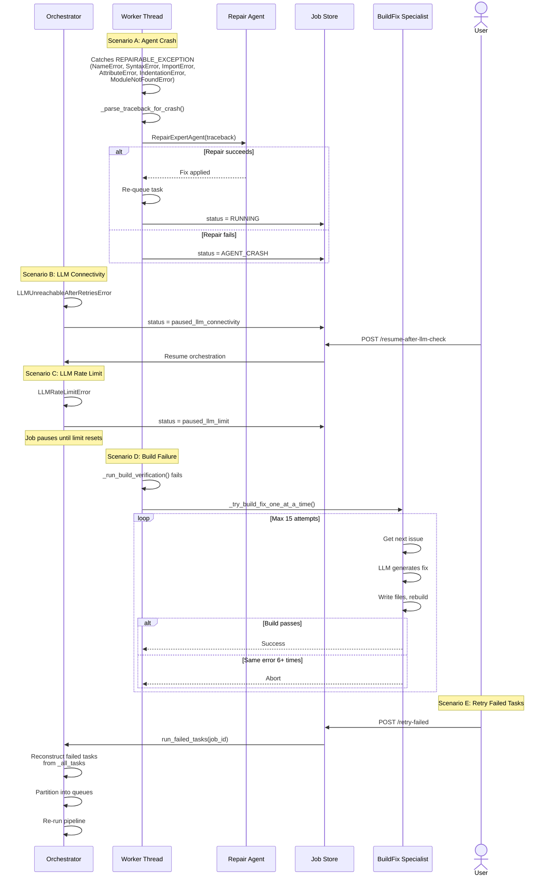
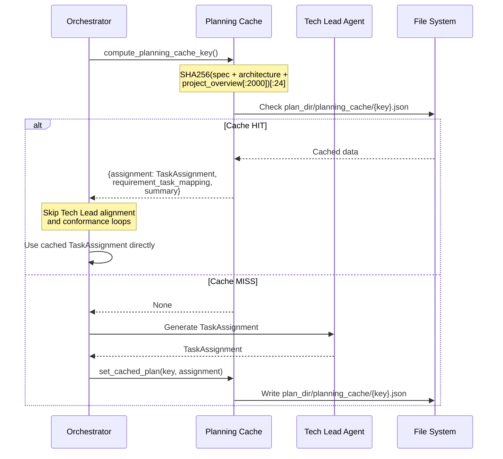

# Software Engineering Team — Use Cases

## UC-1: Submit New Project

A user submits a project specification and monitors progress through polling.

## UC-2: Full Pipeline — Coding Team Path (Primary)

The primary execution path using the Coding Team swarm orchestrator.

## UC-3: Full Pipeline — Legacy Path

The legacy path using parallel backend/frontend worker threads.

## UC-4: User Clarification Flow

When agents need user input to proceed.

## UC-5: Error Recovery

Multiple error recovery paths available in the system.

## UC-6: Planning Cache

Short-circuits the Design phase when inputs are unchanged.

