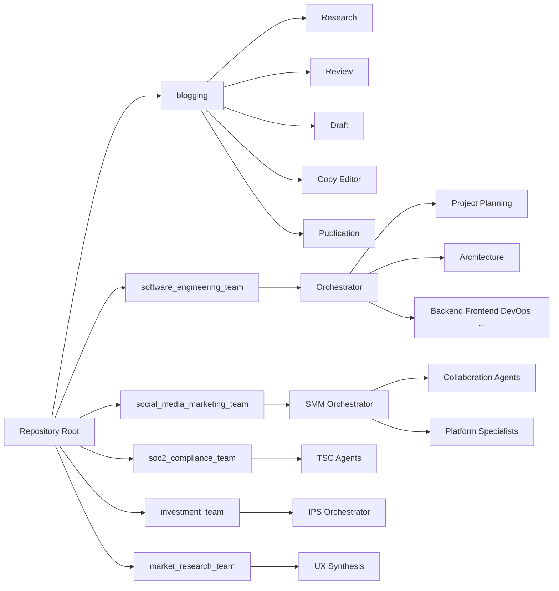

# Strands Agents

This repository provides **multiple Strands-style agent systems** in a monorepo:

- **Blogging** – Research, review, draft, copy-edit, and publication agents for content creation (web + arXiv research, title/outline generation, draft with style guide, copy-editor loop, platform-specific output for Medium/dev.to/Substack).
- **Software engineering team** – Full dev team simulation from spec: architecture, Tech Lead, backend/frontend workers, DevOps, security, QA, code review, accessibility, and more. Reads `initial_spec.md` from a git repo and produces working code.
- **Social media marketing team** – Campaign planning with collaboration agents, human approval gate, and platform specialists (LinkedIn, Facebook, Instagram, X). Produces execution-ready content plans.
- **SOC2 compliance team** – Multi-agent SOC2 audit for a code repository: Security, Availability, Processing Integrity, Confidentiality, and Privacy TSC agents review the repo and produce a compliance report or a next-steps-for-certification document.
- **Investment team** – Multi-asset investment organization with IPS hard constraints, strategy validation, promotion gates (`reject/revise/paper/live`), separation-of-duties, risk veto, and monitor-only safety degradation.
- **Market research team** – Human-AI collaborative workflow for user discovery and product concept viability; transcript ingestion, UX synthesis, experiment scripts, and human approval gates.
- **Branding team** – Brand strategy codification, moodboard ideation, design and writing standards, plus an asynchronous open-question feed and answer workflow.

## Project structure

```
strands-agents/
├── api/                         # Blog research-and-review HTTP API (port 8000)
├── blogging/                    # Blogging agent suite (research, review, draft, copy-edit, publication)
├── software_engineering_team/   # Full software dev team simulation
├── social_media_marketing_team/ # Campaign planning with platform specialists
├── soc2_compliance_team/       # SOC2 compliance audit and certification team
├── investment_team/            # Multi-asset investment organization (IPS-first)
├── market_research_team/       # Market research and concept viability
├── branding_team/              # Branding strategy + interactive clarification API
└── requirements.txt            # Shared dependencies
```

| Directory | Description |
|-----------|-------------|
| [api/](api/README.md) | Blog research-and-review HTTP API; research + review pipeline only. |
| [blogging/](blogging/README.md) | Research, review, draft, copy-editor, and publication agents. Full pipeline from brief to platform-ready posts. |
| [software_engineering_team/](software_engineering_team/README.md) | Multi-agent dev team: architecture, Tech Lead, backend/frontend, DevOps, security, QA, code review, accessibility, documentation. |
| [social_media_marketing_team/](social_media_marketing_team/README.md) | Cross-platform campaign planning with human approval, collaboration agents, and LinkedIn/Facebook/Instagram/X specialists. |
| [soc2_compliance_team/](soc2_compliance_team/README.md) | SOC2 compliance audit: Security, Availability, Processing Integrity, Confidentiality, Privacy TSC agents; produces compliance report or next-steps document. |
| [investment_team/](investment_team/README.md) | Multi-asset investment organization with IPS constraints, validation/promotion gates, and safety-first orchestration. |
| [market_research_team/](market_research_team/README.md) | Market research and business concept viability; transcript ingestion, UX synthesis, experiment scripts, human approval gates. |



## Quick start

### Dependencies

Install shared dependencies from the repo root:

```bash
pip install -r requirements.txt
```

The `blogging/` and `software_engineering_team/` directories have their own `requirements.txt` for team-specific runs. See each team's README for details.

### Unified API Server (Recommended)

The **Unified API Server** consolidates all agent team APIs under a single entry point. This is the recommended way to run the platform.

```bash
# Start the unified API server (default port 8080)
python run_unified_api.py

# Or with custom port
python run_unified_api.py --port 9000

# Development mode with auto-reload
python run_unified_api.py --reload
```

Once running, all team APIs are available under namespaced prefixes:

| Team | Prefix | Example Endpoint |
|------|--------|------------------|
| Blogging | `/api/blogging` | `POST /api/blogging/research-and-review` |
| Software Engineering | `/api/software-engineering` | `POST /api/software-engineering/run-team` |
| Personal Assistant | `/api/personal-assistant` | `POST /api/personal-assistant/users/{user_id}/assistant` |
| Market Research | `/api/market-research` | `POST /api/market-research/market-research/run` |
| SOC2 Compliance | `/api/soc2-compliance` | `POST /api/soc2-compliance/soc2-audit/run` |
| Social Marketing | `/api/social-marketing` | `POST /api/social-marketing/social-marketing/run` |
| Branding | `/api/branding` | `POST /api/branding/branding/run` |
| Agent Provisioning | `/api/agent-provisioning` | `POST /api/agent-provisioning/provision` |

**Key Unified API Endpoints:**

- `GET /` - API info and list of available teams
- `GET /health` - Unified health check for all teams
- `GET /teams` - List all teams with mount status
- `GET /docs` - Interactive API documentation (Swagger UI)

Each team also has its own docs at `{prefix}/docs` (e.g., `/api/blogging/docs`).

### Running Individual Teams

You can also run individual team APIs separately:

| Team | Directory | Command | Port |
|------|------------|---------|------|
| **Blog research & review API** | `blogging/` | `cd blogging && python agent_implementations/run_api_server.py` | 8000 |
| **Blog API (from root)** | repo root | `PYTHONPATH=blogging uvicorn api.main:app --reload --host 0.0.0.0 --port 8000` | 8000 |
| **Software engineering team** | `software_engineering_team/` | See [software_engineering_team/README.md](software_engineering_team/README.md) for CLI and API | 8000 |
| **Personal assistant** | `personal_assistant_team/` | `cd agents && python -m personal_assistant_team.agent_implementations.run_api_server` | 8015 |
| **Social media marketing** | package | `uvicorn social_media_marketing_team.api.main:app --host 0.0.0.0 --port 8010` | 8010 |
| **Market research** | package | `uvicorn market_research_team.api.main:app --host 0.0.0.0 --port 8011` | 8011 |
| **SOC2 compliance audit** | package | `uvicorn soc2_compliance_team.api.main:app --host 0.0.0.0 --port 8020` | 8020 |
| **Branding strategy** | package | `uvicorn branding_team.api.main:app --host 0.0.0.0 --port 8012` | 8012 |

## Prerequisites

- **Python 3.10+**
- **NVM + Node 22.12+** (or v20.19+) – Required for frontend builds in the software engineering team. Install [NVM](https://github.com/nvm-sh/nvm) and run `nvm install 22.12`.
- **Ollama** (optional) – For local LLM when running software engineering team or blogging agents.
- **API keys** – `TAVILY_API_KEY` for blogging research (web search).

## Environment Variables

| Variable | Team | Description |
|----------|------|-------------|
| `UNIFIED_API_HOST` | Unified API | Host to bind (default: `0.0.0.0`) |
| `UNIFIED_API_PORT` | Unified API | Port to bind (default: `8080`) |
| `TAVILY_API_KEY` | Blogging | API key for web search (Tavily). Required for research agent. |
| `PA_PORT` | Personal Assistant | Port for standalone PA API (default: `8015`) |
| `PA_LLM_PROVIDER` | Personal Assistant | LLM provider: `ollama` or `dummy` |
| `PA_CREDENTIAL_KEY` | Personal Assistant | Fernet encryption key for credential storage |
| `SW_LLM_PROVIDER` | Software engineering | `dummy` or `ollama` |
| `SW_LLM_MODEL` | Software engineering | Model name (e.g. `qwen3-coder-next:cloud`) |
| `SW_LLM_BASE_URL` | Software engineering | Ollama API base URL |
| `SW_LLM_*` | Software engineering | See [software_engineering_team/README.md](software_engineering_team/README.md) for full LLM and iteration config. |

## Testing

Run tests from the repository root:

```bash
# Run all tests
pytest

# Run specific team tests
pytest software_engineering_team/tests/ -v
pytest blogging/tests/ -v
pytest market_research_team/tests/ -v
pytest soc2_compliance_team/tests/ -v
pytest social_media_marketing_team/tests/ -v

# Run with logs
pytest -v --log-cli-level=INFO
```

## Docker

Run all 6 agent teams in a consistent, isolated environment with pre-installed tools (Node.js, Angular CLI, Git, Docker CLI):

```bash
docker-compose up -d
```

APIs are exposed on host ports 18000–18005 (mapped from container 8000–8005). See [docker/README.md](docker/README.md) for full documentation, environment variables, volume mounts, and troubleshooting.

## Deployment

- **Port allocation:** Default ports are 8000 (blog/SW), 8010 (social media), 8011 (market research), 8012 (branding), 8020 (SOC2). Override with `--port` when running multiple services.
- **Environment:** Set all required environment variables (e.g. `TAVILY_API_KEY`, `SW_LLM_*`) before starting services.
- **Production:** Use a process manager (e.g. systemd, supervisord) or container orchestration. Run `uvicorn` without `--reload` in production.

## Blog research & review API

The blog API exposes the **research + review** pipeline only (title choices, outline, compiled document). The full blogging pipeline (draft, copy-editor, publication) is in [blogging/README.md](blogging/README.md).

**Start the server** (from `blogging/` directory):

```bash
cd blogging
pip install -r requirements.txt
python agent_implementations/run_api_server.py
# or: uvicorn api.main:app --reload --host 0.0.0.0 --port 8000
```

**POST `/research-and-review`** – Run research and review agents.

Request body:

```json
{
  "brief": "LLM observability best practices for large enterprises",
  "title_concept": "Why CTOs need it",
  "audience": {
    "skill_level": "expert",
    "profession": "CTO",
    "hobbies": ["AI", "DevOps"]
  },
  "tone_or_purpose": "technical deep-dive",
  "max_results": 20
}
```

`audience` can be an object (skill_level, profession, hobbies, other) or a free-text string. `title_concept` and `audience` are optional.

Response: `title_choices`, `outline`, `compiled_document`, `notes`.

**GET `/health`** – Health check.

Interactive docs: http://localhost:8000/docs

## Blogging agents

The blogging suite includes Research, Review, Draft, Copy Editor, and Publication agents. For full agent descriptions, project layout, and pipeline (research → review → draft → copy-editor loop → publication), see [blogging/README.md](blogging/README.md).

## License

This repository is provided as an example implementation for building Strands-style research agents.