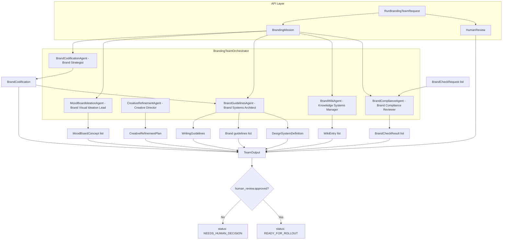
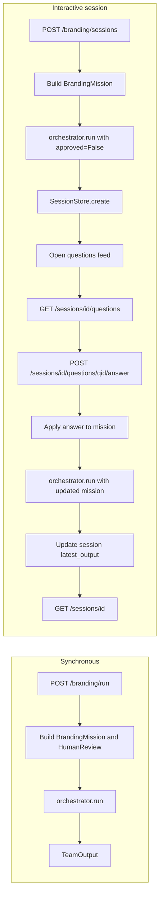
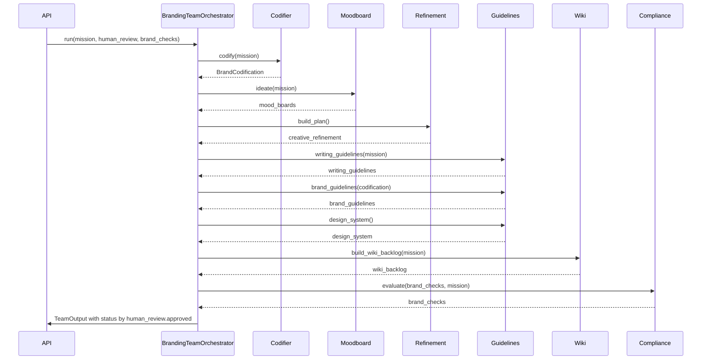

# Branding Strategy Team

This team defines and operationalizes an enterprise brand system through a coordinated group of specialist agents.

## What this team does

1. **Codifies brand identity** with positioning, promise, and narrative pillars.
2. **Ideates brand images** through multiple mood-board concepts.
3. **Guides refinement** with a structured creative workshop and decision framework.
4. **Defines writing guidelines, brand guidelines, and design system standards** for consistent delivery.
5. **Builds and maintains a brand wiki backlog** so the entire organization can work from a shared source of truth.
6. **Fields on-brand requests** by evaluating assets and returning confidence, rationale, and revision suggestions.
7. **Runs an interactive asynchronous clarification loop** where open questions are published to a feed and answered one-by-one.

## Agent setup and flow

The orchestrator coordinates six specialist agents. Inputs are `BrandingMission`, `HumanReview`, and optional `BrandCheckRequest` list; output is a single `TeamOutput` whose status depends on `human_review.approved`.



## API and session flow

**Synchronous:** `POST /branding/run` builds mission and human review, runs the orchestrator once, and returns `TeamOutput`.

**Interactive session:** create a session (orchestrator runs with `approved=False`), then read open questions, answer them one-by-one; each answer updates the mission and the orchestrator is re-run to refresh artifacts.



## Agent roles and outputs

| Agent | Role | Input | Output |
|-------|------|--------|--------|
| **BrandCodificationAgent** | Brand Strategist | BrandingMission | BrandCodification (positioning, promise, pillars) |
| **MoodBoardIdeationAgent** | Brand Visual Ideation Lead | BrandingMission | List of MoodBoardConcept |
| **CreativeRefinementAgent** | Creative Director | — | CreativeRefinementPlan (phases, prompts, criteria) |
| **BrandGuidelinesAgent** | Brand Systems Architect | Mission + Codification | WritingGuidelines, brand guidelines list, DesignSystemDefinition |
| **BrandWikiAgent** | Knowledge Systems Manager | BrandingMission | List of WikiEntry (backlog) |
| **BrandComplianceAgent** | Brand Compliance Reviewer | BrandCheckRequest list + Mission | List of BrandCheckResult |

### Orchestrator run sequence

Within a single `orchestrator.run()` call, agents are invoked in this order; all outputs are combined into `TeamOutput`.



## API

Start:

```bash
uvicorn branding_team.api.main:app --reload --host 0.0.0.0 --port 8012
```

### Synchronous team run

```http
POST /branding/run
```

Use this endpoint when you already have all required information and only need the final team output.

### Interactive asynchronous workflow

This workflow is designed for human-in-the-loop clarification and progressive refinement.

1. **Create session** and generate initial outputs plus open questions:

```http
POST /branding/sessions
```

2. **Read current session state** (mission + latest output + open/answered questions):

```http
GET /branding/sessions/{session_id}
```

3. **Read open-question feed** for the session:

```http
GET /branding/sessions/{session_id}/questions
```

4. **Answer one question at a time**; the mission is updated and branding artifacts are regenerated:

```http
POST /branding/sessions/{session_id}/questions/{question_id}/answer
```

### Example session creation payload

```json
{
  "company_name": "Northstar Labs",
  "company_description": "A product and AI enablement consultancy for B2B software teams",
  "target_audience": "VP Product and Design leaders",
  "values": ["clarity", "craft", "trust"],
  "differentiators": ["hands-on operators", "speed to value"],
  "desired_voice": "clear, practical, confident",
  "brand_checks": [
    {
      "asset_name": "Q3 product launch landing page",
      "asset_description": "Highlights measurable business outcomes with proof and concise messaging"
    }
  ]
}
```

### Example answer payload

```json
{
  "answer": "Use clear, practical, and direct language for technical buyers"
}
```

## Notes on session behavior

- Sessions are currently stored **in memory** in the API process.
- Restarting the API clears active session state.
- Each answer is applied immediately to the mission context, then the orchestrator reruns to refresh output artifacts.
