# Software Engineering Team

A multi-agent system that simulates a real software engineering team with a mix of seniority and domain expertise.

## Team Structure

| Agent | Phase | Role | Expertise |
|-------|-------|------|------------|
| **Spec Intake** | Discovery | Spec validator | Validates spec, REQ-IDs, glossary, assumptions |
| **Project Planning Agent** | Discovery | Spec reviewer | Reviews `initial_spec.md`, produces features/functionality overview; used by Tech Lead and Architecture |
| **Architecture Expert** | Design | System designer | Designs system architecture from requirements; output used by all other agents |
| **Tech Lead** | Design | Staff-level orchestrator | Uses initial_spec to generate full build plan; distributes work by dependency; tracks progress; triggers documentation (uses Spec Chunk Analyzer, Spec Analysis Merger, Task Generator for large specs) |
| **Git Setup Agent** | Setup | Repo setup | Creates `work_path/backend` and `work_path/frontend` clones/branches; ensures `development` branch |
| **Backend Expert** | Implementation | Backend engineer | Implements solutions in Python or Java; runs autonomous workflow with quality gates |
| **Frontend Expert** (via Frontend Engineering Team) | Implementation | Frontend sub-orchestration | UX Designer, UI Designer, Design System, Frontend Architect, Feature Implementation, UX Engineer, Accessibility, Security, Performance Engineer, QA, Build/Release, Code Review – full pipeline per task |
| **Code Review Agent** | Quality | Code reviewer | Reviews code against spec, standards, and acceptance criteria (uses Chunk Reviewer + Coordinator for large codebases) |
| **QA Expert** | Quality | Quality assurance | Reviews for bugs; produces integration/unit tests and README content (persisted to repo) |
| **Cybersecurity Expert** | Quality | Security specialist | Reviews code for security flaws per task (backend and frontend); remediates vulnerabilities |
| **Accessibility Expert** | Quality | A11y specialist | Reviews frontend for WCAG 2.2 compliance |
| **Acceptance Verifier** | Quality | Criteria checker | Verifies each task acceptance criterion is satisfied with evidence |
| **DbC Comments Agent** | Quality | Design by Contract | Adds pre/postconditions and invariants to code |
| **Integration Agent** | Integration/release | Full-stack validator | Validates backend-frontend API contract alignment after workers complete |
| **DevOps Expert** | Integration/release | Infrastructure specialist | CI/CD pipelines, IaC (Terraform, etc.), Docker, networking |
| **Documentation Agent** | Integration/release | Technical writer | Updates README and project docs |

## Coding Standards

All agents enforce these rules for produced code:

| Rule | Description |
|------|--------------|
| **Design by Contract** | Preconditions, postconditions, and invariants on all public APIs |
| **SOLID** | Single responsibility, Open/Closed, Liskov, Interface segregation, Dependency inversion |
| **Documentation** | Comment blocks on every class/method/function: how used, why it exists, constraints enforced |
| **Test Coverage** | Minimum 85% coverage; CI fails if below |
| **README** | Must include build, run, test, and deploy instructions |
| **Git Branching** | Work on `development` branch; PR to merge into `main`. Tech Lead creates `development` if missing |
| **Commit Messages** | Conventional Commits format: `type(scope): description` (feat, fix, docs, test, ci, etc.) |

## Sub-teams and SDLC

Agents are grouped by **SDLC phase** and **who consumes whose output**. Execution is driven by **task assignee** (`backend`, `frontend`, `devops`, `git_setup`). QA and Security are **not** task assignees; they are invoked **inside** backend and frontend workflows (per task) and in a final full-codebase security pass.

### Six SDLC Phases

| Phase | Sub-team | Agents |
|-------|----------|--------|
| **Discovery** | planning_team (intake) | Spec Intake, Project Planning |
| **Design** | planning_team | Architecture Expert, Tech Lead, domain planning agents (API Contract, Data Architecture, UI/UX, Frontend Architecture, Infrastructure, DevOps Planning, QA Test Strategy, Security Planning, Observability, Performance Doc), planning consolidation |
| **Setup** | top-level | Git Setup |
| **Implementation** | backend | Backend Expert |
| **Implementation** | frontend_team | UX Designer, UI Designer, Design System, Frontend Architect, Feature Agent, UX Engineer, Performance Engineer, Build/Release |
| **Quality** | quality gates (cross-cutting) | Code Review, QA Expert, Cybersecurity Expert, Accessibility Expert, Acceptance Verifier, DbC Comments |
| **Integration / release** | top-level | Integration Agent, DevOps Expert, Documentation Agent |

**Planning team sub-groups:** Within `planning_team/`, **Discovery** (intake) = Spec Intake, Project Planning. **Design** = Architecture, Tech Lead, and all domain planning agents. The Tech Lead uses planning graph agents (backend, frontend, data, test, performance, documentation, quality-gate planning) internally when creating task details and aligning with Architecture.

**Accessibility:** Lives under `frontend_team/` but is conceptually part of the **Quality** phase—it reviews frontend code for WCAG 2.2 compliance and is invoked per frontend task.

### SDLC Flow Diagram

```mermaid
flowchart LR
  subgraph discovery [Discovery]
    SpecIntake
    ProjectPlanning
  end

  subgraph design [Design and planning]
    Architecture
    TechLead
    DomainPlanning[API Contract, Data Arch, UI/UX, etc.]
  end

  subgraph setup [Setup]
    GitSetup
  end

  subgraph implementation [Implementation]
    Backend[Backend worker]
    Frontend[Frontend worker]
  end

  subgraph quality [Quality and review]
    CodeReview
    QA
    Security
    Accessibility
    AcceptanceVerifier
    DbcComments
  end

  subgraph integration [Integration and release]
    IntegrationAgent
    DevOps
    Documentation
  end

  discovery --> design
  design --> setup
  setup --> implementation
  implementation --> quality
  quality --> integration
```



### Per-Task Workflow Gates

**Backend:** build verification → code review → acceptance verifier → security → QA → DbC → Tech Lead review → documentation

**Frontend:** design (optional, skipped for lightweight tasks) → implementation → build → code review → QA → accessibility → security → acceptance verifier → DbC → Tech Lead → documentation

**Frontend internal pipeline order:** UX Designer → UI Designer → Design System → Frontend Architect → Feature Implementation → UX Engineer → Performance Engineer → Build/Release

## Plan folder

All planning artifacts are written to a `plan/` folder at the project root (work path). The folder is created when the spec is first ingested successfully. Artifacts include:

- `plan/spec_lint_report.md`, `plan/glossary.md`, `plan/assumptions_and_questions.md`, `plan/acceptance_criteria_index.md` (Spec Intake)
- `plan/project_overview.md`, `plan/features_and_functionality.md` (Project Planning)
- `plan/architecture.md` (Architecture)
- `backend/openapi.yaml`, `plan/api_error_model.md`, `plan/api_versioning.md`, `plan/contract_tests_plan.md` (API Contract)
- `plan/data_schema.md`, `plan/data_architecture.md` (Data Architecture)
- `plan/ui_ux.md` (UI/UX Design)
- `plan/frontend_architecture.md` (Frontend Architecture)
- `plan/infrastructure.md` (Infrastructure)
- `plan/devops_pipeline.md` (DevOps)
- `plan/test_strategy.md` (QA Test Strategy)
- `plan/security_and_compliance.md` (Security)
- `plan/observability.md` (Observability)
- `plan/performance.md` (Performance)
- `plan/tech_lead.md` (Tech Lead task plan)
- `plan/master_plan.md` (Consolidated master plan, risk register, ship checklist)
- `plan/backend_task_<task_id>.md`, `plan/frontend_task_<task_id>.md` (Per-task implementation plans from coding agents)

## Flow

1. **Load spec** – Read `initial_spec.md` from the repo. Create `plan/` folder on first successful ingest.
2. **Spec Intake and Validation** (optional) – Validates spec, produces REQ-IDs, glossary, assumptions.
3. **Project Planning** produces a features/functionality document from the spec.
4. **Tech Lead** (using planning sub-agents: backend, frontend, data, test, performance, documentation, quality gates) and **Architecture Expert** iterate until tasks and architecture align.
5. **Planning agents** (API Contract, Data Architecture, UI/UX, Infrastructure, Frontend Architecture, DevOps, QA Test Strategy, Security, Observability, Performance) produce additional artifacts in `plan/`.
6. **Planning consolidation** produces `plan/master_plan.md` with risk register and ship checklist.
7. **Tech Lead** generates a complete build plan and assigns tasks (git_setup, devops, backend, frontend).
5. **Backend and Frontend workers** run in parallel. Each task follows a unified workflow:
   - Create feature branch
   - **Per-task planning** – Review codebase, produce implementation plan (feature intent, what to change, algorithms/data structures, tests needed). The plan drives the implementation; code generation must realize the plan's what_changes and tests_needed.
   - Generate code (with clarification loop via Tech Lead if needed)
   - **Build verification** (pytest for backend, ng build for frontend)
   - **Code review** (against spec and standards)
   - **Acceptance criteria verification** (optional; per-criterion check)
   - **Security review** (per task for backend; per task for frontend)
   - **QA review** (backend: bugs + persisted integration/unit tests and README)
   - **Accessibility review** (frontend only)
   - **DbC comments** (add pre/postconditions)
   - Merge to development, Tech Lead review, Documentation update
9. **Integration phase** – After workers complete, Integration Agent validates backend-frontend API contract alignment.
10. **Final security** (full codebase) and **documentation** pass when Tech Lead requests.
11. **Retry path** – Failed tasks are retried through the same full workflow (build, code review, QA, a11y, security, DBC).

## Requirements

- **Frontend builds:** NVM and Node v22.12+ (or v20.19+). The pipeline uses NVM to run Angular CLI. Install [NVM](https://github.com/nvm-sh/nvm) and run `nvm install 22.12`.

## Quick Start

```bash
cd software_engineering_team
pip install -r requirements.txt
python -m agent_implementations.run_team
```

Or from the project root:

```bash
python software_engineering_team/agent_implementations/run_team.py
```

By default, the script uses `DummyLLMClient` for testing without an LLM. To use a real model (e.g. Ollama), set environment variables or edit `run_team.py` and set `USE_DUMMY = False`.

**LLM configuration (environment variables):**

| Variable | Description | Default |
|----------|-------------|---------|
| `SW_LLM_PROVIDER` | `dummy` or `ollama` | `dummy` |
| `SW_LLM_MODEL` | Model name for Ollama | `qwen3-coder-next:cloud` |
| `SW_LLM_BASE_URL` | Ollama API base URL | `http://127.0.0.1:11434` |
| `SW_LLM_TIMEOUT` | Timeout in seconds | `1800` |
| `SW_LLM_MAX_RETRIES` | Max retries for 429/5xx errors | `4` |
| `SW_LLM_BACKOFF_BASE` | Base seconds for exponential backoff | `2` |
| `SW_LLM_BACKOFF_MAX_SECONDS` | Max backoff seconds | `60` |
| `SW_LLM_MAX_CONCURRENCY` | Max concurrent LLM calls (default 4; set 4–6 for faster runs with parallel planning and backend+frontend workers; lower to 2 if GPU/memory limited) | `4` |
| `SW_LLM_MAX_TOKENS` | Max tokens to generate; if unset, uses min(context size, 32768) so APIs that cap output (e.g. 32K) work | 32768 (capped) |
| `SW_LLM_CONTEXT_SIZE` | Context window in tokens; if unset, uses known model table or Ollama /api/show. Effective context = max minus largest agent reservation. qwen3-coder-next:cloud, qwen3.5:397b-cloud: 256K max (242K effective). minimax-m2.5:cloud, glm-5:cloud: 198K max (178K/80K effective). If tech_lead planning fails on large specs with glm-5, set `SW_LLM_CONTEXT_SIZE=198000` | (model-dependent) |
| `SW_ENABLE_PLANNING_CACHE` | Reuse cached TaskAssignment when spec and architecture unchanged; set to `0` or `false` to disable | `1` (enabled) |

**Per-agent model configuration:** Each agent can use a different model. Set `SW_LLM_MODEL_<agent_key>` to override (e.g. `SW_LLM_MODEL_backend`, `SW_LLM_MODEL_tech_lead`). Model resolution order: per-agent env var → `SW_LLM_MODEL` (global fallback) → recommended default for that agent → `qwen3-coder-next:cloud`.

Recommended defaults (all :cloud versions) when no overrides are set:

| Model | Agents |
|-------|--------|
| qwen3-coder-next:cloud | backend, frontend, code_review, repair, devops, dbc_comments |
| glm-5:cloud | tech_lead, architecture, spec_intake, project_planning, integration |
| qwen3.5:397b-cloud | api_contract, data_architecture, ui_ux, frontend_architecture, infrastructure, devops_planning, qa_test_strategy, security_planning, observability, acceptance_verifier, documentation |
| minimax-m2.5:cloud | qa, security, accessibility |

Example: `export SW_LLM_MODEL_tech_lead=glm-5:cloud` overrides only the Tech Lead; other agents use their defaults or `SW_LLM_MODEL`.

Example with Ollama:
```bash
export SW_LLM_PROVIDER=ollama
export SW_LLM_MODEL=qwen3-coder-next:cloud
python -m agent_implementations.run_team
```

Ensure Ollama is running with the model (e.g. `ollama run qwen3-coder-next:cloud`). If you use a different API (OpenRouter, Together, etc.) or get a "model not found" error, set `SW_LLM_MODEL` to a model your API supports (e.g. `export SW_LLM_MODEL=llama3.2` for Ollama, or your provider's model id).

**Iteration caps (environment variables):** Lowering these can speed runs but may reduce refinement.

| Variable | Description | Default |
|----------|-------------|---------|
| `SW_MAX_ALIGNMENT_ITERATIONS` | Max Tech Lead ↔ Architecture alignment loops | `20` |
| `SW_MAX_CONFORMANCE_RETRIES` | Max spec conformance retries | `20` |
| `SW_MAX_REVIEW_ITERATIONS` | Max code review → fix rounds (backend) | `20` |
| `SW_MAX_CLARIFICATION_ROUNDS` | Max clarification rounds (backend) | `20` |
| `SW_MAX_SAME_BUILD_FAILURES` | Stop if build fails identically N times (backend) | `6` |
| `SW_MAX_CODE_REVIEW_ITERATIONS` | Max code review rounds (frontend) | `20` |
| `SW_MAX_CLARIFICATION_REFINEMENTS` | Max clarification refinements (frontend) | `20` |

**Faster runs:** Set `SW_SKIP_PLANNING_AGENTS=observability,performance_doc` to skip specific planning agents, or `SW_MINIMAL_PLANNING=1` to skip all domain planning (spec → Tech Lead ↔ Architecture → consolidation → execution).

### Planning cache and stable spec

When `SW_ENABLE_PLANNING_CACHE=1` (default), the first successful planning run stores the `TaskAssignment` under a cache key derived from spec, architecture, and project overview. Subsequent runs on the same repo with an unchanged spec reuse the cached plan and skip alignment/conformance loops, making planning much faster.

**Stable spec per branch practice:**

- When you branch for a feature, keep `initial_spec.md` mostly stable for that branch.
- If you need a substantial spec change, make it once, then re-run the team to regenerate a new cached plan.
- For small, non-structural edits (typos, wording clarifications), batch changes rather than repeatedly invoking the full team on slightly different specs.

**Verifying the cache:** Run the team twice on the same repo/spec. The second run should log `Planning cache HIT (key=...)` and `Using cached planning result (skipping alignment/conformance)`. To force a fresh plan, change the spec enough that the cache key changes, or set `SW_ENABLE_PLANNING_CACHE=0`.

### Faster runs summary

- **Parallel planning:** Domain planning agents (API Contract, Data Arch, UI/UX, Infra, etc.) run in dependency tiers with internal parallelism (Tier 1 → Tier 2 → Tier 3).
- **LLM concurrency:** Default `SW_LLM_MAX_CONCURRENCY=4`; set 4–6 for faster runs when GPU/memory allows.
- **Skip planning:** `SW_SKIP_PLANNING_AGENTS` or `SW_MINIMAL_PLANNING=1` for time-sensitive runs.
- **Iteration caps:** Lower `SW_MAX_*` env vars to reduce refinement rounds (may reduce quality).

### Future improvements (design only)

- **Task-aware context truncation:** Prefer files relevant to the current task (route/component from description) within `MAX_EXISTING_CODE_CHARS`; risks dropping critical files if heuristics fail.
- **Parallel backend/frontend tasks:** Run multiple backend (or frontend) tasks concurrently via clone-per-worker or branch-per-task with serialized merges; high complexity, only if profiling shows task execution dominates after planning is parallelized.

## API

An HTTP API lets you run the team on a git repo by providing a local path:

```bash
# Start the API server
cd software_engineering_team
pip install -r requirements.txt
python agent_implementations/run_api_server.py
```

Then POST to `http://127.0.0.1:8000/run-team`:

```json
{
  "repo_path": "/path/to/your/git/repo",
  "use_llm_for_spec": true
}
```

**Requirements:**
- `repo_path` must be a valid directory and a git repository (has `.git`)
- The repo must contain `initial_spec.md` at the root with the full project specification

**Response:** Architecture overview, task IDs, task results, `git_branch_setup` (development branch), and status.

Use `test_repo/` as a sample (includes `initial_spec.md`):
```bash
curl -X POST http://127.0.0.1:8000/run-team \
  -H "Content-Type: application/json" \
  -d '{"repo_path": "./test_repo"}'
```

## Logging and debugging

Agents log progress at INFO level so you can see what’s happening at each step.

**When running the API server**, logs go to stderr. Example output:

```
15:57:33 | INFO    | spec_parser | Parsing spec with LLM (1234 chars)
15:57:33 | INFO    | architecture_agent.agent | Architecture Expert: starting design for Task Manager API
15:57:33 | INFO    | architecture_agent.agent | Architecture Expert: done, 2 components
15:57:33 | INFO    | tech_lead_agent.agent | Tech Lead: planning tasks for Task Manager API
15:57:33 | INFO    | tech_lead_agent.agent | Tech Lead: assigned 2 tasks in order ['t1', 't2']
15:57:33 | INFO    | api.main | Pipeline: Task t1 (backend) -> backend
15:57:33 | INFO    | backend_agent.agent | Backend: implementing task 'Implement API'
15:57:33 | INFO    | backend_agent.agent | Backend: done, code=0 chars, summary=0 chars
```

**Verbose mode (DEBUG):** For more detail, use `shared.logging_config`:

```python
from shared.logging_config import setup_logging
setup_logging(level=logging.INFO, verbose=True)  # Agent loggers at DEBUG
```

**Write logs to a file:**

```python
from pathlib import Path
from shared.logging_config import setup_logging
setup_logging(level=logging.INFO, log_file=Path("agent.log"))
```

**Run tests with visible logs:**

```bash
pytest tests/ -v --log-cli-level=INFO
```

**Finding error-resolution prompts:** When agents fix build failures, QA/security/code review issues, they enter problem-solving mode. To see what the agent is doing when resolving errors:

- Search for `LLM call` – each LLM invocation logs one short line: `agent=Backend|Frontend`, `mode=initial|problem_solving`, `task=...`, `prompt_len=N`. No prompt body is logged.
- Search for `problem-solving header for LLM` – shows the exact header text (instructions and issue summary) prepended to the prompt.
- Search for `problem-solving context` – shows structured issue counts (e.g. `qa_issues=2, code_review_issues=1`).

## Pipeline Diagram

```
Spec → Project Planning → Architecture + Tech Lead (alignment loop)
         ↓
    [Backend Worker]     [Frontend Worker]
    (run_workflow)       (run_workflow)
    Build → CodeReview → AcceptanceVerifier → Security → QA → DBC → Merge
         ↓                      ↓
    Integration Agent (backend + frontend contract alignment)
         ↓
    Final Security + Documentation
```

## Project Layout

```
software_engineering_team/
├── api/
│   └── main.py       # FastAPI app with /run-team endpoint
├── spec_parser.py    # Parses initial_spec.md into ProductRequirements
├── orchestrator.py   # Main pipeline orchestration
├── shared/           # LLM client, models, coding_standards, git_utils
├── git_setup_agent/
├── architecture_agent/
├── tech_lead_agent/
├── devops_agent/
├── security_agent/
├── backend_agent/
├── quality_gates/        # Cross-cutting review agents (Code Review, QA, Security, Acceptance Verifier, DbC)
├── integration_team/      # Post-execution agents (Integration, DevOps, Documentation)
├── frontend_team/         # All frontend engineering agents
│   ├── feature_agent/    # FrontendExpertAgent (implementation)
│   ├── accessibility_agent/
│   ├── ux_designer/
│   ├── ui_designer/
│   ├── design_system/
│   ├── frontend_architect/
│   ├── ux_engineer/
│   ├── performance_engineer/
│   ├── build_release/
│   └── orchestrator.py   # FrontendOrchestratorAgent
├── qa_agent/
├── integration_agent/   # Full-stack API contract validation
├── acceptance_verifier_agent/
├── code_review_agent/     # Chunk Reviewer + Coordinator for large code; single-call for small
├── dbc_comments_agent/
├── documentation_agent/
├── planning_team/           # All planning agents and infrastructure
│   ├── plan_dir.py          # ensure_plan_dir, get_plan_dir
│   ├── planning_graph.py   # PlanningGraph, compile to TaskAssignment
│   ├── planning_review.py  # alignment, spec conformance
│   ├── planning_consolidation.py
│   ├── validation.py
│   ├── spec_intake_agent/
│   ├── project_planning_agent/
│   ├── api_contract_planning_agent/
│   ├── data_architecture_agent/
│   ├── ui_ux_design_agent/
│   ├── frontend_architecture_agent/
│   ├── backend_planning_agent/
│   ├── frontend_planning_agent/
│   ├── data_planning_agent/
│   ├── infrastructure_planning_agent/
│   ├── devops_planning_agent/
│   ├── qa_test_strategy_agent/
│   ├── test_planning_agent/
│   ├── security_planning_agent/
│   ├── observability_planning_agent/
│   ├── performance_planning_agent/
│   ├── performance_planning_doc_agent/
│   ├── documentation_planning_agent/
│   ├── quality_gate_planning_agent/
│   ├── spec_chunk_analyzer/      # Tech Lead: analyzes spec chunks
│   ├── spec_analysis_merger/     # Tech Lead: merges chunk analyses
│   └── task_generator_agent/     # Tech Lead: fallback task plan from merged analysis
├── agent_implementations/
│   ├── run_team.py   # CLI orchestration script
│   └── run_api_server.py
├── shared/
│   └── logging_config.py  # setup_logging() for consistent agent logs
├── tests/            # pytest suite (spec, agents, pipeline, API)
├── test_repo/        # Sample repo with initial_spec.md
├── pyproject.toml
└── requirements.txt
```

The Tech Lead invokes planning agents (backend, frontend, data, test, performance, documentation, quality gates) internally when creating task details and aligning with Architecture.

Each agent has:
- `agent.py` – Core logic
- `models.py` – Input/output Pydantic models
- `prompts.py` – LLM prompt templates
