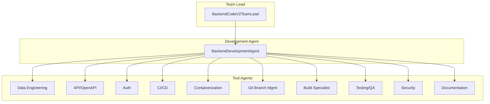
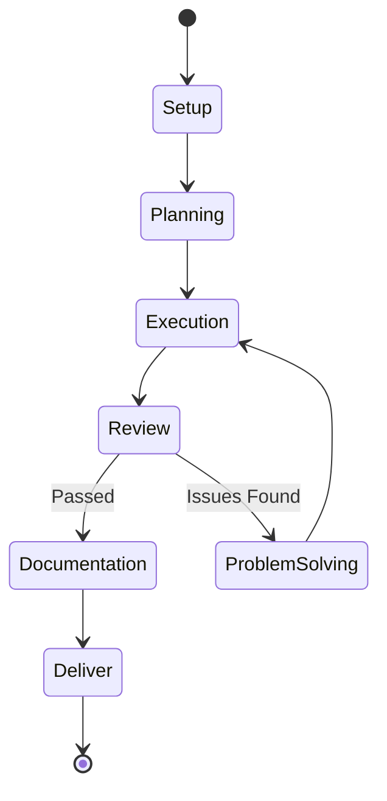

# Backend Code V2 Team

The Backend Code V2 Team is a standalone backend development system that produces production-ready backend code through a 7-phase workflow with 10 specialized tool agents.

## Architecture



### Two-Layer Structure

| Layer | Component | Responsibility |
|-------|-----------|----------------|
| Team Lead | `BackendCodeV2TeamLead` | Setup phase (repo init, branching), delegates to Development Agent |
| Development Agent | `BackendDevelopmentAgent` | Executes 5-phase cycle (Planning → Execution → Review → Problem-solving → Deliver) |

## Workflow Phases



### Phase Details

| Phase | Purpose | Output |
|-------|---------|--------|
| **Setup** | Initialize repo, create branches, base README | `SetupResult` |
| **Planning** | Generate microtasks from spec, detect language | `PlanningResult` with microtasks |
| **Execution** | Route microtasks to tool agents, produce code | `ExecutionResult` with files |
| **Review** | Code review, QA, security, build, lint checks | `ReviewResult` with issues |
| **Problem Solving** | Apply fixes for review issues | `ProblemSolvingResult` |
| **Documentation** | Add/update docstrings, README, API docs | `DocumentationPhaseResult` |
| **Deliver** | Commit, merge to main branch | `DeliverResult` |

The Review → Problem Solving → Execution cycle repeats up to 5 times until review passes.

## Tool Agents

| Agent | Execution Tasks | Review Participation |
|-------|-----------------|---------------------|
| **Data Engineering** | Database models, migrations, schemas | Schema validation |
| **API/OpenAPI** | REST endpoints, OpenAPI specs | API contract review |
| **Auth** | Authentication, authorization, JWT/OAuth | Security review |
| **CI/CD** | Pipeline config (GitHub Actions, etc.) | Pipeline validation |
| **Containerization** | Dockerfile, docker-compose | Container best practices |
| **Git Branch Management** | Branch creation, commits, merges | - |
| **Build Specialist** | Build scripts, dependency management | Build verification |
| **Testing/QA** | Unit tests, integration tests | Test coverage review |
| **Security** | Security scanning, vulnerability checks | Security audit |
| **Documentation** | Docstrings, README, API documentation | Documentation completeness |

## Microtask System

Work is broken into discrete microtasks during the Planning phase:

```python
class Microtask(BaseModel):
    id: str              # Unique kebab-case ID, e.g. "mt-create-user-model"
    title: str           # Short human-readable title
    description: str     # What needs to be done
    tool_agent: ToolAgentKind  # Which agent handles this
    status: MicrotaskStatus    # pending, in_progress, completed, failed, etc.
    depends_on: List[str]      # Prerequisite microtask IDs
    output_files: Dict[str, str]  # Files produced (path → content)
    notes: str           # Agent recommendations
```

### Microtask Statuses

| Status | Meaning |
|--------|---------|
| `pending` | Not yet started |
| `in_progress` | Currently being executed |
| `in_review` | Awaiting review |
| `in_documentation` | Documentation being added |
| `completed` | Successfully finished |
| `failed` | Failed after max retries |
| `review_failed` | Failed review, awaiting problem-solving |
| `skipped` | Skipped due to dependency failure |

## Usage

### Programmatic

```python
from shared.llm import LLMClient
from backend_code_v2_team.orchestrator import BackendCodeV2TeamLead
from pathlib import Path

llm = LLMClient()
lead = BackendCodeV2TeamLead(llm)

result = lead.run_workflow(
    task_id="task-001",
    task_title="User Authentication Service",
    task_description="Build JWT-based auth with refresh tokens...",
    repo_path=Path("/path/to/repo"),
    language="python",
)

if result.success:
    print(f"Backend complete: {result.summary}")
    print(f"Files created: {list(result.final_files.keys())}")
else:
    print(f"Failed: {result.failure_reason}")
```

### With Job Updates

```python
def update_job(**kwargs):
    print(f"Progress: {kwargs.get('progress', 0)}%")
    print(f"Phase: {kwargs.get('current_phase', 'unknown')}")

result = lead.run_workflow(
    task_id="task-001",
    task_title="API Server",
    task_description="FastAPI server with CRUD endpoints",
    repo_path=repo_path,
    job_updater=update_job,
)
```

## Per-Microtask Review Gates

Configure how review failures are handled:

```python
from backend_code_v2_team.models import MicrotaskReviewConfig

config = MicrotaskReviewConfig(
    max_retries=3,           # Max problem-solving attempts per microtask
    on_failure="skip_continue",  # "stop" or "skip_continue"
)
```

| Setting | Behavior |
|---------|----------|
| `on_failure="stop"` | Abort entire workflow if microtask fails after max retries |
| `on_failure="skip_continue"` | Mark failed, continue with next microtask |

## Review Issues

The Review phase identifies issues with severity levels:

```python
class ReviewIssue(BaseModel):
    source: str      # code_review, qa, security, build, lint
    severity: str    # critical, high, medium, low, info
    description: str
    file_path: str
    recommendation: str
```

Critical and high severity issues must be resolved before proceeding to Deliver.

## Language Support

The team auto-detects and supports:

| Language | Build Tools | Test Framework |
|----------|-------------|----------------|
| Python | pip, poetry, setup.py | pytest |
| Java | Maven, Gradle | JUnit |

## Output Files

The workflow produces files in `{repo_path}/backend/`:

```
backend/
├── src/
│   ├── models/           # Data models
│   ├── api/              # API endpoints
│   ├── auth/             # Authentication
│   ├── services/         # Business logic
│   └── utils/            # Utilities
├── tests/
│   ├── unit/
│   └── integration/
├── Dockerfile
├── docker-compose.yml
├── requirements.txt      # Python
├── pom.xml               # Java
├── README.md
└── openapi.yaml
```

## Configuration

| Variable | Description | Default |
|----------|-------------|---------|
| `MAX_REVIEW_ITERATIONS` | Max review → problem-solving cycles | 5 |

## Directory Structure

```
backend_code_v2_team/
├── orchestrator.py        # BackendCodeV2TeamLead, BackendDevelopmentAgent
├── models.py              # Phase, Microtask, all result models
├── prompts.py             # LLM prompts for phases
├── output_templates.py    # Code templates
├── phases/
│   ├── setup.py           # Repo initialization
│   ├── planning.py        # Microtask generation
│   ├── execution.py       # Run microtasks via tool agents
│   ├── review.py          # Code review, QA, security
│   ├── problem_solving.py # Fix issues
│   ├── documentation.py   # Add docs
│   └── deliver.py         # Commit and merge
└── tool_agents/
    ├── data_engineering/  # Database models, schemas
    ├── api_openapi/       # REST endpoints
    ├── auth/              # Authentication
    ├── cicd/              # CI/CD pipelines
    ├── containerization/  # Docker
    ├── git_branch_management/  # Git operations
    ├── build_specialist/  # Build scripts
    ├── testing_qa/        # Tests
    ├── security/          # Security scanning
    └── documentation/     # Documentation
```

## Integration with SE Team

Backend Code V2 is called by the main Software Engineering Team orchestrator for backend tasks:

1. SE Team receives a task classified as "backend"
2. Task is delegated to `BackendCodeV2TeamLead`
3. Backend V2 completes the 7-phase workflow
4. Results are returned to SE Team orchestrator
5. SE Team proceeds with integration, DevOps, etc.
