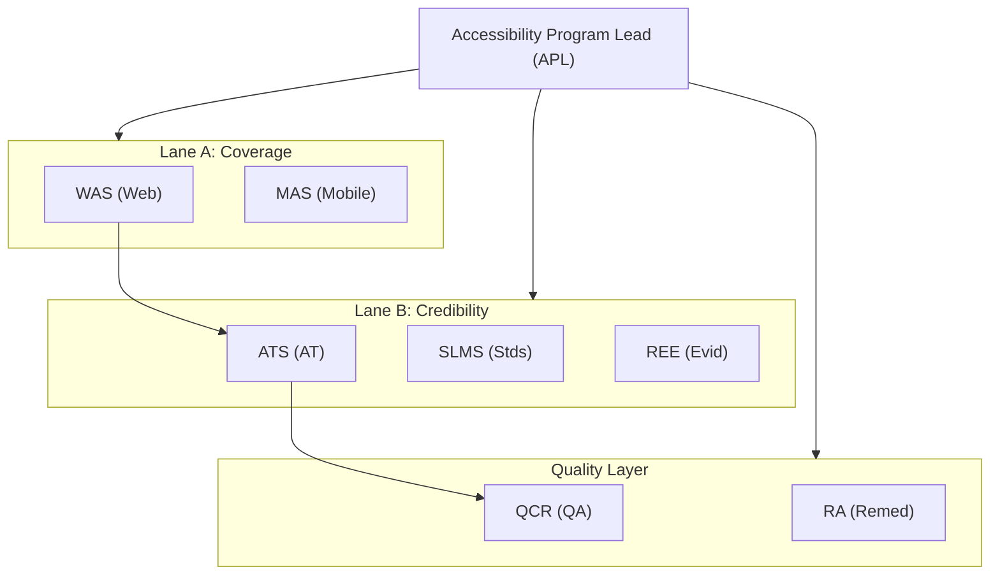
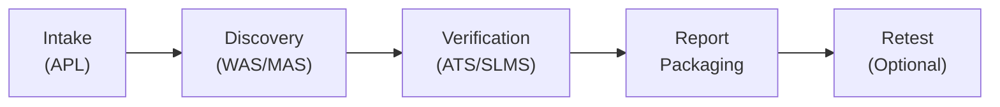

# Digital Accessibility Audit Team

A team of specialist agents that deliver **repeatable, evidence-backed accessibility audits** for websites, web applications, and mobile apps against WCAG 2.2 and Section 508 standards.

## Team Mission

Identify accessibility issues and frame them in two ways:

1. **Engineering reality:** what's broken, how to reproduce it, how to fix it, how to verify it
2. **Compliance reality:** which WCAG 2.2 success criteria are implicated, with clear confidence and rationale

### Non-Goals

- Not producing VPAT/ACR artifacts (explicitly deferred)
- Not doing pixel-perfect UI QA except where it impacts accessibility
- Not claiming legal advice; output is a technical assessment with Section 508 mapping tags

## Architecture



### Specialist Agents (8 Core)

| Agent | Code | Owns | Outputs |
|-------|------|------|---------|
| **Accessibility Program Lead** | APL | Scope, strategy, coverage, final report | AuditPlan, CoverageMatrix, FinalReport |
| **Web Audit Specialist** | WAS | Manual web testing + scan orchestration | Web findings with proof drafts |
| **Mobile Accessibility Specialist** | MAS | iOS/Android testing, device repro | Mobile findings with platform fixes |
| **Assistive Technology Specialist** | ATS | AT verification as truth layer | AT-verified impact statements |
| **Standards & Legal Mapping Specialist** | SLMS | Correct WCAG mapping + Section 508 tags | Standards mapping with confidence |
| **Reproduction & Evidence Engineer** | REE | Proof bundles and reproducibility | Evidence packs + minimal repros |
| **Remediation Advisor** | RA | Fix guidance + acceptance criteria | Developer-ready remediation |
| **QA & Consistency Reviewer** | QCR | Quality bar enforcement + dedupe | Approved backlog + report readiness |

### Add-On Agents (3)

| Agent | Code | Purpose |
|-------|------|---------|
| **Accessibility Education & Training** | AET | Mines patterns from findings and builds training modules |
| **Accessibility Regression Monitor** | ARM | Continuous monitoring with baseline diffing and alerts |
| **Accessible Design System Engineer** | ADSE | Hardens design system components with a11y contracts |

## Workflow Phases



### Phase 0: Intake
- APL collects scope, platforms, environments, constraints
- Produces: AuditPlan, CoverageMatrix, TestRunConfig

### Phase 1: Discovery
- WAS/MAS run scans (signal only!) and manual testing
- REE starts evidence capture
- QCR dedupes and identifies patterns
- Produces: FindingDraft[], ScanResults, InitialPatterns

### Phase 2: Verification
- ATS verifies findings with AT testing (truth layer)
- SLMS confirms WCAG mappings with confidence
- RA adds remediation guidance
- Produces: FindingVerified[]

### Phase 3: Report Packaging
- QCR runs final quality gate
- APL produces exec summary and roadmap
- Produces: FinalBacklog, ExecutiveSummary, Roadmap

### Phase 4: Retest (Optional)
- Triggered after fixes
- Targeted re-tests using acceptance criteria
- Close findings with evidence of fix

## Installation

```python
from agents.accessibility_audit_team import (
    AuditRequest,
    MobileAppTarget,
    WCAGLevel,
)
from agents.accessibility_audit_team.orchestrator import (
    AccessibilityAuditOrchestrator,
    run_accessibility_audit,
)
```

## Quick Start

### Run a Simple Web Audit

```python
import asyncio
from agents.accessibility_audit_team.orchestrator import run_accessibility_audit

result = asyncio.run(run_accessibility_audit(
    web_urls=[
        "https://example.com",
        "https://example.com/login",
        "https://example.com/checkout",
    ],
    critical_journeys=["login", "checkout"],
    audit_name="Example.com Accessibility Audit",
    max_pages=50,
))

print(f"Findings: {result.total_findings}")
print(f"Critical: {result.critical_count}")
print(f"Patterns: {len(result.final_patterns)}")
```

### Run a Full Audit with Mobile Apps

```python
from agents.accessibility_audit_team.models import AuditRequest, MobileAppTarget, WCAGLevel
from agents.accessibility_audit_team.orchestrator import AccessibilityAuditOrchestrator

# Create the orchestrator
orchestrator = AccessibilityAuditOrchestrator()

# Create audit request
request = AuditRequest(
    audit_id="audit-2024-001",
    name="Product Suite Accessibility Audit",
    web_urls=["https://app.example.com", "https://app.example.com/dashboard"],
    mobile_apps=[
        MobileAppTarget(platform="ios", name="ExampleApp", version="3.1.0"),
        MobileAppTarget(platform="android", name="ExampleApp", version="3.1.0"),
    ],
    critical_journeys=["login", "onboarding", "purchase"],
    timebox_hours=40,
    auth_required=True,
    max_pages=100,
    sampling_strategy="journey_based",
    wcag_levels=[WCAGLevel.A, WCAGLevel.AA],
)

# Run the audit
result = await orchestrator.run_audit(
    request,
    tech_stack={"web": "react", "mobile": "native"},
)

# Access results
for finding in result.final_findings:
    print(f"[{finding.severity.value}] {finding.title}")
    print(f"  Target: {finding.target}")
    print(f"  WCAG: {[m.sc for m in finding.wcag_mappings]}")
    print(f"  Fix: {finding.recommended_fix}")
```

## API Endpoints

The team exposes a REST API via FastAPI:

| Method | Path | Description |
|--------|------|-------------|
| POST | `/audit/create` | Create and start an audit |
| GET | `/audit/status/{job_id}` | Poll audit status |
| GET | `/audit/{audit_id}/findings` | Get findings list |
| GET | `/audit/{audit_id}/report` | Get final report |
| POST | `/audit/{audit_id}/retest` | Run verification after fixes |
| POST | `/audit/{audit_id}/export` | Export backlog (JSON/CSV) |
| POST | `/monitor/baseline` | Create monitoring baseline |
| POST | `/monitor/run` | Run monitoring checks |
| GET | `/monitor/diff/{run_id}` | Get diff against baseline |
| POST | `/designsystem/inventory` | Build component inventory |
| POST | `/designsystem/contract` | Generate a11y contract |
| GET | `/health` | Health check |

### Example API Usage

```bash
# Create an audit
curl -X POST http://localhost:8080/api/accessibility-audit/audit/create \
  -H "Content-Type: application/json" \
  -d '{
    "name": "My Audit",
    "web_urls": ["https://example.com"],
    "critical_journeys": ["login", "checkout"],
    "wcag_levels": ["A", "AA"]
  }'

# Check status
curl http://localhost:8080/api/accessibility-audit/audit/status/{job_id}

# Get findings
curl http://localhost:8080/api/accessibility-audit/audit/{audit_id}/findings
```

### Job Tracking

Audit and retest jobs are tracked through the shared centralized job management layer
(`shared_job_management.CentralJobManager`) under the `accessibility_audit_team` namespace.
This provides persistent, file-backed job state and consistent lifecycle handling across team APIs.

## Finding Quality Bar

A finding is "reportable" only if it includes:

- ✅ Repro steps that a dev can follow
- ✅ Expected vs actual behavior
- ✅ User impact statement (who is harmed and how)
- ✅ Evidence artifacts (at least one)
- ✅ Standards mapping (WCAG SC + confidence)
- ✅ Remediation notes + acceptance criteria + test plan

**Findings without evidence or repro steps are NOT reportable.**

## Taxonomy

| Dimension | Values |
|-----------|--------|
| **Surface** | `web`, `ios`, `android`, `pdf` |
| **Issue Types** | `name_role_value`, `keyboard`, `focus`, `forms`, `contrast`, `structure`, `timing`, `media`, `motion`, `input_modality`, `error_handling`, `navigation`, `resizing_reflow`, `gestures_dragging`, `target_size` |
| **Severity** | `Critical`, `High`, `Medium`, `Low` |
| **Scope** | `Systemic`, `Multi-area`, `Localized` |
| **Confidence** | 0.0-1.0 |
| **Finding States** | `draft` → `needs_verification` → `verified` → `ready_for_report` → `closed` |

## Severity Model

| Level | Definition |
|-------|------------|
| **Critical** | Blocks core task completion, no workaround |
| **High** | Major friction, abandonment risk |
| **Medium** | Meaningful friction, workaround exists |
| **Low** | Minor friction, not urgent |

### Priority Sorting

1. Impact (severity)
2. Scope (systemic beats localized)
3. Critical journey relevance
4. Frequency of occurrence

## Two-Lane Execution Model

| Lane | Focus | Agents | Goal |
|------|-------|--------|------|
| **Lane A: Coverage** | Breadth | WAS, MAS | Fast discovery, wide sweep |
| **Lane B: Credibility** | Depth | ATS, SLMS, REE | AT verification, proper evidence |

QCR ensures Lane A doesn't dump garbage into Lane B.

## Guardrails (Hard Rules)

- ❌ No evidence → not reportable
- ❌ No repro steps → not reportable
- ⚠️ Automated scan ≠ confirmed issue (signals only!)
- ✅ Every finding must include: user impact, standards mapping with confidence, acceptance criteria
- ✅ Deduplicate by pattern, not by page count
- ✅ Prefer systemic fixes and design system contracts

## Tools Reference

### Core Orchestration
- `audit.create_plan` - Create audit plan and seed workspace
- `audit.build_coverage_matrix` - Produce SC x surface x journey coverage matrix
- `audit.export_backlog` - Export normalized findings for tracker ingestion

### Web Testing
- `web.run_automated_scan` - Run axe/lighthouse/pa11y scans (signal only)
- `web.record_keyboard_flow` - Capture tab order + focus states
- `web.capture_dom_snapshot` - DOM + computed styles + a11y tree
- `web.check_reflow_zoom` - Validate at 320px and zoom levels
- `web.compute_contrast_and_focus` - Contrast checks + focus ring visibility

### Mobile Testing
- `mobile.record_screen_reader_flow` - Record VoiceOver/TalkBack navigation
- `mobile.check_touch_targets` - Detect target size and spacing problems
- `mobile.check_font_scaling` - Test dynamic type / font scaling

### AT Verification
- `at.run_script` - Run standardized AT script and capture results

### Standards Mapping
- `standards.map_wcag` - Suggest WCAG SC mappings with confidence
- `standards.tag_section508` - Apply Section 508 reporting tags

### Evidence
- `evidence.create_pack` - Create evidence bundle with stable refs
- `repro.generate_minimal_case` - Isolate minimal repro snippet

### Remediation
- `remediation.suggest_fix` - Generate fix recipe + acceptance criteria
- `tests.generate_regression_checks` - Generate regression test scripts

### QA
- `qa.validate_finding` - Validate completeness and consistency
- `qa.cluster_patterns` - Dedupe and cluster findings into patterns

## Directory Structure

```
agents/accessibility_audit_team/
├── __init__.py
├── orchestrator.py                    # Main coordinator
├── models.py                          # Finding, AuditPlan, EvidencePack, etc.
├── prompts.py                         # LLM prompts for analysis
├── wcag_criteria.py                   # WCAG 2.2 success criteria
├── section_508_criteria.py            # Section 508 requirements
├── artifact_store.py                  # Unified storage for evidence
├── phases/
│   ├── intake.py                      # Phase 0
│   ├── discovery.py                   # Phase 1
│   ├── verification.py                # Phase 2
│   ├── report_packaging.py            # Phase 3
│   └── retest.py                      # Phase 4
├── agents/
│   ├── program_lead.py                # APL
│   ├── web_audit_specialist.py        # WAS
│   ├── mobile_accessibility_specialist.py  # MAS
│   ├── assistive_tech_specialist.py   # ATS
│   ├── standards_mapping_specialist.py # SLMS
│   ├── evidence_engineer.py           # REE
│   ├── remediation_advisor.py         # RA
│   └── qa_consistency_reviewer.py     # QCR
├── tools/
│   ├── audit/                         # Core orchestration tools
│   ├── web/                           # Web testing tools
│   ├── mobile/                        # Mobile testing tools
│   ├── at/                            # AT verification tools
│   ├── standards/                     # Standards mapping tools
│   ├── evidence/                      # Evidence tools
│   ├── remediation/                   # Remediation tools
│   └── qa/                            # QA tools
├── addons/
│   ├── training_agent.py              # AET
│   ├── monitoring_agent.py            # ARM
│   └── design_system_agent.py         # ADSE
├── api/
│   └── main.py                        # FastAPI endpoints
└── README.md
```

## WCAG 2.2 Coverage

The team tests against all WCAG 2.2 Level A and AA success criteria, including new 2.2 criteria:

- 2.4.11 Focus Not Obscured (Minimum)
- 2.4.12 Focus Not Obscured (Enhanced) - AAA
- 2.4.13 Focus Appearance - AAA
- 2.5.7 Dragging Movements
- 2.5.8 Target Size (Minimum)
- 3.2.6 Consistent Help
- 3.3.7 Redundant Entry
- 3.3.8 Accessible Authentication (Minimum)
- 3.3.9 Accessible Authentication (Enhanced) - AAA

## License

MIT License - See LICENSE file for details.


## Strands-Native Agency (KIN-27)

A fresh, deterministic Strands-style implementation now lives under:

`agents/accessibility_audit_team/a11y_agency_strands/`

It implements:
- a Python workflow coordinator (`app/workflows/engagement_workflow.py`)
- a dedicated orchestrator with phase + quality gate enforcement (`app/agents/orchestrator.py`)
- specialist agents exposed as tool functions with typed outputs (`app/agents/*.py`)
- local tool implementations for discovery, scanning, evidence, checklist/reporting, storage, and approvals (`app/tools/*.py`)
- contract tests covering execution order + hard gate behavior (`tests/contract_tests/`)

See `a11y_agency_spec.md` in that module for the exact phase sequence and gate contract.

## Khala platform

This package is part of the [Khala](../../../README.md) monorepo (Unified API, Angular UI, and full team index).
