# 01 — Component Architecture

This document captures *what* exists inside the Accessibility Audit Team,
how the pieces are grouped, and why. For *how they behave at runtime*, see
[`02-system-design.md`](./02-system-design.md). For *who calls them*, see
[`03-use-cases.md`](./03-use-cases.md).

## Architecture Diagram

```mermaid
graph TB
    subgraph API["API Layer — api/main.py"]
        ROUTER["FastAPI Router<br/>/api/accessibility-audit/*"]
        JOB["JobServiceClient<br/>_job_manager"]
    end

    subgraph ORCH["Orchestrator — orchestrator.py"]
        AAO["AccessibilityAuditOrchestrator<br/>run_audit / run_retest"]
        BUS["MessageBus<br/>agents/base.py"]
    end

    subgraph LANEA["Lane A — Coverage (fast, broad)"]
        WAS["WAS<br/>Web Audit Specialist"]
        MAS["MAS<br/>Mobile Accessibility Specialist"]
    end

    subgraph LANEB["Lane B — Credibility (deep, rigorous)"]
        ATS["ATS<br/>Assistive Tech Specialist<br/><i>truth layer</i>"]
        SLMS["SLMS<br/>Standards &amp; Legal Mapping"]
        REE["REE<br/>Reproduction &amp; Evidence Engineer"]
        RA["RA<br/>Remediation Advisor"]
    end

    subgraph QUAL["Orchestration &amp; Quality"]
        APL["APL<br/>Accessibility Program Lead"]
        QCR["QCR<br/>QA &amp; Consistency Reviewer<br/><i>gatekeeper</i>"]
    end

    subgraph ADDONS["Add-ons (opt-in via enable_addons)"]
        ARM["ARM<br/>Regression Monitor"]
        AET["AET<br/>Education &amp; Training"]
        ADSE["ADSE<br/>Design System Engineer"]
    end

    subgraph SHARED["Shared Services"]
        STORE["ArtifactStore<br/>artifact_store.py"]
        LLM["LLM Client<br/>llm_service.get_client"]
        STANDARDS["Standards Data<br/>wcag_criteria.py (29KB)<br/>section_508_criteria.py (21KB)"]
    end

    subgraph EXT["External"]
        PLAY["Playwright / device emulators"]
        SCAN["axe-core · Lighthouse · pa11y<br/><i>signals only</i>"]
        AT["NVDA · JAWS · VoiceOver · TalkBack"]
    end

    ROUTER --> JOB
    ROUTER --> AAO
    AAO --> APL
    AAO --> WAS
    AAO --> MAS
    AAO --> ATS
    AAO --> SLMS
    AAO --> REE
    AAO --> RA
    AAO --> QCR
    AAO -.optional.-> ARM
    AAO -.optional.-> AET
    AAO -.optional.-> ADSE

    APL <--> BUS
    WAS <--> BUS
    MAS <--> BUS
    ATS <--> BUS
    SLMS <--> BUS
    REE <--> BUS
    RA <--> BUS
    QCR <--> BUS

    WAS --> SCAN
    WAS --> PLAY
    MAS --> PLAY
    ATS --> AT
    SLMS --> STANDARDS
    APL --> LLM
    RA --> LLM
    QCR --> LLM

    AAO --> STORE
    REE --> STORE
    JOB --> STORE
```

Every node in the diagram maps to a concrete symbol in the codebase. See
the component inventory below for the 1:1 mapping.

## Component Inventory

### Entry points

| Component | File | Symbol | Responsibility |
|---|---|---|---|
| API router | `api/main.py` | `router` (FastAPI `APIRouter`) | REST surface at `/api/accessibility-audit/*` |
| Orchestrator | `orchestrator.py` | `AccessibilityAuditOrchestrator` | Top-level phase coordination, agent lifecycle, persistence |
| Team config | `backend/unified_api/config.py` | `TEAM_CONFIGS["accessibility_audit"]` | Mount prefix, tags, timeout |
| Job client | `api/main.py` | `JobServiceClient(team="accessibility_audit_team")` | Job lifecycle, stale-job monitoring |

### Core specialist agents

All eight core agents inherit from `BaseSpecialistAgent` in `agents/base.py`
and are instantiated once per orchestrator in `AccessibilityAuditOrchestrator.__init__`
(`orchestrator.py` lines 77–84). They share a single `MessageBus` instance
for inter-agent coordination.

| Agent | File | Class | Lane | Owns |
|---|---|---|---|---|
| APL | `agents/program_lead.py` | `AccessibilityProgramLead` | Orchestration | `AuditPlan`, `CoverageMatrix`, executive summary, roadmap |
| WAS | `agents/web_audit_specialist.py` | `WebAuditSpecialist` | Lane A | Web draft findings + scan results |
| MAS | `agents/mobile_accessibility_specialist.py` | `MobileAccessibilitySpecialist` | Lane A | iOS/Android draft findings |
| ATS | `agents/assistive_tech_specialist.py` | `AssistiveTechSpecialist` | Lane B | AT-verified impact statements; rejects false positives |
| SLMS | `agents/standards_mapping_specialist.py` | `StandardsMappingSpecialist` | Lane B | `WCAGMapping` entries with confidence + Section 508 tags |
| REE | `agents/evidence_engineer.py` | `EvidenceEngineer` | Lane B | `EvidencePack` artifacts and minimal reproducers |
| RA | `agents/remediation_advisor.py` | `RemediationAdvisor` | Lane B | Fix recipes, acceptance criteria, test plans |
| QCR | `agents/qa_consistency_reviewer.py` | `QAConsistencyReviewer` | Quality gate | Deduplication, pattern clustering, reportability enforcement |

### Optional add-ons

Add-ons are lazily imported and only instantiated when
`enable_addons=True` is passed to `AccessibilityAuditOrchestrator.__init__`
(`orchestrator.py` lines 62, 87–97). They have their own REST endpoints
under the same team prefix.

| Agent | File | Class | Endpoints | Triggered |
|---|---|---|---|---|
| ARM | `addons/monitoring_agent.py` | `AccessibilityMonitoringAgent` | `/monitor/baseline`, `/monitor/run`, `/monitor/diff/{run_id}` | Directly via API, or post-audit via `_run_addons` (`orchestrator.py:268`) |
| AET | `addons/training_agent.py` | `AccessibilityTrainingAgent` | *(internal)* | Post-audit via `_run_addons` when patterns exist |
| ADSE | `addons/design_system_agent.py` | `AccessibleDesignSystemAgent` | `/designsystem/inventory`, `/designsystem/contract` | Directly via API |

### Shared services

| Component | File | Notes |
|---|---|---|
| `MessageBus` | `agents/base.py` (class at line 36) | In-memory per-orchestrator bus; `send()` / `receive()` / `pending_count()` |
| `ArtifactStore` | `artifact_store.py` | High-level façade over `StorageBackend`; default `FileSystemBackend` rooted at `$AGENT_CACHE/accessibility_audit_team/artifacts` |
| LLM client | `llm_service.get_client("accessibility_audit")` | Injected into all agents by `get_orchestrator()` in `api/main.py:64` |
| Standards data | `wcag_criteria.py`, `section_508_criteria.py` | Pure Pydantic constants — data, not behavior |

### Domain models

All domain models live in `models.py`. The most important ones for
understanding the architecture:

| Model | Purpose |
|---|---|
| `Phase` (enum) | `INTAKE → DISCOVERY → VERIFICATION → REPORT_PACKAGING → RETEST` |
| `AuditRequest` | Incoming request; produced by the API from `CreateAuditRequest` |
| `AuditPlan` | Output of Phase 0 (owned by APL) |
| `Finding` | Core unit of output; reportable only when quality bar is met |
| `EvidencePack` | Bundle of screenshots, videos, DOM snapshots, a11y trees (REE) |
| `PatternCluster` | Systemic grouping of findings (QCR) |
| `CoverageMatrix` | `SC × Surface × Journey` coverage tracking |
| `AccessibilityAuditResult` | Top-level result containing all phase outputs |

## Two-Lane Execution Model

The eight core specialists are organized into two lanes separated by a
quality gatekeeper:

- **Lane A — Coverage (WAS, MAS).** Breadth-first. Runs automated scanners
  (axe-core, Lighthouse, pa11y), performs fast manual sweeps, and produces
  *draft* findings. WAS and MAS execute **concurrently** via `asyncio.gather`
  in `phases/discovery.py:82-84`.
- **Lane B — Credibility (ATS, SLMS, REE, RA).** Depth-first. Only runs on
  findings that already cleared the Lane A + QCR gate. ATS is the "truth
  layer" — it uses real AT scripts to confirm or reject findings. SLMS maps
  to WCAG SCs with confidence scores. REE captures evidence. RA produces
  remediation guidance.
- **Quality gatekeeper (QCR).** Sits between the lanes. Deduplicates,
  assigns `pattern_id`s, and enforces the reportability bar. QCR runs both
  at the end of Phase 1 (early dedupe) and at the start of Phase 3 (final
  quality gate).
- **Strategy owner (APL).** Not a "lane"; a coordinator. Owns the audit plan
  in Phase 0 and the executive report in Phase 3.

## Async Orchestrator vs. Strands-Native Variant

The team ships **two** implementations of the same workflow:

1. **`orchestrator.py` — async orchestrator (primary).** Python `asyncio`,
   in-memory `MessageBus`, artifact-store persistence after every phase.
   This is what `api/main.py` uses. It is flexible, messageable, and
   survives restarts via `_persist_audit` (`orchestrator.py:302`).
2. **`a11y_agency_strands/` — deterministic Strands variant.** A parallel
   Strands-native implementation with explicit, contract-testable phase
   sequencing via `EngagementOrchestrator` in
   `a11y_agency_strands/app/agents/orchestrator.py`. It is used for
   workflows that need hard determinism and replay guarantees.

Both implementations share the same domain models in `models.py` — in
particular, the async variant re-exports Strands architecture models like
`ArchitectureAuditPhaseResult` so results from either path are compatible.
New features should generally land in the async orchestrator first; the
Strands variant is updated when deterministic ordering guarantees are
required.

## Design Rationale

### Why eight specialists instead of one "do-it-all" agent?

Accessibility auditing spans unrelated technical surfaces (web DOM, iOS
UIAccessibility, Android TalkBack), unrelated skill types (manual
keyboard-first testing vs. screen reader scripting vs. WCAG legal
interpretation), and unrelated deliverables (evidence packs vs. executive
summaries). Splitting into specialists lets each agent hold a focused
prompt and a narrow tool vocabulary, which produces better results per
agent and keeps context windows manageable. It also makes the system
testable — each agent's `safe_process` contract can be unit-tested in
isolation via the fixtures in `tests/`.

### Why are add-ons opt-in rather than always on?

ARM, AET, and ADSE each carry real cost: ARM runs continuous checks
against remote targets, AET generates training bundles that are stored
permanently (see `artifact_store.py` `store_training_bundle` with
`RetentionPolicy.PERMANENT`), and ADSE makes a full pass over a design
system. For most audit requests none of that work is wanted. Gating them
behind `enable_addons` keeps the default path cheap and predictable while
still offering the capability when an operator wants it.

### Why is WCAG/508 data kept as code, not in a database?

`wcag_criteria.py` and `section_508_criteria.py` are pure Pydantic
constants. The WCAG 2.2 / Section 508 corpus changes infrequently, is
small enough to live in source control, and benefits enormously from
being reviewable via git diff. A database would add a deployment
dependency and make it harder to reason about which version of the
standard was in effect for any given audit.

### Why share one `MessageBus` instance across all agents?

Agents need to exchange typed `AgentMessage`s across phase boundaries
(for example, QCR signaling WAS about a dedupe decision). Passing the
same bus instance into every agent's constructor lets them use the
`send_message` / `receive_messages` contract defined in
`BaseSpecialistAgent` without knowing about transport details. A future
distributed execution mode could replace `MessageBus` with a
queue-backed implementation without touching any agent code — the
contract lives in one class.

---

**Next:** [`02-system-design.md`](./02-system-design.md) — how these
components behave over time.
