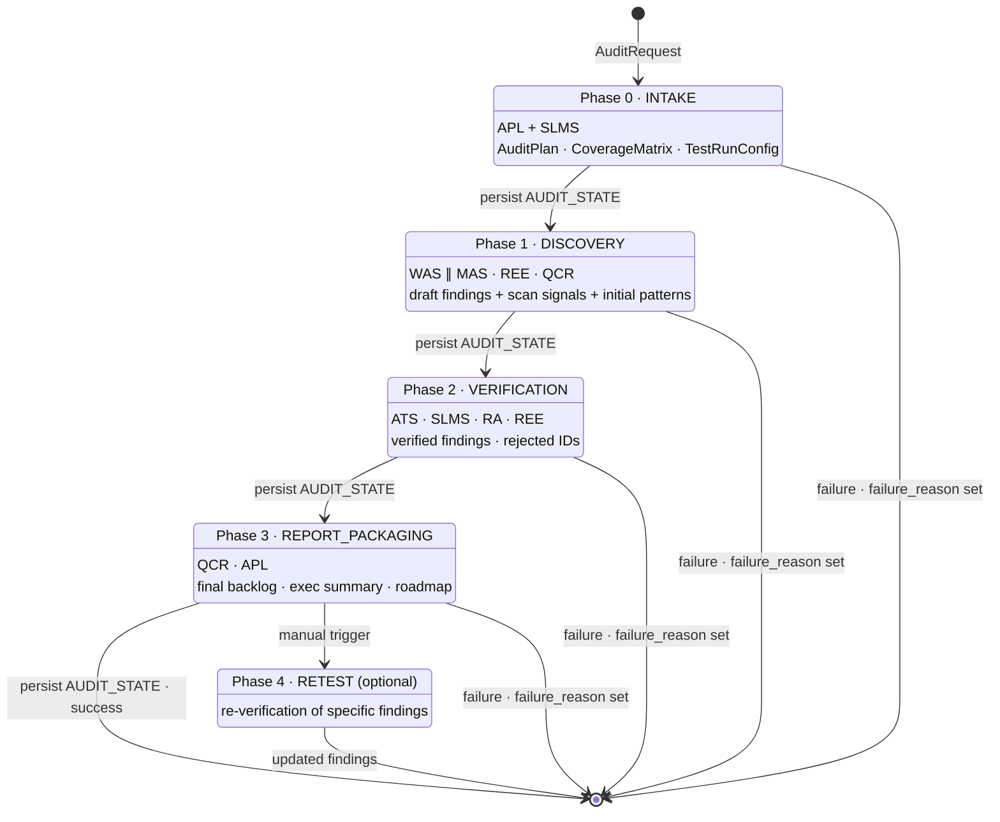
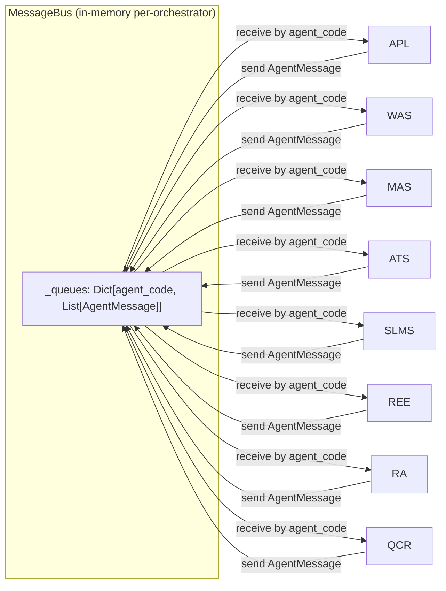

# 02 — System Design

This document captures *how* the Accessibility Audit Team behaves at
runtime: the phase state machine, the artifact-store persistence model,
how the `MessageBus` decouples inter-agent coordination, and the design
rules that bind it all together. For *what* the components are, see
[`01-architecture.md`](./01-architecture.md). For a concrete trace of a
single request, see [`04-flow.md`](./04-flow.md).

## Phase State Machine



Every labeled transition corresponds to a `result.completed_phases.append(...)`
plus an `await self._persist_audit(result)` call in
`AccessibilityAuditOrchestrator._run_audit_phases`
(`orchestrator.py:149-266`). The whole sequence is wrapped in an
`asyncio.wait_for` honoring `AuditRequest.timebox_hours`
(`orchestrator.py:126-139`) so a runaway audit cannot consume unbounded
wall-clock time.

## Phase Contract Table

Each phase takes a typed input, invokes a specific set of agents, and
produces a typed result. The phase handlers live in `phases/` and are
thin coordinators — agents do the work.

| Phase | Handler | Agents involved | Inputs | Outputs (`models.py`) | Persisted artifacts |
|---|---|---|---|---|---|
| 0 — INTAKE | `phases/intake.py` `run_intake_phase` | APL (creates plan), SLMS (establishes mapping guardrails) | `AuditRequest` | `IntakeResult` → `AuditPlan` + `CoverageMatrix` + `TestRunConfig` | `AUDIT_STATE` |
| 1 — DISCOVERY | `phases/discovery.py` `run_discovery_phase` | **WAS ∥ MAS** via `asyncio.gather`, then REE (evidence), then QCR (dedupe) | `AuditPlan` | `DiscoveryResult` → `draft_findings[]`, `scan_results[]`, `initial_patterns[]`, `pages_scanned` | `AUDIT_STATE`, `EVIDENCE_PACK`, `SCREENSHOT`, `DOM_SNAPSHOT`, `A11Y_TREE`, `SCAN_RESULT` |
| 2 — VERIFICATION | `phases/verification.py` `run_verification_phase` | ATS (Critical/High only), SLMS (confirm mappings), RA (remediation), REE (supplement evidence) | `audit_id`, `draft_findings[]`, `stack` | `VerificationResult` → `verified_findings[]`, `rejected_findings[]` | `AUDIT_STATE`, additional `EVIDENCE_PACK` |
| 3 — REPORT_PACKAGING | `phases/report_packaging.py` `run_report_packaging_phase` | QCR (final quality gate), APL (exec summary + roadmap), optional case-study renderer | `verified_findings[]`, `coverage_matrix` | `ReportPackagingResult` → `final_backlog[]`, `patterns[]`, `executive_summary`, `roadmap`, `case_study`, `export_refs` | `AUDIT_STATE`, `REPORT`, `BACKLOG_EXPORT` |
| 4 — RETEST *(optional)* | `phases/retest.py` `run_retest_phase` | ATS (re-verify), plus relevant Lane B agents | `audit_id`, `findings_to_retest[]` | `RetestResult` → `findings_retested`, `findings_closed`, `findings_still_open`, `updated_findings[]` | Updated `AUDIT_STATE` |

### Phase 1 concurrency detail

Phase 1 is the only place where two core agents run **concurrently**.
`phases/discovery.py` builds a list of pending tasks (one per surface),
then awaits them together:

```python
if discovery_tasks:
    labels, coros = zip(*discovery_tasks)
    results = await asyncio.gather(*coros, return_exceptions=True)
```

(`phases/discovery.py:82-84`). Both WAS and MAS return `{success, findings, scan_results}` dicts through `BaseSpecialistAgent.safe_process`, which
wraps exceptions so one surface's failure never crashes the other. REE
and QCR then run sequentially on the combined finding list. Every other
phase is strictly sequential.

### Phase 2 prioritization detail

Phase 2 does **not** run AT verification on every finding. ATS only
inspects `Severity.CRITICAL` and `Severity.HIGH` findings
(`phases/verification.py:73`). Medium/low findings get lightweight
treatment: marked `VERIFIED` if they already have an `evidence_pack_ref`,
otherwise `NEEDS_VERIFICATION` (see the `FindingState` transitions in
`phases/verification.py:96-105`). This is a deliberate cost-vs-value
trade — see the rationale section.

## Persistence Model

### `ArtifactStore` + retention policies

`artifact_store.py` provides a single `ArtifactStore` façade over a
pluggable `StorageBackend`. The default `FileSystemBackend` writes to
`$AGENT_CACHE/accessibility_audit_team/artifacts/` with a `.bin` file
and a `.meta.json` sidecar per artifact.

Every artifact has an `ArtifactType` and a `RetentionPolicy` that
determines how long it lives (`artifact_store.py` `RETENTION_DAYS`):

| Policy | Duration | Used for |
|---|---|---|
| `EPHEMERAL` | 1 day | Short-lived scratch artifacts |
| `SHORT` | 30 days | Videos (large, expensive), transient scans |
| `STANDARD` | 1 year | Default for most artifacts — `EVIDENCE_PACK`, `SCREENSHOT`, `BACKLOG_EXPORT`, `AUDIT_STATE` |
| `LONG` | 3 years | Monitoring `BASELINE` — need long-running trend data |
| `PERMANENT` | forever | `REPORT`, `TRAINING_BUNDLE` — compliance artifacts that must outlive the audit |

Retention is enforced by `ArtifactStore.cleanup_expired`
(`artifact_store.py:421`), which scans metadata and deletes any artifact
whose `expires_at` has passed.

### `AUDIT_STATE` — resume-on-restart

After every successful phase, the orchestrator calls `_persist_audit`
(`orchestrator.py:302`). That serializes the entire
`AccessibilityAuditResult` as JSON and writes it under the artifact
reference `audit_state_{audit_id}` with `ArtifactType.AUDIT_STATE` and
`RetentionPolicy.STANDARD`. On restart, `_ensure_loaded`
(`orchestrator.py:340`) rehydrates the result from the artifact store if
it's not already in the in-memory `self._audits` cache. This is the
mechanism that lets `run_retest` keep working after a server restart —
the retest flow reads the previously persisted state rather than
requiring the original in-memory instance.

### `JobServiceClient` lifecycle

Separate from artifact persistence, `JobServiceClient` (from the shared
`job_service_client` module) tracks **operational** job state:
`pending → running → completed | failed`. The API layer owns this state
machine in `api/main.py`:

- `create_audit` creates a job in `JOB_STATUS_PENDING`
  (`api/main.py:198-210`).
- A `background_tasks.add_task(run_audit_task)` flips it to
  `JOB_STATUS_RUNNING` with `current_phase="discovery"` and
  `progress=20`, calls `orchestrator.run_audit(...)`, and then writes
  the terminal status with either `"completed"` or `JOB_STATUS_FAILED`
  (`api/main.py:213-235`).
- A background stale-job monitor (`start_stale_job_monitor`,
  `api/main.py:40-45`) fails any job whose heartbeat goes quiet for more
  than 300 seconds, so crashed workers don't leave jobs pending forever.
- On orchestrator startup, `mark_all_running_jobs_failed`
  (`api/main.py:49`) is available for explicit clean-up after a
  controlled shutdown.

The two persistence layers intentionally do not share state:
`JobServiceClient` is about "is the work still in flight?", while
`AUDIT_STATE` is about "what did the work produce?". Either can be
restored without the other.

## Message Bus Topology



The `MessageBus` (`agents/base.py:36`) is intentionally minimal: a dict
of queues keyed by recipient agent code. Each `AgentMessage`
(`agents/base.py:25`) carries `from_agent`, `to_agent`, `message_type`,
`audit_id`, `payload`, and `priority`. `BaseSpecialistAgent.send_message`
routes through the shared bus when one is present, otherwise falls back
to a per-instance queue — this makes agents usable in unit tests without
wiring up a bus.

The bus is **not** the primary way agents exchange data across phase
boundaries. Results flow through typed phase-result models (see the
contract table above). The bus is for out-of-band signals — for example,
QCR telling WAS about a dedupe decision without tightly coupling the two
classes — and for any future cross-cutting notifications.

## Design Rationale

### Why phases are checkpoints

Accessibility audits can take hours. Every phase involves expensive work:
Playwright sessions, AT scripts, LLM calls. Losing the whole run to a
crash in Phase 3 would be brutal. Persisting `AccessibilityAuditResult`
after each phase means the expensive output of Phase 1 and Phase 2 is
durable even if Phase 3 explodes, and retest flows (`run_retest`) can
rehydrate a completed audit from the artifact store without the
orchestrator needing to hold everything in memory indefinitely.

### Why the two-lane model

Lane A and Lane B exist because coverage and credibility have different
performance profiles and different failure modes. Lane A is embarrassingly
parallel, scanner-driven, and cheap per URL — you want it to cast a wide
net. Lane B is serial, script-driven, and expensive per finding — you
want it only on items that have already cleared the Lane A + QCR gate.
Putting QCR between them prevents Lane A from dumping scan noise into
Lane B's queue, which would otherwise waste the most expensive resources
in the whole team (ATS's AT scripts) on false positives.

### Scans-as-signals-only

`ScanResult` instances from axe-core, Lighthouse, and pa11y are stored in
`DiscoveryResult.scan_results` (see `models.py` `ScanResult`) but
**never** become findings directly. Automated scanners have well-known
false-positive rates — they flag `aria-hidden` on focused elements even
when it's intentional, they miss keyboard traps entirely, and they can't
detect most semantic issues. The team's hard rule is that scanner output
is a *signal* pointing a human (or an agent with AT scripts) at
something worth investigating. Only findings that pass through WAS/MAS
drafting *and* QCR's quality gate enter `draft_findings`.

### ATS as the truth layer

Only the Assistive Technology Specialist can promote a finding to a
reportable impact statement at Critical/High severity. Scan output,
manual keyboard testing, and visual checks can all disagree with how a
real AT actually behaves — VoiceOver might read a button differently
than what aria attributes suggest, TalkBack might refuse to focus an
element entirely. ATS resolves those disagreements by running scripts
against the real thing. When it contradicts a scanner, the scanner loses.

### Evidence-first reportability bar

A `Finding` is only "reportable" if it has repro steps, expected vs.
actual, user impact, at least one evidence artifact (via
`evidence_pack_ref`), WCAG mapping with confidence, and remediation
notes with acceptance criteria. This bar is defined in the `Finding`
model's docstring (`models.py:181-192`) and enforced by QCR at the start
of Phase 3. The goal is that any developer opening a finding from the
exported backlog has everything they need to fix and verify it without
asking clarifying questions — no empty "Accessibility issue on login
page" tickets.

### Systemic clustering over localized reporting

QCR assigns a `pattern_id` (`models.py` `PatternCluster`) to any group of
findings that share a root cause — typically a design system component or
an issue type that recurs across the surface. The final report then
prioritizes the patterns over individual findings, because fixing one
shared `<Button>` component usually resolves dozens of findings at once.
`ReportPackagingResult` surfaces both `final_backlog[]` and `patterns[]`
so consumers can choose to fix either leaves or roots, but the exec
summary and roadmap written by APL emphasize the roots.

### Why `MessageBus` over direct agent references

Specialists need to be individually unit-testable, the messaging surface
must be replayable for debugging, and future work may move agents into
separate processes. Direct `self.other_agent.notify(...)` calls would
satisfy none of those. The `MessageBus` abstraction gives a single seam
where tests can observe traffic, where a recording/replay layer can be
inserted, and where transport can be swapped (for example, to a real
queue) without changing any agent code. The implementation is tiny
(~30 lines in `agents/base.py`) so there's no meaningful overhead today.

---

**Next:** [`03-use-cases.md`](./03-use-cases.md) — the actors that
interact with this system, and the capabilities each can invoke.
