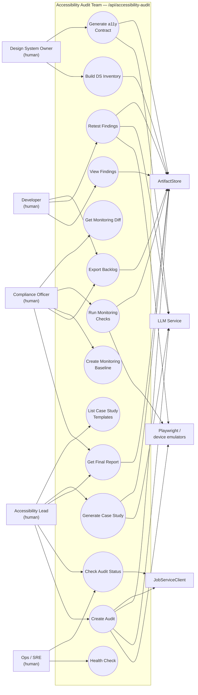

# 03 — Use Cases

This document lists the **actors** who interact with the Accessibility
Audit Team and the **capabilities** each one can invoke. Every capability
is mapped to a concrete endpoint in `api/main.py`. For the components
behind the endpoints, see [`01-architecture.md`](./01-architecture.md);
for the runtime behavior, see [`02-system-design.md`](./02-system-design.md).

## Use Case Diagram

Use-case bubbles are the capabilities the team exposes. Human actors on
the left initiate them; system actors on the right are downstream
dependencies the team calls out to in service of each use case.

## Actors

### Human actors

| Actor | Goal | Why they call the team |
|---|---|---|
| **Accessibility Lead** | Kick off and oversee audits | Owns the scope, deadlines, and final deliverable. Primary consumer of the executive summary and case study. |
| **Developer** | Fix reported issues | Consumes the exported backlog, reproduces findings from evidence packs, implements fixes, and requests a retest to confirm. |
| **Compliance Officer** | Assess WCAG 2.2 / Section 508 posture | Needs mappings with confidence scores, pattern-level risk assessment, and long-running monitoring baselines. |
| **Design System Owner** | Harden shared components | Uses ADSE add-on flows to inventory the component library and generate a11y contracts that become the testable baseline for each component. |
| **Ops / SRE** | Keep the service healthy | Polls `/health`, watches job-status trajectories, and intervenes when the stale-job monitor flags something. |

### System actors

These are **not** users of the team — they are the external systems the
team depends on in order to execute any capability.

| System | Used by | Purpose |
|---|---|---|
| **Playwright** / iOS Simulator / Android Emulator | WAS, MAS, ATS, ARM | Drives web pages and mobile apps to produce deterministic behavior for scanning and scripting |
| **axe-core / Lighthouse / pa11y** | WAS | Automated web accessibility scanners — produce signals only, never findings |
| **NVDA / JAWS / VoiceOver / TalkBack** | ATS | Real assistive technologies used as the truth layer for Critical/High findings |
| **LLM service** (`llm_service.get_client("accessibility_audit")`) | APL, RA, QCR, ADSE, case-study renderer | Summarization, prose generation, remediation drafting, contract drafting |
| **`ArtifactStore`** | Every phase | Durable storage for evidence, audit state, reports, baselines |
| **`JobServiceClient`** | API layer | Operational job lifecycle and stale-job watchdog |

## Use Case → Endpoint Mapping

All endpoints are mounted under the prefix **`/api/accessibility-audit`**
(from `TEAM_CONFIGS["accessibility_audit"]` in
`backend/unified_api/config.py:104`).

### Core audit capabilities

| Use case | Method + path | Handler | Notes |
|---|---|---|---|
| Create Audit | `POST /audit/create` | `api/main.py:157` `create_audit` | Returns a `job_id`; work runs in a `BackgroundTasks` coroutine |
| Check Audit Status | `GET /audit/status/{job_id}` | `api/main.py:247` `get_audit_status` | Maps `JobServiceClient` status to UI-friendly values |
| View Findings | `GET /audit/{audit_id}/findings` | `api/main.py:276` `get_audit_findings` | Supports `severity`, `state`, `offset`, `limit` filters |
| Get Final Report | `GET /audit/{audit_id}/report` | `api/main.py:328` `get_audit_report` | Requires the audit to be in `complete` status |
| Retest Findings | `POST /audit/{audit_id}/retest` | `api/main.py:365` `retest_findings` | Accepts a `finding_ids[]` list (empty = all); runs `Phase.RETEST` |
| Export Backlog | `POST /audit/{audit_id}/export` | `api/main.py:420` `export_backlog` | Supports `json` / `csv`; optional `include_evidence` |

### Case study capabilities

| Use case | Method + path | Handler | Notes |
|---|---|---|---|
| Generate Case Study | `POST /audit/{audit_id}/case-study` | `api/main.py:485` `generate_audit_case_study` | Template keys: `comprehensive`, `basic_audit`, `premium_assessment`, `enterprise_analysis`, `executive_summary`, `video_script`; optional industry override |
| List Case Study Templates | `GET /case-study-templates` | `api/main.py:527` `list_case_study_templates` | Returns template metadata |

### Monitoring capabilities (ARM add-on)

| Use case | Method + path | Handler | Notes |
|---|---|---|---|
| Create Monitoring Baseline | `POST /monitor/baseline` | `api/main.py:542` `create_monitoring_baseline` | Stores a `BASELINE` artifact with `RetentionPolicy.LONG` |
| Run Monitoring Checks | `POST /monitor/run` | `api/main.py:568` `run_monitoring_checks` | Executes configured checks against the target |
| Get Monitoring Diff | `GET /monitor/diff/{run_id}` | `api/main.py:594` `get_monitoring_diff` | Returns new/resolved/unchanged issues and alert count |

### Design system capabilities (ADSE add-on)

| Use case | Method + path | Handler | Notes |
|---|---|---|---|
| Build DS Inventory | `POST /designsystem/inventory` | `api/main.py:621` `build_component_inventory` | Source can be `storybook`, `repo`, or `manual` |
| Generate a11y Contract | `POST /designsystem/contract` | `api/main.py:646` `generate_a11y_contract` | Returns requirements + test harness plan for a component |

### Operational capabilities

| Use case | Method + path | Handler | Notes |
|---|---|---|---|
| Health Check | `GET /health` | `api/main.py:678` `health_check` | Simple liveness probe for load balancers |

## Authorization

The accessibility audit team runs behind the **unified API security
gateway** (`SECURITY_GATEWAY_ENABLED=true` by default; see the top-level
project `CLAUDE.md`). All endpoints above are gated by that shared layer
and the team itself does not implement bespoke authentication. Within
the team, no endpoint distinguishes between actor roles — the team
trusts that any caller who reaches it is authorized to read/write the
audit domain. Any role-based access restrictions (for example, only
Compliance Officers calling `/monitor/*`) must be enforced upstream at
the gateway.

## Design Rationale

### Why add-ons expose separate endpoint namespaces

ARM lives under `/monitor/*` and ADSE under `/designsystem/*` rather
than being folded into the core `/audit/*` surface. This matches the
opt-in nature of add-ons (they only instantiate when
`enable_addons=True`; see `orchestrator.py:90-97`) and keeps the core
audit API small and predictable for the most common caller — the
Accessibility Lead creating an audit. A compliance officer who only
cares about monitoring never has to navigate the audit taxonomy, and a
design system owner never has to understand the phase state machine.
Each namespace's contract can also evolve independently without risking
regressions in the core path.

### Why retest is explicit, not automatic

`POST /audit/{audit_id}/retest` is a manual trigger. The team does not
auto-retest on a schedule or when it detects a repository change. This
is deliberate: a retest is expensive (it re-drives Playwright/AT
scripts) and only makes sense after a concrete fix has been deployed.
Retesting without that premise would generate noise and waste LLM and
AT-script cost. The *continuous* story is owned by ARM via
`/monitor/*`, which is designed for scheduled baseline diffing and is
the right tool when what you want is "alert me when accessibility
regresses," not "verify this specific fix landed."

### Why case study generation is a post-phase capability, not part of `run_audit`

Case studies use industry- and tier-specific templates (`comprehensive`,
`enterprise_analysis`, `ecommerce`, etc.) and require client context
that the team does not have at audit-creation time. Pulling case-study
rendering out of the critical path keeps Phase 3 focused on producing
canonical findings and keeps the expensive, context-hungry template
work in a separate POST that can be re-run with different templates
without re-running the audit.

### Why `/health` is not phase-aware

Load balancers, docker healthchecks, and the shared stale-job monitor
all want a cheap liveness answer. A phase-aware health endpoint would
have to reach into the orchestrator and potentially the artifact store,
turning a 1ms check into a 50ms one and creating coupling that makes
the endpoint prone to false-negative flapping. The current shape
(`{"status": "healthy", "service": "accessibility_audit_team"}`) is the
minimum information callers actually need, which is "the process is
alive and the router is mounted."

---

**Next:** [`04-flow.md`](./04-flow.md) — a concrete sequence trace of
a single audit from request to report.
