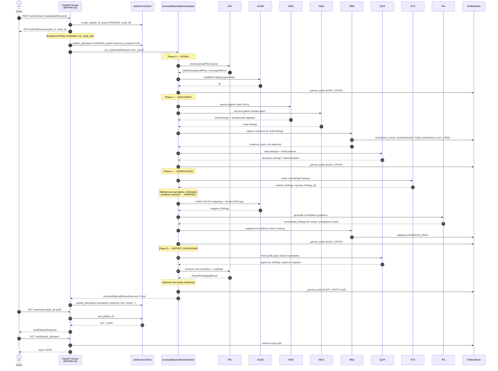
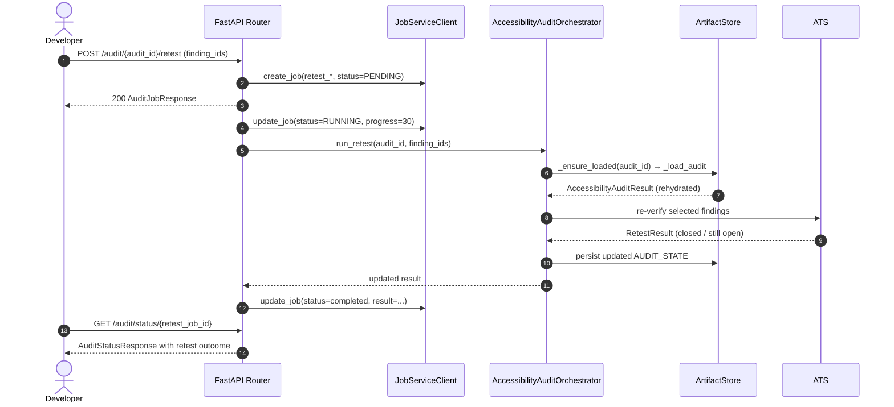

# 04 — End-to-End Request Flow

This document traces a single audit request from the moment a client
POSTs to `/audit/create` through every phase, every artifact write, and
back to the client polling for status. For the component identities see
[`01-architecture.md`](./01-architecture.md); for the phase contracts
see [`02-system-design.md`](./02-system-design.md).

## Happy-Path Audit Sequence

### Happy-path narrative

1. **Client submits `POST /audit/create`** with a `CreateAuditRequest`
   (see `api/main.py:79` for the shape). The API validates URLs in
   `validate_urls` (line 96), converts mobile app dicts into
   `MobileAppTarget`s, converts string `wcag_levels` into the `WCAGLevel`
   enum, and builds an `AuditRequest` (`api/main.py:185`).
2. **Job record created.** `_job_manager.create_job` persists a
   `JOB_STATUS_PENDING` entry (`api/main.py:198`), seeded with
   `current_phase="intake"` and `progress=0`.
3. **Client gets an immediate response.** `AuditJobResponse` with
   `status="running"` is returned **before** the audit actually starts —
   the real work is queued via `background_tasks.add_task(run_audit_task)`
   (`api/main.py:237`). This keeps the request thread free.
4. **Background task flips status.** `run_audit_task` calls
   `_job_manager.update_job` with `status=RUNNING`,
   `current_phase="discovery"`, `progress=20` (`api/main.py:215-217`),
   then invokes `orchestrator.run_audit(...)` with the request and
   tech stack.
5. **Phase 0 INTAKE.** `run_intake_phase` calls APL's `process` to
   create the `AuditPlan` and `CoverageMatrix`, then invokes SLMS to
   establish mapping guardrails (`phases/intake.py:52-72`). The result
   is assigned to `result.intake_result`, `Phase.INTAKE` is appended to
   `completed_phases`, and `_persist_audit` writes an `AUDIT_STATE`
   artifact (`orchestrator.py:171-175`).
6. **Phase 1 DISCOVERY.** `run_discovery_phase` builds concurrent tasks
   for WAS (if web URLs exist) and MAS (if mobile apps exist) and runs
   them via `asyncio.gather(..., return_exceptions=True)`
   (`phases/discovery.py:82-84`). Results are merged into
   `all_findings` and `all_scan_results`. REE then captures evidence,
   and QCR performs early deduplication and initial pattern
   identification. Another `AUDIT_STATE` checkpoint is written.
7. **Phase 2 VERIFICATION.** `run_verification_phase` prioritizes
   Critical/High findings for ATS
   (`phases/verification.py:73`). ATS runs AT scripts (NVDA, VoiceOver,
   etc.) and either confirms each finding (adding AT-verified impact
   statements) or rejects it as a scanner false positive. Medium/Low
   findings bypass ATS but get their state set based on whether they
   already have an `evidence_pack_ref`. SLMS then confirms `WCAGMapping`
   entries, RA adds remediation guidance, and REE supplements any
   still-missing evidence. A third `AUDIT_STATE` checkpoint is written.
8. **Phase 3 REPORT_PACKAGING.** `run_report_packaging_phase` calls QCR
   one more time — the *final* quality gate — which approves or rejects
   each finding against the reportability bar (repro, evidence, WCAG
   mapping, remediation). APL then produces the executive summary and
   roadmap. Optional case-study rendering runs via `_generate_case_study`
   (`phases/report_packaging.py:133`). The final `_persist_audit` write
   captures the complete `AccessibilityAuditResult`.
9. **Orchestrator finalizes and returns.** Severity counts are computed
   (`orchestrator.py:241-249`), optional add-ons run via `_run_addons`
   if `enable_addons=True`, and the result is returned to the background
   task. The task calls `_job_manager.update_job` with `status="completed"`,
   `progress=100`, and the serialized result (`api/main.py:220-229`).
10. **Client polls for status** at `GET /audit/status/{job_id}`. The
    handler (`api/main.py:247`) fetches the job, rehydrates the
    `AccessibilityAuditResult` from its stored dict form, and returns an
    `AuditStatusResponse`. Once `status=="complete"`, the client can
    call `GET /audit/{audit_id}/report` for the final report and
    `POST /audit/{audit_id}/export` to produce a `BACKLOG_EXPORT`
    artifact.

### Failure modes

- **Phase handler returns `success=False`.** Each phase in
  `_run_audit_phases` checks the phase result's `success` flag
  immediately after awaiting it. On failure, `result.failure_reason` is
  set and the method returns early (see, for example,
  `orchestrator.py:167-169` for intake). Because the previous phases
  were already persisted via `_persist_audit`, their output is not lost.
  The in-flight phase's partial state is dropped.
- **Timeout.** The full `_run_audit_phases` call is wrapped in
  `asyncio.wait_for(..., timeout=audit_request.timebox_hours * 3600)`
  (`orchestrator.py:126-130`). On `asyncio.TimeoutError`,
  `result.success=False`, `failure_reason` is set to a message
  including `completed_phases`, and `_persist_audit` is called one last
  time so the partial result is still retrievable.
- **Unhandled exception.** A generic `except Exception as e` block
  (`orchestrator.py:141-145`) logs, sets `failure_reason=str(e)`, and
  persists. The background task then marks the job
  `JOB_STATUS_FAILED` with the error message
  (`api/main.py:230-235`).
- **Background worker dies mid-run.** The stale-job monitor
  (`start_stale_job_monitor`, `api/main.py:40-45`) polls every 15
  seconds and fails any pending/running job whose heartbeat has been
  silent for more than 300 seconds, so the client's polling doesn't
  hang indefinitely.
- **Server restart.** Because every phase checkpoint wrote an
  `AUDIT_STATE` artifact, a retest request after the restart can
  rehydrate the audit via `_ensure_loaded` (`orchestrator.py:340-347`)
  without requiring the original `_audits` dictionary. The in-flight
  phase's work is still lost, but everything up to the last checkpoint
  survives.

## Retest Sub-Flow

`run_retest` (`orchestrator.py:349`) is deliberately lighter than
`run_audit`. It filters `result.final_findings` by the provided
`finding_ids`, invokes `run_retest_phase` for the filtered list, and
merges the returned `updated_findings` back into the parent result.
Only findings the caller explicitly listed are touched — a developer
who fixed the modal focus trap doesn't cause every finding in the audit
to be re-tested.

## Design Rationale

### Why polling rather than webhooks

Every other team in this repository (blogging, software engineering,
market research, etc.) uses the shared `JobServiceClient` polling
model. Standardizing on polling for the accessibility audit team means
operators only have to learn one status convention across the Khala
platform, clients share infrastructure (the shared stale-job monitor,
the common status enum mapping), and there is no inbound webhook
surface to secure or debug. Audits run in minutes-to-hours; a few
seconds of polling latency is never the bottleneck.

### Why WAS and MAS run in parallel but nothing else does

Lane A is the only place where two specialists operate on **disjoint
inputs** — WAS only touches `audit_plan.targets.web_urls`, MAS only
touches `audit_plan.targets.mobile_apps`. There is no shared state to
coordinate, no ordering constraint between them, and they are the only
step where wall-clock time is directly proportional to the number of
targets. Running them concurrently halves the phase duration for mixed
web+mobile audits with zero coordination cost. Every other agent's
work either depends on a previous agent's output (SLMS needs findings
from ATS, RA needs mappings from SLMS) or shares mutable state that
would require locking if parallelized.

### Why QCR sits between the lanes, not just at the end

QCR is invoked *twice*: once at the end of Phase 1 for early
deduplication and pattern identification, and once at the start of
Phase 3 as the final quality gate
(`phases/discovery.py:117-128`, `phases/report_packaging.py:72-87`).
The early call prevents Lane B's expensive AT scripts and LLM calls
from being spent on findings that are duplicates or low-quality drafts.
The late call ensures the final backlog actually satisfies the
reportability bar regardless of what Lane B produced. Doing only the
late call would waste Lane B cost; doing only the early call would let
incomplete findings into the report. Both passes matter.

### Why the background task flips progress to 20% before Phase 0 runs

The first thing `run_audit_task` does is
`update_job(..., current_phase="discovery", progress=20)`
(`api/main.py:215-217`), even though the orchestrator is about to run
Phase 0 (intake). This is a deliberate UX nudge: from the Accessibility
Lead's perspective, intake is bookkeeping — what they actually care
about is that real work has started. Jumping the reported progress
past the intake phase quickly signals "the audit is live" and avoids
UIs that appear stuck at 0% during the APL/SLMS setup phase. The
orchestrator itself then continues to report `current_phase` accurately
in the final status update once the audit completes.

---

**You are here.** Head back to the [`README.md`](./README.md) for the
index or jump to [`01-architecture.md`](./01-architecture.md) for the
component inventory.
