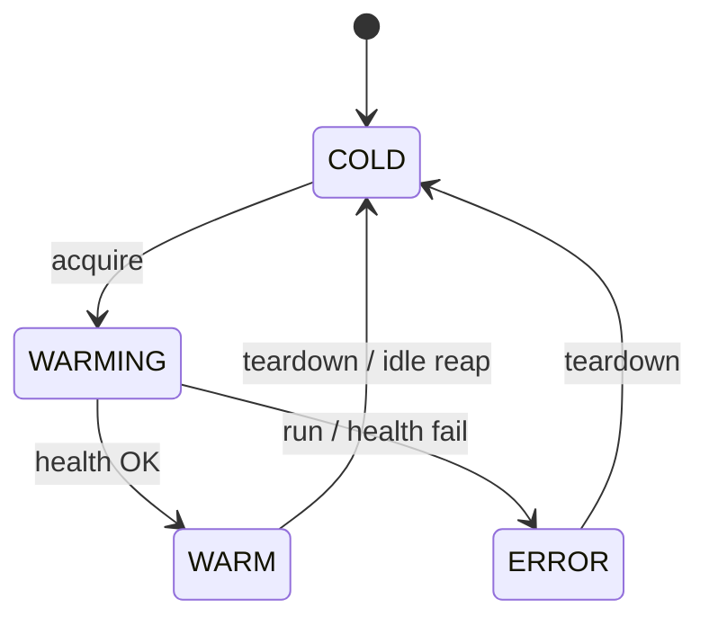

# agent_provisioning_team.sandbox

Per-agent ephemeral sandbox lifecycle used by the Agent Console **Runner**.

Drives the unified `khala-agent-sandbox` image (`backend/agent_sandbox_image/`,
`backend/agent_sandbox_runtime/`). Each invocation of a specialist agent gets
its own hardened container, loaded with exactly one agent via
`SANDBOX_AGENT_ID`, torn down after it goes idle. Replaces the old per-team
compose-based lifecycle at `backend/agents/agent_sandbox/`, which was removed
in Phase 5 of the sandbox re-architecture (issue #267).

Used by `backend/unified_api/routes/sandboxes.py` (`/api/agents/sandboxes/*`)
and the invoke proxy in `routes/agents.py` (`POST /api/agents/{id}/invoke`).

## Modules

| File | Role |
|---|---|
| `lifecycle.py` | Per-process `Lifecycle` class keyed by `agent_id`: `acquire`, `status`, `teardown`, `list_active`, `note_activity`, idle reaper. |
| `provisioner.py` | `docker run` / `docker inspect` / `docker rm -f` wrapper. Assembles the hardened argv (cap-drop, read-only, no-new-privileges, seccomp, loopback-bound ports, resource caps). Creates the `khala-sandbox` bridge network on demand. |
| `state.py` | Pydantic models (`SandboxState`, `SandboxHandle`, `SandboxStatus`), atomic JSON checkpoint, env-var helpers. |

## State machine



Transitions are serialised by a per-agent `asyncio.Lock`. State is
checkpointed after every transition and reconciled with `docker inspect` on
the next request so an API restart doesn't orphan containers.

## SandboxSpec (manifest side)

Each agent's YAML manifest may declare a `sandbox:` block consumed by the
provisioner. Fields live on `agent_registry.models.SandboxSpec`:

| Field | Purpose |
|---|---|
| `env` | Extra env vars to forward into the sandbox container (beyond the default Postgres/LLM set). |
| `extra_pip` | Additional pip packages to install at image build time (Phase 1 image bake). |

## Environment variables

| Variable | Default | Purpose |
|---|---|---|
| `AGENT_PROVISIONING_SANDBOX_IMAGE` | `khala-agent-sandbox:latest` | Image tag for the unified single-agent sandbox (Phase 1). |
| `AGENT_PROVISIONING_SANDBOX_NETWORK` | `khala-sandbox` | Docker bridge network. Created on demand; safe to leave at the default. |
| `AGENT_PROVISIONING_SANDBOX_STATE_FILE` | `$AGENT_CACHE/agent_provisioning/sandboxes/state.json` | Where to checkpoint state across restarts. |
| `AGENT_PROVISIONING_SANDBOX_IDLE_MINUTES` | `5` | Idle threshold before the reaper tears a sandbox down. |
| `AGENT_PROVISIONING_SANDBOX_BOOT_TIMEOUT_S` | `90` | How long to wait for `/health` to succeed after boot. |

## Local smoke test

```bash
cd backend && make run
# in another shell (blogging.writer is just an example agent id):
curl -X POST localhost:8080/api/agents/sandboxes/blogging.writer | jq
# poll until status -> warm
curl localhost:8080/api/agents/sandboxes/blogging.writer | jq
curl -X POST localhost:8080/api/agents/blogging.writer/invoke \
     -H 'Content-Type: application/json' \
     -d @agents/blogging/agent_console/samples/blogging.writer/default.json | jq
curl localhost:8080/api/agents/sandboxes | jq
curl -X DELETE localhost:8080/api/agents/sandboxes/blogging.writer
```

## Tests

```bash
cd backend
python3 -m pytest agents/agent_provisioning_team/tests/test_sandbox_lifecycle.py --asyncio-mode=auto
```

Tests patch `provisioner.run_container`, `inspect_host_port`, `is_running`,
and `stop_container` so the suite runs offline.

## Capacity

Phase 6 (issue #268) characterised the per-agent sandbox under the production
hardening profile. The harness lives in
`backend/agents/agent_provisioning_team/tests/`:

- `test_e2e_smoke.py` (gated on `KHALA_E2E=1`) — drives the four-agent smoke
  matrix, cross-team and intra-team concurrency, the reaper, and the
  `requires-live-integration` block. Writes one perf sample per invoke to
  `$AGENT_CACHE/agent_provisioning/phase6_perf.jsonl`.
- `scripts/phase6_hardening.sh` — `docker inspect` / `ss` / `docker exec`
  probes that confirm the hardening flags are still in effect on a live
  sandbox.
- `scripts/phase6_perf_summary.py` — reads the perf log and prints p50/p95.

### Resource caps (per sandbox)

| Cap | Value | Source |
|---|---|---|
| CPU | 1.0 core | `--cpus=1.0` (provisioner.py) |
| Memory | 1 GiB | `--memory=1g` |
| PIDs | 512 | `--pids-limit=512` |
| Open files | 4096 | `--ulimit nofile=4096` |
| Subprocesses | 1024 | `--ulimit nproc=1024` |
| Health-probe timeout | 90 s | `AGENT_PROVISIONING_SANDBOX_BOOT_TIMEOUT_S` |
| Idle reap threshold | 5 min | `AGENT_PROVISIONING_SANDBOX_IDLE_MINUTES` |
| Reaper tick | 60 s | `Lifecycle.run_idle_reaper` |

### Port binding

Sandboxes bind only to `127.0.0.1`; Docker picks a free ephemeral host port at
provision time. Theoretical upper bound is the loopback ephemeral range
(≈ 28 000 ports on Linux), well above any plausible per-host concurrency cap.

### Cold-start observability

`Lifecycle.acquire()` records `boot_ms` on the returned `SandboxHandle` for
every cold provision and emits a structured log line:

```
sandbox.cold_start agent_id=<id> team=<team> image=<image> boot_ms=<n>
```

Warm-path returns leave `boot_ms` as `None`. The invoke proxy forwards the
sample into `agent_console_runs.logs_tail` as a `sandbox.cold_start boot_ms=<n>`
line, so cold-vs-warm latency is queryable from the runs table without a
schema migration.

### Measured envelope

Latency samples come from running the harness end-to-end against the full
docker-compose stack (`docker compose -f docker/docker-compose.yml up`). The
header below is committed as `TBD` until a human runs the harness on real
hardware and pastes the resulting numbers.

| Phase | n | p50 (ms) | p95 (ms) |
|---|---|---|---|
| cold-start | TBD | TBD | TBD |
| warm-invoke | TBD | TBD | TBD |

Maximum concurrent sandboxes the dev host tolerated before OOM / CPU
contention: **TBD** (host spec: TBD).

To populate: run `KHALA_E2E=1 pytest backend/agents/agent_provisioning_team/tests/test_e2e_smoke.py`,
then `python backend/agents/agent_provisioning_team/tests/scripts/phase6_perf_summary.py`,
then paste the markdown snippet it prints over the row above.

### Known exhaustion modes

- **Host memory** (primary): each sandbox reserves up to 1 GiB; with 16 GiB of
  host RAM and overhead for the unified API + Postgres + Ollama, expect
  ~10–12 concurrent sandboxes before swapping.
- **Docker daemon throughput**: bursting `acquire()` for many cold agents
  serialises through the Docker socket. The lifecycle's per-agent
  `asyncio.Lock` prevents duplicate provisions for the same id but does not
  rate-limit across agents.
- **Loopback ephemeral ports**: theoretical only — the kernel will run out of
  RAM long before the port range is depleted.

Live counters for resident sandboxes and reaper activity are tracked
separately as a follow-up (`/metrics` endpoint, issue #302).

## Design notes

- **One container per agent.** Each specialist gets its own sandbox — process
  state can't leak between agents. Idle reaper keeps the resident set small.
- **Hardened by default.** The provisioner argv enforces `--cap-drop=ALL`,
  `--read-only`, `--security-opt=no-new-privileges:true`, seccomp, pid/file
  ulimits, 1 CPU / 1 GiB RAM, and binds host ports to `127.0.0.1` (addresses
  issue #255).
- **No shared Postgres.** The host's Postgres creds are forwarded through so
  every sandbox points at the same development DB. Per-sandbox secret
  isolation is issue #257.
- **No auto-start.** The unified API only warms a sandbox on the first
  `acquire`; cold-start cost is paid by the first invocation for each agent.
- **Restart safety.** State is reconciled with `docker inspect` on the next
  request, so an API crash doesn't orphan containers or leak tracked state.
