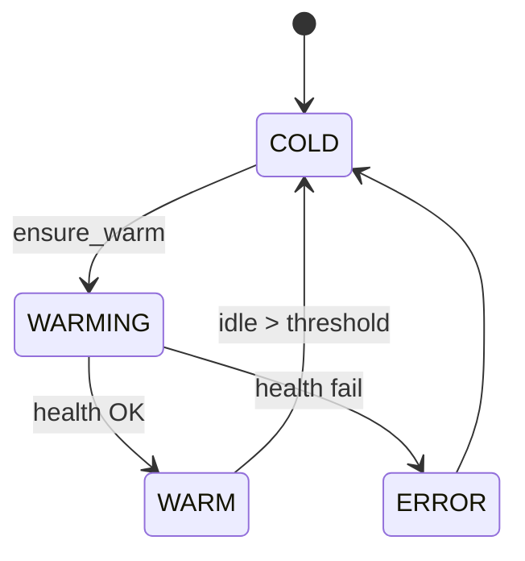

# agent_sandbox

Warm-reuse lifecycle for per-team Docker sandboxes used by the Agent Console
**Runner** (Phase 2).

Shells out to `docker compose -f docker/sandbox.compose.yml` to:

1. Spin up a team service in isolation (separate Postgres, separate network,
   distinct ports 8200–8220) on demand.
2. Keep it warm across invocations.
3. Tear it down after `SANDBOX_IDLE_TEARDOWN_MINUTES` (default **15**) of no
   activity.

Used by `backend/unified_api/routes/sandboxes.py`
(`/api/agents/sandboxes/*`) and the invoke endpoint in `routes/agents.py`
(`POST /api/agents/{id}/invoke`).

## State machine



## Adding a new team

1. **Add a service block** to `docker/sandbox.compose.yml` mirroring the
   production service but with an isolated `POSTGRES_DB` and a unique host
   port in the 8200–8220 range.
2. **Register it** in `backend/agents/agent_sandbox/config.py`
   (`TEAM_SANDBOX_CONFIGS`).
3. **Mount the invoke shim** in the team's `api/main.py`:
   ```python
   from shared_agent_invoke import mount_invoke_shim
   mount_invoke_shim(app, team_key="your_team")
   ```

The catalog will automatically surface the team's agents in the Runner once
the shim responds on `/_agents/{id}/invoke`.

## Environment variables

| Variable | Default | Purpose |
|---|---|---|
| `SANDBOX_COMPOSE_FILE` | `docker/sandbox.compose.yml` (repo path) | Override compose file location. |
| `SANDBOX_STATE_FILE` | `$AGENT_CACHE/agent_sandbox/state.json` | Where to checkpoint warm-sandbox state across restarts. |
| `SANDBOX_IDLE_TEARDOWN_MINUTES` | `15` | Idle threshold before the reaper tears a sandbox down. |
| `SANDBOX_BOOT_TIMEOUT_S` | `90` | How long to wait for a new sandbox to report healthy. |
| `BLOGGING_SANDBOX_PORT`, `SE_SANDBOX_PORT`, `PLANNING_V3_SANDBOX_PORT`, `BRANDING_SANDBOX_PORT` | 8200–8203 | Override host ports when the defaults collide. |

## Local smoke test

```bash
cd backend && make run
# in another shell:
curl -X POST localhost:8080/api/agents/sandboxes/blogging | jq
# wait 10-30s for the container to boot
curl localhost:8080/api/agents/sandboxes/blogging | jq        # status → warm
curl -X POST localhost:8080/api/agents/blogging.writer/invoke \
     -H 'Content-Type: application/json' \
     -d @agents/blogging/agent_console/samples/blogging.writer/default.json | jq
curl localhost:8080/api/agents/sandboxes | jq                  # list warm
curl -X DELETE localhost:8080/api/agents/sandboxes/blogging
```

## Tests

```bash
cd backend
python3 -m pytest agents/agent_sandbox/tests/ --asyncio-mode=auto
```

Tests mock the Docker subprocess and the health probe so they run offline.

## Design notes

- **Per-team, not per-agent.** Sandboxes are shared across every specialist
  in the same team. Process state can leak between invocations — this is fine
  for testing; production isolation is handled by the team's real service.
- **Shared `sandbox-postgres`.** All team sandboxes use the same Postgres
  instance on host port 5433, with per-team database names (e.g.
  `sandbox_blogging`, `sandbox_branding`). Avoids spinning up 20 Postgres
  containers.
- **No auto-start.** The unified_api does NOT warm every team sandbox on
  boot; only on-demand via `ensure_warm()`. Cold start cost is paid by the
  first invocation for each team.
- **Restart safety.** State is checkpointed to
  `$AGENT_CACHE/agent_sandbox/state.json` and reconciled with `docker compose
  ps` on the next request, so a unified_api restart doesn't orphan containers.
