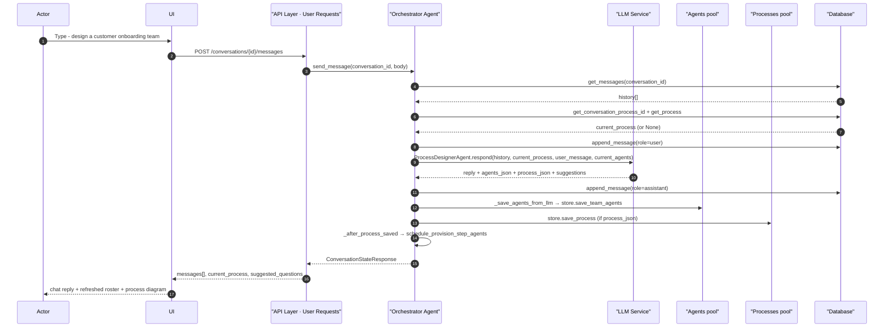
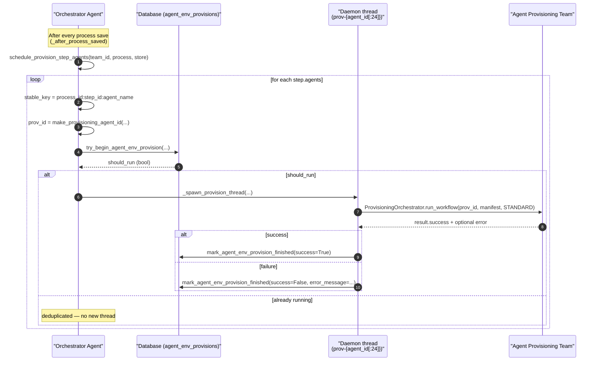
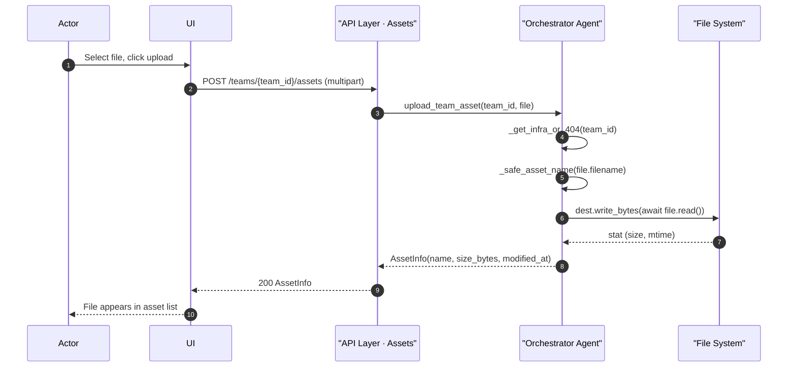
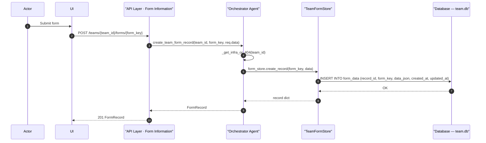
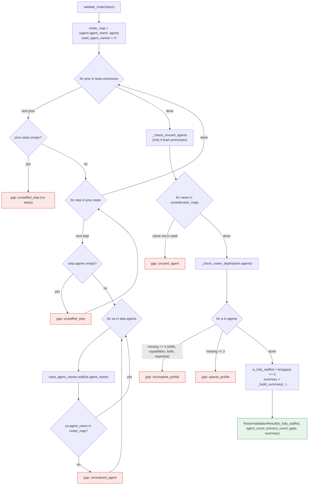
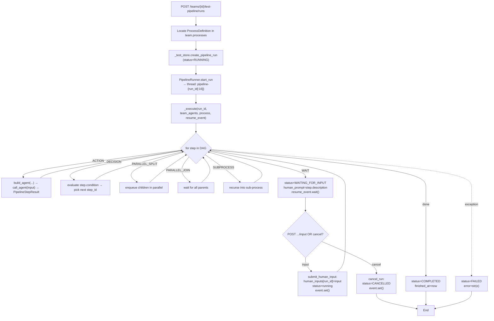
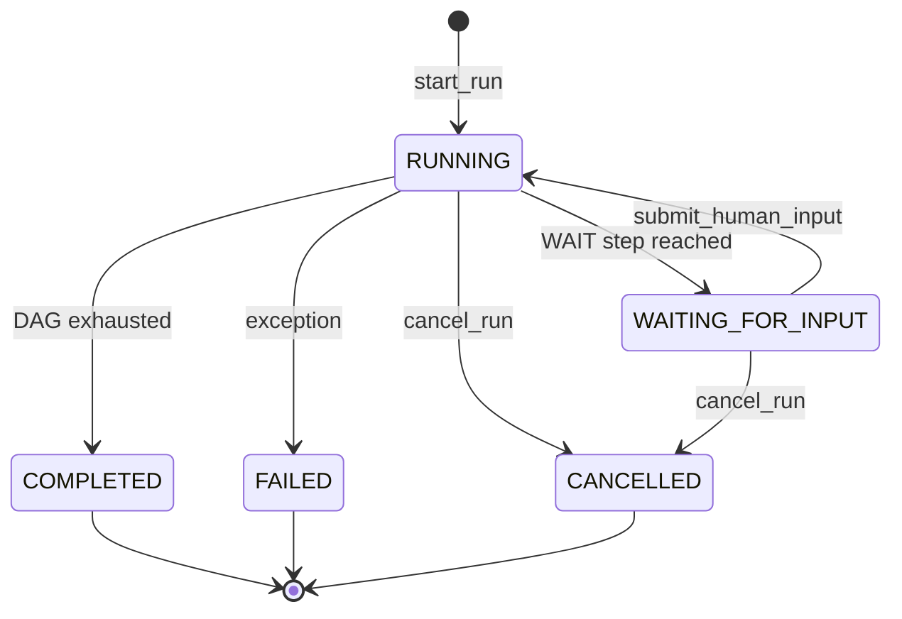
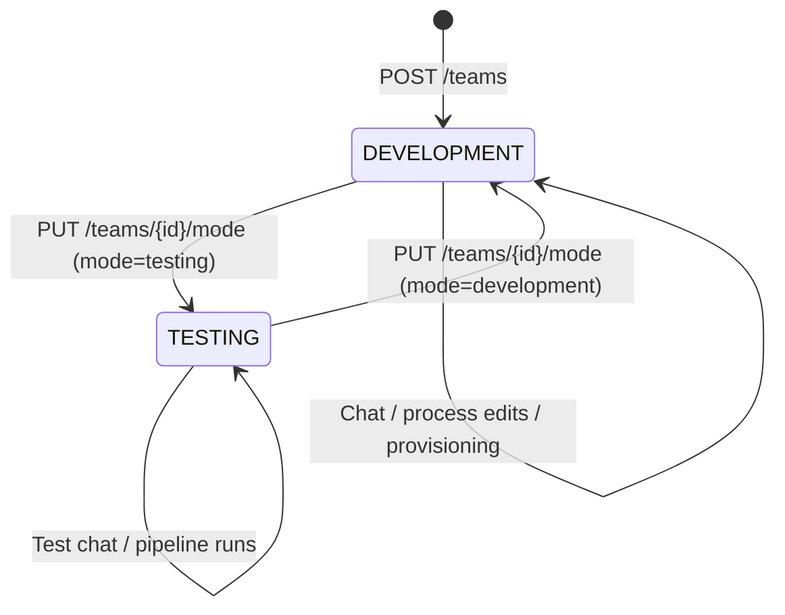

# Flow Charts

> These flows animate the static structures in [`../designs/Agentic-team-architecture.png`](../designs/Agentic-team-architecture.png) and [`../designs/AgenticTeamApiInteractionsArchitecture.png`](../designs/AgenticTeamApiInteractionsArchitecture.png). Each sequence diagram's participant list uses the exact labels from those PNGs (`Actor`, `UI`, `API Layer`, `Orchestrator Agent`, `Agents pool`, `Processes pool`, `File System`, `Database`, `Job Tracking`, `Question Tracking`) so the reader can map every lifeline back to a box in the PNG.

## 1. Sequence — Conversational team design (animates UC1)

Participants correspond to: `Actor` (PNG #2 stick figure), `UI` (PNG #2 monitor), `API Layer · User Requests` (PNG #2 box), `Orchestrator Agent` (PNG #1 middle box), `LLM Service` (external, dashed in our architecture diagram), `Agents pool` (PNG #1 bottom-left), `Processes pool` (PNG #1 bottom-right), `Database` (PNG #2 cylinder).

Source: [`api/main.py:389-424`](../api/main.py), [`assistant/agent.py`](../assistant/agent.py), [`assistant/store.py`](../assistant/store.py), [`agent_env_provisioning.py:53-85`](../agent_env_provisioning.py).

## 2. Sequence — Agent environment provisioning bridge (animates UC4)

Source: [`agent_env_provisioning.py:53-129`](../agent_env_provisioning.py), [`api/main.py:464-471`](../api/main.py) (status read path).

## 3. Sequence — Asset upload (animates the `Assets → File System` edge from PNG #2)

Note: `FS` is rooted at `$AGENT_CACHE/provisioned_teams/{team_id}/assets/` (see `infrastructure.py`).

Source: [`api/main.py:559-612`](../api/main.py), [`infrastructure.py`](../infrastructure.py).

## 4. Sequence — Form record write (animates the `Form Information → Database` edge from PNG #2)

Note: `FormStore` is `TeamFormStore` from `infrastructure.py`; `DB` is the per-team SQLite at `$AGENT_CACHE/provisioned_teams/{team_id}/team.db` in WAL mode.

Source: [`api/main.py:635-640`](../api/main.py), [`infrastructure.py:30-80`](../infrastructure.py).

## 5. Flowchart — Roster validation (animates UC2)

Source: [`roster_validation.py:23-151`](../roster_validation.py).

## 6. Flowchart — Pipeline test run (animates UC9)

Source: [`runtime/pipeline_runner.py:33-120+`](../runtime/pipeline_runner.py), [`api/main.py:858-933`](../api/main.py), `StepType` in [`models.py:24-32`](../models.py), `PipelineRunStatus` in [`models.py:57-64`](../models.py).

## 7. State — `PipelineRunStatus`

Source: [`models.py:57-64`](../models.py), [`runtime/pipeline_runner.py:58-71`](../runtime/pipeline_runner.py).

## 8. State — `TeamMode`

Source: [`models.py:43-47`](../models.py), [`api/main.py:670-677`](../api/main.py).

---

### PNG-box → participant cross-reference

| PNG box (legacy) | Appears in these diagrams as |
|---|---|
| PNG #2 `Actor` (stick figure) | §1, §3, §4 lifeline `Actor` |
| PNG #2 `UI` (monitor) | §1, §3, §4 lifeline `UI` |
| PNG #2 `API Layer` | §1 `API Layer · User Requests`, §3 `API Layer · Assets`, §4 `API Layer · Form Information` |
| PNG #2 `Agentic Team` = PNG #1 `Orchestrator Agent` | §1-§4 lifeline `Orchestrator Agent` |
| PNG #2 `File System` | §3 `File System` |
| PNG #2 `Database` | §1, §4 `Database` |
| PNG #1 `Agents` pool | §1 `Agents pool` |
| PNG #1 `Processes` pool | §1 `Processes pool` |
| PNG #1 `Job Tracking` / `Question Tracking` | Referenced in UC5 (use_cases.md) — no dedicated sequence here since they're simple `JobServiceClient` wrappers |
