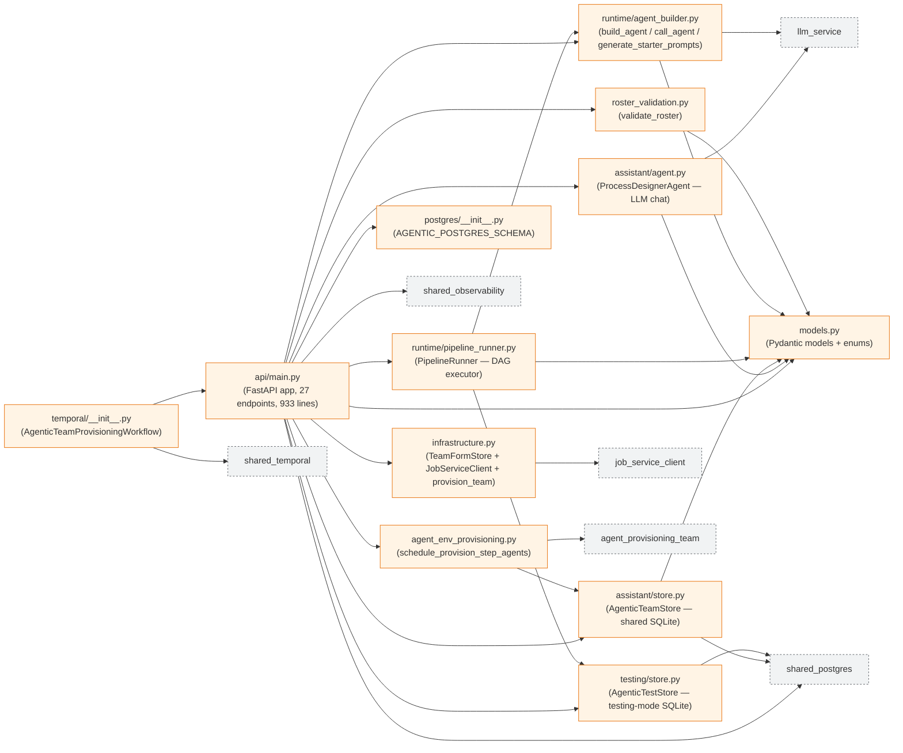
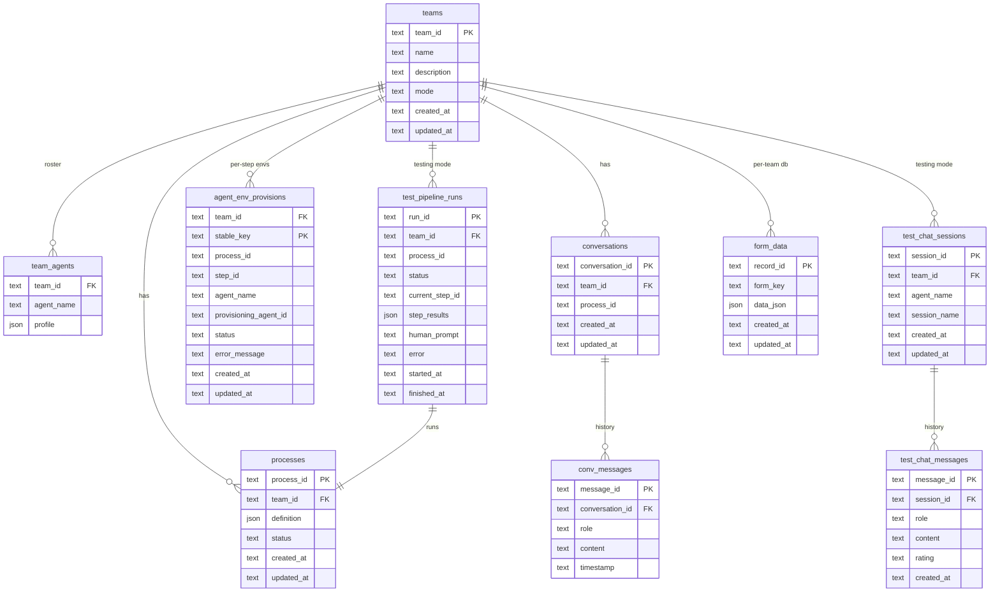
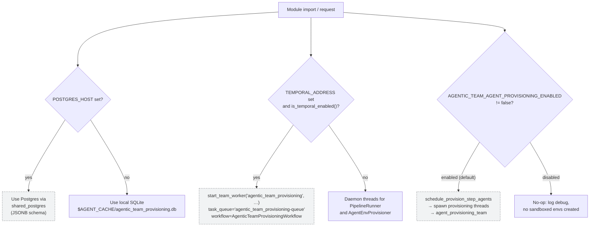

# System Design

> Goes **beneath** the two legacy PNGs ([`../designs/Agentic-team-architecture.png`](../designs/Agentic-team-architecture.png), [`../designs/AgenticTeamApiInteractionsArchitecture.png`](../designs/AgenticTeamApiInteractionsArchitecture.png)) with a data-and-module view neither PNG exposes:
> - module dependency graph of the team's Python package,
> - ER diagram of the persistence schema shared by SQLite and Postgres backends,
> - Pydantic model catalogue,
> - runtime-mode decision tree.
>
> Vocabulary remains aligned with the legacy PNGs: `Orchestrator Agent`, `Agents`, `Processes`, `File System`, `Database`.

## 1. Module dependency graph



### Key files (source of truth for every other diagram)

| File | Lines | Purpose |
|---|---|---|
| [`../api/main.py`](../api/main.py) | ~933 | FastAPI app; all 27 endpoints; orchestrator entry; retroactive `provision_team` on startup (`api/main.py:108-113`) |
| [`../models.py`](../models.py) | ~460 | Pydantic enums + models: `TriggerType`, `StepType`, `ProcessStatus`, `TeamMode`, `MessageRating`, `PipelineRunStatus`, `AgenticTeam`, `AgenticTeamAgent`, `ProcessDefinition`, `ProcessStep`, `RosterValidationResult`, `ConversationStateResponse`, `TestPipelineRun`, … |
| [`../assistant/store.py`](../assistant/store.py) | ~440 | Shared SQLite store; conversation + team + process + roster + agent-env provisions |
| [`../assistant/agent.py`](../assistant/agent.py) | ~364 | `ProcessDesignerAgent` — system prompt, LLM call, JSON block parser |
| [`../runtime/pipeline_runner.py`](../runtime/pipeline_runner.py) | ~307 | Background-thread DAG walker; `WAIT`-step handling via `threading.Event` (`runtime/pipeline_runner.py:38-71`) |
| [`../infrastructure.py`](../infrastructure.py) | ~241 | Per-team `assets/` + `runs/` + `team.db`; `TeamFormStore` in WAL mode (`infrastructure.py:30-74`) |
| [`../roster_validation.py`](../roster_validation.py) | 182 | `validate_roster` → `RosterValidationResult`; gap categories in `models.py:295-316` |
| [`../runtime/agent_builder.py`](../runtime/agent_builder.py) | ~160 | Roster entry → `strands.Agent`; starter prompt generator |
| [`../agent_env_provisioning.py`](../agent_env_provisioning.py) | 134 | `make_provisioning_agent_id`, `schedule_provision_step_agents`, `_spawn_provision_thread` |
| [`../postgres/__init__.py`](../postgres/__init__.py) | ~130 | `AGENTIC_POSTGRES_SCHEMA` — 10 JSONB-backed tables |
| [`../temporal/__init__.py`](../temporal/__init__.py) | ~45 | `run_pipeline_activity`, `AgenticTeamProvisioningWorkflow`, `agentic_team_provisioning-queue` |
| [`../testing/store.py`](../testing/store.py) | ~332 | Test-mode persistence (sessions, messages, pipeline runs) |

## 2. Persistence — ER diagram

Both backends share the same logical schema. The shared SQLite instance at `$AGENT_CACHE/agentic_team_provisioning.db` is authoritative when `POSTGRES_HOST` is unset; otherwise Postgres (JSONB columns) registered via `shared_postgres.register_team_schemas(AGENTIC_POSTGRES_SCHEMA)` in the FastAPI lifespan (`api/main.py:77-92`) takes over.



### Backing resources

| Resource | Backing | Path / config |
|---|---|---|
| Shared team / process / conversation store | SQLite (default) or Postgres | `$AGENT_CACHE/agentic_team_provisioning.db` / `AGENTIC_POSTGRES_SCHEMA` |
| Per-team `File System` (matches legacy PNG) | Filesystem | `$AGENT_CACHE/provisioned_teams/{team_id}/assets/` (`infrastructure.py:1-9`) |
| Per-team job runs | Filesystem | `$AGENT_CACHE/provisioned_teams/{team_id}/runs/` |
| Per-team `Database` (matches legacy PNG) | SQLite WAL mode | `$AGENT_CACHE/provisioned_teams/{team_id}/team.db` (`infrastructure.py:59-74`) |
| Job lifecycle tracking | `JobServiceClient(team="provisioned_{team_id}")` | see `infrastructure.py` |
| Testing-mode store | SQLite or Postgres | `testing/store.py` |

## 3. Pydantic model catalogue

Enums (`models.py:15-64`):

| Enum | Values |
|---|---|
| `TriggerType` | `MESSAGE`, `EVENT`, `SCHEDULE`, `MANUAL` |
| `StepType` | `ACTION`, `DECISION`, `PARALLEL_SPLIT`, `PARALLEL_JOIN`, `WAIT`, `SUBPROCESS` |
| `ProcessStatus` | `DRAFT`, `COMPLETE`, `ARCHIVED` |
| `TeamMode` | `DEVELOPMENT`, `TESTING` |
| `MessageRating` | `THUMBS_UP`, `THUMBS_DOWN` |
| `PipelineRunStatus` | `RUNNING`, `WAITING_FOR_INPUT`, `COMPLETED`, `FAILED`, `CANCELLED` |

Domain models (`models.py`):

| Model | Lines | Purpose |
|---|---|---|
| `AgenticTeam` | 161-173 | Top-level team: roster + processes + mode |
| `AgenticTeamAgent` | 128-153 | Roster entry: `agent_name`, `role`, `skills`, `capabilities`, `tools`, `expertise` |
| `ProcessDefinition` | 111-120 | Process: `trigger`, `steps`, `output`, `status` |
| `ProcessStep` | 79-94 | Step: `step_type`, `agents`, `next_steps`, `condition` |
| `ProcessStepAgent` | 72-77 | Agent assignment to a specific step |
| `ProcessTrigger` | 97-101 | Trigger metadata |
| `ProcessOutput` | 104-108 | Deliverable metadata |
| `RosterValidationResult` | 309-316 | `is_fully_staffed`, `gaps`, `summary`, counts |
| `RosterGap` | 295-306 | Category, detail, process/step/agent refs |
| `ConversationStateResponse` | 226-231 | Chat history + current process + suggested questions |
| `RecommendedAgent` / `RecommendAgentsResponse` | 319-338 | Step → roster-agent matching |
| `AgentEnvProvisionSummary` | 341-355 | Provisioning status row for the API |
| `TestChatSession` / `TestChatMessage` / `TestChatSessionDetail` | 363-390 | Testing-mode chat entities |
| `AgentQualityScore` | 393-400 | Aggregated thumbs-up/down score per agent |
| `PipelineStepResult` | 403-411 | Per-step output inside a pipeline run |
| `TestPipelineRun` | 414-427 | End-to-end pipeline test record |

## 4. Runtime-mode decision tree



### Relevant environment variables

| Variable | Default | Effect |
|---|---|---|
| `POSTGRES_HOST` (+ `_PORT`/`_USER`/`_PASSWORD`/`_DB`) | unset | Enables Postgres-backed stores via `shared_postgres.register_team_schemas` |
| `TEMPORAL_ADDRESS` / `TEMPORAL_NAMESPACE` / `TEMPORAL_TASK_QUEUE` | unset | Enables Temporal worker bootstrap in `temporal/__init__.py:38-44` |
| `AGENTIC_TEAM_AGENT_PROVISIONING_ENABLED` | `true` | Toggles the Agent Provisioning bridge (`agent_env_provisioning.py:25-29`) |
| `AGENTIC_TEAM_AGENT_PROVISIONING_MANIFEST` | `minimal.yaml` | Manifest passed to `ProvisioningOrchestrator.run_workflow` (`agent_env_provisioning.py:30`) |
| `AGENT_CACHE` | `~/.agent_cache` | Root for `$AGENT_CACHE/provisioned_teams/{team_id}/` |

## 5. Integration contract — Agent Provisioning bridge

Each `(team_id, process_id, step_id, agent_name)` tuple maps to a stable, sanitized `agent_id` via `make_provisioning_agent_id` (`agent_env_provisioning.py:38-50`):

```text
at-{team_id[:12]}-{process_id[:10]}-{slug(step_id,28)}-{slug(agent_name,36)}
```

`schedule_provision_step_agents` (`agent_env_provisioning.py:53-85`) iterates every step agent in a `ProcessDefinition`, calls `store.try_begin_agent_env_provision` to deduplicate, and — if the row is new — dispatches `_spawn_provision_thread`. The background thread calls:

```python
orch = ProvisioningOrchestrator()
result = orch.run_workflow(
    agent_id=provisioning_agent_id,
    manifest_path=_MANIFEST,            # default "minimal.yaml"
    access_tier=AccessTier.STANDARD,
    job_updater=None,
)
```

On completion it calls `store.mark_agent_env_provision_finished(..., success=..., error_message=...)`, updating the `agent_env_provisions` row consumed by `GET /teams/{team_id}/agent-environments` (`api/main.py:464-471`).
