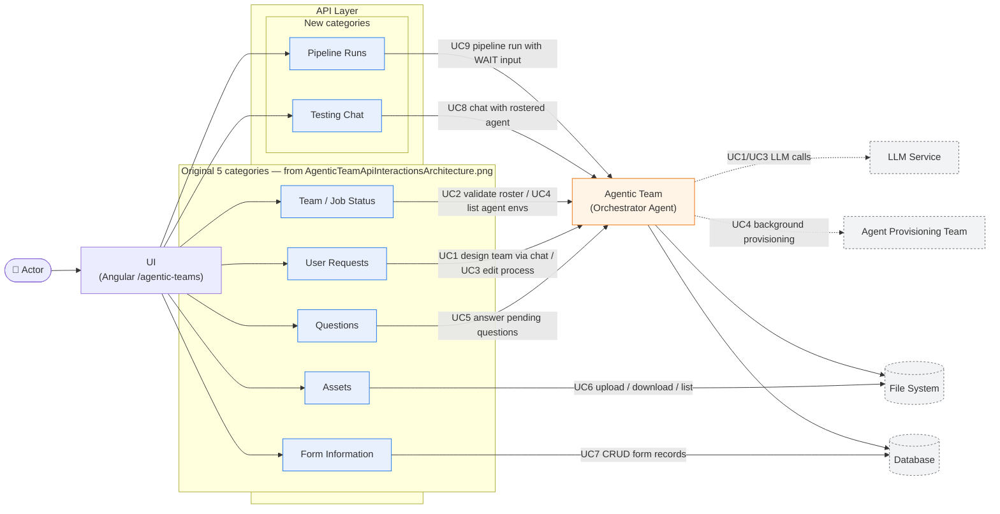

# Use Cases

> **Extends [`../designs/AgenticTeamApiInteractionsArchitecture.png`](../designs/AgenticTeamApiInteractionsArchitecture.png).** The `Actor` / `UI` / `API Layer` / `Agentic Team` / `File System` / `Database` vocabulary and left-to-right layout are reused verbatim. The original five API categories (`Questions`, `User Requests`, `Team / Job status`, `Assets`, `Form Information`) remain visually grouped and recognizable; this document adds two new categories introduced by testing-mode (`Testing Chat`, `Pipeline Runs`) and turns each PNG edge into enumerated, code-cited use cases.

## 1. Actor → UI → API Layer use-case map



The left-to-right ribbon (`Actor → UI → API Layer → Agentic Team → File System / Database`) is the exact skeleton of the legacy PNG. Every edge now carries a **use-case ID** that maps to the catalogue below, and two dashed external nodes (`LLM Service`, `Agent Provisioning Team`) make explicit the downstream systems the PNG omits.

## 2. Use case catalogue

### UC1 — Design an agentic team via conversation

| | |
|---|---|
| **Primary actor** | End user |
| **API Layer category** | `User Requests` |
| **Preconditions** | A team exists (`POST /teams`); the LLM service is reachable. |
| **Trigger** | User sends a chat message describing the team they want. |
| **Main flow** | 1. `POST /conversations` or `POST /conversations/{id}/messages` (`api/main.py:351-424`); 2. `AgenticTeamStore.get_messages` loads history; 3. `ProcessDesignerAgent.respond` calls the LLM with the system prompt; 4. `_save_agents_from_llm` persists the ```agents``` block to `team_agents`; 5. `_store.save_process` persists the ```process``` block; 6. `_after_process_saved` triggers `schedule_provision_step_agents`; 7. response returns `ConversationStateResponse` with `messages`, `current_process`, `suggested_questions`. |
| **Postconditions** | Roster and/or process updated; background provisioning scheduled; UI refreshes Team Roster and process diagram. |
| **Relevant files** | `api/main.py:351-424`, `assistant/agent.py`, `assistant/store.py`, `agent_env_provisioning.py` |

### UC2 — Validate roster / detect staffing gaps

| | |
|---|---|
| **Primary actor** | End user (or automated UI poll) |
| **API Layer category** | `Team / Job Status` |
| **Preconditions** | Team has at least one roster agent or process. |
| **Trigger** | `GET /teams/{team_id}/roster/validation`. |
| **Main flow** | 1. Route fetches the team (`api/main.py:211-219`); 2. `roster_validation.validate_roster` iterates `team.processes`, calling `_check_process`, `_check_unused_agents`, `_check_roster_depth` (`roster_validation.py:23-151`); 3. Returns `RosterValidationResult` with `is_fully_staffed`, `gaps`, `summary`. |
| **Gap categories** | `unstaffed_step`, `unrostered_agent`, `unused_agent`, `incomplete_profile`, `sparse_profile` |
| **Postconditions** | UI surfaces gap badges; team is "fully staffed" only when `len(gaps) == 0`. |
| **Relevant files** | `api/main.py:211-219`, `roster_validation.py`, `models.py:295-316` |

### UC3 — Define or edit a process DAG (visual or chat)

| | |
|---|---|
| **Primary actor** | End user |
| **API Layer category** | `User Requests` |
| **Preconditions** | Team exists. |
| **Trigger** | Visual editor `PUT /processes/{process_id}` (`api/main.py:262-276`) or follow-up chat message. |
| **Main flow** | 1. Route validates `process_id` match; 2. Resolves `team_id` via `store.get_process_team_id`; 3. `_store.save_process` persists the `ProcessDefinition`; 4. `_after_process_saved` schedules per-step agent provisioning; 5. UI re-fetches the updated process. |
| **Postconditions** | `processes` row updated; provisioning bridge scheduled for any newly referenced agents. |
| **Relevant files** | `api/main.py:262-276`, `assistant/store.py`, `agent_env_provisioning.py` |

### UC4 — Provision sandboxed agent environments

| | |
|---|---|
| **Primary actor** | Orchestrator Agent (triggered automatically after every process save) |
| **API Layer category** | `Team / Job Status` (surfaced via `GET /teams/{team_id}/agent-environments`) |
| **Preconditions** | `AGENTIC_TEAM_AGENT_PROVISIONING_ENABLED` != `false`; the `agent_provisioning_team` package is importable. |
| **Trigger** | Any call path that lands in `_after_process_saved` (UC1 or UC3). |
| **Main flow** | 1. `schedule_provision_step_agents` iterates steps and step agents (`agent_env_provisioning.py:53-85`); 2. `make_provisioning_agent_id` derives the stable id; 3. `store.try_begin_agent_env_provision` inserts a row and returns `should_run`; 4. `_spawn_provision_thread` starts a daemon thread; 5. Thread calls `ProvisioningOrchestrator.run_workflow(manifest=minimal.yaml, access_tier=STANDARD)`; 6. `mark_agent_env_provision_finished` writes success/error. |
| **Postconditions** | One `agent_env_provisions` row per `(team, process, step, agent)` in `pending` → `completed`/`failed`. |
| **Relevant files** | `agent_env_provisioning.py`, `assistant/store.py`, `api/main.py:464-471` |

### UC5 — Answer pending questions / track jobs

| | |
|---|---|
| **Primary actor** | End user |
| **API Layer category** | `Questions` + `Team / Job Status` |
| **Preconditions** | Team is provisioned (per-team `JobServiceClient` exists via `infrastructure.py`). |
| **Trigger** | `GET /teams/{team_id}/questions` and `POST /teams/{team_id}/questions/{job_id}/answers`. |
| **Main flow** | 1. `_get_infra_or_404` resolves `TeamInfrastructure`; 2. `infra.job_client.list_jobs(statuses=["pending","running"])` collects pending questions from each active job; 3. User submits answers; 4. `infra.job_client.atomic_update` clears `pending_questions`, sets `waiting_for_answers=False`, appends to `submitted_answers`. |
| **Postconditions** | Job resumes (waited on by its owning team). |
| **Relevant files** | `api/main.py:526-551`, `infrastructure.py` |

### UC6 — Manage per-team assets (File System)

| | |
|---|---|
| **Primary actor** | End user |
| **API Layer category** | `Assets` → `File System` |
| **Preconditions** | Team is provisioned (`assets_dir` exists). |
| **Trigger** | `GET /teams/{team_id}/assets`, `GET /teams/{team_id}/assets/{name}`, `POST /teams/{team_id}/assets` (upload). |
| **Main flow** | 1. `_safe_asset_name` prevents path traversal (`api/main.py:559-564`); 2. List enumerates `infra.assets_dir`; 3. Download uses `FileResponse`; 4. Upload reads `UploadFile` and writes to `infra.assets_dir / safe_name`. |
| **Postconditions** | File present under `$AGENT_CACHE/provisioned_teams/{team_id}/assets/`. |
| **Relevant files** | `api/main.py:554-612`, `infrastructure.py` |

### UC7 — Manage per-team form data (Database)

| | |
|---|---|
| **Primary actor** | End user |
| **API Layer category** | `Form Information` → `Database` |
| **Preconditions** | Team is provisioned (per-team `team.db` exists, WAL mode). |
| **Trigger** | `GET/POST/PUT/DELETE` under `/teams/{team_id}/forms/...`. |
| **Main flow** | 1. `_get_infra_or_404` resolves `TeamInfrastructure`; 2. `infra.form_store.create_record / list_form_keys / get_records / update_record / delete_record` operates on the per-team `form_data` table (`infrastructure.py:30-39`). |
| **Postconditions** | `form_data` row created / updated / removed in the per-team SQLite. |
| **Relevant files** | `api/main.py:615-662`, `infrastructure.py` |

### UC8 — Interactive testing chat with a rostered agent (new)

| | |
|---|---|
| **Primary actor** | End user (designer, tester) |
| **API Layer category** | `Testing Chat` (new, grouped with the original 5 under `API Layer`) |
| **Preconditions** | Team exists; the target agent exists in the team roster (`_find_agent_in_roster`, `api/main.py:685-691`). `TeamMode` is **not** checked server-side — see note below. |
| **Trigger** | `POST /teams/{team_id}/test-chat/sessions/{session_id}/messages`. |
| **Main flow** | 1. `get_chat_session` verifies the session belongs to the team; 2. `_find_agent_in_roster` locates the roster entry; 3. `_test_store.create_chat_message` stores the user message; 4. Full history is concatenated to build context; 5. `build_agent` (`runtime/agent_builder.py`) produces a `strands.Agent`; 6. `call_agent` invokes the LLM; 7. Assistant response stored with `create_chat_message`; 8. Optionally rated via `PUT .../messages/{message_id}/rating`. |
| **Postconditions** | Messages persisted; quality scores aggregated at `GET /teams/{team_id}/test-chat/quality-scores`. |
| **Note on `TeamMode`** | `PUT /teams/{team_id}/mode` (`api/main.py:670-677`) records the mode as advisory metadata but the test-chat handlers (`:694`, `:760`) do **not** read it. A team in `DEVELOPMENT` mode can still accept test-chat sessions. Treat mode as a UI hint, not a server-enforced gate. |
| **Relevant files** | `api/main.py:694-851`, `runtime/agent_builder.py`, `testing/store.py` |

### UC9 — End-to-end pipeline test run with WAIT-step human input (new)

| | |
|---|---|
| **Primary actor** | End user |
| **API Layer category** | `Pipeline Runs` (new) |
| **Preconditions** | A `ProcessDefinition` exists on the team. `TeamMode` is not checked — `start_pipeline_run` (`api/main.py:858`) only validates team and process existence. |
| **Trigger** | `POST /teams/{team_id}/test-pipeline/runs` with `process_id` and `initial_input`. |
| **Main flow** | 1. Route locates the process; 2. `_test_store.create_pipeline_run` persists a `TestPipelineRun` in `RUNNING`; 3. `PipelineRunner.start_run` spawns `pipeline-{run_id[:16]}` daemon thread; 4. Thread topologically sorts `process.steps` once (`runtime/pipeline_runner.py:254-293`) and iterates the resulting list linearly; 5. For each step, the runner specializes **only** `WAIT` (blocks on a `threading.Event`) and `DECISION` (runs the agent and records the decision string); every other `StepType` — `ACTION`, `PARALLEL_SPLIT`, `PARALLEL_JOIN`, `SUBPROCESS` — falls through to `_handle_action_step` and runs the first assigned agent as a plain action (see `runtime/pipeline_runner.py:90-115`); 6. On `WAIT`, status becomes `WAITING_FOR_INPUT`; 7. User calls `POST /teams/{team_id}/test-pipeline/runs/{run_id}/input`; `submit_human_input` sets the event; 8. Run finishes → `COMPLETED` / `FAILED` / `CANCELLED`. |
| **Postconditions** | `test_pipeline_runs` row with per-step `PipelineStepResult` entries. |
| **Note on step semantics** | The runner does **not** fan out `PARALLEL_SPLIT`, synchronize `PARALLEL_JOIN`, branch on `DECISION` results, or recurse into `SUBPROCESS`. When designing a test pipeline, assume a linear topologically-sorted walk with WAIT-pause. See `flow_charts.md` §6 "Unimplemented semantics". |
| **Relevant files** | `api/main.py:858-933`, `runtime/pipeline_runner.py`, `testing/store.py`, `models.py:414-427` |

## 3. Priority matrix

| Use case | Category | Priority | Typical usage context |
|---|---|---|---|
| UC1 Conversational team design | `User Requests` | Critical path | Design-time |
| UC2 Roster validation | `Team / Job Status` | Critical path | Design-time |
| UC3 Process edit | `User Requests` | Critical path | Design-time |
| UC4 Agent env provisioning | `Team / Job Status` | Critical path (async) | Design-time |
| UC5 Questions / jobs | `Questions` + `Team / Job Status` | Essential | Runtime |
| UC6 Assets (files) | `Assets` | Essential | Runtime |
| UC7 Form data | `Form Information` | Essential | Runtime |
| UC8 Testing chat | `Testing Chat` | Optional | Design / debug |
| UC9 Pipeline test run | `Pipeline Runs` | Optional | Design / debug |

The **Typical usage context** column describes when a user would naturally reach for the use case; it is **not** a reflection of `TeamMode`. `TeamMode` is advisory metadata and none of these endpoints are gated by it (see UC8 note and `flow_charts.md` §8).

Every use case can be traced back to exactly one box in `AgenticTeamApiInteractionsArchitecture.png` (the original five) or to one of the two new `API Layer` boxes added here, so reviewers can hold the PNG and this document side by side without losing context.
